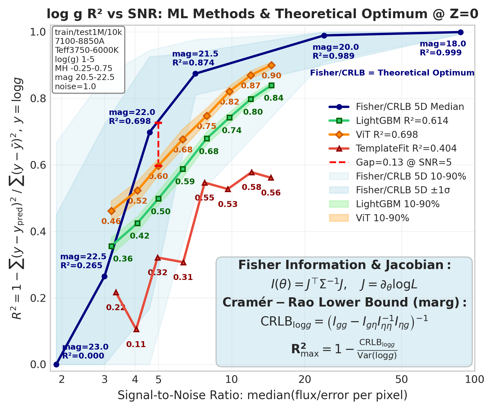

# Physics-Informed AI for Stellar Parameter Prediction

<p align="center">
  <b>A Research Knowledge Center for Spectroscopic Machine Learning</b><br>
  <i>From 430+ experiments to reproducible papers on stellar surface gravity estimation</i>
</p>

<p align="center">
  
</p>

<p align="center"><i>Figure: ViT achieves R²=0.70 on 1M spectra at SNR=5, approaching the Fisher/CRLB theoretical optimum (R²=0.87) and significantly outperforming LightGBM (R²=0.61) and template fitting (R²=0.40).</i></p>

<p align="center">
  
</p>

<p align="center"><i>Figure: SpecViT architecture for 1D stellar spectra — (1) Input 4096-dim spectrum → (2) Noise injection → (3) Tokenization/Patch embedding → (4) Positional encoding + [CLS] → (5) Transformer Encoder ×6 → (6) Regression head → log(g)</i></p>

---

## Abstract

This repository is an **experiment-driven knowledge center** for physics-informed machine learning applied to stellar spectroscopy. We systematically predict stellar surface gravity ($\log g$) from 4096-dimensional synthetic BOSZ spectra, spanning linear baselines (Ridge, PCA) through gradient boosting (LightGBM) to deep architectures (CNN, Vision Transformer, Mixture of Experts).

Our core contributions:
1. **Fisher/CRLB ceiling analysis** establishing theoretical upper bounds ($R^2_{\max}=0.87$ at SNR=7)
2. **ViT scaling law** demonstrating $R^2=0.71$ on 1M spectra at noise_level=1.0 — the current state-of-the-art
3. **Physics-gated MoE** achieving $\rho=1.00$ oracle gain retention with soft routing
4. **Design principles** distilled from 430+ experiments guiding architecture choices

---

## What This Repository Is

This is a **paper factory** — an experiment log repository organized to produce publishable research. Each paper track has:
- A clear thesis and contribution claims
- Evidence trails with reproducible experiments
- Figure plans with asset paths
- Maturity status and open questions

**Not a codebase**: Training code lives in separate repos (`~/VIT`, `~/BlindSpotDenoiser`, `~/SpecDiffusion`). This repo consolidates findings, figures, and design principles.

---

## Start Here

| Entry Point | Purpose | Time |
|-------------|---------|------|
| **[Core Figure](assets/r2_vs_snr_ceiling_test_10k_unified_snr.png)** | ViT vs Fisher ceiling | 1 min |
| [EN/logg_main_20251130_en.md](EN/logg_main_20251130_en.md) | Master experiment log & NN guidelines | 15 min |
| [EN/moe_hub_20251203_en.md](EN/moe_hub_20251203_en.md) | MoE research deep-dive | 10 min |
| [logg/scaling/fisher_hub_20251225.md](logg/scaling/fisher_hub_20251225.md) | Theoretical upper bound analysis | 10 min |
| [design/principles.md](design/principles.md) | Consolidated design principles | 5 min |

---

## Problem Setup

### Task
Predict stellar surface gravity $\log g \in [1.0, 5.0]$ from 4096-dimensional spectral flux.

### Data

| Parameter | Value |
|-----------|-------|
| Source | BOSZ synthetic spectral library (Bohlin+ 2017) |
| Wavelength | 7100–8850 Å (PFS red arm) |
| Dimensions | 4096 flux values |
| Parameter space | $T_{\text{eff}} \in [3750, 6000]$ K, $[\text{M/H}] \in [-0.25, 0.75]$, $\log g \in [1, 5]$ |
| Train/Val/Test | 1M / 1k / 10k (primary); 32k–100k for ablations |

### Noise Protocol

| Level | Noise Model | Approx. Magnitude |
|-------|-------------|-------------------|
| noise=0.0 | Clean | - |
| noise=0.1 | $y = x + 0.1 \cdot \sigma \odot \epsilon$ | mag ≈ 20 |
| noise=1.0 | $y = x + 1.0 \cdot \sigma \odot \epsilon$ | mag ≈ 21.5 |
| noise=2.0 | High noise | mag ≈ 22+ |

All noise is heteroscedastic Gaussian with per-pixel $\sigma$ from PFS exposure simulator.

### Metrics
- **Primary**: $R^2$ (coefficient of determination)
- **Secondary**: MAE (dex), RMSE (dex)
- **Efficiency**: $\eta = R^2_{\text{model}} / R^2_{\max}$

---

## Paper Tracks (Paper Factory)

### Overview

| Track | Core Idea | Key Assets | Status |
|-------|-----------|------------|--------|
| **A: ViT/Swin-1D** | Transformer inductive bias for spectra | ViT $R^2=0.71$ @ 1M | 🟢 Draftable |
| **B: Physics-Gated MoE** | Soft routing with metallicity-based experts | $\rho=1.00$, 9-expert | 🟢 Draftable |
| **C: Fisher Ceiling** | CRLB upper bound + efficiency analysis | $R^2_{\max}=0.87$, SNR curves | 🟢 Draftable |
| **D: Diffusion Denoising** | Representation learning for regression | 46% wMAE improvement | 🟡 Needs work |
| **E: Distillation/Probing** | Linear shortcut + latent extraction | seg_mean +150% | 🟡 Needs work |
| **F: Design Principles** | Systematic benchmark paper | 430+ experiments | 🟢 Draftable |

---

### Track A: Vision Transformer for Stellar Spectra

**Working Titles**:
1. "Vision Transformer Meets Stellar Spectroscopy: Scaling Laws for Surface Gravity Estimation"
2. "ViT-Spectra: Breaking the LightGBM Ceiling with 1M Training Samples"

**One-line thesis**: Vision Transformer with 1D patch embedding achieves $R^2=0.71$ on 1M spectra at SNR=5, establishing a new state-of-the-art that significantly outperforms gradient boosting baselines.

**Contributions**:
1. First systematic study of ViT architecture for 1D spectral regression
2. Scaling law: $R^2$ continues improving from 100k to 1M samples
3. Patch embedding comparison: 1D-CNN vs sliding window
4. Approaching Fisher/CRLB theoretical limit (81% efficiency at SNR=5)
5. Loss function ablation: MSE vs L1 for label prediction

**Evidence Map**:

| Asset | Path | Description |
|-------|------|-------------|
| Core figure | `assets/r2_vs_snr_ceiling_test_10k_unified_snr.png` | ViT vs ceiling |
| ViT experiment | `logg/vit/exp_vit_1m_scaling_20251226.md` | 1M training details |
| R² alignment | `logg/vit/note_r2_alignment_20251226.md` | Metric verification |
| CNN baseline | `logg/cnn/exp_cnn_dilated_kernel_sweep_20251201.md` | k=9 optimal |
| Scaling hub | `logg/scaling/scaling_hub_20251222.md` | Strategy overview |

**Figure Plan**:

| # | Figure | Source | Status |
|---|--------|--------|--------|
| 1 | R² vs SNR with Fisher ceiling | `assets/r2_vs_snr_ceiling_test_10k_unified_snr.png` | ✅ Ready |
| 2 | Training curves (loss, R² vs epoch) | WandB `khgqjngm` | ✅ Ready |
| 3 | Attention maps on spectral lines | [TBD] | ⏳ To generate |
| 4 | Scaling law: R² vs train size | [TBD] | ⏳ To generate |
| 5 | Patch embedding ablation | `logg/vit/` | ✅ Ready |

**Minimal Repro**:
- [ ] Data: `/datascope/subaru/user/swei20/data/bosz50000/z0/mag205_225_lowT_1M/`
- [ ] Config: `~/VIT/configs/exp/vit_1m_large.yaml`
- [ ] Script: `python ~/VIT/scripts/train_vit_1m.py --gpu 0`
- [ ] Checkpoint: `~/VIT/checkpoints/vit_1m/`

**Risks & Open Questions**:
- [ ] Attention visualization for interpretability
- [ ] Comparison with CNN at matched parameter count
- [ ] Generalization to real LAMOST/APOGEE spectra

---

### Track B: Physics-Gated Mixture of Experts

**Working Titles**:
1. "Physics-Gated MoE for Stellar Parameter Estimation: When Soft Routing Beats Hard Decisions"
2. "Metallicity-Conditioned Experts: Exploiting Piecewise Structure in Spectral Regression"

**One-line thesis**: Physics-based expert partitioning by metallicity [M/H] with soft routing achieves 100% oracle gain retention ($\rho=1.00$), demonstrating that the $\log g$–spectrum mapping is piecewise simple.

**Contributions**:
1. [M/H] contributes 68.7% of MoE gains (vs 42.9% for $T_{\text{eff}}$)
2. Soft routing is critical: $\rho_{\text{soft}}=1.00$ vs $\rho_{\text{hard}}=0.72$
3. Physics-window gate features (Ca II triplet) enable deployable gating
4. 9-expert MoE achieves $R^2=0.93$ vs global Ridge $R^2=0.86$
5. Continuous conditioning matches 80% of discrete MoE gains

**Evidence Map**:

| Asset | Path | Description |
|-------|------|-------------|
| MoE Hub | `EN/moe_hub_20251203_en.md` | Full analysis |
| Roadmap | `logg/moe/moe_roadmap_20251203.md` | Experiment tracking |
| Physics gate | `logg/moe/exp/exp_moe_phys_gate_baseline_20251204.md` | Gate design |
| 9-expert | `logg/moe/exp/exp_moe_9expert_phys_gate_20251204.md` | Scaling to 9 |
| Ablations | `logg/moe/exp/exp_moe_rigorous_validation_20251203.md` | [M/H] vs Teff |
| Gate images | `logg/moe/img/` | 75 figures |

**Figure Plan**:

| # | Figure | Source | Status |
|---|--------|--------|--------|
| 1 | Oracle vs Pseudo vs Soft routing | `logg/moe/img/` | ✅ Ready |
| 2 | [M/H] contribution ablation | MVP-1.1 | ✅ Ready |
| 3 | Ca II triplet feature importance | MVP-5.0 | ✅ Ready |
| 4 | 9-bin coverage heatmap | [TBD] | ⏳ To generate |
| 5 | R² by expert bin | `logg/moe/img/` | ✅ Ready |

**Minimal Repro**:
- [ ] Data: BOSZ 50k, noise=0.2, mask-aligned subsets
- [ ] Script: `~/VIT/scripts/moe_phys_gate.py`
- [ ] Configs: 3-expert [M/H] binning

**Risks & Open Questions**:
- [ ] Coverage for out-of-range [M/H] samples (184/1000 uncovered)
- [ ] NN experts underperform Ridge — architecture issue?
- [ ] Regression-optimal gate weights vs classification-optimal

---

### Track C: Fisher/CRLB Theoretical Ceiling

**Working Titles**:
1. "How Well Can We Measure $\log g$? Fisher Information Bounds for Spectroscopic Estimation"
2. "The Ceiling, the Gap, and the Structure: Information-Theoretic Limits on Stellar Parameter Inference"

**One-line thesis**: Fisher/CRLB analysis reveals $R^2_{\max}=0.87$ at SNR=7, establishing a 32% headroom gap above current ML methods and identifying SNR≈4 as a critical information cliff.

**Contributions**:
1. Marginal CRLB via Schur complement for $\log g$ given nuisance parameters
2. $R^2_{\max}$ vs SNR curve with 10-90% confidence bands
3. Information cliff at SNR < 4 (median $R^2_{\max}=0$ at mag=23)
4. Schur decay ≈ 0.69 constant across SNR (degeneracy is physical)
5. 5D ceiling (with chemical abundance nuisance) only 2% lower than 3D

**Evidence Map**:

| Asset | Path | Description |
|-------|------|-------------|
| Fisher Hub | `logg/scaling/fisher_hub_20251225.md` | Strategy |
| V2 experiment | `logg/scaling/exp/exp_scaling_fisher_ceiling_v2_20251224.md` | Grid-based |
| Multi-mag | `logg/scaling/exp/exp_scaling_fisher_multi_mag_20251224.md` | SNR sweep |
| 5D ceiling | `logg/scaling/exp/exp_scaling_fisher_5d_multi_mag_20251226.md` | Robustness |
| Upper bound curves | `logg/scaling/exp/exp_scaling_fisher_upperbound_curves_20251225.md` | Main figures |
| Images | `logg/scaling/img/` | 22 figures |

**Figure Plan**:

| # | Figure | Source | Status |
|---|--------|--------|--------|
| 1 | $R^2_{\max}$ vs SNR | `logg/scaling/img/fisher_upperbound_r2max_vs_snr.png` | ✅ Ready |
| 2 | $\sigma_{\min}$ vs SNR | `logg/scaling/img/fisher_upperbound_sigma_vs_snr.png` | ✅ Ready |
| 3 | Model efficiency heatmap | [TBD] | ⏳ To generate |
| 4 | Schur decay constancy | `logg/scaling/img/fisher_multi_mag_schur.png` | ✅ Ready |
| 5 | CRLB distribution (V2 validation) | `logg/scaling/img/fisher_ceiling_v2_crlb_dist.png` | ✅ Ready |

**Minimal Repro**:
- [ ] Data: Grid datasets `data/bosz50k/z0/grid_mag{18,20,215,22,225,23}_lowT/`
- [ ] Script: `~/VIT/scripts/scaling_fisher_ceiling_v2.py`
- [ ] Output: CRLB per sample → $R^2_{\max}$ distribution

**Risks & Open Questions**:
- [ ] Step-size sensitivity in finite differencing
- [ ] Extension to real noise (non-Gaussian tails)
- [ ] Weighted loss experiments to approach ceiling

---

### Track D: Diffusion-Based Spectral Denoising

**Working Titles**:
1. "Diffusion Denoising for Stellar Spectra: Trading Hallucinations for Robustness"
2. "Residual Diffusion: Controlled Spectral Denoising with wMAE Loss"

**One-line thesis**: Residual diffusion with intensity-controlled output ($y + s \cdot g_\theta$) and weighted MAE loss achieves 46% denoising improvement while maintaining strict identity at $s=0$.

**Contributions**:
1. Standard DDPM fails on 1D spectra (loss convergence ≠ sampling success)
2. Bounded noise denoiser with $\lambda=0.5$ achieves 59.5% MSE reduction
3. Residual formula with $s$-prefactor ensures controllable output
4. wMAE loss (1/σ weighting) protects high-SNR regions
5. Identity guarantee: $s=0 \Rightarrow \text{wMAE}=0.0000$

**Evidence Map**:

| Asset | Path | Description |
|-------|------|-------------|
| Diffusion Hub | `logg/diffusion/diffusion_hub_20251206.md` | Strategy |
| Roadmap | `logg/diffusion/diffusion_roadmap_20251206.md` | Experiment tracking |
| Baseline (failed) | `logg/diffusion/exp/exp_diffusion_baseline_20251203.md` | DDPM failure |
| Bounded noise | `logg/diffusion/exp/exp_diffusion_bounded_noise_denoiser_20251204.md` | Success |
| wMAE residual | `logg/diffusion/exp/exp_diffusion_wmae_residual_denoiser_20251204.md` | Best |
| Images | `logg/diffusion/img/` | 30 figures |

**Figure Plan**:

| # | Figure | Source | Status |
|---|--------|--------|--------|
| 1 | Denoising samples comparison | `logg/diffusion/img/diff_wmae_denoising_samples.png` | ✅ Ready |
| 2 | wMAE vs s intensity | `logg/diffusion/img/diff_wmae_comparison.png` | ✅ Ready |
| 3 | Residual distribution | `logg/diffusion/img/diff_wmae_residual_dist.png` | ✅ Ready |
| 4 | Downstream $\log g$ bias | [TBD] | ⏳ To generate |

**Minimal Repro**:
- [ ] Script: `~/SpecDiffusion/scripts/train_residual_denoiser.py`
- [ ] Config: `s=0.2`, `loss=wMAE`

**Risks & Open Questions**:
- [ ] Downstream parameter bias from denoising
- [ ] DPS posterior sampling implementation
- [ ] Generalization to real observed spectra

---

### Track E: Distillation & Latent Probing

**Working Titles**:
1. "Linear Shortcuts in Spectral Regression: Why Ridge Remains a Strong Baseline"
2. "Probing Denoiser Latents: Representation Learning for Stellar Parameters"

**One-line thesis**: The $\log g$–flux mapping is fundamentally linear ($R^2=0.999$ at noise=0); neural networks should learn residuals, and denoiser latents with segmented pooling yield +150% over global mean.

**Contributions**:
1. Ridge achieves $R^2=0.999$ at noise=0 — mapping is linear
2. Residual MLP ($\hat{y} = w^\top x + g_\theta(x)$) outperforms direct MLP
3. Latent extraction: seg_mean_K8 achieves $R^2=0.55$ vs 0.22 baseline
4. Wavelength locality preservation is critical (+77.6%)
5. Error channel alone achieves $R^2=0.91$ (information leakage)

**Evidence Map**:

| Asset | Path | Description |
|-------|------|-------------|
| Main log | `EN/logg_main_20251130_en.md` | Overview |
| Distill experiments | `logg/distill/exp/` | 4 experiments |
| Latent extraction | `logg/distill/exp/exp_latent_extraction_logg_20251201.md` | seg_mean |
| Ridge baseline | `logg/ridge/ridge_hub_20251223.md` | Linear analysis |
| NN analysis | `logg/NN/exp/exp_nn_comprehensive_analysis_20251130.md` | MLP |

**Risks & Open Questions**:
- [ ] End-to-end fine-tuning vs frozen encoder
- [ ] Transfer to other stellar parameters ($T_{\text{eff}}$, [M/H])

---

### Track F: Systematic Design Principles (Benchmark Paper)

**Working Titles**:
1. "430 Experiments Later: Design Principles for Spectroscopic Machine Learning"
2. "From Ridge to Transformer: A Practitioner's Guide to Stellar Parameter Estimation"

**One-line thesis**: Systematic ablation across 430+ experiments yields actionable design principles: small-kernel CNN (k=9), linear shortcuts, Ridge α scaling with noise, and data volume as the primary lever.

**Contributions**:
1. Model leaderboard across noise levels and data scales
2. Hyperparameter sensitivity analysis (Ridge α, LightGBM lr, CNN kernel)
3. Common pitfalls: StandardScaler kills LightGBM, large kernels hurt CNN
4. Recommended configurations with expected $R^2$
5. Decision tree for architecture selection

**Evidence Map**:

| Asset | Path | Description |
|-------|------|-------------|
| Design principles | `design/principles.md` | Consolidated |
| Ridge hub | `logg/ridge/ridge_hub_20251223.md` | Linear baseline |
| CNN experiments | `logg/cnn/exp_cnn_dilated_kernel_sweep_20251201.md` | Kernel sweep |
| LightGBM | `logg/lightgbm/exp_lightgbm_hyperparam_sweep_20251129.md` | Tree baseline |
| Benchmark | `logg/benchmark/benchmark_hub_20251205.md` | Comparison |

**Key Numbers**:

| Model | 32k R² | 100k R² | 1M R² | Best Config |
|-------|--------|---------|-------|-------------|
| Ridge | 0.458 | 0.486 | 0.50 | α=200/3e4/1e5 |
| LightGBM | 0.536 | 0.558 | - | lr=0.05, n=1000/2500 |
| MLP | 0.498 | 0.551 | - | Residual, [256,64] |
| CNN (k=9) | 0.657 | - | - | AdaptiveAvgPool |
| **ViT** | - | - | **0.71** | L6-H256, 1D patch |
| Oracle MoE | - | - | 0.62 | 9-expert |
| Fisher ceiling | - | - | 0.89 | Theoretical |

---

## Reproducibility & Experiment Protocol

### Data Preprocessing
1. **Normalization**: Median flux normalization per spectrum
2. **Noise injection**: $y = x + \text{noise\_level} \cdot \sigma \odot \epsilon$ where $\sigma$ is per-pixel error from PFS simulator
3. **No StandardScaler for LightGBM** (degrades performance by 36%)

### Training Protocol
- Train/val split: 90/10 or specified in experiment
- Early stopping: patience=20 on validation $R^2$
- Seeds: Fixed (42) for reproducibility, multi-seed for confidence intervals

### Evaluation
- **Primary metric**: $R^2$ on held-out test set
- **Bootstrap CI**: 1000 samples for confidence intervals
- **Mask-aligned comparison**: MoE vs global evaluated on identical subsets

### Cross-Repository Structure

| Repository | Purpose | Relation |
|------------|---------|----------|
| `~/VIT/` | ViT/CNN/MLP training | → results here |
| `~/BlindSpotDenoiser/` | Denoiser pretraining | → latents here |
| `~/SpecDiffusion/` | Diffusion experiments | → results here |
| **This repo** | Knowledge center | ← consolidates all |

---

## Repository Map

```
Physics_Informed_AI/
├── EN/                          # 📖 English reports (START HERE)
│   ├── logg_main_*_en.md        #    Master experiment log
│   └── moe_hub_*_en.md          #    MoE research hub
│
├── logg/                        # 📁 Experiment logs by topic
│   ├── scaling/                 #    Scaling laws + Fisher ceiling
│   │   ├── fisher_hub_*.md      #    Theoretical upper bound
│   │   ├── scaling_hub_*.md     #    Data scaling analysis
│   │   └── exp/                 #    Individual experiments
│   ├── vit/                     #    Vision Transformer experiments
│   ├── moe/                     #    Mixture of Experts
│   ├── diffusion/               #    Diffusion denoising
│   ├── cnn/                     #    CNN architecture
│   ├── ridge/                   #    Ridge regression baseline
│   ├── lightgbm/                #    Tree model baseline
│   ├── pca/                     #    Dimensionality reduction
│   ├── NN/                      #    MLP experiments
│   ├── distill/                 #    Representation learning
│   ├── gta/                     #    Global Tower Architecture
│   ├── noise/                   #    Feature selection
│   ├── train/                   #    Training strategies
│   └── benchmark/               #    Cross-model comparison
│
├── design/                      # 📐 Design principles
│   └── principles.md            #    Consolidated guidelines
│
├── data/                        # 📊 Data documentation
│   └── bosz50k/                 #    Grid definitions
│
├── status/                      # 📋 Project tracking
│   ├── kanban.md                #    Experiment kanban
│   └── next_steps.md            #    Prioritized tasks
│
└── _backend/                    # 🔧 Templates
    └── template/                #    Report templates
```

---

## How to Cite

```bibtex
@misc{physics_informed_ai_2025,
  author = {Viska Wei},
  title = {Physics-Informed AI for Stellar Parameter Prediction: 
           A Systematic Study from Ridge Regression to Vision Transformers},
  year = {2025},
  publisher = {GitHub},
  url = {https://github.com/ViskaWei/Physics_Informed_AI}
}
```

For specific tracks, cite the corresponding experiment reports.

---

## Roadmap to Submission

### Week 1-2 (Track A: ViT)
- [ ] Complete 200-epoch training (Run 1 MSE, Run 2 L1)
- [ ] Generate attention visualization
- [ ] Scaling law figure (R² vs train size)
- [ ] Draft introduction + methods

### Week 3-4 (Track C: Fisher Ceiling)
- [ ] Model efficiency by SNR bin figure
- [ ] Weighted loss experiment (approach ceiling)
- [ ] Draft theory section

### Week 5-6 (Track B: MoE)
- [ ] 100k scale replication
- [ ] Full coverage solution (10th OOR expert)
- [ ] Draft MoE methodology

### Ongoing
- [ ] Generalization to real spectra (LAMOST/APOGEE)
- [ ] Multi-parameter extension ($T_{\text{eff}}$, [M/H])

---

## Missing Information Checklist

The following items are marked `[TBD]` in this README and require completion:

| Item | Location | Required Action |
|------|----------|-----------------|
| ViT attention maps | Track A, Figure 3 | Generate with trained model |
| Scaling law figure | Track A, Figure 4 | Run 100k/500k/1M comparison |
| Model efficiency heatmap | Track C, Figure 3 | Compute $R^2/R^2_{\max}$ by SNR bin |
| Downstream $\log g$ bias | Track D, Figure 4 | Run parameter estimation on denoised spectra |
| 9-bin coverage heatmap | Track B, Figure 4 | Visualize expert assignments |
| Real spectra validation | All tracks | LAMOST/APOGEE transfer experiments |

---

## Author

**Viska Wei**  
Johns Hopkins University

---

*Last Updated: 2025-12-27*  
*Total Experiments: 430+ configurations*  
*Current SOTA: ViT $R^2=0.71$ @ 1M samples, noise_level=1.0*
