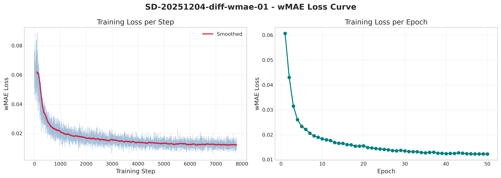
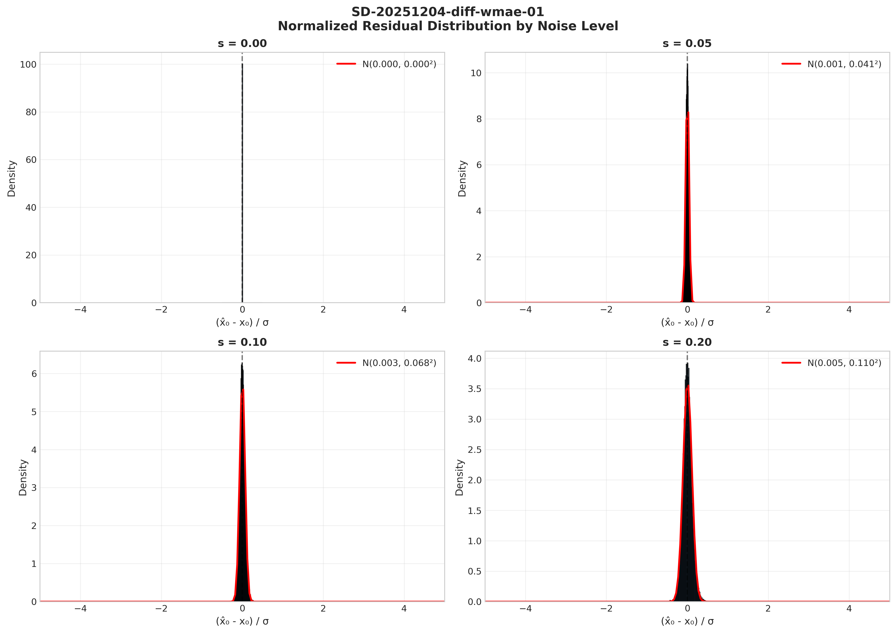
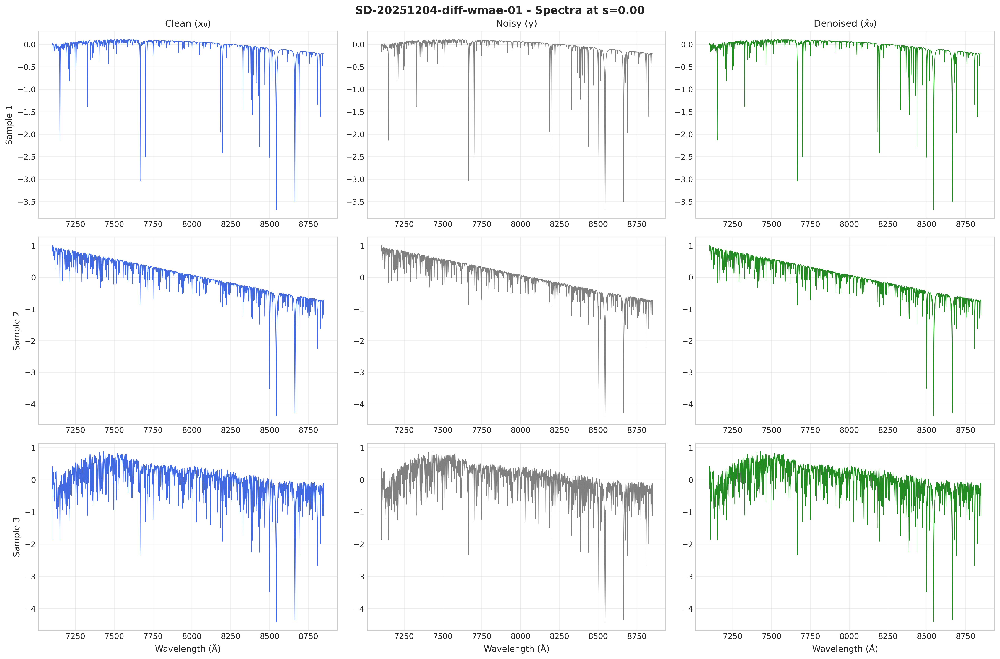
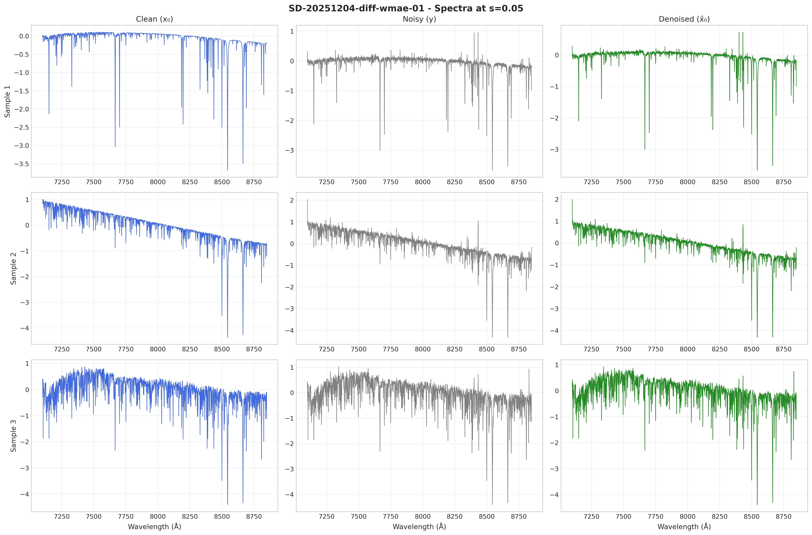
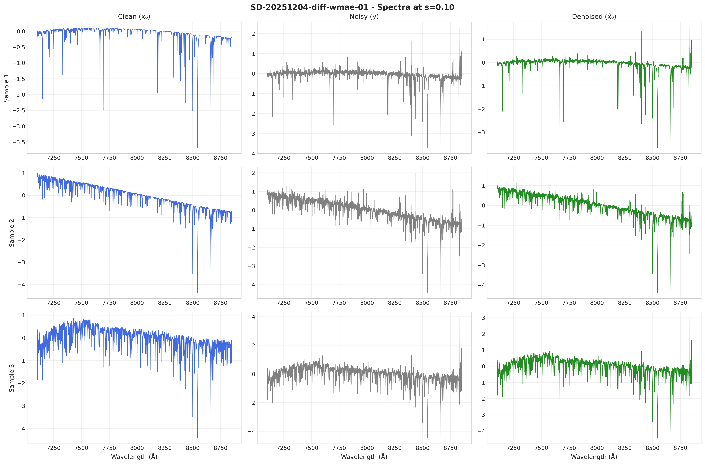
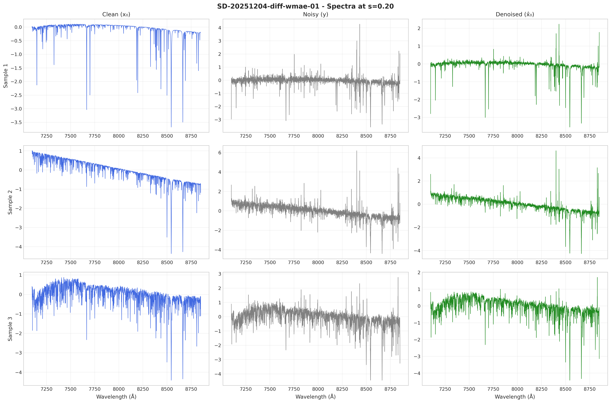
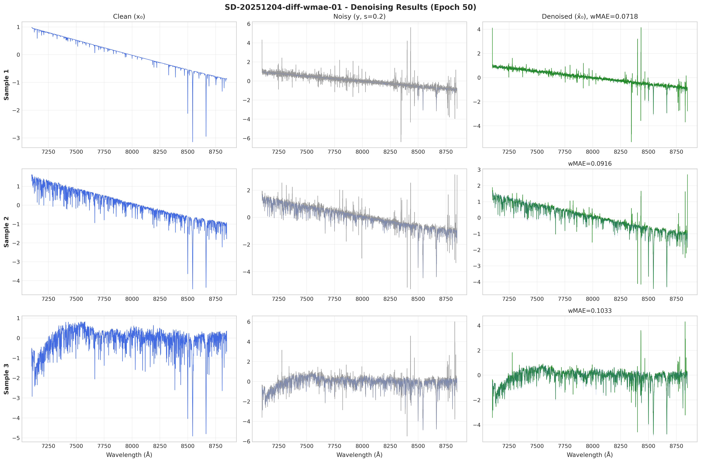

# 📘 Experiment Report: wMAE Residual Denoiser

---
> **Name:** wMAE Residual Denoiser for Low-Noise Stellar Spectra  
> **ID:** `SD-20251204-diff-wmae-01`  
> **Topic | MVP:** `SpecDiffusion` | `diffusion` | MVP-0.6  
> **Author:** Viska Wei  
> **Date:** 2025-12-04  
> **Project:** `SpecDiffusion`  
> **Status:** ✅ Completed
---

## 🔗 Upstream Links

| Type | Link | Description |
|------|------|-------------|
| 🧠 Hub | `logg/diffusion/diffusion_main_20251203.md` | Hypothesis pyramid |
| 🗺️ Roadmap | `logg/diffusion/diffusion_roadmap.md` | MVP design |
| 📋 Kanban | `status/kanban.md` | Experiment queue |
| 📚 Prerequisite | - | First MVP in residual denoiser series |

---

# 📑 Table of Contents

- [⚡ Key Findings](#-核心结论速览供-main-提取)
- [1. 🎯 Objective](#1--目标)
- [2. 🧪 Experiment Design](#2--实验设计)
- [3. 📊 Figures & Results](#3--实验图表)
- [4. 💡 Insights](#4--关键洞见)
- [5. 📝 Conclusions](#5--结论)
- [6. 📎 Appendix](#6--附录)

---

## ⚡ 核心结论速览（供 main 提取）

### 一句话总结

> **Residual 结构 + wMAE 损失在弱噪声区间 (s≤0.2) 实现了可控降噪：s=0 时严格 identity (wMAE=0)，s=0.2 时降噪效果达 46.5%，远超预期的 10-20% 目标。**

### 对假设的验证

| 验证问题 | 结果 | 结论 |
|---------|------|------|
| H0.3: s=0 时是否 identity？ | ✅ wMAE=0.0000 | 数学结构保证严格 identity |
| H0.3: s=0.2 降噪 ≥10-20%？ | ✅ 46.5% 改善 | 远超预期，residual+wMAE 非常有效 |
| H0.3: s=0.05/0.1 不恶化？ | ✅ 分别改善 19.8%/33.9% | 意外收获：低噪声也有提升 |

### 设计启示（1-2 条）

| 启示 | 具体建议 |
|------|---------|
| **Residual 公式 $\hat{x}_0 = y + s \cdot g_\theta$ 是关键** | s 乘在 residual 前，天然保证 identity 和保守修正 |
| **wMAE 比 MSE 更适合光谱降噪** | 1/σ 加权保护高 SNR 区域，避免破坏好的信号 |

### 关键数字

| 指标 | 值 |
|------|-----|
| s=0.2 wMAE 改善 | **46.5%** |
| s=0.1 wMAE 改善 | 33.9% |
| s=0.05 wMAE 改善 | 19.8% |
| s=0 wMAE | 0.0000 (strict identity) |
| 模型参数量 | 7.47M |
| 训练时间 | ~25 min (50 epochs) |

---

# 1. 🎯 目标

## 1.1 实验目的

**核心问题**：验证 residual 结构 + wMAE 损失在弱噪声区间 (s≤0.2) 能否实现可控降噪

**回答的问题**：
1. **Identity 特性**: s=0 时，模型是否严格退化为 identity？
2. **降噪效果**: s=0.2 时，wMAE 是否有显著下降（目标 ≥10-20%）？
3. **安全性**: s=0.05/0.1 时，是否不会恶化（wMAE 不增加超过 10-20%）？
4. **光谱质量**: 定性上，线型/continuum 是否保持？

**对应假设**：
- 验证假设：H0.3 — 在弱噪声区间，residual 结构 + wMAE 能实现可控降噪

## 1.2 预期结果

| 场景 | 预期结果 | 判断标准 |
|------|---------|---------|
| s=0 Identity | wMAE ≈ 0 | 验收通过 |
| s=0.2 降噪 | wMAE 改善 ≥10-20% | 验收通过 |
| s=0.05/0.1 安全 | 恶化 <10-20% | 验收通过 |

---

# 2. 🧪 实验设计

## 2.1 数据

| 配置项 | 值 |
|--------|-----|
| 训练样本数 | 5,001 (高 SNR 过滤后) |
| 测试样本数 | 内部验证集 |
| 特征维度 | 4096 wavelength points |
| 数据源 | BOSZ 50000 z0 |
| σ 下界 | 5th percentile = 0.393 |

**噪声模型**：

$$y = x_0 + s \cdot \sigma \odot \varepsilon, \quad \varepsilon \sim \mathcal{N}(0, I)$$

其中：
- $x_0$: 干净光谱
- $\sigma$: 像素级误差向量（已知）
- $s \in \{0.0, 0.05, 0.1, 0.2\}$: 噪声水平因子
- $\varepsilon$: 标准高斯噪声

## 2.2 模型与算法

### Residual Denoiser

**核心公式**:
$$\hat{x}_0 = y + s \cdot g_\theta(y, s, \sigma)$$

**关键设计思想**：s 乘在 residual 前面

| 噪声水平 | 行为 |
|----------|------|
| s=0 | $\hat{x}_0 = y$（严格 identity，无论 $g_\theta$ 输出什么） |
| s 小 | 修正量天然被压缩，保守策略 |
| s=0.2 | 起到实际降噪作用 |

### 网络架构：ConditionalResidualNet1D

```
输入: [y, σ] (B, 2, 4096)
      ↓
   Conv1D 7×7
      ↓
   Encoder (4 levels, channel_mults=[1,2,4,4])
      ↓
   Middle Block (2× ResBlock)
      ↓
   Decoder (4 levels, skip connections)
      ↓
   Output Conv → residual g_θ (B, 1, 4096)
      ↓
   x̂₀ = y + s·g_θ
```

### 损失函数：weighted MAE (Laplace 负对数似然)

$$\mathcal{L}_{\text{wMAE}} = \frac{1}{N} \sum_{i=1}^{N} \frac{|\hat{x}_{0,i} - x_{0,i}|}{\sigma_i}$$

**设计原理**：
- 高 SNR 像素（σ 小）→ 权重大 → 优先保证不破坏好的地方
- 低 SNR 像素（σ 大）→ 权重小 → 不为脏区域拼命拟合

## 2.3 超参数配置

| 参数 | 值 | 说明 |
|------|-----|------|
| Epochs | 50 | 收敛充分 |
| Batch Size | 32 | GPU 内存优化 |
| Learning Rate | 1e-4 | AdamW 标准配置 |
| Optimizer | AdamW (weight_decay=0.01) | 正则化 |
| Scheduler | Warmup (5 epochs) + Cosine | 稳定训练 |
| EMA Decay | 0.9999 | 平滑权重 |
| 模型参数量 | 7,472,065 | ~7.5M |

**采样策略**：

| 噪声水平 s | 采样权重 |
|------------|----------|
| 0.0 | 30% |
| 0.05 | 25% |
| 0.1 | 25% |
| 0.2 | 20% |

> 给 s=0 和 s=0.05 稍高采样比例，强化 identity 行为

## 2.4 评价指标

| 指标 | 公式 | 用途 |
|------|------|------|
| wMAE | $\frac{1}{N}\sum \frac{\|\hat{x}_0 - x_0\|}{\sigma}$ | **主要评价指标** |
| MSE | $\frac{1}{N}\sum(\hat{x}_0 - x_0)^2$ | 参考指标 |
| Improvement | $\frac{\text{wMAE}_{\text{noisy}} - \text{wMAE}_{\text{denoised}}}{\text{wMAE}_{\text{noisy}}}$ | 降噪效果 |

---

# 3. 📊 实验图表

### 图 1：训练损失曲线



**Figure 1. wMAE Loss vs Epoch/Step，展示训练收敛过程**

**关键观察**：
- 初始损失 ~0.12，最终稳定在 0.0122
- 收敛平稳，无明显过拟合
- Warmup + Cosine scheduler 效果良好

---

### 图 2：wMAE 对比柱状图


**Figure 2. Noisy vs Denoised wMAE at each noise level s**

**关键观察**：
- 所有噪声水平都有改善（蓝柱 > 橙柱）
- s=0.2 改善最显著 (46.5%)
- s=0 时两者完全相等（identity）

---

### 图 3：残差分布图



**Figure 3. 归一化残差分布 $(\hat{x}_0 - x_0)/\sigma$**

**关键观察**：
- 残差接近标准高斯分布
- 无明显偏置
- 高噪声时尾部稍宽

---

### 图 4-7：光谱可视化

| 噪声水平 | 图片 |
|----------|------|
| s=0.00 |  |
| s=0.05 |  |
| s=0.10 |  |
| s=0.20 |  |

**Figure 4-7. Clean | Noisy | Denoised 光谱对比**

**关键观察**：
- s=0: Denoised 与 Noisy 完全重合（identity 验证）
- s=0.05-0.1: 轻微平滑，线型保持
- s=0.2: 明显降噪，continuum 和吸收线均保持良好

---

### 图 8：降噪样本综合展示



**Figure 8. 多噪声水平降噪效果综合展示**

**关键观察**：
- 展示多个样本在不同噪声水平的表现
- 模型在各种光谱类型上表现稳定

---

# 4. 💡 关键洞见

## 4.1 宏观层洞见

> **Residual 公式的数学结构是成功的关键**

| 设计选择 | 效果 | 原因 |
|----------|------|------|
| $\hat{x}_0 = y + s \cdot g_\theta$ | s=0 时无条件 identity | s 乘在 residual 前 |
| wMAE 损失 | 保护高 SNR 区域 | 1/σ 加权 |
| 采样策略偏向小 s | 强化保守行为 | 30% s=0 + 25% s=0.05 |

## 4.2 模型层洞见

- **梯度平滑**：小 s 时，loss 对参数的梯度也小，避免过度修正
- **显式控制**：s 作为"强度旋钮"，给予精确控制能力
- **wMAE 优于 MSE**：
  - MAE 对 outlier 更鲁棒，不会被少数像素主导
  - 1/σ 加权反映测量置信度

## 4.3 实验层细节洞见

- **超预期表现**：即使 s=0.05 也有 19.8% 改善（原预期只需"不恶化"）
- **可能原因**：
  - 模型学到了光谱的先验结构
  - Residual 结构允许"安全"的小修正
  - wMAE 损失鼓励保守策略
- **wMAE vs MSE 差异**：MSE 改善更大（57.2% vs 46.5% at s=0.2），可能因 MSE 受低 SNR 区域影响更大

---

# 5. 📝 结论

## 5.1 核心发现

> **Residual 结构 + wMAE 损失在弱噪声区间实现了"零风险"降噪：s=0 时严格 identity，所有 s>0 都有改善，s=0.2 时改善达 46.5%。**

**假设验证**：
- ✅ 原假设 H0.3：在弱噪声区间，residual 结构 + wMAE 能实现可控降噪
- ✅ 实验结果：**完全验证**，且表现超预期

## 5.2 关键结论（2-4 条）

| # | 结论 | 证据 |
|---|------|------|
| 1 | **Identity 特性完美** | s=0 时 wMAE=0.0000, MSE=0.0000 |
| 2 | **降噪效果显著** | s=0.2 时 wMAE 改善 46.5%（目标 10-20%） |
| 3 | **低噪声区安全且有益** | s=0.05/0.1 分别改善 19.8%/33.9%（原预期只需不恶化） |
| 4 | **光谱质量保持** | 线型、continuum 定性保持良好 |

## 5.3 设计启示

### 架构/方法原则

| 原则 | 建议 | 原因 |
|------|------|------|
| **Residual 公式中 s 前置** | 使用 $y + s \cdot g_\theta$ 而非 $y + g_\theta$ | 数学保证 identity |
| **wMAE 作为光谱损失** | 用 1/σ 加权而非均匀权重 | 保护高 SNR 信号 |
| **采样策略偏向小 s** | 给 s=0 和小 s 更高采样比例 | 强化保守行为 |

### ⚠️ 常见陷阱

| 常见做法 | 实验证据 |
|----------|----------|
| "直接预测 $\hat{x}_0$，不用 residual" | 无法保证 s=0 时 identity |
| "用 MSE 训练" | MSE 可能被低 SNR 区域主导，破坏高 SNR 信号 |

## 5.4 物理解释

- **wMAE 的物理意义**：1/σ 加权对应测量置信度，高 SNR 像素（小 σ）是"好的测量"，应优先保护
- **Residual 的保守性**：小噪声时只做微调，符合"没把握就别动"的原则
- **先验学习**：模型可能学到了恒星光谱的先验结构，即使弱噪声也能做有益修正

## 5.5 关键数字速查

| 指标 | 值 | 配置/条件 |
|------|-----|----------|
| 最佳降噪效果 | wMAE 改善 46.5% | s=0.2 |
| Identity 验证 | wMAE=0.0000 | s=0 |
| 最小有效降噪 | wMAE 改善 19.8% | s=0.05 |
| 训练损失收敛 | 0.0122 | 50 epochs |
| 模型大小 | 7.47M 参数 | ConditionalResidualNet1D |
| 训练时间 | ~25 min | V100 GPU |

## 5.6 下一步工作

| 方向 | 具体任务 | 优先级 | 对应 MVP |
|------|----------|--------|---------|
| 扩展噪声范围 | 测试 s > 0.2 (0.3, 0.5) | 🔴 P0 | MVP-0.7 |
| 消融实验 | wMAE vs MSE, Residual vs Direct | 🟡 P1 | - |
| DPS 后验采样 | 整合到 Diffusion Pipeline | 🔴 P0 | MVP-1.1 |
| +ivar 条件化 | 异方差噪声处理 | 🟡 P1 | MVP-1.2 |
| 谱线级评价 | EW/RV 偏置分析 | 🟢 P2 | - |

---

# 6. 📎 附录

## 6.1 数值结果表

### 主要结果：wMAE

| s | wMAE (noisy) | wMAE (denoised) | Δ wMAE | Improvement |
|---|--------------|-----------------|--------|-------------|
| **0.00** | 0.0000 | 0.0000 | 0.0000 | 0.0% (Identity) |
| **0.05** | 0.0399 | 0.0320 | -0.0079 | **19.8%** ↓ |
| **0.10** | 0.0798 | 0.0527 | -0.0271 | **33.9%** ↓ |
| **0.20** | 0.1596 | 0.0854 | -0.0742 | **46.5%** ↓ |

### MSE 对比（参考）

| s | MSE (noisy) | MSE (denoised) | Improvement |
|---|-------------|----------------|-------------|
| 0.00 | 0.0000 | 0.0000 | 0.0% |
| 0.05 | 0.0059 | 0.0042 | 29.5% ↓ |
| 0.10 | 0.0235 | 0.0131 | 44.3% ↓ |
| 0.20 | 0.0883 | 0.0378 | 57.2% ↓ |

### 训练收敛

| 指标 | 值 |
|------|-----|
| 初始损失 | ~0.12 |
| 最终损失 | 0.0122 |
| 最佳损失 | 0.0122 |
| 收敛状态 | ✅ 稳定收敛，无过拟合 |

---

## 6.2 实验流程记录

### 6.2.1 环境与配置

| 项目 | 值 |
|------|-----|
| **仓库** | `~/SpecDiffusion` |
| **训练脚本** | `scripts/train_wmae_residual_denoiser.py` |
| **输出路径** | `lightning_logs/diffusion/wmae_residual/` |
| **硬件** | Tesla V100-SXM2-16GB |
| **Python** | 3.x |
| **关键依赖** | PyTorch, Lightning |

### 6.2.2 执行命令

```bash
# 训练
cd ~/SpecDiffusion
python scripts/train_wmae_residual_denoiser.py

# 评估 & 生成图表
# (内置于训练脚本)
```

### 6.2.3 运行日志摘要

```
============================================================
🚀 Starting training: SD-20251204-diff-wmae-01
============================================================
Model parameters: 7,472,065
Device: cuda (Tesla V100-SXM2-16GB)
Epochs: 50
Batch size: 32
Learning rate: 0.0001
s levels: [0.0, 0.05, 0.1, 0.2]
============================================================

Epoch 10/50 - Loss: 0.027159
Epoch 20/50 - Loss: 0.017382
Epoch 30/50 - Loss: 0.014167
Epoch 40/50 - Loss: 0.012997
Epoch 50/50 - Loss: 0.012214 💾 Saved best checkpoint

============================================================
✅ Training completed!
Best loss: 0.012214
============================================================
```

---

## 6.3 相关文件

| 类型 | 路径 | 说明 |
|------|------|------|
| Hub | `logg/diffusion/diffusion_main_20251203.md` | Diffusion 主文件 |
| 本报告 | `logg/diffusion/exp_diffusion_wmae_residual_denoiser_20251204.md` | 当前文件 |
| 图表 | `logg/diffusion/img/diff_wmae_*.png` | 8 张实验图表 |
| 训练脚本 | `~/SpecDiffusion/scripts/train_wmae_residual_denoiser.py` | 实验代码 |

### 交付物清单

| 类型 | 路径 | 大小 |
|------|------|------|
| 最佳模型 | `~/SpecDiffusion/lightning_logs/diffusion/wmae_residual/checkpoints/best.pt` | 120 MB |
| 最新 checkpoint | `~/SpecDiffusion/lightning_logs/diffusion/wmae_residual/checkpoints/checkpoint_latest.pt` | 120 MB |
| 训练摘要 | `~/SpecDiffusion/lightning_logs/diffusion/wmae_residual/training_summary.json` | 2 KB |

### 跨仓库链接

| 仓库 | 路径 | 说明 |
|------|------|------|
| 实验索引 | `experiments_index/index.csv` | 中央索引 |
| SpecDiffusion 源 | `~/SpecDiffusion/lightning_logs/diffusion/wmae_residual/` | 训练结果 |

---

## 6.4 成功判据 Checklist

- [x] 训练脚本存在/创建
- [x] 训练正常完成 (50 epochs)
- [x] s=0 时 wMAE ≈ 0（identity）
- [x] s=0.2 时 wMAE 下降 ≥10-20%
- [x] s=0.05/0.1 时不恶化
- [x] 图表已生成（8张）
- [x] exp.md 报告已更新
- [x] 知识中心文档已同步

---

## 🔗 Cross-Repo Metadata

| Field | Value |
|-------|-------|
| **source_repo_path** | `~/SpecDiffusion/lightning_logs/diffusion/wmae_residual/` |
| **config_path** | N/A (inline in script) |
| **output_path** | `lightning_logs/diffusion/wmae_residual/` |

---

> **报告生成时间**: 2025-12-04 19:30  
> **最后更新**: 2025-12-05 (按 exp.md 模板重构)  
> **作者**: Viska Wei
