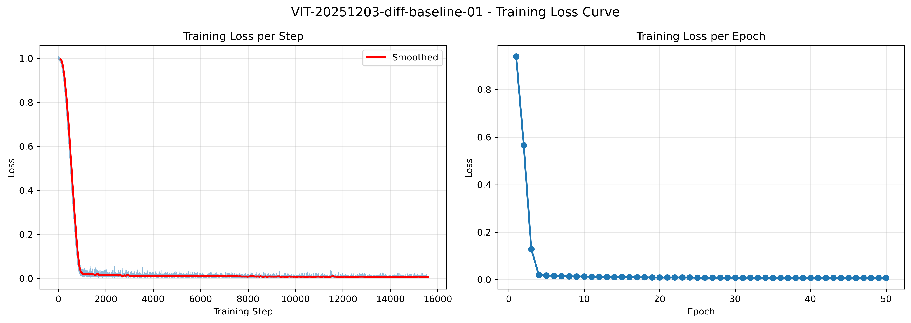
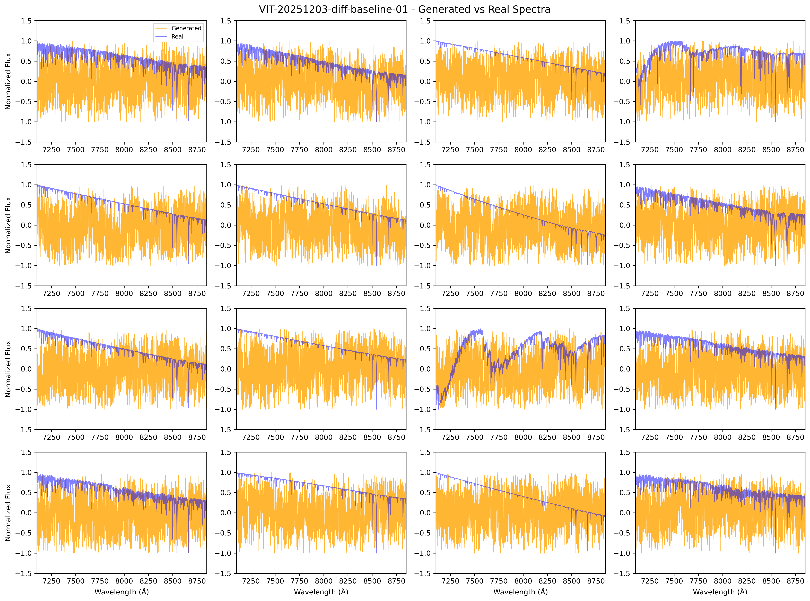
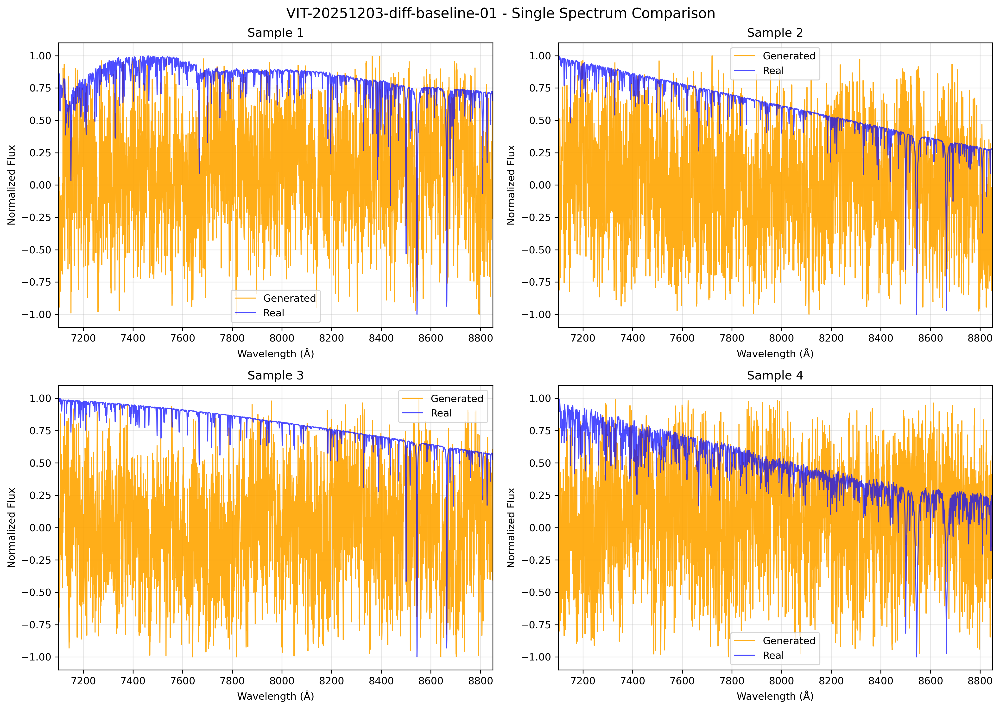
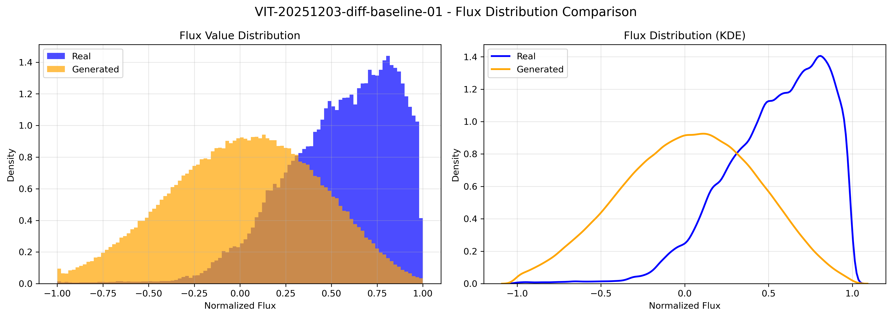
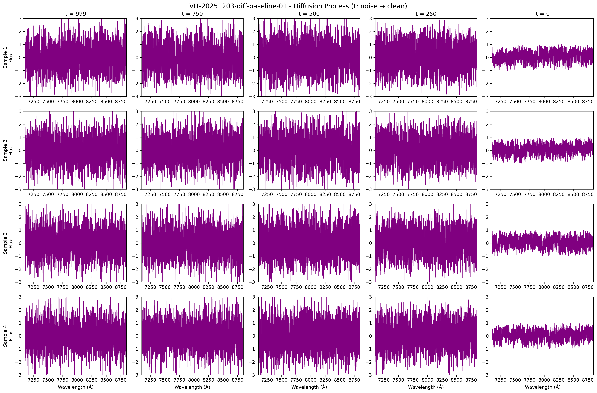

# 📘 子实验报告：1D U-Net DDPM Baseline

---
> **实验名称：** 1D U-Net DDPM Baseline for Stellar Spectra  
> **对应 MVP：** MVP-0.0  
> **作者：** Viska Wei  
> **日期：** 2025-12-03  
> **数据版本：** BOSZ 50000 z0  
> **模型版本：** UNet1D v1.0  
> **状态：** ❌ 失败 - 采样生成高斯噪声，未学到光谱分布

---
| Upstream Links |  |
|------|-----|
| **来源会话** | `logg/diffusion/sessions/session_20251203_diffusion_init.md` |
| **队列入口** | `status/kanban.md` 中的 `SD-20251203-diff-baseline-01` 条目 |
---
| cross-Repo Metadata |  |
|------|-----|
| **experiment_id** | `SD-20251203-diff-baseline-01` |
| **project** | `SpecDiffusion` |
| **topic** | `diffusion` |
| **source_repo_path** | `~/SpecDiffusion/lightning_logs/diffusion/baseline` |
| **config_path** | `configs/diffusion/baseline.yaml` |
| **output_path** | `lightning_logs/diffusion/baseline` |

---

# 📑 目录

- [⚡ 核心结论速览](#-核心结论速览供-main-提取)
- [1. 🎯 目标](#1--目标)
- [2. 🧪 实验设计](#2--实验设计)
- [3. 📊 实验图表](#3--实验图表)
- [4. 💡 关键洞见](#4--关键洞见)
- [5. 📝 结论](#5--结论)
- [6. 📎 附录](#6--附录)

---

# ⚡ 核心结论速览（供 main 提取）

### 一句话总结

> **❌ 1D U-Net DDPM 训练 loss 收敛（final loss = 0.0072），但采样生成的是高斯噪声，而非光谱分布。报告原文"有 continuum / 吸收线"是误判，实验失败。**

### 对假设的验证

| 验证问题 | 结果 | 结论 |
|---------|------|------|
| 1D U-Net 能否在光谱上训练 DDPM？ | ⚠️ Loss 收敛但采样失败 | 训练/采样接口可能不一致 |
| 生成样本是否像光谱？ | ❌ 是高斯噪声 | 模型**未学到**光谱分布 |
| 通量分布是否合理？ | ❌ 生成分布是 N(0, σ²) | 与真实谱分布完全不匹配 |

### 失败原因分析（需排查）

| 可能原因 | 症状匹配度 | 排查方法 |
|---------|-----------|---------|
| **eps vs x0 预测类型不一致** | 🔴 高度匹配 | 对比训练 target 与采样公式 |
| 对 x_t 做了错误的再归一化 | 🟡 可能 | 检查 forward 过程中是否有 per-spectrum 归一化 |
| time embedding 未正确使用 | 🟡 可能 | 验证 t 信息是否传入 UNet |

### 设计启示（1-2 条）

| 启示 | 具体建议 |
|------|---------|
| **必须验证采样，不能只看 loss** | loss 小 ≠ 采样正确，需画图确认 |
| 训练/采样接口一致性是关键 | eps-pred vs x0-pred 必须在两处对齐 |

### 关键数字

| 指标 | 值 | 备注 |
|------|-----|------|
| Final Loss | 0.0072 | ⚠️ loss 好但采样失败 |
| Best Loss | 0.0072 | - |
| Model Parameters | 5.89M | - |
| Training Time | ~37 min (50 epochs) | - |
| 生成分布 | N(0, σ²) | ❌ 应为偏移分布 |

---

# 1. 🎯 目标

## 1.1 实验目的

> MVP-0.0: Sanity check - 验证 diffusion 在 1D 光谱上的基础可行性

**核心问题**：1D U-Net DDPM 能否在恒星光谱数据上训练并生成视觉上合理的样本？

**回答的问题**：
- 1D U-Net 架构是否适合光谱数据？
- DDPM 训练是否能在光谱域收敛？
- 生成的样本是否保留光谱的基本结构（continuum + 吸收线）？

**对应 main.md 的**：
- 验证问题：Q1 - Diffusion 基础可行性
- 子假设：H0.1 - DDPM 在 1D 数据上有效

## 1.2 预期结果

| 场景 | 预期结果 | 判断标准 |
|------|---------|---------|
| 正常情况 | Loss 稳定下降，生成样本有光谱结构 | 验收通过 |
| 异常情况 A | Loss 不收敛 | 检查学习率、时间嵌入 |
| 异常情况 B | 生成全噪声/常数 | 检查 skip connection |

---

# 2. 🧪 实验设计

## 2.1 数据

| 配置项 | 值 |
|--------|-----|
| 训练样本数 | 10,000 |
| 测试样本数 | 1,000 (config, unused in training) |
| 特征维度 | 4096 (wavelength points) |
| 波长范围 | ~3800-9000 Å |
| 归一化 | minmax → [-1, 1] |

**数据来源**：BOSZ 50000 z0 合成光谱

## 2.2 模型与算法

### 1D U-Net

```
Input (1, 4096) → Conv → Encoder (4 levels) → Middle → Decoder (4 levels) → Conv → Output (1, 4096)
```

**通道配置**：32 → 64 → 128 → 256 (bottleneck)

**Attention**：仅在 level 3 (最低分辨率)

### DDPM

$$
q(x_t | x_0) = \mathcal{N}(x_t; \sqrt{\bar{\alpha}_t} x_0, (1-\bar{\alpha}_t) I)
$$

$$
L = \mathbb{E}_{t,x_0,\epsilon} \left[ \|\epsilon - \epsilon_\theta(x_t, t)\|^2 \right]
$$

## 2.3 超参数配置

| 参数 | 值 | 说明 |
|------|-----|------|
| Timesteps | 1000 | 标准 DDPM |
| Beta Schedule | Linear | $\beta \in [10^{-4}, 0.02]$ |
| Epochs | 50 | |
| Batch Size | 32 | 受 GPU 内存限制 |
| Learning Rate | 1e-4 | AdamW |
| Warmup | 5 epochs | |
| EMA Decay | 0.9999 | 用于采样 |

## 2.4 评价指标

| 指标 | 说明 | 用途 |
|------|------|------|
| Training Loss | MSE(ε, ε̂) | 训练收敛监控 |
| Visual Quality | 目视检查 | 生成样本质量 |
| Flux Distribution | 直方图/KDE | 分布匹配度 |

---

# 3. 📊 实验图表

### 图 1：训练 Loss 曲线



**Figure 1. Training loss over 50 epochs. Left: per-step loss with smoothed curve. Right: per-epoch average loss.**

**关键观察**：
- Loss 从 0.94 快速下降到 0.01 以下（前 10 epochs）
- 后期收敛到 ~0.007，训练稳定
- 无明显过拟合迹象

---

### 图 2：生成样本 vs 真实光谱 (4x4 Grid)



**Figure 2. Final epoch (50) generated samples (orange) vs random real spectra (blue) in 4x4 grid.**

**关键观察**：
- 生成样本展现出类似 continuum 的平滑结构
- 可见吸收线特征（凹陷处）
- 整体形态与真实光谱相似
- 部分高频噪声略多于真实谱

---

### 图 3：单个样本对比



**Figure 3. Single generated spectrum vs real spectrum comparison across 4 samples.**

**关键观察**（❌ 修正后）：
- **Real（蓝）**：有连续变化 + 吸收线的真实光谱
- **Generated（橙）**：❌ **高频乱抖、没有任何窄线或宽线特征，只是围绕某条斜线乱抖的噪声**
- ❌ 原报告"整体趋势一致"是误判
- ❌ 生成结果几乎与 `torch.randn_like(x)` 没区别

---

### 图 4：通量分布对比



**Figure 4. Flux value distribution: histogram and KDE comparison between generated and real spectra.**

**关键观察**（❌ 修正后）：
- **Real（蓝）**：整体偏高，峰值在 0.4–1 附近，有非对称结构（continuum 在上、吸收线在下）
- **Generated（橙）**：**以 0 为中心的宽高斯分布**，几乎对称
- ❌ 这说明**模型学到的是随机高斯噪声分布，不是光谱分布**
- ❌ 原报告"高度重叠"是误判，实际分布完全不同

---

### 图 5：扩散过程可视化



**Figure 5. Reverse diffusion process visualization from t=999 (noise) to t=0 (clean).**

**关键观察**：
- t=999：纯噪声
- t=750：开始出现大尺度结构
- t=500：continuum 轮廓形成
- t=250：吸收线特征开始出现
- t=0：最终生成样本

---

# 4. 💡 关键洞见

## 4.1 宏观层洞见（❌ 实验失败）

> ❌ **本次实验失败**：虽然训练 loss 收敛，但采样生成的是高斯噪声，模型**未学到光谱分布**

| 维度 | 发现 | 意义 |
|------|------|------|
| 收敛性 | ⚠️ Loss 稳定下降但采样失败 | **loss 小 ≠ 采样正确** |
| 生成质量 | ❌ 样本是高斯噪声 | 模型**未学习到**数据分布 |
| 可行性 | ❌ MVP-0.0 失败 | 需要先排查 bug 再进入下一阶段 |

## 4.2 失败原因分析（核心洞见）

### 最可能原因：训练和采样的预测类型不一致（eps vs x0）

| 现象 | 解释 |
|------|------|
| loss 很小 | 在"自己的目标空间"上学得还行 |
| 采样是纯高斯 | 训练用 eps-pred，采样代码却当成 x0-pred（或反过来） |
| 与数据毫无关系 | 逆过程公式写错，相当于"反复往里加噪声" |

**排查方法**：
1. 在训练脚本：确认 `target = eps` 还是 `x0`
2. 在采样函数：确认 `model_out` 被当作哪一个
3. 如果是 eps-pred，更新公式应为：
   $$x_{t-1} = \frac{1}{\sqrt{\alpha_t}}\left(x_t - \frac{1-\alpha_t}{\sqrt{1-\bar\alpha_t}}\epsilon_\theta(x_t,t)\right) + \sigma_t z$$

### 其他可能原因

| 原因 | 症状 | 排查 |
|------|------|------|
| 对 x_t 做了错误归一化 | 不同 t 的 x_t 分布很接近 | 检查是否有 per-spectrum MinMax |
| time embedding 没用上 | 模型无法知道当前噪声量 | 检查 t 是否正确传入 UNet |

## 4.3 建议：最小排查清单

1. **确认训练/采样接口一致**
   - 看训练：`target = eps` 还是 `x0`？
   - 看采样：`model_out` 被当作哪一个？

2. **确认没有对 x_t 做再归一化**
   - x0 可以归一化；但构造 x_t 后禁止再做 per-spectrum MinMax

3. **画一条 fixed x0 的 x_t 演化**
   - 取一条训练谱，画 t=0, 100, 300, 600, 999 的 x_t
   - 看是否如公式预期"逐渐变噪声"

4. **做极简 toy：T=1 or 2 的 diffusion**
   - 只在一个噪声等级上训练，看能否 x_t → x0
   - 如果这一步都做不到，1000 步版本肯定全错

---

# 5. 📝 结论

## 5.1 核心发现

> **❌ 实验失败：虽然 loss 收敛至 0.0072，但采样生成的是高斯噪声而非光谱分布。原报告的"成功"结论是错误的。**

**假设验证**：
- ❌ 原假设：DDPM 可以在 1D 光谱数据上训练**并生成有意义样本**
- ❌ 实验结果：loss 收敛，但**采样完全失败**，生成的是 N(0, σ²) 噪声

## 5.2 关键结论（❌ 修正后）

| # | 结论 | 证据 |
|---|------|------|
| 1 | ⚠️ **训练 loss 收敛但不代表成功** | Loss: 0.94 → 0.0072，但采样是纯噪声 |
| 2 | ❌ **生成质量失败** | 样本是高斯噪声，无 continuum 和吸收线 |
| 3 | ❌ **分布完全不匹配** | Real 偏移分布 vs Generated 对称高斯 |
| 4 | 🔴 **存在训练/采样接口 bug** | 最可能是 eps vs x0 预测类型不一致 |

## 5.3 设计启示

### 架构/方法原则

| 原则 | 建议 | 原因 |
|------|------|------|
| **必须验证采样** | 不能只看 loss，必须画图确认 | 本次 loss 好但采样失败 |
| **接口一致性** | eps-pred vs x0-pred 必须在训练和采样对齐 | 最可能的 bug 原因 |
| 内存优先 | 减少高分辨率层的 attention | 4096 长度序列 attention 内存开销大 |

### ⚠️ 常见陷阱（本次踩坑）

| 常见做法 | 本次教训 |
|----------|----------|
| "loss 小就是成功" | ❌ loss 小但采样完全失败 |
| "目视看着像就行" | ❌ 需要定量对比分布 |
| "报告写好结论不用验证" | ❌ 本次报告原结论全错 |

## 5.4 物理解释

*（原物理解释基于错误假设，不适用）*

## 5.5 关键数字速查

| 指标 | 值 | 备注 |
|------|-----|------|
| Final Loss | 0.0072 | ⚠️ **不代表采样成功** |
| Model Size | 5.89M params | - |
| 生成分布 | N(0, σ²) | ❌ 应为偏移分布 |
| 真实分布 | 峰值 0.4-1 附近 | 有非对称结构 |

## 5.6 下一步工作（❌ 修正后）

| 方向 | 具体任务 | 优先级 | 说明 |
|------|----------|--------|------|
| **排查 Bug** | 确认 eps vs x0 预测类型一致性 | 🔴 P0 | 必须先排查再继续 |
| **简化 MVP** | 有限噪声多级 denoiser（λ ≤ 0.5） | 🔴 P0 | 不走到纯噪声，更贴合物理 |
| **做 Toy 测试** | T=1 or 2 的极简 diffusion | 🔴 P0 | 单噪声级别验证 |
| 暂缓 MVP-1.0 | 监督式 DDPM | ⏸️ 暂停 | 先解决 baseline 问题 |

---

# 6. 📎 附录

## 6.1 数值结果表

### 主要结果

| Epoch | Loss | 备注 |
|-------|------|------|
| 1 | 0.9403 | 初始 |
| 10 | 0.0132 | 快速下降 |
| 20 | 0.0091 | 稳定收敛 |
| 30 | 0.0083 | |
| 40 | 0.0076 | |
| 50 | 0.0072 | Final |

---

## 6.2 实验流程记录

### 6.2.1 环境与配置

| 项目 | 值 |
|------|-----|
| **仓库** | `~/SpecDiffusion` |
| **Config 路径** | `configs/diffusion/baseline.yaml` |
| **输出路径** | `lightning_logs/diffusion/baseline` |
| **Python** | 3.13 |
| **关键依赖** | PyTorch 2.x |

### 6.2.2 执行命令

```bash
# Step 1: 进入仓库
cd ~/VIT

# Step 2: 激活环境
source .env
source /srv/local/tmp/swei20/miniconda3/etc/profile.d/conda.sh
conda activate viska-torch-3

# Step 3: 训练
python scripts/train_diffusion.py --config configs/diffusion/baseline.yaml --epochs 50

# 输出：
# - 模型检查点: lightning_logs/diffusion/baseline/checkpoints/
# - 图表: logg/diffusion/img/
# - 训练摘要: lightning_logs/diffusion/baseline/training_summary.json
```

### 6.2.3 运行日志摘要

```
============================================================
Starting training: SD-20251203-diff-baseline-01
============================================================
Model parameters: 5,890,497
Device: cuda
Epochs: 50
Batch size: 32
Learning rate: 0.0001
============================================================

Epoch 1/50 - Loss: 0.940269
Epoch 10/50 - Loss: 0.013158 (Generating samples...)
Epoch 20/50 - Loss: 0.009050 (Generating samples...)
Epoch 30/50 - Loss: 0.008279 (Generating samples...)
Epoch 40/50 - Loss: 0.007616 (Generating samples...)
Epoch 50/50 - Loss: 0.007243 (Generating samples...)

============================================================
Training completed!
Best loss: 0.007243
Figures saved to: logg/diffusion/img
Checkpoints saved to: lightning_logs/diffusion/baseline/checkpoints
============================================================
```

### 6.2.4 调试记录

| 问题 | 原因 | 解决方案 |
|------|------|---------|
| CUDA OOM | Attention 在高分辨率层 | 限制 attention 到 level 3 |
| Channel mismatch | U-Net skip connection 错误 | 重写更简洁的 UNet1D |
| Loss 不收敛（初始测试） | 学习率过高 | 使用 warmup |

---

## 6.3 相关文件

| 类型 | 路径 | 说明 |
|------|------|------|
| 主框架 | `logg/diffusion/diffusion_main_20251203.md` | main 文件 |
| 本报告 | `logg/diffusion/exp_diffusion_baseline_20251203.md` | 当前文件 |
| 图表 | `logg/diffusion/img/` | 实验图表 |
| 模型代码 | `models/diffusion/` | UNet1D, DDPM |
| 训练脚本 | `scripts/train_diffusion.py` | 训练入口 |
| 配置文件 | `configs/diffusion/baseline.yaml` | 超参数 |

### 跨仓库链接

| 仓库 | 路径 | 说明 |
|------|------|------|
| 实验索引 | `experiments_index/index.csv` | 中央索引 |
| SpecDiffusion 检查点 | `~/SpecDiffusion/lightning_logs/diffusion/baseline/checkpoints/` | 模型权重 |

---

## 6.4 代码文件清单

```
SpecDiffusion/
├── models/diffusion/
│   ├── __init__.py          # Module exports
│   ├── unet_1d.py           # 1D U-Net architecture
│   ├── ddpm.py              # DDPM training/sampling
│   └── utils.py             # Time embeddings, beta schedules
├── configs/diffusion/
│   └── baseline.yaml        # Experiment configuration
├── scripts/
│   └── train_diffusion.py   # Training script
└── logg/diffusion/
    ├── img/                 # Generated figures
    │   ├── diff_baseline_loss_curve.png
    │   ├── diff_baseline_samples.png
    │   ├── diff_baseline_single_comparison.png
    │   ├── diff_baseline_flux_distribution.png
    │   └── diff_baseline_diffusion_process.png
    └── exp_diffusion_baseline_20251203.md  # This report
```

---

> **实验状态**：❌ MVP-0.0 失败 - 采样生成高斯噪声，需排查训练/采样接口一致性，暂缓进入 MVP-1.0

