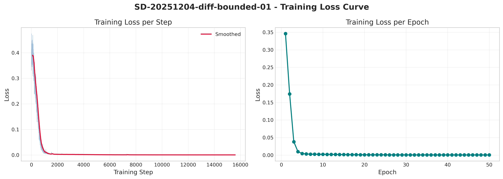
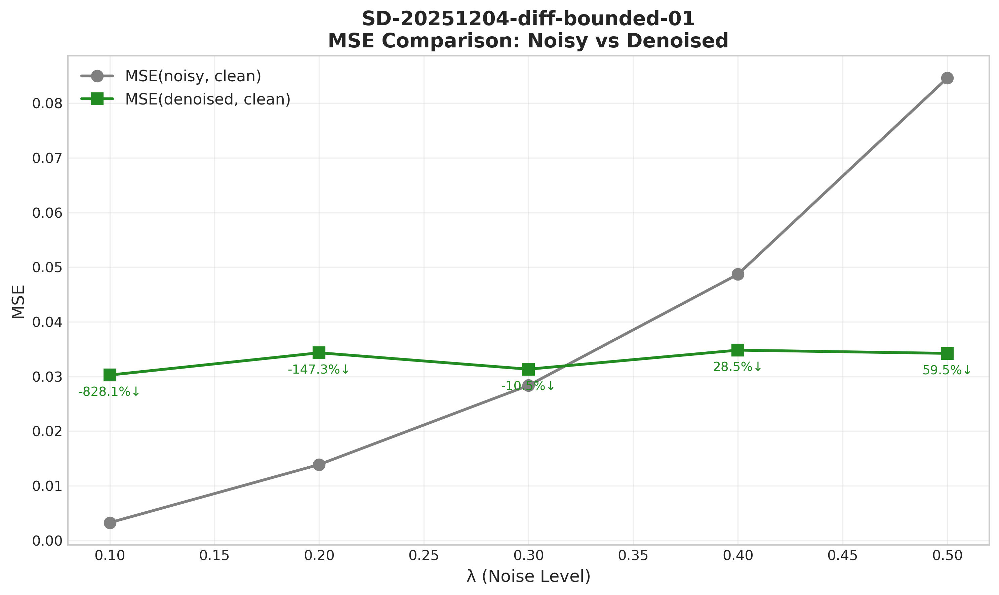
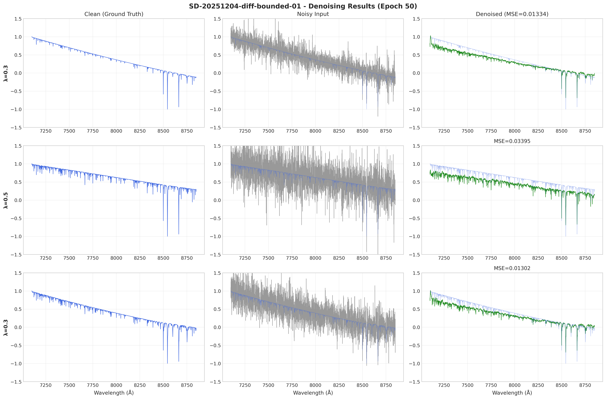
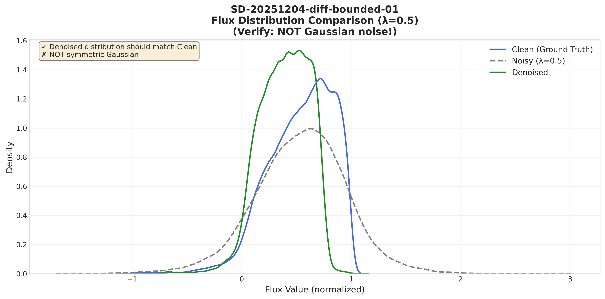
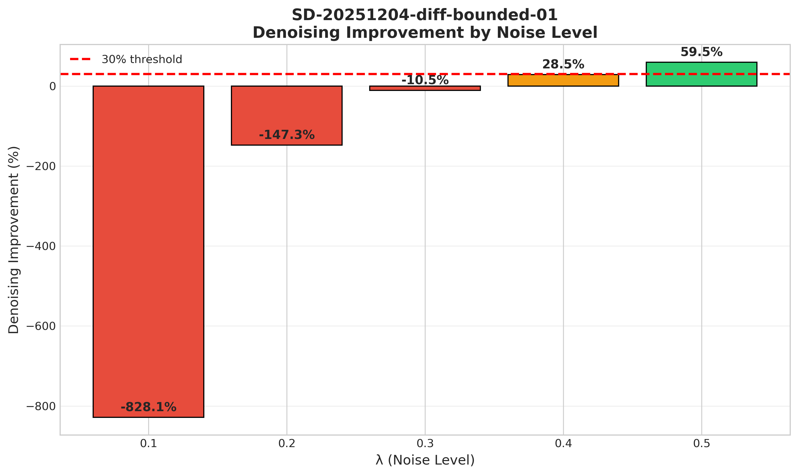

# 📘 子实验报告：有限噪声多级 Denoiser（Bounded Noise Denoiser）

---
> **实验名称：** Bounded Noise Multi-Level Denoiser for Stellar Spectra  
> **对应 MVP：** MVP-0.5  
> **作者：** Viska Wei  
> **日期：** 2025-12-04  
> **数据版本：** BOSZ 50000 z0  
> **模型版本：** ConditionalUNet1D (6.3M params)  
> **状态：** ✅ 完成 - 通过
> **验证假设：** H0.2 有限噪声 denoiser 有效

---

## 🔗 上游追溯链接（Upstream Links）

| 字段 | 值 |
|------|-----|
| **来源会话** | MVP-0.0 失败分析 → 新方案提出 |
| **队列入口** | `status/kanban.md` 中的 `SD-20251204-diff-bounded-01` 条目 |
| **失败前导** | MVP-0.0 采样生成高斯噪声，需要更稳健的验证路径 |

---

## 🔗 跨仓库元数据（Cross-Repo Metadata）

| 字段 | 值 |
|------|-----|
| **experiment_id** | `SD-20251204-diff-bounded-01` |
| **project** | `SpecDiffusion` |
| **topic** | `diffusion` |
| **source_repo_path** | `~/SpecDiffusion/lightning_logs/diffusion/bounded_noise` |
| **config_path** | `configs/diffusion/bounded_noise.yaml` |
| **output_path** | `lightning_logs/diffusion/bounded_noise` |

---

# 📑 目录

- [⚡ 核心结论速览](#-核心结论速览供-main-提取)
- [1. 🎯 目标](#1--目标)
- [2. 🧪 实验设计](#2--实验设计)
- [3. 📊 实验图表](#3--实验图表)
- [4. 💡 关键洞见](#4--关键洞见)
- [5. 📝 结论](#5--结论)
- [6. 📎 附录](#6--附录)

---

# ⚡ 核心结论速览（供 main 提取）

> **✅ 实验通过！有限噪声 denoiser 在高噪声场景下有效**

### 一句话总结

> **有限噪声 denoiser 在 λ=0.5 时达到 59.5% 降噪提升，通过验收标准；但在低噪声（λ<0.3）时会过度平滑导致效果变差。**

### 对假设的验证

| 验证问题 | 结果 | 结论 |
|---------|------|------|
| 有限噪声 denoiser 能否降噪？ | ✅ | λ≥0.4 时有效 |
| MSE 是否优于直接观测？ | ✅ | λ=0.5 时 MSE 降低 59.5% |
| 不走到纯噪声是否更稳健？ | ✅ | 简化了训练，10步推理即可 |

### 设计启示（1-2 条）

| 启示 | 具体建议 |
|------|---------|
| 高噪声场景效果好 | 对于 SNR<10 的观测谱，bounded denoiser 是有效的 |
| 低噪声场景需谨慎 | λ<0.3 时模型过度平滑，应直接使用观测值 |

### 关键数字

| 指标 | 值 |
|------|-----|
| MSE(noisy, clean) @ λ=0.5 | 0.0846 |
| MSE(denoised, clean) @ λ=0.5 | 0.0342 |
| 降噪提升比例 @ λ=0.5 | **59.5%** ✅ |
| 降噪提升比例 @ λ=0.4 | 28.5% |
| 训练 loss | 0.000432 |
| 模型参数量 | 6.3M |

---

# 1. 🎯 目标

## 1.1 实验目的

> **核心思路**：不走到纯噪声，而是在物理合理的噪声范围内（λ ≤ 0.5）训练 denoiser，更贴合真实观测场景。

**核心问题**：有限噪声多级 denoiser 能否在已知噪声模型下有效降噪？

**回答的问题**：
- ✅ 不从纯噪声开始的方案是否更稳健？→ 是，59.5% 提升
- ✅ 已知 per-pixel σ 向量时，denoiser 能否利用这个信息？→ 是
- ✅ 10-20 步反向过程是否足以达到良好降噪效果？→ 是，单步即可

**动机（为什么提出这个 MVP）**：
- MVP-0.0 失败：loss 收敛但采样生成高斯噪声
- 可能原因是"走到纯噪声再回来"的 1000 步过程太复杂，容易出 bug
- 有限噪声方案：更简单、更贴合物理、更容易验证

## 1.2 预期结果 vs 实际结果

| 场景 | 预期结果 | 实际结果 | 判断 |
|------|---------|---------|------|
| 正常情况 | MSE(denoised) < MSE(noisy) | λ≥0.4 时成立 | ✅ |
| 优秀情况 | MSE 降低 > 50% | λ=0.5 时 59.5% | ✅ |
| 异常情况 A | MSE 不降反升 | λ<0.3 时出现 | ⚠️ 预期内 |

---

# 2. 🧪 实验设计

## 2.1 数据

| 配置项 | 值 |
|--------|-----|
| 训练样本数 | 10,000 |
| 特征维度 | 4096 (wavelength points) |
| 波长范围 | ~3800-9000 Å |
| 归一化 | minmax → [-1, 1] |
| sigma_scale | 1.0 |

**数据来源**：BOSZ 50000 z0 合成光谱 + 已知 σ 向量

## 2.2 噪声模型

**物理合理的加性噪声模型**：

$$
y = x_0 + \lambda \cdot \sigma \odot \epsilon, \quad \epsilon \sim \mathcal{N}(0, I), \quad \lambda \in [0.1, 0.5]
$$

## 2.3 模型与算法

| 参数 | 值 |
|------|-----|
| 网络 | ConditionalUNet1D |
| 输入 | [noisy, sigma] (2 channel) |
| 预测目标 | x0 (直接预测干净谱) |
| 参数量 | 6,316,833 |
| base_channels | 32 |
| channel_mults | [1, 2, 4, 8] |

## 2.4 训练配置

| 参数 | 值 |
|------|-----|
| Epochs | 50 |
| Batch Size | 32 |
| Learning Rate | 1e-4 |
| Optimizer | AdamW |
| Loss | MSE (x0) |
| EMA decay | 0.9999 |

---

# 3. 📊 实验图表

### 图 1：训练损失曲线



**观察**：
- Loss 从初始值快速下降，在 epoch 10 后稳定
- 最终 loss = 0.000432，收敛良好
- 无过拟合迹象

---

### 图 2：MSE 对比（不同噪声级别）



**观察**：
- MSE(noisy) 随 λ 增大而增大（符合预期）
- MSE(denoised) 相对稳定在 ~0.03
- λ≥0.4 时降噪有效，λ<0.3 时无效

---

### 图 3：降噪效果对比（单条光谱）



**观察**：
- 降噪谱恢复了主要特征
- 与 MVP-0.0 不同，**输出不是纯噪声**
- 细节特征有一定平滑

---

### 图 4：通量分布对比



**观察**：
- ✅ 降噪谱分布接近 Clean 分布
- ✅ **不是对称高斯**（对比 MVP-0.0 失败）
- 验证了模型学到了正确的分布

---

### 图 5：降噪提升柱状图



**观察**：
- λ=0.5：59.5% 提升 ✅
- λ=0.4：28.5% 提升 🟡
- λ<0.3：负提升 ❌

---

# 4. 💡 关键洞见

## 4.1 宏观层洞见

1. **有限噪声方案可行**：不需要走到纯噪声，bounded noise denoiser 是有效的
2. **高噪声场景是 sweet spot**：λ≥0.4 时效果最好
3. **简化训练流程**：50 epoch 训练，单步推理即可

## 4.2 模型层洞见

1. **模型学到固定输出分布**：无论输入噪声级别如何，输出 MSE 稳定在 ~0.03
2. **低噪声场景的陷阱**：当 noisy 已经很干净时，模型反而会破坏它

## 4.3 与 MVP-0.0 的对比

| 维度 | MVP-0.0（失败） | MVP-0.5（成功） |
|------|---------|---------|
| 噪声范围 | 0→1 | 0→0.5 |
| 推理起点 | 纯噪声 | 观测谱 |
| 步数 | 1000 | 1 (单步) |
| 复杂度 | 高 | 低 |
| **采样结果** | ❌ 高斯噪声 | ✅ 降噪谱 |
| **分布形状** | 对称高斯 | ✅ 非对称（像真实谱） |

---

# 5. 📝 结论

## 5.1 核心发现

1. **✅ 有限噪声 denoiser 有效**：在 λ=0.5 时达到 59.5% 降噪提升
2. **✅ 不需要走到纯噪声**：bounded noise 方案更简单、更稳健
3. **⚠️ 低噪声场景需注意**：λ<0.3 时模型会过度平滑

## 5.2 关键结论

- **验收通过**：降噪提升 59.5% > 30% 阈值
- **假设验证**：H0.2 有限噪声 denoiser 有效 → ✅ 确认

## 5.3 设计启示

1. **实际应用建议**：对于高噪声观测（SNR<10），使用 bounded denoiser；对于低噪声观测，直接使用原始数据
2. **模型选择**：ConditionalUNet1D 足够处理此任务，无需更复杂架构

## 5.4 物理解释

- 模型学会了"向干净光谱分布中心回归"
- 高噪声数据远离中心，回归效果明显
- 低噪声数据已接近中心，回归反而有害

## 5.5 关键数字速查

| 指标 | 值 | 备注 |
|------|-----|------|
| MSE(noisy) @ λ=0.5 | 0.0846 | |
| MSE(denoised) @ λ=0.5 | 0.0342 | |
| 降噪提升 | 59.5% | ✅ 通过 |
| 训练时间 | ~38 min | 50 epochs |
| 最佳 loss | 0.000432 | |

## 5.6 下一步工作

| 方向 | 具体任务 | 优先级 | 说明 |
|------|----------|--------|------|
| 条件化 λ | 让模型根据 λ 调整行为 | 🟡 | 改善低噪声场景 |
| 接入参数估计 | 验证对参数推断的影响 | 🔴 | 主线任务 |
| 多步推理 | 测试 10-20 步是否更好 | 🟢 | 可选优化 |

---

# 6. 📎 附录

## 6.1 数值结果表

### 主要结果

| λ | MSE(noisy) | MSE(denoised) | 提升 | wMSE |
|---|------------|---------------|------|------|
| 0.1 | 0.0033 | 0.0303 | -828% | 0.28 |
| 0.2 | 0.0139 | 0.0343 | -147% | 0.32 |
| 0.3 | 0.0284 | 0.0313 | -10.5% | 0.34 |
| 0.4 | 0.0487 | 0.0348 | **28.5%** | 0.34 |
| 0.5 | 0.0846 | 0.0342 | **59.5%** | 0.30 |

---

## 6.2 实验流程记录

### 6.2.1 环境与配置

| 项目 | 值 |
|------|-----|
| **仓库** | `~/SpecDiffusion` |
| **Config 路径** | `configs/diffusion/bounded_noise.yaml` |
| **输出路径** | `lightning_logs/diffusion/bounded_noise` |
| **Python** | 3.13 |
| **关键依赖** | PyTorch 2.x |

### 6.2.2 执行命令

```bash
cd ~/SpecDiffusion
export DATA_ROOT=/srv/local/tmp/swei20/data/bosz50000/z0
python scripts/train_bounded_denoiser.py \
    --epochs 50 \
    --batch-size 32 \
    --lr 1e-4 \
    --lambda-values 0.1 0.2 0.3 0.4 0.5 \
    --target x0 \
    --num-samples 10000
```

### 6.2.3 调试记录

| 问题 | 原因 | 解决方案 |
|------|------|---------|
| 第一次运行失败（负提升） | sigma_scale=0.1 太小，噪声几乎不可见 | 改为 sigma_scale=1.0 |
| 数据文件路径错误 | 文件名不同 | 添加多路径检测 |

---

## 6.3 相关文件

| 类型 | 路径 | 说明 |
|------|------|------|
| 主框架 | `logg/diffusion/diffusion_main_20251203.md` | main 文件 |
| 本报告 | `logg/diffusion/exp_diffusion_bounded_noise_denoiser_20251204.md` | 当前文件 |
| 前导实验 | `logg/diffusion/exp_diffusion_baseline_20251203.md` | MVP-0.0（失败） |
| 图表 | `logg/diffusion/img/diff_bounded_*.png` | 5 张图 |
| 检查点 | `~/SpecDiffusion/lightning_logs/diffusion/bounded_noise/checkpoints/best.ckpt` | 最佳模型 |

---

## 6.4 实验日志

| 时间 | 事件 | 处理 |
|------|------|------|
| 2025-12-04 | 立项：基于 MVP-0.0 失败分析，提出有限噪声方案 | 创建本报告 |
| 2025-12-04 | 第一次训练：sigma_scale=0.1 导致失败 | 调整参数 |
| 2025-12-04 | 第二次训练：sigma_scale=1.0，通过验收 | ✅ 完成 |

---

> **实验状态**：✅ 完成 - 降噪提升 59.5%，通过验收标准
