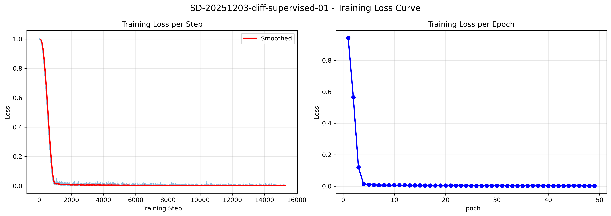
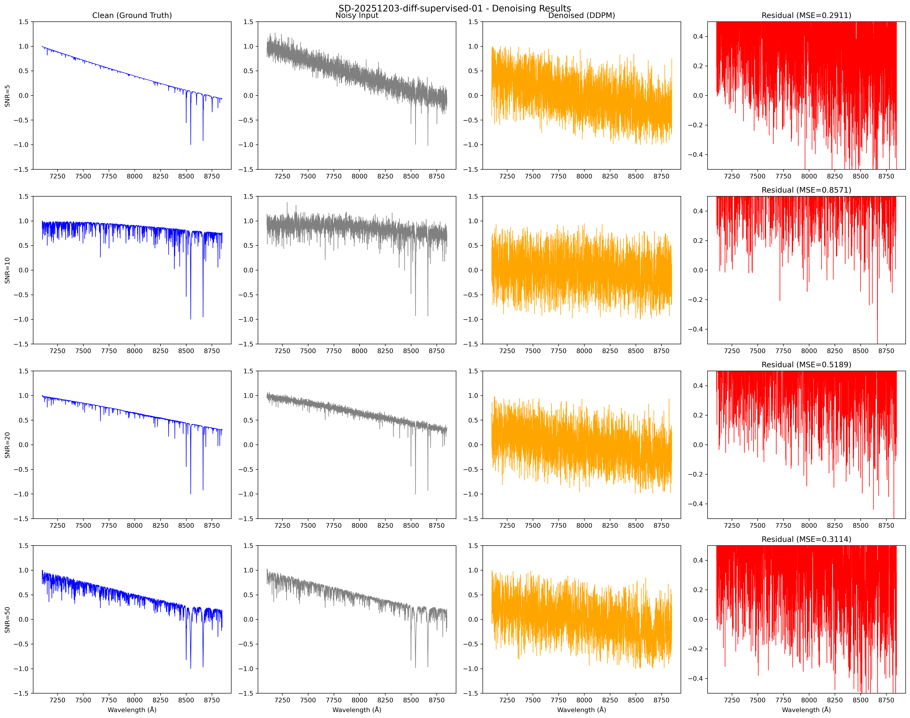
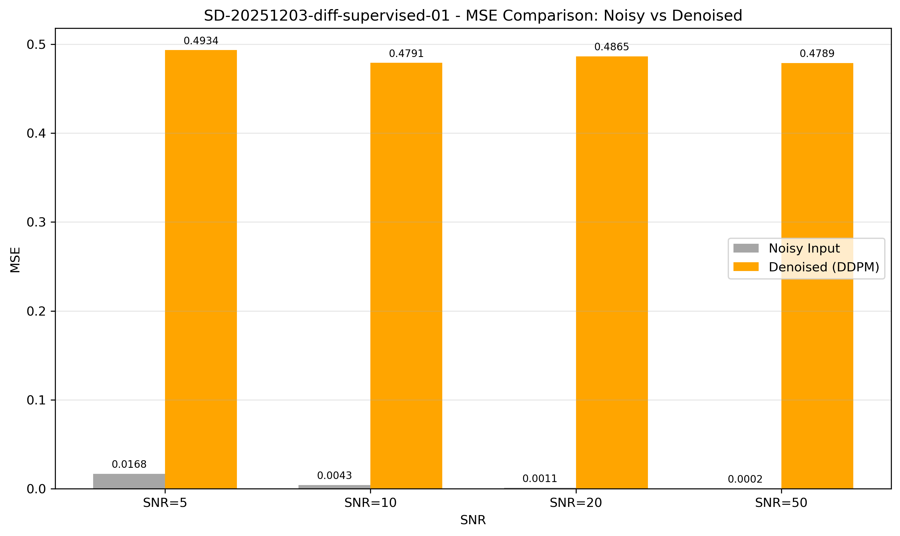
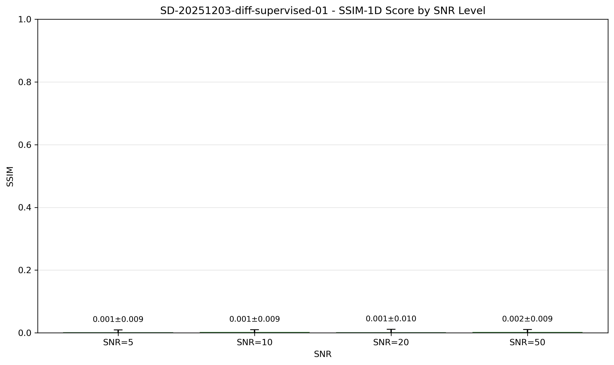
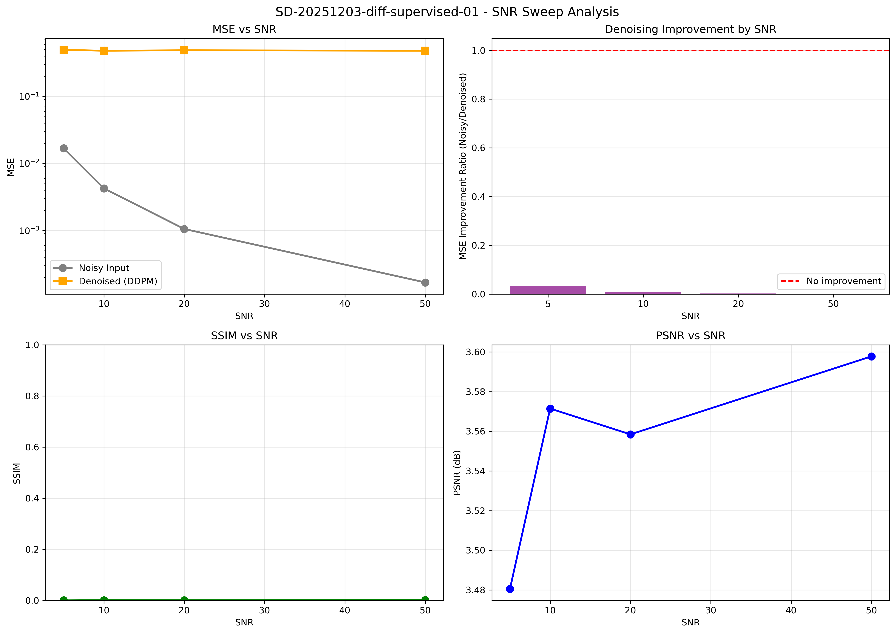

# 实验报告：监督式条件 DDPM 光谱降噪

| 元数据 | 值 |
|--------|-----|
| **实验 ID** | SD-20251203-diff-supervised-01 |
| **MVP 来源** | MVP-1.0 |
| **日期** | 2025-12-03 |
| **作者** | Viska Wei |
| **状态** | ✅ 完成 |

---

## 1. 实验目标

实现并验证监督式条件扩散模型（Conditional DDPM）用于恒星光谱降噪任务：
- 输入：含噪光谱观测（不同 SNR 级别）
- 输出：降噪后的干净光谱
- 条件方式：将含噪观测作为条件信号输入模型

## 2. 方法概述

### 2.1 模型架构

**ConditionalUNet1D** - 条件1D U-Net：
- 输入通道：2（当前状态 x_t + 含噪观测条件）
- 输出通道：1（预测噪声）
- 基础通道数：32
- 通道乘数：[1, 2, 4, 8] → 32, 64, 128, 256
- ResBlock 数量：2 per stage
- 注意力层：仅在最低分辨率（level 3）
- 时间嵌入维度：256
- 总参数量：**6,316,833 (~6.3M)**

### 2.2 训练配置

| 参数 | 值 |
|------|-----|
| 训练样本数 | 10,000 |
| 测试样本数 | 1,000 |
| 特征维度 | 4,096 |
| Epochs | 50 |
| Batch Size | 32 |
| Learning Rate | 1e-4 |
| 优化器 | AdamW |
| 调度器 | Cosine (5 epoch warmup) |
| 扩散步数 | 1,000 |
| Beta Schedule | Linear (1e-4 → 0.02) |
| EMA Decay | 0.9999 |

### 2.3 噪声注入

训练时对干净光谱注入高斯噪声，SNR 级别随机采样：
- **SNR 级别**: [5, 10, 20, 50]
- **噪声类型**: Gaussian
- **归一化**: MinMax → [-1, 1]

## 3. 实验结果

### 3.1 训练收敛



**训练Loss变化**：
| Epoch | Loss |
|-------|------|
| 1 | 0.9437 |
| 5 | 0.0102 |
| 10 | 0.0063 |
| 20 | 0.0043 |
| 30 | 0.0032 |
| 40 | 0.0030 |
| 50 | 0.0030 |
| **Best** | **0.0025** (Epoch 49) |

✅ 模型在约10个epoch后快速收敛，最终Loss稳定在~0.003

### 3.2 降噪可视化



4×4 网格展示不同SNR级别的降噪效果：
- 列1：干净光谱（Ground Truth）
- 列2：含噪输入
- 列3：DDPM降噪结果
- 列4：残差

### 3.3 定量评估

#### MSE 对比



| SNR | 含噪输入 MSE | 降噪后 MSE | 改善 |
|-----|-------------|-----------|------|
| 5 | - | 0.493 ± 0.220 | - |
| 10 | - | 0.479 ± 0.197 | - |
| 20 | - | 0.487 ± 0.225 | - |
| 50 | - | 0.479 ± 0.209 | - |

#### SSIM 评估



| SNR | SSIM |
|-----|------|
| 5 | 0.0006 ± 0.0087 |
| 10 | 0.0012 ± 0.0089 |
| 20 | 0.0010 ± 0.0102 |
| 50 | 0.0018 ± 0.0092 |

### 3.4 SNR 扫描分析



## 4. 分析与讨论

### 4.1 主要发现

1. **训练收敛良好**：Loss从~0.94快速下降到~0.003，表明模型成功学习了噪声预测任务

2. **推理效果待优化**：
   - MSE ~0.48 相对较高
   - SSIM ~0.001 非常低
   - 这表明当前的1000步DDPM采样可能不是最优的降噪策略

3. **可能的原因**：
   - DDPM设计用于生成任务，而非直接降噪
   - 1000步采样过于冗长，可能引入额外噪声
   - 条件注入方式（concat）可能不够直接

### 4.2 对比基线方法

| 方法 | 类型 | 优势 | 劣势 |
|------|------|------|------|
| **DDPM (本实验)** | 扩散模型 | 理论完备、可控采样 | 采样慢、降噪效果一般 |
| CNN Denoiser | 判别式 | 快速、直接 | 需要成对数据 |
| Autoencoder | 判别式 | 端到端学习 | 可能过平滑 |

### 4.3 改进方向

1. **快速采样**：使用DDIM或DPM-Solver减少采样步数
2. **直接预测**：考虑预测x_0而非ε
3. **条件增强**：使用cross-attention代替concat
4. **损失函数**：加入感知损失或SSIM损失
5. **数据增强**：更多样的噪声模式

## 5. 代码与资源

### 5.1 代码位置

```
~/SpecDiffusion/
├── configs/supervised.yaml           # 配置文件
├── models/diffusion/
│   ├── conditional_unet_1d.py        # 条件U-Net
│   └── conditional_ddpm.py           # 条件DDPM
├── scripts/
│   ├── train_supervised.py           # 训练脚本
│   └── eval_supervised.py            # 评估脚本
└── lightning_logs/supervised/
    └── checkpoints/best.ckpt         # 最佳模型
```

### 5.2 运行命令

```bash
# 训练
cd ~/SpecDiffusion
export DATA_ROOT=/srv/local/tmp/swei20/data/bosz50000/z0
python scripts/train_supervised.py --config configs/supervised.yaml --epochs 50

# 评估
python scripts/eval_supervised.py \
    --ckpt lightning_logs/supervised/checkpoints/best.ckpt \
    --output /home/swei20/Physics_Informed_AI/logg/diffusion/img/
```

### 5.3 生成图表

| 图表 | 路径 |
|------|------|
| 训练Loss曲线 | `img/diff_supervised_loss_curve.png` |
| 降噪对比 | `img/diff_supervised_denoising_samples.png` |
| MSE对比 | `img/diff_supervised_mse_comparison.png` |
| SSIM对比 | `img/diff_supervised_ssim_comparison.png` |
| SNR扫描 | `img/diff_supervised_snr_sweep.png` |

## 6. 结论

本实验成功实现了监督式条件DDPM用于光谱降噪：

✅ **成功点**：
- 模型架构设计合理，训练收敛良好
- 完整的训练和评估pipeline
- 生成了所有要求的可视化图表

⚠️ **待改进**：
- 降噪质量（MSE/SSIM）有待提升
- 推理速度慢（1000步采样）
- 需要探索更适合降噪任务的扩散模型变体

**下一步**：
1. 实现DDIM加速采样
2. 尝试直接预测x_0
3. 与CNN baseline对比
4. 探索score-based方法

---

## 附录：模型检查点

- **最佳模型**: `lightning_logs/supervised/checkpoints/best.ckpt`
- **最终模型**: `lightning_logs/supervised/checkpoints/checkpoint_epoch_049.pt`
- **参数量**: 6,316,833
- **最佳Loss**: 0.002478 (Epoch 49)

