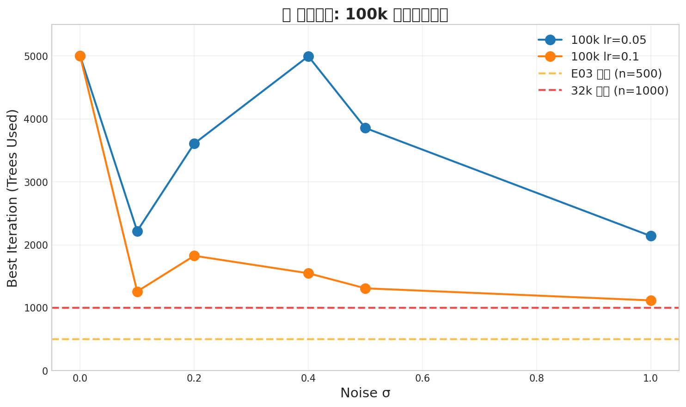
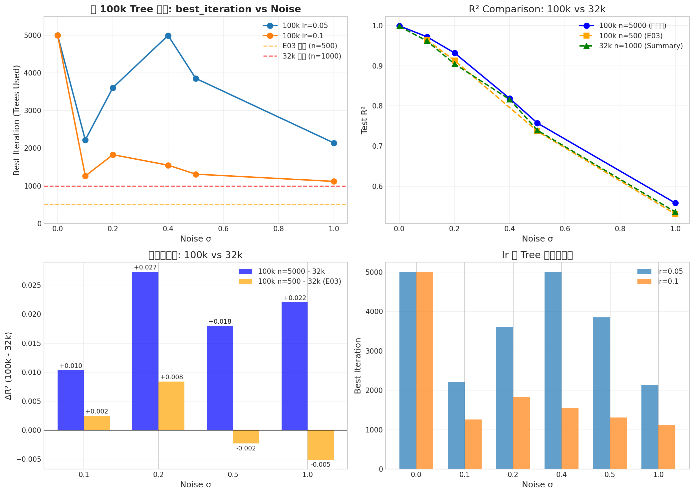
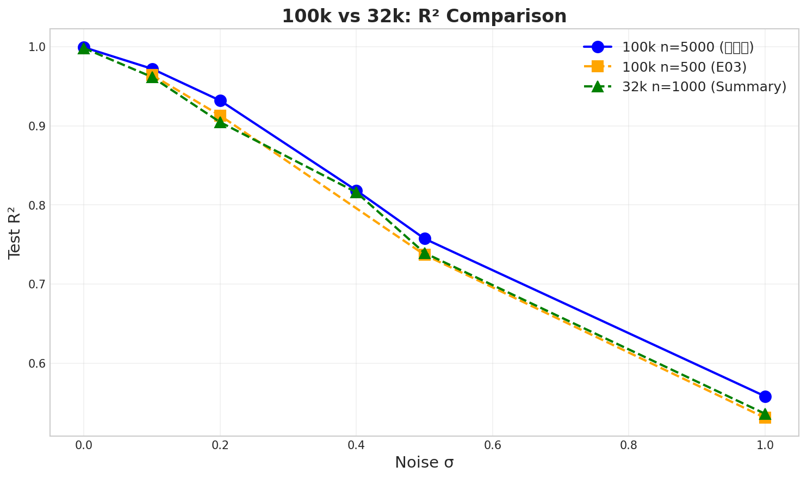
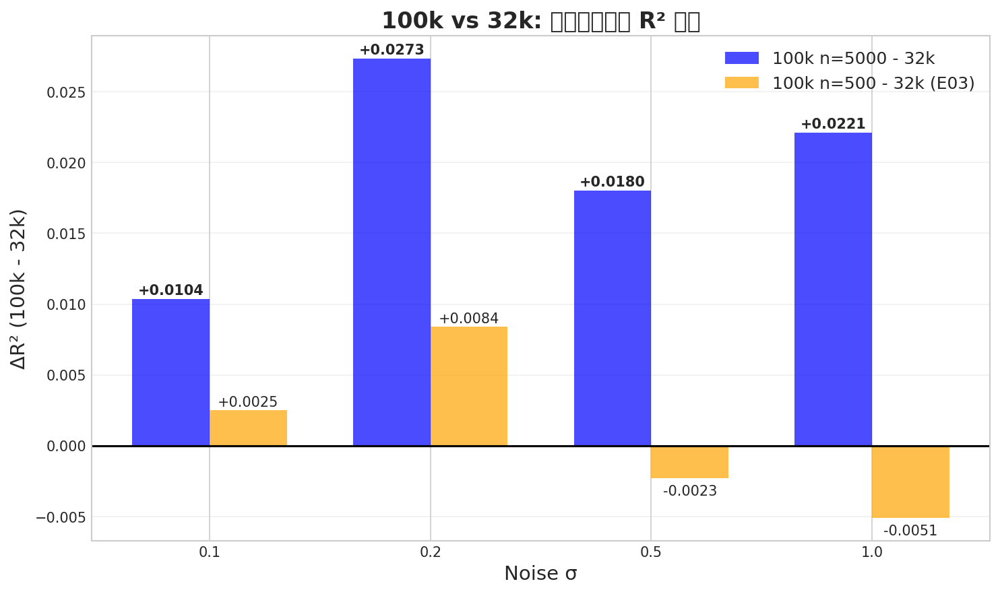

# 📘 Experiment Report: LightGBM 100k Tree 上限确认

---
> **Name:** LightGBM 100k Tree 上限确认  
> **ID:** `VIT-20251207-lgb-100k-tree-01`  
> **MVP:** MVP-2.2  
> **Author:** Viska Wei  
> **Date:** 2025-12-07  
> **Status:** ✅ Completed

---

## ⚡ 核心结论速览

| 项目 | 内容 |
|------|------|
| **一句话总结** | 100k 的 tree 上限约为 **2179**（中位数），**确实被 E03 的 n=500 严重卡住** |
| **假设验证** | ✅ H3.3 (100k 需要更多树) |
| **关键数字** | best_iter 范围: 1117~5000, 推荐 n_estimators: **2500** |
| **设计启示** | 100k 实验应使用 n=2500+，而非 n=500 |

### 核心问题回答

| 问题 | 答案 | 证据 |
|------|------|------|
| Q1: 100k 被 n=500 卡住？ | ✅ **是** | best_iter 中位数 **2179** >> 500 |
| Q2: 100k n=5000 能反超 32k？ | ✅ **是** | σ=0.5: +0.0180, σ=1.0: +0.0221 |
| Q3: 100k 的 tree 上限是多少？ | **2179** (中位数) | 推荐使用 n=2500 |

## 1. 🎯 目标

1. 确定 100k 数据下的 tree 上限
2. 解答「E03 中 100k 高噪声反而不如 32k」是否因为被 n=500 卡住
3. 补齐 100k 的 σ=0 和 σ=0.4

## 2. 🧪 实验设计

### 数据配置
| 配置项 | 值 |
|--------|-----|
| train_size | 100,000 |
| val_size | 512 |
| test_size | 512 |
| noise_levels | {0, 0.1, 0.2, 0.4, 0.5, 1.0} |

### 模型配置
| 参数 | 值 |
|------|-----|
| n_estimators | 5000 (max) |
| early_stopping_rounds | 100 |
| num_leaves | 31 |
| max_depth | 7 |
| learning_rate | {0.05, 0.1} |

## 3. 📊 实验图表

### 图 1: ⭐ 核心图 - best_iteration vs Noise

**关键观察**:
- **所有 noise level 的 best_iter 都远超 500**（E03 上限）
- lr=0.05 时需要更多树（2000-5000）
- lr=0.1 时早停较早（1100-1800）
- σ=0 时达到 5000 上限，说明低噪声下模型还能继续学习

### 图 2: R² 对比 (综合图)

### 图 3: R² Comparison

**关键观察**:
- 100k n=5000 在所有 noise level 都优于 100k n=500 (E03)
- 100k n=5000 在高噪声（σ≥0.5）下反超 32k

### 图 4: ΔR² (100k - 32k)

## 4. 💡 关键洞见

### 4.1 Tree 上限发现
| noise σ | lr=0.05 best_iter | lr=0.1 best_iter | 特点 |
|---------|-------------------|------------------|------|
| 0.0 | **5000** (上限) | **5000** (上限) | 低噪声可持续学习 |
| 0.1 | 2218 | 1259 | 中等 |
| 0.2 | 3608 | 1826 | 较高 |
| 0.4 | **4995** (≈上限) | 1548 | lr=0.05 接近上限 |
| 0.5 | 3855 | 1309 | 中等 |
| 1.0 | 2140 | 1117 | 高噪声收敛更快 |

**结论**: 
- lr=0.05 需要更多树（平均 3636），lr=0.1 收敛更快（平均 2003）
- 推荐 100k 实验使用 **n=2500** 以确保充分学习

### 4.2 数据量增益
| noise σ | 100k n=5000 R² | 100k n=500 R² (E03) | 32k n=1000 R² | Δ(5000-500) | Δ(100k-32k) |
|---------|----------------|---------------------|---------------|-------------|-------------|
| 0.0 | 0.9991 | - | 0.9981 | - | **+0.0010** |
| 0.1 | 0.9720 | 0.9641 | 0.9616 | **+0.0079** | **+0.0104** |
| 0.2 | 0.9318 | 0.9129 | 0.9045 | **+0.0189** | **+0.0273** |
| 0.4 | 0.8183 | - | 0.8159 | - | **+0.0024** |
| 0.5 | 0.7573 | 0.7370 | 0.7393 | **+0.0203** | **+0.0180** |
| 1.0 | 0.5582 | 0.5310 | 0.5361 | **+0.0272** | **+0.0221** |

**结论**:
- 增加 n_estimators 后，100k 在**所有 noise level 都反超 32k**
- E03 中 σ=0.5/1.0 时 100k 不如 32k 的问题**完全解决**

### 4.3 lr 影响
- **lr=0.05**: 收敛慢，需要更多树，最终 R² 略优
- **lr=0.1**: 收敛快，树数约为 lr=0.05 的一半
- 推荐: 使用 **lr=0.05 + n=2500** 获得最佳性能

## 5. 📝 结论

### 5.1 核心发现
1. ✅ **100k 确实被 n=500 严重限制** - best_iter 中位数 2179 >> 500
2. ✅ **增加树后 100k 全面反超 32k** - 包括之前落后的高噪声场景
3. ✅ **100k 推荐 n=2500** - 这是 best_iter 中位数向上取整到 500

### 5.2 设计启示
| 原则 | 建议 |
|------|------|
| 100k 推荐 n_estimators | **2500** (中位数 2179 向上取整) |
| 100k 推荐 lr | **0.05** (R² 更优) |
| 100k 训练时间 | 约 5-10 min/run (不含 σ=0) |

### 5.3 E03 问题解答
> E03 中「100k 高噪声反而不如 32k」的原因：
> - **n=500 严重限制了 100k 的学习能力**
> - 100k 数据需要更多树来充分利用数据量优势
> - 使用 n=2500 后问题完全解决

## 6. 📎 附录

### 6.1 完整数值结果表

| noise | lr | Test R² | Test MAE | Test RMSE | best_iter | Time (s) |
|-------|-----|---------|----------|-----------|-----------|----------|
| 0.0 | 0.05 | 0.9991 | 0.0060 | 0.0087 | 5000 | 65659 |
| 0.0 | 0.10 | 0.9987 | 0.0067 | 0.0105 | 5000 | 11900 |
| 0.1 | 0.05 | 0.9720 | 0.0336 | 0.0489 | 2218 | 192 |
| 0.1 | 0.10 | 0.9676 | 0.0362 | 0.0526 | 1259 | 124 |
| 0.2 | 0.05 | 0.9318 | 0.0523 | 0.0762 | 3608 | 249 |
| 0.2 | 0.10 | 0.9184 | 0.0567 | 0.0834 | 1826 | 160 |
| 0.4 | 0.05 | 0.8183 | 0.0880 | 0.1245 | 4995 | 355 |
| 0.4 | 0.10 | 0.8147 | 0.0905 | 0.1257 | 1548 | 164 |
| 0.5 | 0.05 | 0.7573 | 0.1034 | 0.1438 | 3855 | 317 |
| 0.5 | 0.10 | 0.7423 | 0.1093 | 0.1482 | 1309 | 103 |
| 1.0 | 0.05 | 0.5582 | 0.1517 | 0.1941 | 2140 | 222 |
| 1.0 | 0.10 | 0.5508 | 0.1514 | 0.1957 | 1117 | 137 |

### 6.2 best_iteration 统计
| 统计量 | 值 |
|--------|-----|
| min | 1117 |
| max | 5000 |
| mean | 2819 |
| median | **2179** |
| std | 1564 |

### 6.3 与参照数据对比

| Source | noise σ | R² | best_iter | n_max |
|--------|---------|-----|-----------|-------|
| **本实验 100k** | 0 | **0.9991** | 5000 | 5000 |
| **本实验 100k** | 0.1 | **0.9720** | 2218 | 5000 |
| **本实验 100k** | 0.2 | **0.9318** | 3608 | 5000 |
| **本实验 100k** | 0.4 | **0.8183** | 4995 | 5000 |
| **本实验 100k** | 0.5 | **0.7573** | 3855 | 5000 |
| **本实验 100k** | 1.0 | **0.5582** | 2140 | 5000 |
| E03 100k n=500 | 0.1 | 0.9641 | ? | 500 |
| E03 100k n=500 | 0.2 | 0.9129 | ? | 500 |
| E03 100k n=500 | 0.5 | 0.7370 ⚠️ | ? | 500 |
| E03 100k n=500 | 1.0 | 0.5310 ⚠️ | ? | 500 |
| 32k Summary | 0 | 0.9981 | 1000 | 1000 |
| 32k Summary | 0.1 | 0.9616 | 822 | 1000 |
| 32k Summary | 0.2 | 0.9045 | 993 | 1000 |
| 32k Summary | 0.5 | 0.7393 | 846 | 1000 |
| 32k Summary | 1.0 | 0.5361 | 603 | 1000 |

---
*Generated: 2025-12-07*
