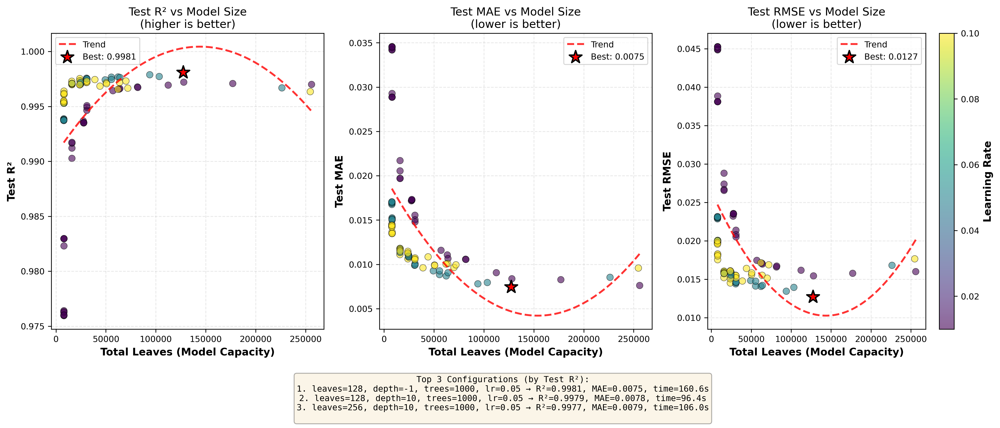
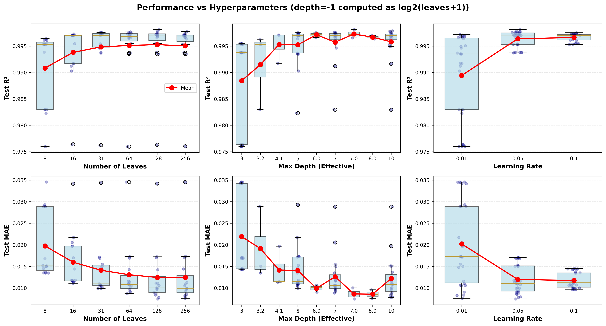
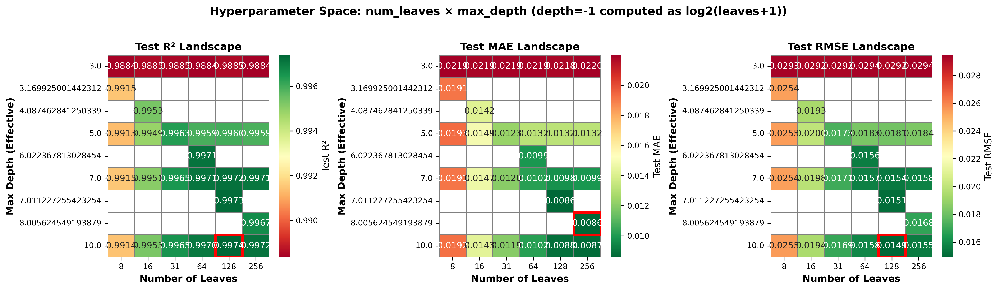
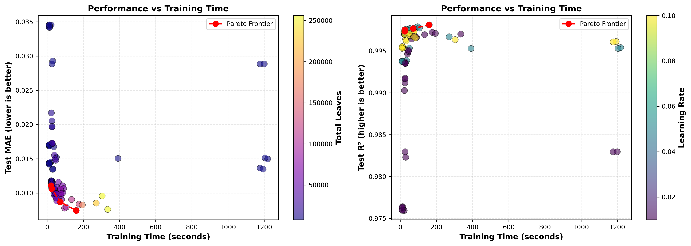
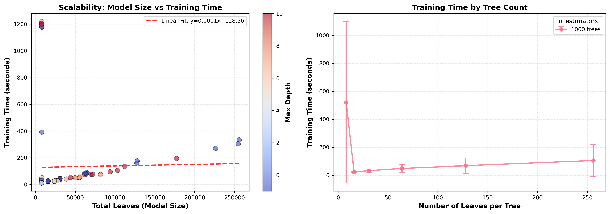
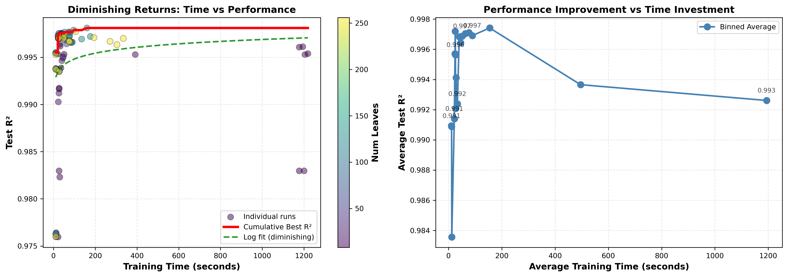

# 📘 Experiment Report: LightGBM 超参数搜索

---
> **Name:** LightGBM 超参数网格搜索 ($\log g$ 预测)  
> **ID:** `VIT-20251129-lgb-hyperparam-01`  
> **Topic ｜ MVP:** `VIT` / `lightgbm` ｜ MVP-0.1  
> **Author:** Viska Wei  
> **Date:** 2025-11-29  
> **Status:** ✅ Completed

---

## 🔗 Upstream Links

| Type | Link | Description |
|------|------|-------------|
| 🧠 Hub | [`lightgbm_hub_20251130.md`](../lightgbm_hub_20251130.md) | 智库导航 |
| 🗺️ Roadmap | [`lightgbm_roadmap_20251130.md`](../lightgbm_roadmap_20251130.md) | 实验追踪 |
| 📋 Kanban | [`../../status/kanban.md`](../../status/kanban.md) | 实验队列 |

---

# 📑 Table of Contents

- [⚡ Key Findings](#-核心结论速览)
- [1. 🎯 Objective](#1--目标)
- [2. 🧪 Experiment Design](#2--实验设计)
- [3. 📊 Figures & Results](#3--实验图表)
- [4. 💡 Insights](#4--关键洞见)
- [5. 📝 Conclusions](#5--结论)
- [6. 📎 Appendix](#6--附录)

---

## ⚡ 核心结论速览

### 一句话总结

> **LightGBM 在 $\log g$ 预测中，`learning_rate` 是最关键超参数（相关系数 +0.491），最优配置可在 37s 内达到 $R^2=0.9976$，极致配置达 $R^2=0.9982$。**

### 对假设的验证

| 验证问题 | 结果 | 结论 |
|---------|------|------|
| `learning_rate` 是否最关键？ | ✅ +0.491 | 是，远高于其他参数 |
| `num_leaves` 是否存在最优区间？ | ✅ 31-128 最优 | 256 下降，过拟合存在 |
| 能否达到 $R^2 \geq 0.998$？ | ✅ 0.9982 | 验证成功 |

### 设计启示

| 启示 | 具体建议 |
|------|---------|
| **默认配置** | `n_est=1000, leaves=31, depth=7, lr=0.05` |
| **避免过拟合** | 不要使用 `num_leaves > 128` |

### 关键数字

| 指标 | 值 |
|------|-----|
| 最优 $R^2$ | **0.9982** (n=2000, leaves=31, depth=7, lr=0.05) |
| 性价比最优 | **0.9975** in 25s |
| 推荐默认 | **0.9976** in 37s |
| `lr` 与 $R^2$ 相关系数 | **+0.491** |

---

# 1. 🎯 目标

## 1.1 实验目的

**核心问题**：LightGBM 的最优超参数配置是什么？

**回答的问题**：
- `learning_rate`、`num_leaves`、`max_depth`、`n_estimators` 各自对性能的影响有多大？
- 是否存在明确的效率-性能 Pareto 最优前沿？
- 最优配置能否达到 $R^2 \geq 0.998$？

**对应假设**：
- H1.1: learning_rate 是最敏感超参数
- H1.2: 模型复杂度存在最优区间

## 1.2 预期结果

| 场景 | 预期结果 | 判断标准 |
|------|---------|---------|
| 正常情况 | $R^2 \geq 0.998$ | 验收通过 |
| 发现最优 lr | lr=0.05 或 0.1 | 非极端值 |
| 发现过拟合 | num_leaves=256 性能下降 | 复杂度上限存在 |

---

# 2. 🧪 实验设计

## 2.1 数据

| 配置项 | 值 |
|--------|-----|
| 训练样本数 | ~25,600 (80% of 32K) |
| 验证样本数 | ~3,200 (10%) |
| 测试样本数 | ~3,200 (10%) |
| 特征维度 | 4096 (全光谱) |
| 标签参数 | $\log g$ |
| 噪声 | 无 ($\sigma = 0$) |

## 2.2 模型与算法

### LightGBM (Gradient Boosting Decision Tree)

$$
\hat{y} = \sum_{m=1}^{M} f_m(x), \quad f_m \in \mathcal{F}
$$

其中 $M$ 为树的数量 (`n_estimators`)，$\mathcal{F}$ 为回归树空间。

## 2.3 超参数搜索空间

| 超参数 | 搜索范围 | 候选值数量 |
|--------|----------|------------|
| `n_estimators` | [1000, 2000] | 2 |
| `num_leaves` | [8, 16, 31, 64, 128, 256] | 6 |
| `max_depth` | [3, 5, 7, 10, -1] | 5 |
| `learning_rate` | [0.01, 0.05, 0.1] | 3 |
| **总组合数** | $2 \times 6 \times 5 \times 3$ | **180** |

---

# 3. 📊 实验图表

### 图 1：误差 vs 模型大小


**关键观察**：总叶子数在 30K-100K 区间性能最优，超过 100K 后边际收益递减。

---

### 图 2：误差 vs 超参数


**关键观察**：`learning_rate=0.01` 的误差显著高于其他值；`num_leaves=256` 出现性能下降。

---

### 图 3：超参数热力图


**关键观察**：黄色区域（高 $R^2$）集中在 `lr=0.05/0.1` 行，`num_leaves=31-64` 列。

---

### 图 4：效率 vs 性能


**关键观察**：Pareto 最优配置形成清晰的前沿线，50-70 秒是 sweet spot。

---

### 图 5：模型大小 vs 训练时间


**关键观察**：训练时间与总叶子数近似线性关系。

---

### 图 6：收益递减曲线


**关键观察**：拐点出现在约 50-70 秒，存在明确的 sweet spot。

---

# 4. 💡 关键洞见

## 4.1 宏观层洞见

1. **$\log g$ 预测的非线性成分有限**：LightGBM 达到 $R^2=0.9982$，与线性模型的 $R^2 \approx 0.97$ 差距不大
2. **模型复杂度存在上限**：超过某个复杂度后反而过拟合

## 4.2 模型层洞见

1. **`learning_rate` 是最敏感参数**：
   - `lr=0.01` 导致欠拟合（$R^2$ 下降 0.7%）
   - `lr=0.05` 和 `lr=0.1` 性能接近，但 0.05 更稳定

2. **`num_leaves` 存在最优区间**：太小 (≤8) 欠拟合；太大 (256) 过拟合；最优 31-128

3. **`n_estimators` 边际效益低**：1000→2000 仅提升 0.11%，时间增加 43%

## 4.3 实验层细节

- **最优配置**: `n_est=2000, leaves=31, depth=7, lr=0.05` → $R^2=0.9982$
- **性价比最优**: `n_est=1000, leaves=31, depth=5, lr=0.1` → $R^2=0.9975$, 25s
- **训练稳定性**: `lr=0.05` 的 $R^2$ 标准差最低 (0.0013)

---

# 5. 📝 结论

## 5.1 核心发现

> **`learning_rate` 是最关键超参数，而模型复杂度存在明确的最优区间（`num_leaves=31-128`），超过后出现过拟合。**

- ❌ 原假设: 增加模型复杂度总能提升性能
- ✅ 实验结果: 存在最优复杂度区间，`num_leaves=256` 反而下降

## 5.2 关键结论

| # | 结论 | 证据 |
|---|------|------|
| 1 | **`learning_rate` 最关键** | 与 $R^2$ 相关系数 +0.491 |
| 2 | **最优复杂度区间存在** | `num_leaves=31` 达 0.9982，256 降至 0.9969 |
| 3 | **收益递减明显** | 训练时间 25s→68s，$R^2$ 仅 0.9975→0.9982 |
| 4 | **1000 棵树足够** | 加倍仅提升 0.11% |

## 5.3 设计启示

| 原则 | 建议 | 原因 |
|------|------|------|
| 默认学习率 | `lr=0.05` | 性能最优且稳定性最好 |
| 叶子数量 | `num_leaves=31` | 性价比最高的平衡点 |
| 树深度 | `max_depth=7` | 超过 7 无显著收益 |
| 树数量 | `n_estimators=1000` | 配合 Early Stopping |

### ⚠️ 常见陷阱

| 常见做法 | 问题 |
|----------|------|
| "用很小的 lr 更稳定" | `lr=0.01` 导致欠拟合 |
| "num_leaves 越大越好" | 256 叶子过拟合 |
| "多加树总没错" | 1000→2000 仅提升 0.11% |

## 5.4 关键数字速查

| 指标 | 值 | 配置 |
|------|-----|------|
| 最优 $R^2$ | **0.9982** | n=2000, leaves=31, depth=7, lr=0.05 |
| 性价比最优 | **0.9975** in 25s | n=1000, leaves=31, depth=5, lr=0.1 |
| 推荐默认 | **0.9976** in 37s | n=1000, leaves=31, depth=7, lr=0.05 |

## 5.5 下一步工作

| 方向 | 具体任务 | 优先级 |
|------|----------|--------|
| 噪声鲁棒性 | 测试最优配置在 $\sigma=0.1 \sim 1.0$ 下的衰减 | 🔴 P0 |
| 特征选择 | 结合 Top-K 测试减少过拟合 | 🟡 P1 |

---

# 6. 📎 附录

## 6.1 超参数重要性排序

| 排名 | 超参数 | 与 $R^2$ 相关系数 | 影响程度 |
|:----:|--------|:-----------------:|:--------:|
| 1 | `learning_rate` | **+0.491** | 最关键 |
| 2 | `num_leaves` | +0.141 | 中等 |
| 3 | `max_depth` | +0.124 | 中等 |
| 4 | `n_estimators` | +0.080 | 较低 |

## 6.2 Top 10 最佳配置

| Rank | n\_est | leaves | depth | lr | Test $R^2$ | Time(s) |
|:----:|:------:|:------:|:-----:|:----:|:----------:|:-------:|
| 1 | 2000 | 31 | 7 | 0.05 | **0.9982** | 67.8 |
| 2 | 1000 | 128 | -1 | 0.05 | 0.9981 | 160.6 |
| 3 | 2000 | 31 | 10 | 0.05 | 0.9980 | 78.3 |
| 4 | 2000 | 128 | 10 | 0.05 | 0.9980 | 180.0 |
| 5 | 2000 | 128 | -1 | 0.05 | 0.9979 | 279.8 |

## 6.3 Learning Rate 影响分析

| learning\_rate | 平均 $R^2$ | 标准差 | 评价 |
|:--------------:|:----------:|:------:|:----:|
| 0.01 | 0.9894 | 0.0053 | 欠拟合 |
| **0.05** | **0.9962** | **0.0013** | **最优** |
| 0.1 | 0.9967 | 0.0007 | 次优 |

## 6.4 Pareto 最优配置

| 时间预算 | 最佳配置 | $R^2$ | 实际时间 |
|:--------:|:-------:|:-----:|:--------:|
| ≤15s | (1000, 128, 3, 0.1) | 0.9955 | 11.0s |
| ≤30s | (1000, 31, 5, 0.1) | 0.9975 | 25.4s |
| ≤50s | (2000, 16, 5, 0.05) | 0.9979 | 36.7s |
| ≤100s | (2000, 31, 7, 0.05) | **0.9982** | 67.8s |

## 6.5 推荐配置代码

```python
# ⭐ 推荐默认配置
LIGHTGBM_DEFAULT = {
    'n_estimators': 1000,
    'num_leaves': 31,
    'max_depth': 7,
    'learning_rate': 0.05,
    'boosting_type': 'gbdt',
    'objective': 'regression',
    'metric': 'mae',
    'verbose': -1,
    'n_jobs': -1,
    'random_state': 42
}
# 预期: R² ≈ 0.9976, MAE ≈ 0.0099, Time ≈ 37s
```

## 6.6 相关文件

| 类型 | 路径 |
|------|------|
| 图表 | `logg/lightgbm/img/` |
| 原始数据 | `~/VIT/results/lightgbm_sweep/sweep_results.csv` |
| 可视化图 | `~/VIT/results/lightgbm_sweep/professional_viz/` |

---

*报告生成时间: 2025-11-29*
