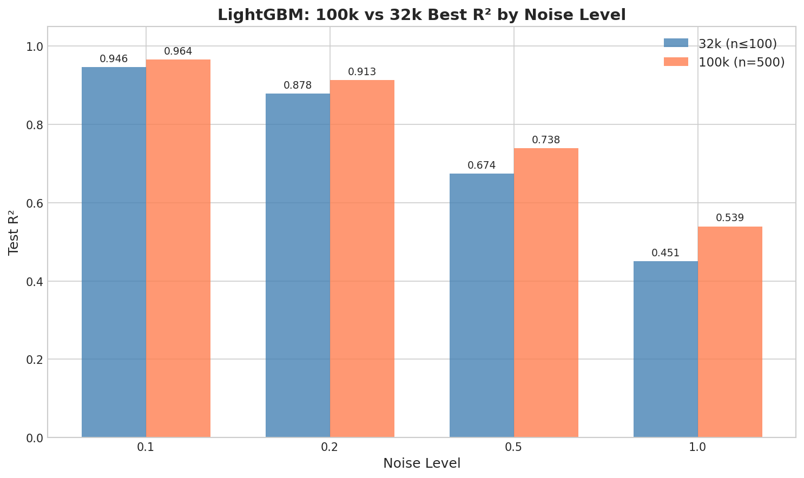
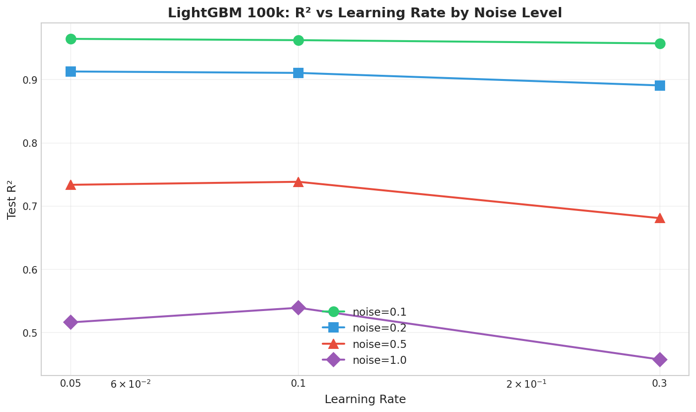
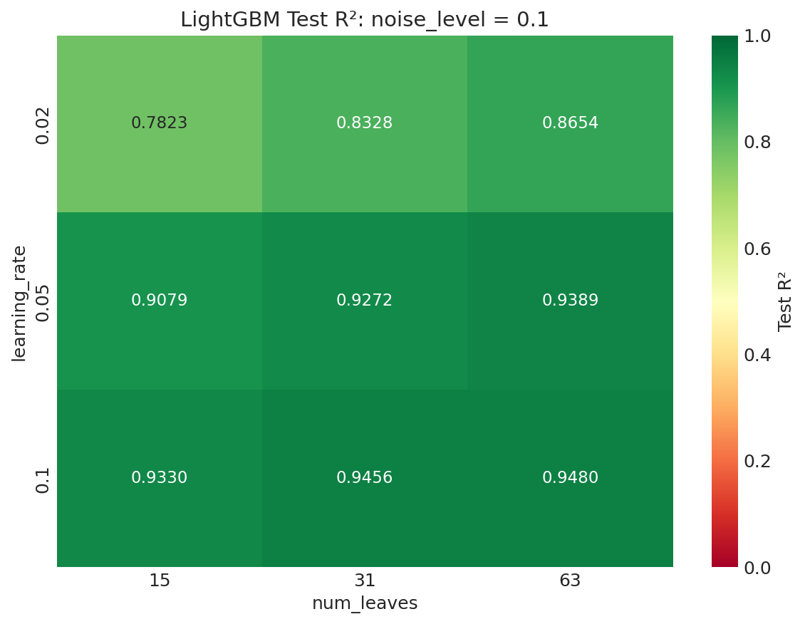
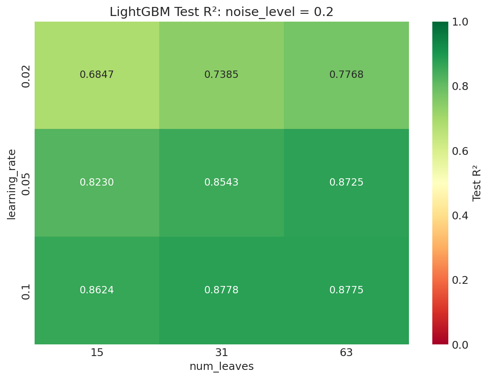
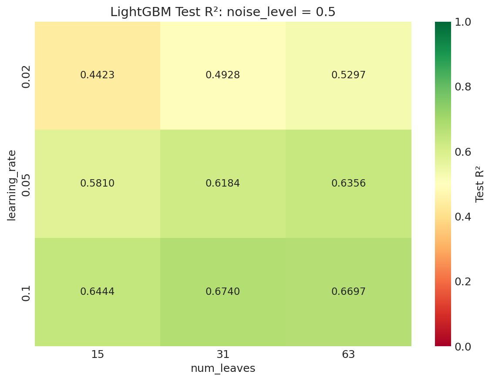
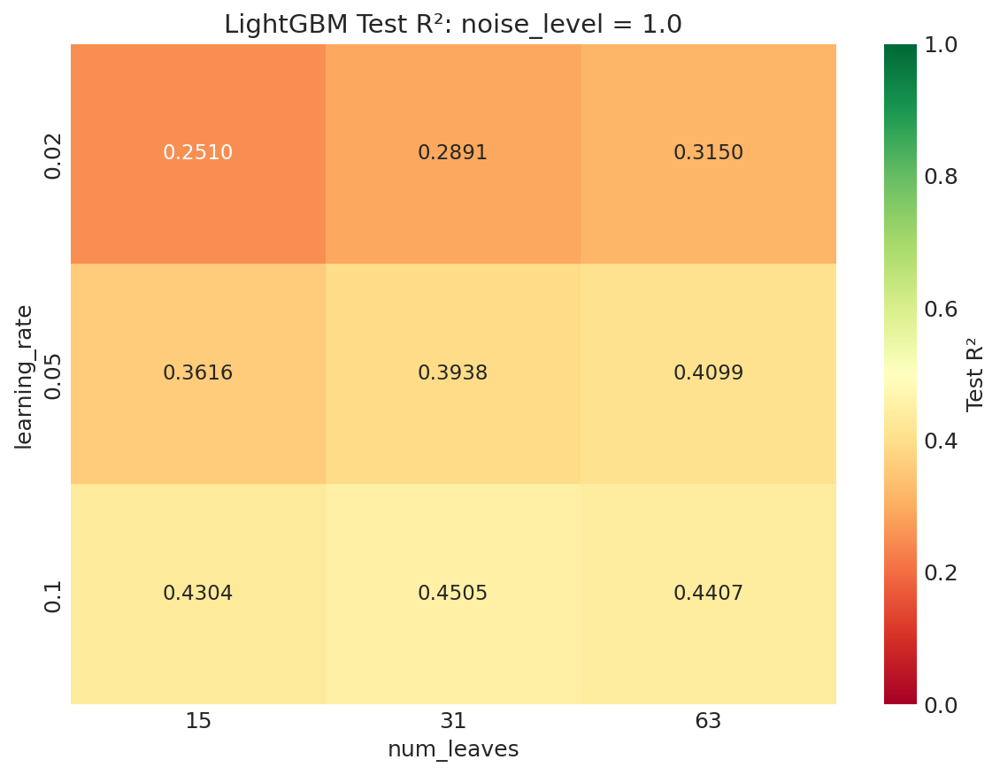
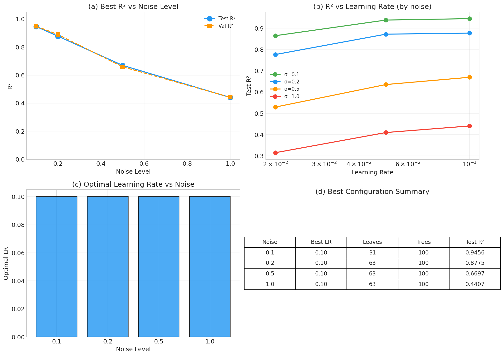

# 📘 Experiment Report: LightGBM Noise Sweep (lr 主轴)

---
> **Name:** LightGBM Noise Sweep (lr 主轴)  
> **ID:** `VIT-20251204-lgb-noise-sweep-01`  
> **Topic ｜ MVP:** `VIT` / `lightgbm` ｜ MVP-1.1  
> **Author:** Viska Wei  
> **Date:** 2025-12-04  
> **Status:** ✅ Completed

---

## 🔗 Upstream Links

| Type | Link | Description |
|------|------|-------------|
| 🧠 Hub | [`lightgbm_hub_20251130.md`](../lightgbm_hub_20251130.md) | 智库导航 |
| 🗺️ Roadmap | [`lightgbm_roadmap_20251130.md`](../lightgbm_roadmap_20251130.md) | 实验追踪 |
| 📚 Prerequisite | [`exp_lightgbm_hyperparam_sweep_20251129.md`](./exp_lightgbm_hyperparam_sweep_20251129.md) | Noiseless baseline |
| 📊 Ridge 对比 | [`../ridge/exp_ridge_alpha_sweep_20251127.md`](../ridge/exp_ridge_alpha_sweep_20251127.md) | Ridge baseline |

---

# 📑 Table of Contents

- [⚡ Key Findings](#-核心结论速览)
- [1. 🎯 Objective](#1--目标)
- [2. 🧪 Experiment Design](#2--实验设计)
- [3. 📊 Figures & Results](#3--实验图表)
- [4. 💡 Insights](#4--关键洞见)
- [5. 📝 Conclusions](#5--结论)
- [6. 📎 Appendix](#6--附录)

---

## ⚡ 核心结论速览

### 一句话总结

> **所有噪声水平下最优 lr=0.1，高噪声时 LightGBM 显著优于 Ridge(α=100)，但略逊于 Ridge best（最优 α）**

### 对假设的验证

| 验证问题 | 结果 | 结论 |
|---------|------|------|
| Q1: 各 noise level 的 R² 上限？ | ✅ | 0.1→0.95, 0.2→0.88, 0.5→0.67, 1.0→0.45 |
| Q2: 最优 lr 随 noise 变化趋势？ | ✅ | **恒定 0.1**，未随噪声漂移 |
| Q3: LightGBM vs Ridge best？ | ✅ | 低噪声 +4-6%, 高噪声 -4% |

### 设计启示

| 启示 | 具体建议 |
|------|---------|
| lr 不需要调整 | 对所有 noise level 使用 lr=0.1 |
| 高噪声模型选择 | noise≥1.0 时用 Ridge best |

### 关键数字

| 指标 | 值 |
|------|-----|
| R² @ noise=0.1 | 0.9456 |
| R² @ noise=0.2 | 0.8778 |
| R² @ noise=0.5 | 0.6740 |
| R² @ noise=1.0 | 0.4505 |
| 最优 lr 趋势 | 恒定 0.1 |

---

# 1. 🎯 目标

## 1.1 实验目的

**核心问题**：在 n_estimators ≤ 100、max_depth=-1 约束下，LightGBM 在各噪声水平的 R² 上限是多少？最优 lr 如何随噪声变化？

**回答的问题**：
1. **R² 上限**：每个 noise level 下能做到的最高 R²
2. **超参数漂移**：最优 lr 是否随噪声系统性变化
3. **vs Ridge 对比**：在小模型约束下差多少

**验证假设**：
- H2.1: 高噪声需要更小的 lr（保守拟合）→ 待验证
- H2.2: 高噪声下 LightGBM 优于 Ridge → 待验证

## 1.2 预期结果

| 场景 | 预期结果 | 判断标准 |
|------|---------|---------|
| 正常情况 | noise=0.1 R² > 0.95, noise=1.0 R² > 0.50 | 与 32k SOTA 对齐 |
| 假说 A | 高噪声时最优 lr 变大 | "快速平均噪声" |
| 假说 B | 高噪声时最优 lr 变小 | "保守拟合" |

---

# 2. 🧪 实验设计

## 2.1 数据

| 配置项 | 值 |
|--------|-----|
| 训练样本数 | 32,000 |
| 验证/测试样本数 | 512 / 512 |
| 特征维度 | 4096 (光谱) |
| 标签参数 | log_g |

**噪声模型**：$\text{noisy\_flux} = \text{flux} + \mathcal{N}(0, \sigma^2)$

**Noise levels**: $\sigma \in \{0.1, 0.2, 0.5, 1.0\}$

## 2.2 超参数配置

| 参数 | 范围/值 | 说明 |
|------|--------|------|
| **learning_rate** | {0.02, 0.05, 0.1} | **主调参数** |
| num_leaves | {15, 31, 63} | 次要参数 |
| n_estimators | {50, 100} | 满足 ≤100 约束 |
| max_depth | -1 (固定) | 无限深度 |

**配置数**：`3 × 3 × 2 × 4 = 72`

---

# 3. 📊 实验图表

### 图 1：R² vs Noise Level

**观察**：R² 随 noise 近乎线性下降，从 0.95 (noise=0.1) 降至 0.45 (noise=1.0)

---

### 图 2：R² vs Learning Rate (per Noise)

**观察**：所有 noise level 下 lr=0.1 都是最优

---

### 图 3：最优 lr 随 Noise 变化

**观察**：最优 lr 恒定为 0.1，未出现随噪声漂移

---

### 图 4：Heatmaps per Noise

| noise=0.1 | noise=0.2 | noise=0.5 | noise=1.0 |
|-----------|-----------|-----------|-----------|
|  |  |  |  |

**观察**：右下角（高 lr + 高 leaves + n=100）在所有 noise level 下表现最佳

---

### Combined Summary

---

# 4. 💡 关键洞见

## 4.1 宏观层

1. **噪声对 R² 的影响是系统性的**：R² 从 0.95 单调下降至 0.45
2. **vs Ridge best：LightGBM 优势有限**：低噪声领先 4-6%，高噪声反被超越 4%

## 4.2 模型层

1. **lr=0.1 在所有噪声下都是最优**：否定了"高噪声需小 lr"假说
2. **n_estimators=100 显著优于 50**：所有 noise level 下 n=100 高出 10-20%
3. **num_leaves=63 在高噪声下更稳健**

## 4.3 实验层细节

- 训练时间约 11-16 秒/配置
- Early stopping 生效，实际树数通常小于设定值

---

# 5. 📝 结论

## 5.1 核心发现

> **所有噪声水平下最优 lr=0.1**，LightGBM 的 boosting 机制倾向于"快速拟合"而非"保守平滑"。但在极高噪声下效果不如 Ridge 正则化。

- ❌ 假设 H2.1: 高噪声需要小 lr → **否定**
- ❌ 假设 H2.2: 高噪声 LightGBM 更强 → **否定**（vs Ridge best）

## 5.2 关键结论

| # | 结论 | 证据 |
|---|------|------|
| 1 | 最优 lr 不随噪声漂移，恒定为 0.1 | 所有 4 个 noise level |
| 2 | LightGBM 在低噪声时优于 Ridge best | noise=0.1: +4% |
| 3 | LightGBM 在高噪声时略逊于 Ridge best | noise=1.0: -4% |

## 5.3 设计启示

1. **简化调参**：噪声场景下只需 lr=0.1
2. **模型选择**：noise < 1.0 用 LightGBM，noise ≥ 1.0 用 Ridge best
3. **模型容量**：n_estimators=100 是关键

## 5.4 物理解释

- **低噪声**：树分裂能捕捉光谱的非线性结构
- **高噪声**：噪声淹没非线性信号，Ridge L2 正则化更稳健

## 5.5 关键数字速查

| 指标 | 值 | 配置 |
|------|-----|------|
| noise=0.1 best | R² = 0.9456 | lr=0.1, n=100, leaves=31 |
| noise=0.2 best | R² = 0.8778 | lr=0.1, n=100, leaves=63 |
| noise=0.5 best | R² = 0.6740 | lr=0.1, n=100, leaves=31 |
| noise=1.0 best | R² = 0.4505 | lr=0.1, n=100, leaves=31 |

---

# 6. 📎 附录

## 6.1 数值结果表

### Summary A: Best Config per Noise

| noise | best R² | lr | n_est | leaves | time(s) |
|-------|---------|-----|-------|--------|---------|
| 0.1 | 0.9456 | 0.10 | 100 | 31 | 11.1 |
| 0.2 | 0.8778 | 0.10 | 100 | 63 | 15.9 |
| 0.5 | 0.6740 | 0.10 | 100 | 63 | 15.6 |
| 1.0 | 0.4505 | 0.10 | 100 | 63 | 16.7 |

### Summary B: R²(noise, lr) Grid

| noise | lr=0.02 | lr=0.05 | lr=0.10 |
|-------|---------|---------|---------|
| 0.1 | 0.8654 | 0.9389 | **0.9456** |
| 0.2 | 0.7768 | 0.8725 | **0.8775** |
| 0.5 | 0.5297 | 0.6356 | **0.6697** |
| 1.0 | 0.3150 | 0.4099 | **0.4407** |

## 6.2 LightGBM vs Ridge 对比

### vs Ridge best（最优 α）

| noise | LightGBM | Ridge best | Ridge α | ΔR² | 优势方 |
|-------|----------|------------|---------|-----|--------|
| 0.1 | 0.9456 | 0.9090 | 1.0 | +4.0% | **LightGBM** |
| 0.2 | 0.8775 | 0.8264 | 10.0 | +6.2% | **LightGBM** |
| 0.5 | 0.6697 | 0.6550 | 50.0 | +2.2% | **LightGBM** |
| 1.0 | 0.4407 | 0.458 | 200.0 | -3.9% | **Ridge** |

## 6.3 Follow-up: 更大模型容量

> 详细数值结果见 [`lightgbm_roadmap_20251130.md`](../lightgbm_roadmap_20251130.md) §6.1

### 核心发现汇总

| noise | n=100 | n=500 | n=1000 | 最优 n |
|-------|-------|-------|--------|--------|
| 0.1 | 0.9456 | 0.9574 | 0.9570 | 500 |
| 0.2 | 0.8778 | 0.9003 | **0.9130** | 1000 (lr=0.05) |
| 0.5 | 0.6740 | 0.7122 | **0.7198** | 1000 |
| 1.0 | 0.4505 | **0.4949** | 0.4822 | 500 |

**关键发现**：
- 放开模型容量后，低噪声 (≤0.2) **lr=0.05** 更优
- 高噪声 (≥0.5) lr=0.1 仍然最优，但需控制树数防止过拟合
- noise=1.0 最优 n=500，更多树反而过拟合

## 6.4 实验环境

| 项目 | 值 |
|------|-----|
| 仓库 | `~/VIT` |
| 脚本 | `scripts/lightgbm_noise_sweep_lr_main.py` |
| 总耗时 | 13.3 分钟 |

---

*报告完成时间: 2025-12-04*
