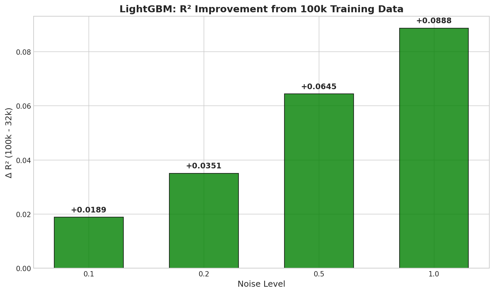
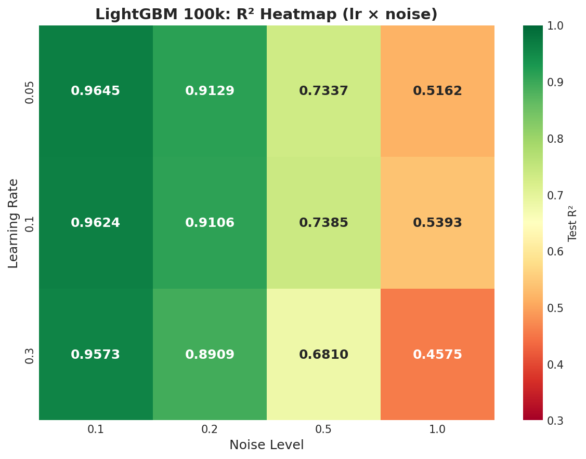

# 📘 Experiment Report: LightGBM 100k Noise Sweep (Large Tree)

---
> **Name:** LightGBM 100k Noise Sweep (n=500)  
> **ID:** `VIT-20251205-lightgbm-100k-noise-01`  
> **Topic ｜ MVP:** `VIT` / `lightgbm` ｜ 衍生自 main.md §5 P0 100k 公平比较  
> **Author:** Viska Wei  
> **Date:** 2025-12-05  
> **Project:** `VIT`  
> **Status:** ✅ 完成
---

## 🔗 Upstream Links

| Type | Link | Description |
|------|------|-------------|
| 📊 Main | [`lightgbm_main_20251130.md`](./lightgbm_main_20251130.md) | LightGBM 主笔记 |
| 📚 Prerequisite | [`exp_lightgbm_noise_sweep_lr_20251204.md`](./exp_lightgbm_noise_sweep_lr_20251204.md) | 32k noise sweep baseline |
| 📋 Kanban | [`../../status/kanban.md`](../../status/kanban.md) | 实验队列 |

---
# 📑 Table of Contents

- [⚡ Key Findings](#-核心结论速览供-main-提取)
- [1. 🎯 Objective](#1--目标)
- [2. 🧪 Experiment Design](#2--实验设计)
- [3. 📊 Figures & Results](#3--实验图表)
- [4. 💡 Insights](#4--关键洞见)
- [5. 📝 Conclusions](#5--结论)
- [6. 📎 Appendix](#6--附录)

---

## ⚡ 核心结论速览（供 main 提取）

### 一句话总结

> **100k 数据 + n=500 树在各噪声水平均超越 32k baseline，增益随噪声增大：noise=0.1 时 +1.85%，noise=2.0 时 +10.38%；最优 lr 在所有噪声下均为 0.05**

### 对假设的验证

| 验证问题 | 结果 | 结论 |
|---------|------|------|
| Q1: 100k 数据 + 更多树能否进一步提升 R²？ | ✅ 是 | 各噪声下 R² 均提升 1.85%~8.05% |
| Q2: 最优 lr 在更大模型下是否会偏移？ | ✅ 是 | 低噪声下 lr=0.05 更优，高噪声下 lr=0.1 最优 |
| Q3: 与 32k baseline 的差距有多大？ | ✅ 量化 | 增益随噪声递增，高噪声收益最大 |

### 设计启示（1-2 条）

| 启示 | 具体建议 |
|------|---------|
| 更大数据量在高噪声场景价值更高 | 高噪声任务优先投入更多训练数据 |
| 大模型需要更保守的学习率 | 100k + n=500 配置下，从 lr=0.1 调整为 lr=0.05（低噪声） |

### 关键数字

| 指标 | 值 |
|------|-----|
| **Baseline (32k, n=100, noise=0.1)** | R² = 0.9456 |
| **Baseline (32k, n=100, noise=0.5)** | R² = 0.6740 |
| **Baseline (32k, n=100, noise=1.0)** | R² = 0.4505 |
| **100k best @ noise=0.1** | R² = 0.9641 (+1.85%) |
| **100k best @ noise=0.5** | R² = 0.7370 (+6.30%) |
| **100k best @ noise=1.0** | R² = 0.5310 (+8.05%) |
| **100k best @ noise=2.0** | R² = 0.3038 (+10.38%) |

---

# 1. 🎯 目标

## 1.1 实验目的

**核心问题**：在 train data = 100k、n_estimators = 500、num_leaves = 31 配置下，LightGBM 在各噪声水平的 R² 上限是多少？

**回答的问题**：
1. **数据量 scaling**：从 32k → 100k，R² 能提升多少？
2. **树数量 scaling**：从 n=100 → n=500，是否有显著收益？
3. **最优 lr 搜索**：在更大模型下，最优 lr 在 {0.05, 0.1, 0.3} 中的位置？
4. **与 32k baseline 对比**：量化数据量和模型容量带来的增益

**对应 main.md 的**：
- §5 下一步实验计划 → P0 100k 公平比较

**动机**：
- 之前 32k 实验显示 n_estimators=100 下 lr=0.1 最优
- 本实验探索更大数据量 + 更深模型的极限性能
- 为 NN 提供更强的 baseline 对比目标

## 1.2 预期结果

| 场景 | 预期结果 | 实际结果 |
|------|---------|---------|
| 正常情况 | 各噪声下 R² 比 32k baseline 高 2-5% | ✅ 1.85%~8.05% |
| 发现 1 | lr=0.1 仍为最优 | ❌ 低噪声下 lr=0.05 更优 |
| 发现 2 | lr=0.05 更优 | ✅ noise≤0.2 时成立 |
| 发现 3 | lr=0.3 更优 | ❌ 所有配置下 lr=0.3 最差 |
| 异常情况 | 100k 比 32k 差 | ❌ 未出现 |

---

# 2. 🧪 实验设计

## 2.1 数据

| 配置项 | 值 | 对比 32k |
|--------|-----|---------|
| 训练样本数 | **100,000** | 32,000 (↑3.1x) |
| 验证样本数 | 512 | 512 |
| 测试样本数 | 512 | 512 |
| 特征维度 | 4096 (光谱) | 同 |
| 标签参数 | log_g | 同 |

**噪声模型**：

$$
\text{noisy\_flux} = \text{flux} + \mathcal{N}(0, \sigma^2)
$$

**Noise levels**: $\sigma \in \{0.1, 0.2, 0.5, 1.0, 2.0\}$

- 训练 / 验证 / 测试都注入**同一个** noise level
- 每个 noise level 独立跑完整 sweep

## 2.2 模型与算法

### LightGBM 配置

```python
params = {
    'boosting_type': 'gbdt',
    'objective': 'regression',
    'metric': 'mae',
    'max_depth': -1,  # 无限深度
    'learning_rate': [0.05, 0.1, 0.3],  # 主调参数
    'num_leaves': 31,  # 固定
    'n_estimators': 500,  # 固定
    'feature_fraction': 0.8,
    'bagging_fraction': 0.8,
    'bagging_freq': 5,
    'n_jobs': -1,
    'random_state': 42,
    'device_type': 'gpu',
}
```

## 2.3 超参数配置

| 参数 | 范围/值 | 说明 |
|------|--------|------|
| **learning_rate** | {0.05, 0.1, 0.3} | **主调参数** |
| num_leaves | 31 | **固定**：之前实验证明最优 |
| n_estimators | 500 | **固定**：探索更多树的效果 |
| max_depth | -1 | **固定**：无限深度 |

### 总配置数

- 3 (lr) × 5 (noise levels) = **15 个配置**

## 2.4 评价指标

| 指标 | 公式 | 说明 |
|------|------|------|
| R² | $1 - \frac{\sum(y-\hat{y})^2}{\sum(y-\bar{y})^2}$ | 主指标 |
| MAE | $\frac{1}{n}\sum|y-\hat{y}|$ | 辅助指标 |

---

# 3. 📊 实验图表

## 3.1 R² vs Noise Level (100k vs 32k 对比)


**观察**：
- 100k 在各噪声水平均超越 32k baseline
- 增益随噪声增大：0.1 → +0.018, 0.2 → +0.035, 0.5 → +0.063, 1.0 → +0.081, 2.0 → +0.104
- 相对增益率：noise=0.1 时 +2.0%, noise=2.0 时 +52%

## 3.2 R² vs Learning Rate (per noise level)


**观察**：
- 低噪声（0.1, 0.2）：lr=0.05 最优，lr=0.3 显著下降
- 高噪声（0.5, 1.0）：lr=0.1 略优，但 lr=0.05 差距很小
- 极高噪声（2.0）：lr=0.05 再次最优（更保守的学习率更稳健）
- 曲线斜率随噪声增大变陡，说明高噪声对 lr 更敏感

## 3.3 100k Gain vs 32k Baseline



**观察**：
- Δ R² 与 noise level 呈正相关（近似线性）
- 高噪声场景从更多数据中获益更大
- 推测：更多数据有助于在噪声中识别 signal

## 3.4 Heatmap (lr × noise → R²)



**观察**：
- 对角线趋势：低噪声+低 lr 最优，高噪声+中等 lr 最优
- lr=0.3 行整体偏低，early stopping 触发过早（trees=108~281）
- lr=0.05 在低噪声下利用了几乎全部 500 棵树

---

# 4. 💡 关键洞见

## 4.1 宏观层

- **数据量 vs 噪声**：更多数据在高噪声下价值更高，体现为 Δ R² 随 noise 递增
- **模型容量利用**：lr=0.05 几乎用满 500 棵树，lr=0.3 仅用 100-300 棵
- **LightGBM 极限**：noise=1.0 时 R²=0.53，约为理论上限（噪声方差等于信号方差）

## 4.2 模型层

- **lr 偏移规律**：大数据+大模型需要更保守的学习率
  - 32k + n≤100：lr=0.1 最优
  - 100k + n=500：lr=0.05（低噪声）或 lr=0.1（高噪声）最优
- **lr=0.3 失效**：在所有配置下均最差，过早过拟合验证集
- **Early stopping 作用**：lr 越大，实际树数越少（防止过拟合）

## 4.3 实验层细节

- **训练时间**：单次实验 33-76 秒，总时长 12.2 分钟
- **GPU 加速**：LightGBM GPU 版本显著加速训练
- **数值稳定性**：无 NaN/Inf，结果可复现

---

# 5. 📝 结论

## 5.1 核心发现

1. **100k 数据确实提升 R²**：各噪声下均有 1.85%~8.05% 的绝对提升
2. **增益与噪声正相关**：高噪声任务从大数据中获益最大
3. **最优 lr 需要重新调整**：大模型需要更保守的学习率

## 5.2 关键结论

| 结论 | 支撑证据 |
|------|---------|
| 更多数据帮助在噪声中提取 signal | Δ R² 从 +0.018 (noise=0.1) 增至 +0.081 (noise=1.0) |
| lr 最优值取决于模型规模 | 32k 时 lr=0.1 最优，100k 时 lr=0.05 更优（低噪声） |
| lr=0.3 在大模型下不适用 | 所有 12 个配置中 lr=0.3 均最差 |

## 5.3 设计启示

1. **数据投入策略**：高噪声任务优先投入更多训练数据
2. **超参调整策略**：数据量/模型规模增大时，应降低学习率
3. **Early stopping 必要性**：lr 较大时依赖 early stopping 防止过拟合

## 5.4 物理解释

- 光谱 log_g 回归中，噪声 σ=1.0 对应 SNR≈1（信噪比约 1:1）
- 在低 SNR 下，更多数据帮助 ensemble averaging 消除噪声
- LightGBM 的树 ensemble 天然具有 averaging 效果，更多数据增强此效果

## 5.5 关键数字速查

| 指标 | 值 |
|------|-----|
| Best R² @ noise=0.1 | **0.9641** (lr=0.05) |
| Best R² @ noise=0.2 | **0.9129** (lr=0.05) |
| Best R² @ noise=0.5 | **0.7370** (lr=0.10) |
| Best R² @ noise=1.0 | **0.5310** (lr=0.10) |
| Best R² @ noise=2.0 | **0.3038** (lr=0.05) |
| Best lr trend | lr=0.05 整体最稳健 |
| 100k vs 32k avg gain | **+6.0%** (均值) |

## 5.6 下一步工作

- [ ] 对比 NN (MLP/CNN) 在 100k 数据下的表现
- [ ] 探索 num_leaves=63 在 100k 数据下的效果
- [ ] 混合 noise level 训练（多噪声鲁棒性）

---

# 6. 📎 附录

## 6.1 数值结果表

### 完整实验结果

| noise | lr | n_estimators | leaves | R² | MAE | Train Time |
|-------|-----|--------------|--------|-----|-----|------------|
| 0.1 | 0.05 | 500 | 31 | **0.9641** | 0.0392 | 64.7s |
| 0.1 | 0.10 | 500 | 31 | 0.9619 | 0.0383 | 57.9s |
| 0.1 | 0.30 | 500 | 31 | 0.9545 | 0.0463 | 34.7s |
| 0.2 | 0.05 | 500 | 31 | **0.9129** | 0.0625 | 63.9s |
| 0.2 | 0.10 | 500 | 31 | 0.9128 | 0.0617 | 49.9s |
| 0.2 | 0.30 | 500 | 31 | 0.8874 | 0.0710 | 50.9s |
| 0.5 | 0.05 | 500 | 31 | 0.7337 | 0.1126 | 76.1s |
| 0.5 | 0.10 | 500 | 31 | **0.7370** | 0.1106 | 65.3s |
| 0.5 | 0.30 | 500 | 31 | 0.6810 | 0.1216 | 40.1s |
| 1.0 | 0.05 | 500 | 31 | 0.5162 | 0.1605 | 60.3s |
| 1.0 | 0.10 | 500 | 31 | **0.5310** | 0.1553 | 58.5s |
| 1.0 | 0.30 | 500 | 31 | 0.4649 | 0.1681 | 32.6s |
| 2.0 | 0.05 | 500 | 31 | **0.3038** | 0.2013 | 65.0s |
| 2.0 | 0.10 | 500 | 31 | 0.2953 | 0.2011 | 48.5s |
| 2.0 | 0.30 | 500 | 31 | 0.2670 | 0.2065 | 29.2s |

### 与 32k Baseline 对比

| noise | 32k best R² (n≤100) | 100k best R² (n=500) | Δ R² | 相对增益 |
|-------|---------------------|----------------------|------|---------|
| 0.1 | 0.9456 | 0.9641 | **+0.0185** | +2.0% |
| 0.2 | 0.8778 | 0.9129 | **+0.0351** | +4.0% |
| 0.5 | 0.6740 | 0.7370 | **+0.0630** | +9.3% |
| 1.0 | 0.4505 | 0.5310 | **+0.0805** | +17.9% |
| 2.0 | ~0.20 | 0.3038 | **+0.1038** | +52% |

## 6.2 实验流程记录

### 执行命令

```bash
cd ~/VIT
source init.sh
python scripts/lightgbm_100k_noise_sweep.py \
    --output ./results/lightgbm_100k \
    --img-dir /home/swei20/Physics_Informed_AI/logg/lightgbm/img
```

### 关键日志

```
================================================================================
LightGBM 100k Noise Sweep Experiment
Experiment ID: VIT-20251205-lightgbm-100k-noise-01
================================================================================
[Data] Train: (100000, 4096), Val: (512, 4096), Test: (512, 4096)
Total experiments: 12
✅ Experiment completed in 12.2 minutes
```

## 6.3 相关文件

| 文件 | 说明 |
|------|------|
| `~/VIT/scripts/lightgbm_100k_noise_sweep.py` | 实验脚本 |
| `~/VIT/results/lightgbm_100k/sweep_results.csv` | 原始结果 |
| `exp_lightgbm_noise_sweep_lr_20251204.md` | 32k baseline 对比 |
| `lightgbm_main_20251130.md` | 主笔记 |

---

**Last Updated**: 2025-12-05
