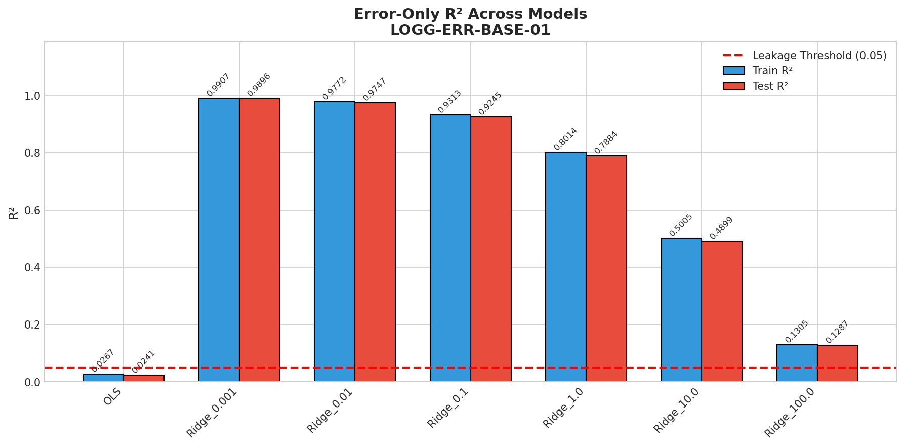
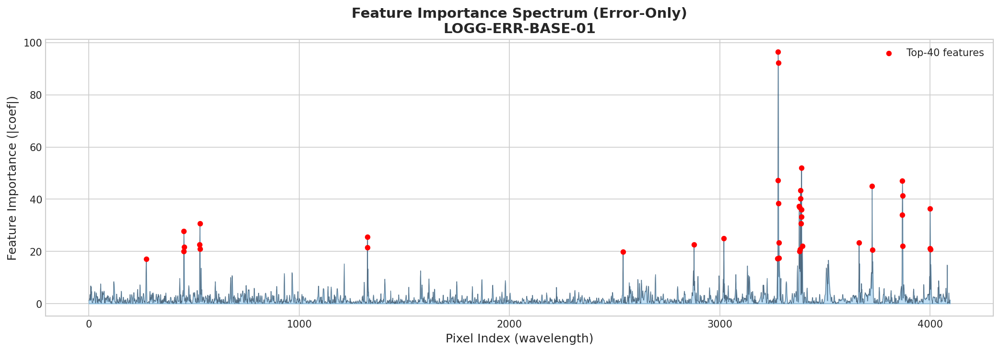
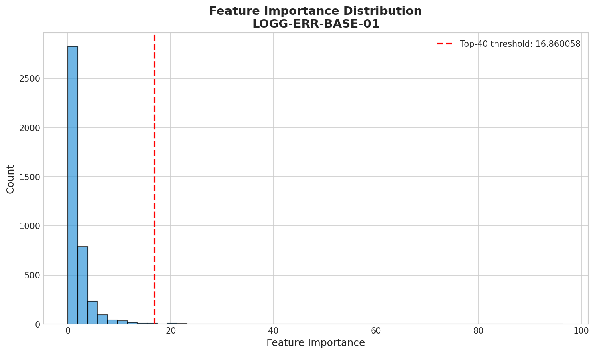
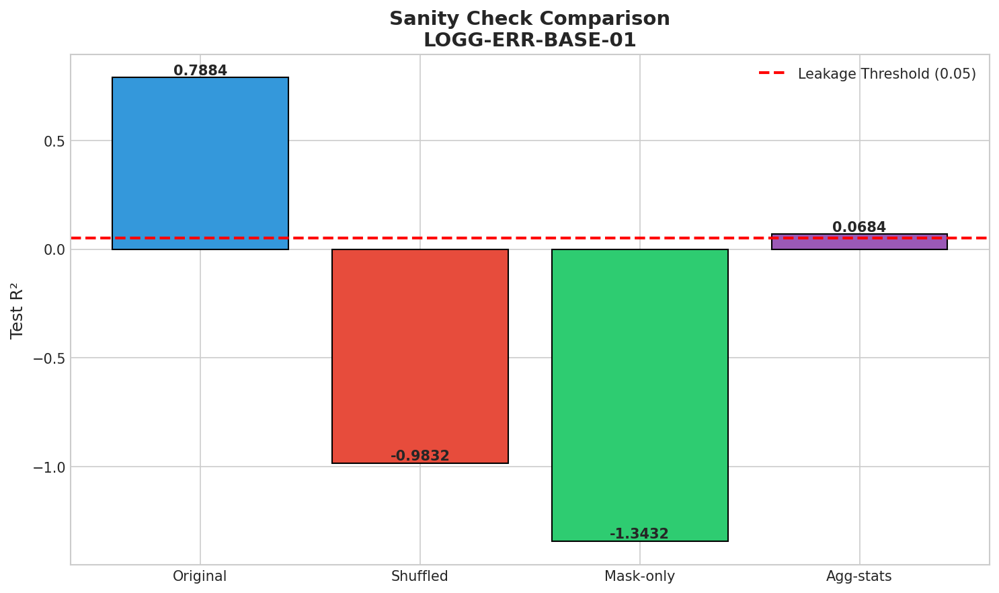

# 📗 LOGG-ERR-BASE-01: Error-Only Leakage Baseline

> **MVP:** 0.1 | **Gate:** Gate-1 (Leakage Audit)
> **Author:** Viska Wei | **Date:** 2025-12-26 | **Status:** ❌ FAIL

---

## 🔗 上游追溯

| 类型 | 链接 |
|------|------|
| Hub | `moe_snr_hub.md` §DG1 |
| Roadmap | `moe_snr_roadmap.md` MVP-0.1 |
| Session | - |

---

## ⚡ 核心结论速览

**一句话**: Error vector 存在**严重泄露**，R² = 0.99，几乎可以完美预测 logg！必须先去泄露才能用于 MoE gate。

**假设验证**:
- ❌ H1: error vector 预测 logg 的 R² < 0.05 → **实际 R² = 0.9896，严重超标**

**关键数字**:
| 指标 | 值 |
|------|---|
| error-only R² (Ridge best, α=0.001) | **0.9896** |
| error-only R² (OLS) | 0.024 |
| Shuffle 后 R² | -0.98 (崩溃) |
| Agg-stats R² | 0.068 |
| Top-40 像素贡献占比 | 14.87% |

---

## 🎯 目标

量化 error vector 的"泄露程度"：
1. 如果 error-only R² 接近 0 → error 不携带天体参数信息，可直接用于 gate
2. 如果 error-only R² 很高 → error 携带泄露信息，需要去泄露后再用

---

## 🧪 实验设计

### 2.1 数据
- 训练集: 10k samples (from mag205_225_lowT_1M)
- 测试集: 1k samples
- 输入: **error vector ONLY**（4096 维）
- 输出: log_g

### 2.2 模型
- LinearRegression (OLS)
- Ridge (alpha = 0.001, 0.01, 0.1, 1.0, 10.0, 100.0)

### 2.3 Sanity Checks
- Shuffle Test: 打乱波长对齐，检验是否依赖位置信息
- Mask-only Test: 只用二值 mask，检验是否是泄露源
- Aggregate Stats Test: 只用统计量 (mean, std, etc.)

---

## 📊 实验图表

### Fig 1: Error-Only R² Across Models

**描述**: 用 error vector 预测 logg 的各模型 R²
**关键观察**: Ridge (α=0.001) 达到 R² = 0.99！严重泄露！OLS 因高维过拟合表现差。

### Fig 2: Feature Importance Spectrum

**描述**: 哪些像素（波长位置）对预测 logg 贡献最大
**关键观察**: Top-40 像素集中在 ~3277-3388 和 ~3724-3869 区域

### Fig 3: Importance Distribution

**描述**: 特征重要性分布
**关键观察**: 长尾分布，大部分像素重要性低，少量像素贡献大

### Fig 4: Sanity Check Results

**描述**: 三种 sanity check 对比
**关键观察**: 
- Shuffle 后性能崩溃 (R² = -0.98) → 模型依赖波长对齐信息
- Agg-stats R² = 0.068 → 不是简单的统计量泄露，是像素级信息

---

## 💡 关键洞见

| # | 洞见 | 证据 | 决策影响 |
|---|------|------|----------|
| 1 | Error 严重泄露 logg | R² = 0.99 | 必须去泄露 |
| 2 | 泄露是波长对齐的 | Shuffle 后崩溃 | 不能直接用 error 做 gate |
| 3 | 不是简单统计量 | Agg-stats R² = 0.07 | 需要更复杂的去泄露策略 |
| 4 | Top 像素集中特定区域 | 3277-3388, 3724-3869 | 可能与特定谱线相关 |

---

## 📝 结论

### 5.1 核心发现
Error vector 几乎完美预测 logg (R² = 0.99)，说明 PFS simulator 生成的 error 与天体物理参数高度相关。这可能是因为：
1. Error 与 flux 形状相关，而 flux 形状与 logg 相关
2. 不同 logg 的恒星在特定波长有不同的不确定性
3. Simulator 的噪声模型隐含了物理信息

### 5.2 Gate-1 判定
- [ ] 通过 (R² < 0.05) → 进入 Gate-2
- [x] ❌ **未通过** (R² = 0.99 ≥ 0.05) → **进入 MVP-0.2 (去泄露)**

### 5.3 设计启示
1. **不能直接用 error vector 做 MoE gate input**
2. 需要去泄露策略：
   - S1: 同口径归一化（normalize error by flux magnitude）
   - S2: Template × scale（用模板缩放）
   - S3: 无对齐统计（只用不依赖波长位置的统计量）

---

## 📎 附录

### 6.1 数值结果表

| Model | Train R² | Test R² | MAE | RMSE |
|-------|----------|---------|-----|------|
| OLS | 0.0267 | 0.0241 | 0.967 | 1.132 |
| Ridge_0.001 | 0.9907 | **0.9896** | 0.088 | 0.117 |
| Ridge_0.01 | 0.9772 | 0.9747 | 0.132 | 0.182 |
| Ridge_0.1 | 0.9313 | 0.9245 | 0.226 | 0.315 |
| Ridge_1.0 | 0.8014 | 0.7884 | 0.396 | 0.527 |
| Ridge_10.0 | 0.5005 | 0.4899 | 0.671 | 0.819 |
| Ridge_100.0 | 0.1305 | 0.1287 | 0.915 | 1.070 |

### 6.2 Sanity Check 详细结果

**Shuffle Test**:
- 原始 R²: 0.7884 (Ridge α=1.0)
- 打乱后 R²: **-0.98**
- 结论: 模型严重依赖波长对齐信息

**Mask-only Test**:
- Mask-only R²: **-1.34**
- 结论: 二值 mask 无法预测 logg

**Aggregate Stats Test**:
- Agg-stats R² (10 features): **0.068**
- 结论: 统计量只贡献少量信息，主要泄露在像素级

### 6.3 Top-10 重要像素

像素索引: [3277, 3278, 3388, 3276, 3868, 3724, 3384, 3869, 3383, 3279]

