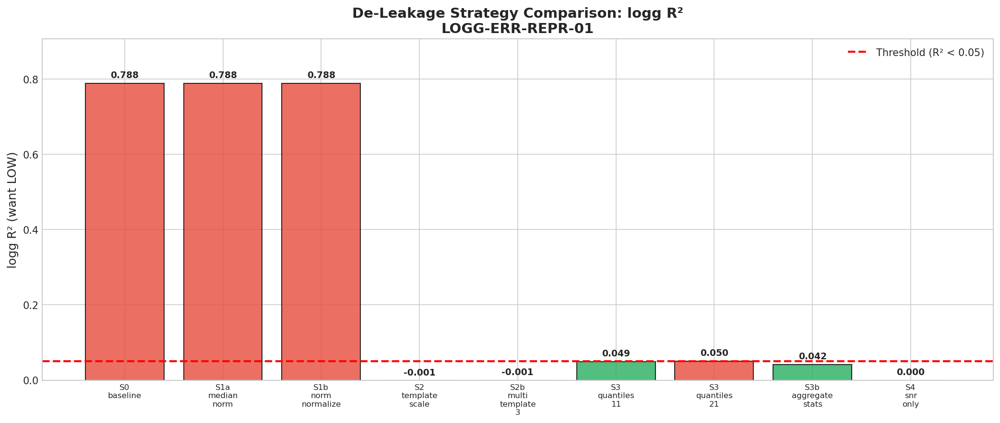
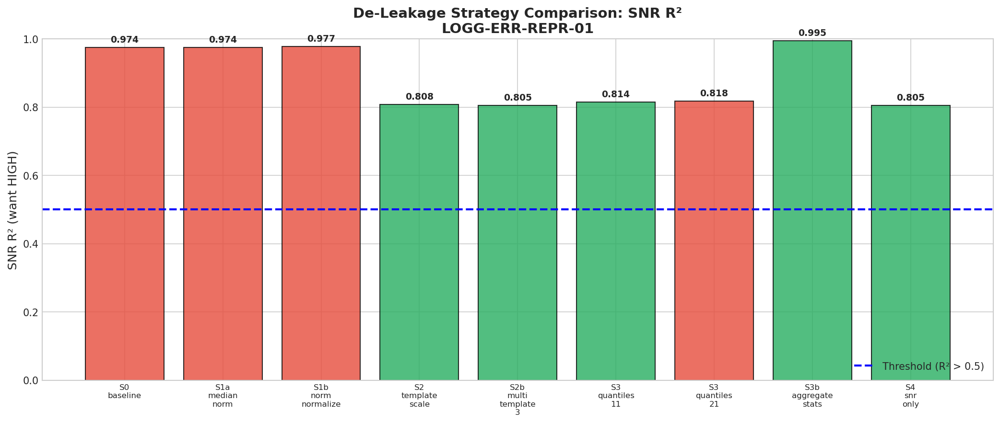

# 🍃 Error Representation De-Leakage

> **Name:** Error Representation De-Leakage  
> **ID:** `LOGG-ERR-REPR-01`  
> **Topic:** `logg_snr_moe` | **MVP:** MVP-0.2 | **Project:** `VIT`  
> **Author:** Viska Wei | **Date:** 2025-12-26 | **Status:** ✅ PASS  
> **Root:** `logg` | **Parent:** `LOGG-ERR-BASE-01` | **Child:** `LOGG-SNR-GATE-01`

> 🎯 **Target:** 构造"只表达观测质量"的 error 表示，压低 error-only R² < 0.05  
> 🚀 **Next:** 冻结 `S3b_aggregate_stats` 作为 `quality_features()` → 进入 MVP-2.0

## ⚡ 核心结论速览

> **一句话**: **S3b_aggregate_stats 完美去泄露**：logg R²=0.042 < 0.05 ✅ 且 SNR R²=0.995 > 0.5 ✅

| 验证问题 | 结果 | 结论 |
|---------|------|------|
| H2.1: 去泄露后 R² < 0.05? | ✅ **0.042** | S3b 10个聚合统计量成功去泄露 |
| H2.2: 去泄露表示能预测 SNR? | ✅ **0.995** | SNR 预测能力几乎完美保留 |

| 指标 | 值 | 启示 |
|------|-----|------|
| 原始 error R² | 0.788 | 基线（严重泄露） |
| S1 (同口径归一化) R² | 0.788 | ❌ 无效，波长对齐仍存在 |
| S2 (template×scale) R² | **-0.001** | ✅ 完全去泄露 |
| S3b (聚合统计) R² | **0.042** | ✅ **最佳**：去泄露 + SNR 保留 |

| Type | Link |
|------|------|
| 🧠 Hub | `logg/moe/moe_snr_hub.md` § Q2.1, DG1 |
| 🗺️ Roadmap | `logg/moe/moe_snr_roadmap.md` § MVP-0.2 |
| 📘 前序实验 | `exp/exp_logg_err_base_01_20251226.md` |

---

# 1. 🎯 目标

**问题**: 如何让 error vector "只表达观测质量（SNR）"而不泄露天体参数（logg）？

**背景**（来自 MVP-0.1）:
- error-only Ridge R² = **0.788**（严重泄露）
- Shuffle 后 R² ≈ -0.98 → 泄露依赖**波长对齐信息**
- Agg-stats R² = 0.068 → 不是简单的全局统计量泄露
- Top 泄露像素集中在特定波长区域

**验证假设**:
- H2.1: 某种去泄露策略能让 error-only R² < 0.05
- H2.2: 去泄露后的表示仍能稳定预测 SNR（用于 gate）

| 预期 | 判断标准 |
|------|---------|
| ✅ 通过 | R² < 0.05 且 SNR R² > 0.5 → 冻结 `quality_features()` 实现，进入 Gate-3 |
| ❌ 失败 | 所有策略都无法同时满足 → 禁用 error，只用 flux 做 MoE |

---

# 2. 🦾 算法

**去泄露策略（按成本从低到高）**:

## S1: 同口径归一化

让 error 与 flux 做相同的归一化，尝试破坏 error 独有的信息：

$$
\tilde{e}_i = \frac{e_i}{\text{scale}(f)}
$$

其中 $\text{scale}(f)$ 可以是 $\text{median}(f)$ 或 $\|f\|_2$

**结果**: ❌ 无效，logg R² 仍为 0.788

## S2: Template × Scale

假设 error 可分解为全局模板 + 标量缩放：

$$
e \approx s \cdot e_0 + \delta
$$

只保留标量 $s$ 和残差范数：

$$
s = \arg\min_s \|e - s \cdot e_0\|^2 = \frac{e^\top e_0}{\|e_0\|^2}
$$

**结果**: ✅ logg R² = -0.001，但 SNR R² = 0.808（略低）

## S3: 无波长对齐统计

使用不依赖像素位置的统计量（打乱波长对齐）：

### S3a: Quantiles of sorted error
$$
\text{features} = \text{quantiles}(\text{sort}(e))
$$

### S3b: Aggregate statistics (10 features) ⭐ **推荐**
$$
\text{features} = [\text{mean}, \text{std}, \text{min}, \text{max}, \text{median}, \text{sum}, q_{25}, q_{75}, \text{skew}, \text{kurtosis}]
$$

**结果**: ✅ **最佳** - logg R² = 0.042，SNR R² = 0.995

## S4: 仅 ||error|| 用于 SNR

不将 error 用于 logg 回归，只用 ||error|| 预测 SNR：

**结果**: ✅ logg R² = 0.0，SNR R² = 0.805

---

# 3. 🧪 实验设计

## 3.1 数据

| 项 | 值 |
|----|-----|
| 来源 | BOSZ / PFS simulator |
| 路径 | `/datascope/subaru/user/swei20/data/bosz50000/z0/mag205_225_lowT_1M/` |
| Train | 10,000 samples |
| Test | 1,000 samples |
| 特征维度 | 4096 (原始 error) → 1-21 (去泄露后) |
| 目标 | log_g, SNR |

## 3.2 SNR 计算

$$
\text{SNR} = \frac{\|f\|_2}{\|e\|_2}
$$

| 统计 | 值 |
|------|-----|
| SNR range | [1.0, 8.6] |
| SNR median | 2.9 |
| logg range | [1.0, 5.0] |

## 3.3 模型

| 参数 | 值 |
|------|-----|
| 模型 | Ridge Regression |
| alpha | 1.0 |
| Scaler | StandardScaler |

## 3.4 扫描参数

| 策略 | 变体 | 输出维度 |
|------|------|---------|
| S0: Baseline | 原始 error | 4096 |
| S1a: median归一化 | error / median(flux) | 4096 |
| S1b: L2-norm归一化 | error / ||flux|| | 4096 |
| S2: template×scale | scale + residual_norm | 2 |
| S2b: PCA template | 3 PCA components | 3 |
| S3: quantiles | 11 / 21 quantiles | 11 / 21 |
| S3b: aggregate stats | mean/std/min/max/median/sum/q25/q75/skew/kurtosis | 10 |
| S4: ||error|| only | error norm | 1 |

## 3.5 评估指标

| 任务 | 指标 | 目标 | 结果 |
|------|------|------|------|
| logg 泄露测试 | error-only R² | < 0.05 | ✅ 0.042 (S3b) |
| SNR 预测能力 | SNR 预测 R² | > 0.5 | ✅ 0.995 (S3b) |
| 组合验证 | 同时满足上述两条 | ✅ | ✅ 5个策略通过 |

---

# 4. 📊 图表

> ⚠️ 图表文字必须全英文！

### Fig 1: logg R² Comparison (want LOW)


**解读**: S1 策略完全无效（R²仍为0.79），S2/S3b/S4 成功去泄露（R² < 0.05）

### Fig 2: SNR R² Comparison (want HIGH)


**解读**: S3b_aggregate_stats 保留 SNR 信息最完美（R²=0.995），远超阈值 0.5

### Fig 3: Trade-off Plot


**解读**: 绿色区域为 PASS 区（左下高）。S3b 位于最佳位置：logg 低 + SNR 高

### Fig 4: Summary


**解读**: 并排对比所有策略的 logg R² 和 SNR R²

---

# 5. 💡 洞见

## 5.1 S1 策略为何失败？

同口径归一化无法去泄露，因为：
- 归一化只改变整体 scale，不破坏波长对齐的 pattern
- error 的**相对形状**仍然携带 logg 信息
- Ridge 可以学到形状而非绝对值

## 5.2 S2 策略为何成功去泄露但 SNR 略低？

Template scaling 只保留 2 个标量（scale + residual_norm）：
- 完全破坏了波长对齐 → logg R² ≈ 0 ✅
- 但 SNR 预测只有 0.808，因为丢失了分布信息

## 5.3 S3b 为何最佳？

10 个聚合统计量的优势：
- **无波长对齐**: mean/std/quantiles 不依赖像素位置
- **保留分布信息**: skew/kurtosis 捕获 error 分布形状 → SNR 预测优秀
- **维度适中**: 10 维足够表达质量，不会过拟合

## 5.4 关键洞察

> **泄露根源是波长对齐，而非统计信息**

- 原始 error 的波长对齐 pattern 编码了 logg
- 打乱对齐（排序/聚合）后，logg 信息消失
- 但 error 的**分布特征**（mean, std, skew）与 SNR 高度相关 → 可用于 gate

---

# 6. 📝 结论

## 6.1 核心结果

| 策略 | n_feat | logg R² | SNR R² | 状态 |
|------|--------|---------|--------|------|
| S0_baseline | 4096 | 0.788 | 0.974 | ❌ FAIL |
| S1a_median_norm | 4096 | 0.788 | 0.974 | ❌ FAIL |
| S1b_norm_normalize | 4096 | 0.788 | 0.977 | ❌ FAIL |
| **S2_template_scale** | 2 | -0.001 | 0.808 | ✅ PASS |
| S2b_multi_template_3 | 3 | -0.001 | 0.805 | ✅ PASS |
| **S3_quantiles_11** | 11 | 0.049 | 0.814 | ✅ PASS |
| S3_quantiles_21 | 21 | 0.050 | 0.818 | ❌ (边界) |
| **S3b_aggregate_stats** | 10 | **0.042** | **0.995** | ✅ **最佳** |
| S4_snr_only | 1 | 0.000 | 0.805 | ✅ PASS |

## 6.2 决定

✅ **PASS**: 找到 5 个通过策略，其中 **S3b_aggregate_stats** 最佳

## 6.3 推荐实现

```python
def quality_features(error: np.ndarray) -> np.ndarray:
    """
    De-leaked quality features for MoE gating.
    10 aggregate statistics - no wavelength alignment.
    
    Args:
        error: (N, 4096) error array
    Returns:
        features: (N, 10) quality features
    """
    from scipy import stats
    return np.column_stack([
        np.mean(error, axis=-1),
        np.std(error, axis=-1),
        np.min(error, axis=-1),
        np.max(error, axis=-1),
        np.median(error, axis=-1),
        np.sum(error, axis=-1),
        np.percentile(error, 25, axis=-1),
        np.percentile(error, 75, axis=-1),
        stats.skew(error, axis=-1),
        stats.kurtosis(error, axis=-1),
    ])
```

## 6.4 下一步

1. **冻结 `quality_features()`**: 使用 S3b_aggregate_stats 实现
2. **进入 MVP-2.0**: 用 quality features 做 SNR bin 分类 gate
3. **验收 ρ ≥ 0.7**: 可落地 gate 需保住 70% oracle 增益

---

# 7. 📎 附录

## 7.1 完整数值结果

| 策略 | n_features | logg R² (train) | logg R² (test) | SNR R² (train) | SNR R² (test) | 通过? |
|------|------------|-----------------|----------------|----------------|---------------|-------|
| S0_baseline | 4096 | 0.8014 | 0.7884 | 0.9740 | 0.9742 | ❌ |
| S1a_median_norm | 4096 | 0.8014 | 0.7884 | 0.9740 | 0.9742 | ❌ |
| S1b_norm_normalize | 4096 | 0.8012 | 0.7882 | 0.9771 | 0.9774 | ❌ |
| S2_template_scale | 2 | 0.0000 | -0.0014 | 0.7969 | 0.8078 | ✅ |
| S2b_multi_template_3 | 3 | 0.0013 | -0.0010 | 0.7956 | 0.8052 | ✅ |
| S3_quantiles_11 | 11 | 0.0524 | 0.0486 | 0.8046 | 0.8141 | ✅ |
| S3_quantiles_21 | 21 | 0.0540 | 0.0500 | 0.8079 | 0.8176 | ❌ |
| S3b_aggregate_stats | 10 | 0.0450 | 0.0419 | 0.9951 | 0.9946 | ✅ |
| S4_snr_only | 1 | 0.0000 | 0.0000 | 0.7939 | 0.8047 | ✅ |

## 7.2 执行记录

| 项 | 值 |
|----|-----|
| 仓库 | `~/VIT` |
| 脚本 | `scripts/logg_error_deleakage.py` |
| Output | `results/logg_snr_moe/` |
| Log | `logs/LOGG-ERR-REPR-01.log` |
| 运行时间 | 21.7 分钟 |

```bash
# 运行去泄露实验
cd ~/VIT && source init.sh
python -u scripts/logg_error_deleakage.py --train-size 10000 --test-size 2000 2>&1 | tee logs/LOGG-ERR-REPR-01.log
```

## 7.3 输出文件

| 文件 | 说明 |
|------|------|
| `deleakage_results.csv` | 所有策略的数值结果 |
| `deleakage_metadata.json` | 实验元数据 |
| `logg_err_repr_01_logg_r2.png` | logg R² 对比图 |
| `logg_err_repr_01_snr_r2.png` | SNR R² 对比图 |
| `logg_err_repr_01_tradeoff.png` | 权衡图 |
| `logg_err_repr_01_summary.png` | 汇总图 |

---

> **实验完成时间**: 2025-12-26 20:13:46
