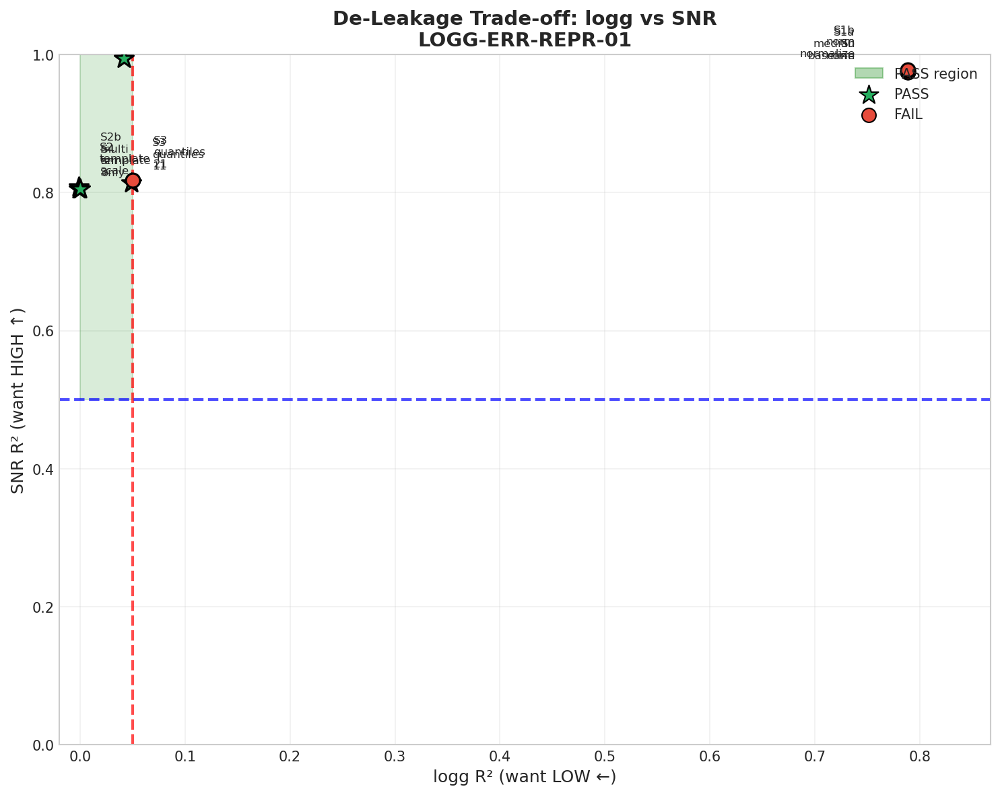

# 🍃 Error Representation De-Leakage

> **Name:** Error Representation De-Leakage  
> **ID:** `LOGG-ERR-REPR-01`  
> **Topic:** `logg_snr_moe` | **MVP:** MVP-0.2 | **Project:** `VIT`  
> **Author:** Viska Wei | **Date:** 2025-12-26 | **Status:** 🔄  
> **Root:** `logg` | **Parent:** `LOGG-ERR-BASE-01` | **Child:** -

> 🎯 **Target:** 构造"只表达观测质量"的 error 表示，压低 error-only R² < 0.05  
> 🚀 **Next:** 若成功去泄露 → 用于 MoE gate 输入；若失败 → 禁用 error，只用 flux

## ⚡ 核心结论速览

> **一句话**: [TODO: 待实验完成]

| 验证问题 | 结果 | 结论 |
|---------|------|------|
| H2.1: 去泄露后 R² < 0.05? | ⏳ | [TODO] |
| H2.2: 去泄露表示能预测 SNR? | ⏳ | [TODO] |

| 指标 | 值 | 启示 |
|------|-----|------|
| 原始 error R² | 0.99 | 基线（严重泄露） |
| S1 去泄露后 R² | TODO | |
| S2 去泄露后 R² | TODO | |
| S3 去泄露后 R² | TODO | |

| Type | Link |
|------|------|
| 🧠 Hub | `logg/moe/moe_snr_hub.md` § Q2.1, DG1 |
| 🗺️ Roadmap | `logg/moe/moe_snr_roadmap.md` § MVP-0.2 |
| 📘 前序实验 | `exp/exp_logg_err_base_01_20251226.md` |

---

# 1. 🎯 目标

**问题**: 如何让 error vector "只表达观测质量（SNR）"而不泄露天体参数（logg）？

**背景**（来自 MVP-0.1）:
- error-only Ridge R² = **0.99**（极严重泄露）
- Shuffle 后 R² = -0.98 → 泄露依赖**波长对齐信息**
- Agg-stats R² = 0.068 → 不是简单的全局统计量泄露
- Top 泄露像素集中在 3277-3388, 3724-3869

**验证假设**:
- H2.1: 某种去泄露策略能让 error-only R² < 0.05
- H2.2: 去泄露后的表示仍能稳定预测 SNR（用于 gate）

| 预期 | 判断标准 |
|------|---------|
| ✅ 通过 | R² < 0.05 且 SNR 可预测 → 冻结 `quality_features()` 实现，进入 Gate-3 |
| ❌ 失败 | 所有策略都无法同时满足 → 禁用 error，只用 flux 做 MoE |

---

# 2. 🦾 算法

**去泄露策略（按成本从低到高）**:

## S1: 同口径归一化

让 error 与 flux 做相同的归一化，破坏 error 独有的信息：

$$
\tilde{e}_i = \frac{e_i}{\text{scale}(f)}
$$

其中 $\text{scale}(f)$ 可以是 $\text{median}(f)$, $\|f\|_2$, 或 $f_{\text{continuum}}$

## S2: Template × Scale

假设 error 可分解为全局模板 + 标量缩放：

$$
e \approx s \cdot e_0 + \delta
$$

只保留标量 $s$（或 2-3 个全局统计量），丢弃残差 $\delta$：

$$
s = \arg\min_s \|e - s \cdot e_0\|^2 = \frac{e^\top e_0}{\|e_0\|^2}
$$

其中 $e_0 = \text{mean}(e_{\text{train}})$ 是训练集 error 均值模板

## S3: 无波长对齐统计

使用不依赖像素位置的统计量（打乱波长对齐）：

$$
\text{features} = [\text{quantiles}(\text{sort}(e)), \text{histogram}(e)]
$$

例如：sorted error 的 [10%, 25%, 50%, 75%, 90%] 分位数 + 直方图 bin 计数

## S4: 残差仅做异常检测

不将 error 用于 logg 回归，只用于：
- 质量标志（QA flag）
- 样本拒识（reject outliers）
- 不确定度输出

---

# 3. 🧪 实验设计

## 3.1 数据

| 项 | 值 |
|----|-----|
| 来源 | BOSZ / PFS simulator |
| 路径 | `/home/swei20/data/data-20-30-100k/` |
| Train/Val/Test | 100k / 10k / 10k |
| 特征维度 | 4096 (原始 error) → 1-20 (去泄露后) |
| 目标 | log_g |

## 3.2 噪声

| 项 | 值 |
|----|-----|
| 类型 | heteroscedastic |
| σ | 0.0 (先测干净 error) |
| 范围 | train/val/test |

## 3.3 模型

| 参数 | 值 |
|------|-----|
| 模型 | Ridge |
| alpha | 0.001, 0.01, 0.1, 1.0, 10.0, 100.0 |

## 3.4 扫描参数

| 策略 | 变体 | 输出维度 |
|------|------|---------|
| S1: 同口径归一化 | median / L2-norm / continuum | 4096 |
| S2: template×scale | scale only / +median / +iqr | 1-3 |
| S3: 无对齐统计 | 5-quantile / 10-quantile / histogram | 5-20 |
| S4: 残差异常检测 | 不做 logg 回归，只评估 SNR 预测 | N/A |

## 3.5 评估指标

| 任务 | 指标 | 目标 |
|------|------|------|
| logg 泄露测试 | error-only R² | < 0.05 |
| SNR 预测能力 | SNR 预测 R² | > 0.5 |
| 组合验证 | 同时满足上述两条 | ✅ |

---

# 4. 📊 图表

> ⚠️ 图表文字必须全英文！

### Fig 1: De-Leakage Strategy Comparison


**预期内容**: 各策略的 error-only R²（bar chart），baseline R²=0.99 参考线

### Fig 2: SNR Prediction Ability


**预期内容**: 去泄露后的 quality features 预测 SNR 的 R²

### Fig 3: Trade-off Plot


**预期内容**: X=logg R²（越低越好），Y=SNR R²（越高越好），标注最优策略

---

# 5. 💡 洞见

[TODO: 待实验完成]

---

# 6. 📝 结论

[TODO: 待实验完成]

---

# 7. 📎 附录

## 7.1 数值结果

| 策略 | logg R² | SNR R² | 通过? |
|------|---------|--------|-------|
| Baseline (原始 error) | 0.99 | - | ❌ |
| S1: median归一化 | TODO | TODO | |
| S1: L2-norm归一化 | TODO | TODO | |
| S2: scale only | TODO | TODO | |
| S2: scale+median | TODO | TODO | |
| S3: 5-quantile | TODO | TODO | |
| S3: 10-quantile | TODO | TODO | |
| S4: (不做回归) | N/A | TODO | |

## 7.2 执行记录

| 项 | 值 |
|----|-----|
| 仓库 | `~/VIT` |
| 脚本 | `scripts/logg_error_deleakage.py` |
| Output | `results/logg_snr_moe/` |

```bash
# 运行去泄露实验
cd ~/VIT && source init.sh
nohup python scripts/logg_error_deleakage.py > logs/LOGG-ERR-REPR-01.log 2>&1 &
echo $! > logs/LOGG-ERR-REPR-01.pid
```

---

> **实验完成时间**: TODO

