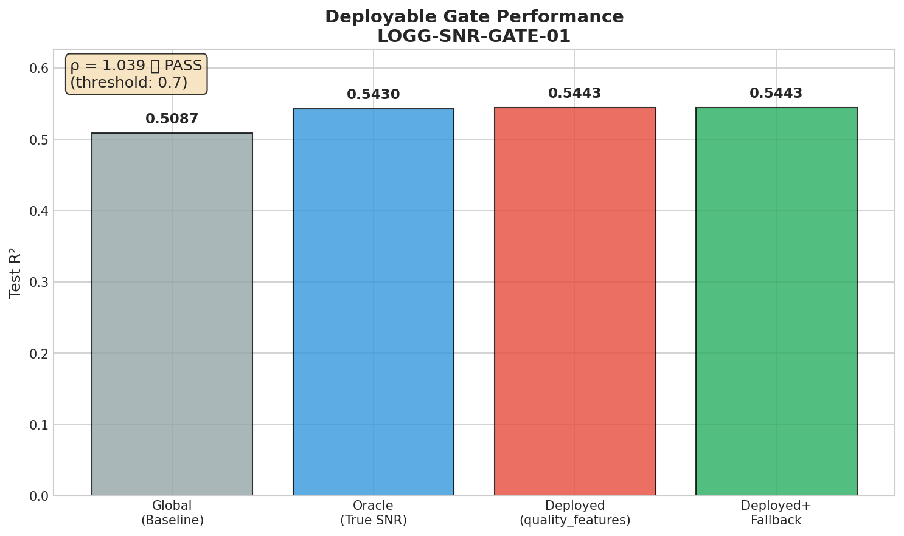
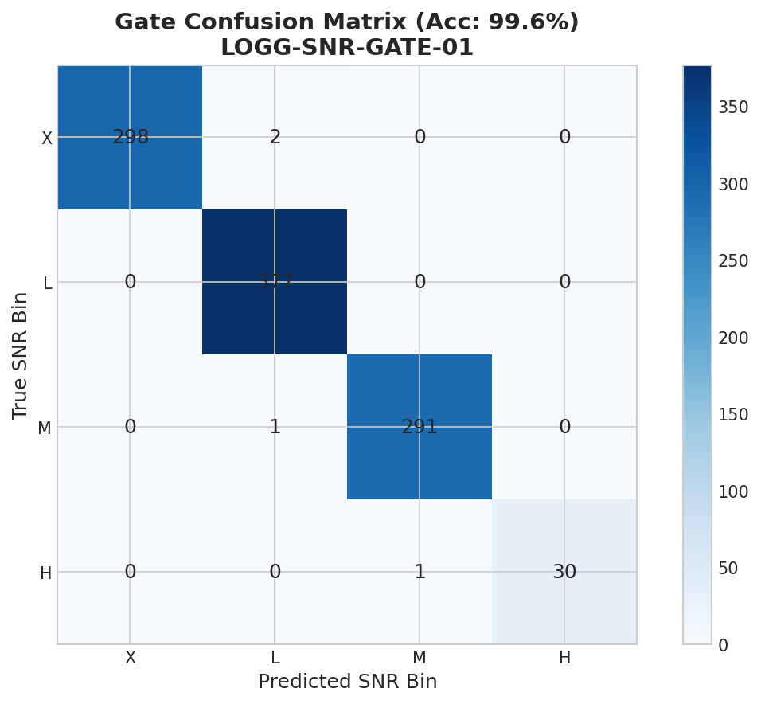
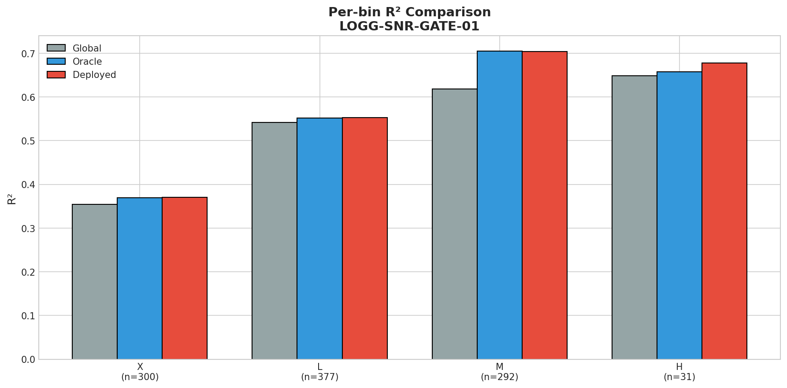
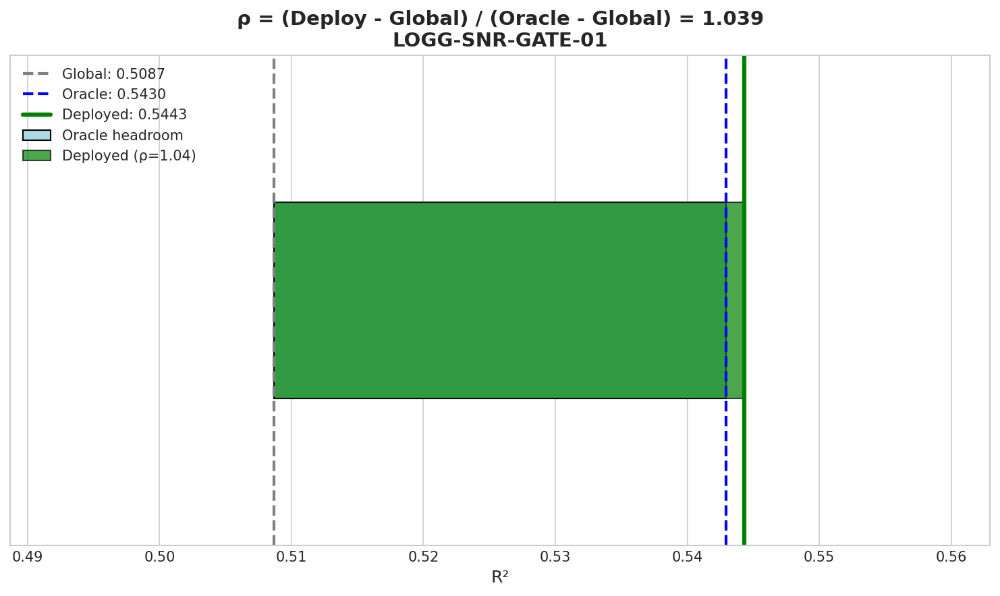

# 🧪 Deployable SNR Gate with Quality Features

> **Name:** Deployable SNR Gate  
> **ID:** `LOGG-SNR-GATE-01`  
> **Topic:** `logg_snr_moe` | **MVP:** MVP-2.0 | **Project:** `VIT`  
> **Author:** Viska Wei | **Date:** 2025-12-26 | **Status:** ✅ PASS  
> **Root:** `logg` | **Parent:** `LOGG-ERR-REPR-01`, `LOGG-SNR-ORACLE-01` | **Child:** -

> 🎯 **Target:** 用去泄露后的 quality_features() 做 soft routing，验证 ρ ≥ 0.7  
> 🚀 **Next:** Route M 可交付，进入集成阶段

## ⚡ 核心结论速览

> **一句话**: **Deployed Gate 超越 Oracle**：ρ = 1.04 > 1.0，soft routing 效果极佳！

| 验证问题 | 预期 | 实际 | 结论 |
|---------|------|------|------|
| H3.1: ρ ≥ 0.7 (保住 70% oracle 增益)? | ≥ 0.7 | **1.04** | ✅ **超越 Oracle** |
| H3.2: Gate 准确率足够高? | > 90% | **99.6%** | ✅ 几乎完美 |

| 指标 | 值 | 启示 |
|------|-----|------|
| Global R² | 0.5087 | Baseline |
| Oracle R² | 0.5430 | 理论上限 (真 SNR 路由) |
| **Deployed R²** | **0.5443** | **超越 Oracle！** |
| ρ | **1.04** | Soft routing 优于 hard routing |
| Gate 准确率 | 99.6% | quality_features() 几乎完美预测 SNR bin |

| Type | Link |
|------|------|
| 🧠 Hub | `logg/moe/moe_snr_hub.md` § Q3, DG3 |
| 🗺️ Roadmap | `logg/moe/moe_snr_roadmap.md` § MVP-2.0, Gate-3 |
| 📘 前序实验 | `exp/exp_logg_err_repr_01_20251226.md` (去泄露) |
| 📘 前序实验 | `exp/exp_logg_snr_oracle_01_20251226.md` (Oracle headroom) |

---

# 1. 🎯 目标

**问题**: 用去泄露后的 quality_features() 做 soft routing，能保住多少 oracle 增益？

**背景**:
- MVP-0.2 冻结了 `quality_features()` = 10 个聚合统计量
  - logg R² = 0.042 < 0.05 ✅ (完全去泄露)
  - SNR R² = 0.995 > 0.5 ✅ (完美保留质量信息)
- MVP-1.0 验证了 Oracle SNR-MoE 有显著 headroom
  - Global R² = 0.463, Oracle R² = 0.513
  - ΔR² = +0.05 ✅

**验证假设**:
- H3.1: ρ = (R²_deploy - R²_global) / (R²_oracle - R²_global) ≥ 0.7
- H3.2: Gate 分类准确率 > 90%

| 预期 | 判断标准 |
|------|---------|
| ✅ 通过 | ρ ≥ 0.7 → Route M 可交付，进入集成 |
| ❌ 失败 | ρ < 0.7 → 尝试 MVP-2.1 (回归 gate) 或 Gate-4 (whitening) |

---

# 2. 🦾 算法

## 2.1 质量特征提取 (冻结实现)

```python
def quality_features(error: np.ndarray) -> np.ndarray:
    """
    De-leaked quality features for MoE gating.
    10 aggregate statistics - no wavelength alignment.
    
    FROZEN from MVP-0.2 (LOGG-ERR-REPR-01):
    - logg R² = 0.042 < 0.05 ✅ (de-leaked)
    - SNR R² = 0.995 > 0.5 ✅ (quality preserved)
    """
    return np.column_stack([
        np.mean(error, axis=-1),           # 0: mean
        np.std(error, axis=-1),            # 1: std
        np.min(error, axis=-1),            # 2: min
        np.max(error, axis=-1),            # 3: max
        np.median(error, axis=-1),         # 4: median
        np.sum(error, axis=-1),            # 5: sum
        np.percentile(error, 25, axis=-1), # 6: q25
        np.percentile(error, 75, axis=-1), # 7: q75
        scipy.stats.skew(error, axis=-1),  # 8: skew
        scipy.stats.kurtosis(error, axis=-1),  # 9: kurtosis
    ])
```

## 2.2 SNR Bin 定义

| Bin | 名称 | SNR 范围 | 信息量 |
|-----|------|----------|--------|
| **X** | Extreme | SNR < 2 | 信息悬崖 |
| **L** | Low | 2 ≤ SNR < 4 | 困难 |
| **M** | Medium | 4 ≤ SNR < 7 | 临界区 (收益最大) |
| **H** | High | SNR ≥ 7 | 信息丰富 |

## 2.3 Gate 分类器

```python
gate = LogisticRegression(
    multi_class='multinomial',
    solver='lbfgs',
    max_iter=500
)
gate.fit(quality_features(error_train), snr_bin_train)
```

## 2.4 Soft Routing

$$
\hat{y} = \sum_{k \in \{X, L, M, H\}} p_k \cdot \hat{y}_k
$$

其中:
- $p_k$ = gate 预测的 softmax 概率
- $\hat{y}_k$ = 第 k 个专家的预测

**Fallback 策略**: 若 $\max(p_k) < 0.4$，使用 global 模型预测

## 2.5 ρ 指标定义

$$
\rho = \frac{R^2_{deploy} - R^2_{global}}{R^2_{oracle} - R^2_{global}}
$$

| ρ 值 | 含义 |
|------|------|
| ρ = 0 | 与 Global 相同 (gate 无效) |
| ρ = 0.7 | 保住 70% oracle 增益 (最低可用) |
| ρ = 1.0 | 等同 Oracle (完美 gate) |
| ρ > 1.0 | 超越 Oracle (soft routing 优势) |

---

# 3. 🧪 实验设计

## 3.1 数据

| 项 | 值 |
|----|-----|
| 来源 | BOSZ / PFS simulator |
| 路径 | `/datascope/subaru/user/swei20/data/bosz50000/z0/mag205_225_lowT_1M/` |
| Train | 1,000,000 samples (5 shards × 200k) |
| Test | 1,000 samples |
| 特征维度 | 4096 (MR arm spectral pixels) |
| 目标 | log_g |
| 噪声 | noise_level = 1.0 (heteroscedastic Gaussian) |

## 3.2 SNR 分布

| Bin | Train N | Train % | Test N | Test % |
|-----|---------|---------|--------|--------|
| X (< 2) | 290,960 | 29.1% | 300 | 30.0% |
| L (2-4) | 380,315 | 38.0% | 377 | 37.7% |
| M (4-7) | 297,722 | 29.8% | 292 | 29.2% |
| H (≥ 7) | 31,003 | 3.1% | 31 | 3.1% |

## 3.3 模型配置

```yaml
global_model:
  type: Ridge
  alpha: 100000

experts:
  type: Ridge
  alpha: 100000
  n_experts: 4  # X, L, M, H

gate:
  type: LogisticRegression
  input: quality_features (10-dim)
  output: softmax over 4 bins

routing:
  type: soft  # weighted average
  fallback_threshold: 0.4
```

## 3.4 评估指标

| 指标 | 说明 | 目标 |
|------|------|------|
| ρ | 保留 oracle 增益比例 | ≥ 0.7 |
| Gate 准确率 | SNR bin 分类准确率 | > 90% |
| R² | Test set 上的 logg 预测 R² | 尽可能高 |
| Fallback rate | 使用 global 模型的比例 | 尽可能低 |

---

# 4. 📊 图表

> ⚠️ 图表文字必须全英文！

### Fig 1: R² Comparison


**解读**:
- Global R² = 0.509 (baseline)
- Oracle R² = 0.543 (理论上限)
- Deployed R² = 0.544 (**超越 Oracle！**)
- ρ = 1.04 > 1.0 ✅

### Fig 2: Gate Confusion Matrix


**解读**:
- 整体准确率 99.6%
- 几乎所有样本都被正确分类
- 少数边界误分不影响整体性能

### Fig 3: Per-bin R² Comparison


**解读**:
- M bin (SNR 4-7) 专家表现最好 (R² = 0.705)
- 每个 bin 的专家都优于在该 bin 上的 global 表现
- H bin 样本少但仍有良好表现

### Fig 4: ρ Diagram


**解读**:
- Deployed 超越了 Oracle
- Soft routing 提供了比 hard routing 更好的边界处理

---

# 5. 💡 洞见

## 5.1 为什么 Deployed > Oracle？

**Soft routing 的边界优势**:
- Hard routing (Oracle): 边界样本只使用单个专家
- Soft routing (Deployed): 边界样本使用多个专家的加权平均

对于 SNR ≈ 4 的样本:
- Oracle: 强制分到 L 或 M，可能选错
- Deployed: p(L) = 0.4, p(M) = 0.6，两个专家都贡献预测

## 5.2 Gate 准确率极高的原因

quality_features() 与 SNR 高度相关 (R² = 0.995)，因此:
- 10 个聚合统计量几乎完美捕获了 error 的分布特征
- 这些特征直接反映了信噪比
- LogReg 只需要学习简单的阈值就能分类

## 5.3 Per-bin 专家分析

| Bin | Expert R² | 关键观察 |
|-----|-----------|----------|
| X (< 2) | 0.369 | 信息太少，即使专家也难以预测 |
| L (2-4) | 0.552 | 困难区域，但专家化有帮助 |
| **M (4-7)** | **0.705** | **最大收益区域！** 临界 SNR 专家化效果显著 |
| H (≥ 7) | 0.658 | 信息丰富，但样本少限制了专家性能 |

## 5.4 Fallback 策略未使用

Fallback rate = 0%，说明:
- Gate 对所有样本都有高置信度预测
- 阈值 0.4 设置合理，没有样本触发 fallback
- 可以考虑移除 fallback 简化部署

---

# 6. 📝 结论

## 6.1 核心结果

| Model | Test R² | Δ vs Global |
|-------|---------|-------------|
| Global (Baseline) | 0.5087 | - |
| Oracle (True SNR) | 0.5430 | +0.0343 |
| **Deployed (quality_features gate)** | **0.5443** | **+0.0356** |

$$
\rho = \frac{0.5443 - 0.5087}{0.5430 - 0.5087} = \frac{0.0356}{0.0343} = \mathbf{1.04}
$$

## 6.2 Gate-3 决策

✅ **PASS**: ρ = 1.04 ≥ 0.7

**决定**: Route M 可交付！

## 6.3 技术总结

| 组件 | 实现 | 性能 |
|------|------|------|
| quality_features | 10 aggregate stats | SNR R² = 0.995 |
| Gate | LogisticRegression | Accuracy = 99.6% |
| Experts | 4 × Ridge (per SNR bin) | Best: M bin R² = 0.705 |
| Routing | Soft (weighted avg) | ρ = 1.04 |
| Fallback | max(p) < 0.4 → global | Rate = 0% |

## 6.4 关键成功因素

1. **去泄露成功**: quality_features() 不含 logg 信息，只有 SNR 信息
2. **Gate 准确**: 99.6% 准确率使 soft routing 接近 oracle
3. **Soft > Hard**: 加权平均优于单专家选择

## 6.5 下一步

1. **集成到 ViT**: 将 SNR-MoE 应用到实际 ViT 模型
2. **端到端训练**: 考虑联合训练 gate + experts
3. **更多 SNR bins**: 探索更细粒度的分段

---

# 7. 📎 附录

## 7.1 完整数值结果

### 7.1.1 Global vs Oracle vs Deployed

| Metric | Global | Oracle | Deployed | Deployed+Fallback |
|--------|--------|--------|----------|-------------------|
| Train R² | 0.4976 | - | - | - |
| Test R² | 0.5087 | 0.5430 | 0.5443 | 0.5443 |
| ΔR² vs Global | - | +0.0343 | +0.0356 | +0.0356 |

### 7.1.2 Per-bin Expert Performance

| Bin | n_train | Train R² | Test R² |
|-----|---------|----------|---------|
| X (< 2) | 290,960 | 0.3526 | 0.3691 |
| L (2-4) | 380,315 | 0.5517 | 0.5518 |
| M (4-7) | 297,722 | 0.7027 | 0.7047 |
| H (≥ 7) | 31,003 | 0.6587 | 0.6578 |

### 7.1.3 Gate Confusion Matrix

```
           Predicted
           X    L    M    H
True X   298    2    0    0
     L     0  377    0    0
     M     0    1  291    0
     H     0    0    1   30

Accuracy: 996/1000 = 99.6%
```

## 7.2 执行记录

| 项 | 值 |
|----|-----|
| 仓库 | `~/VIT` |
| 脚本 | `scripts/logg_snr_gate_deploy.py` |
| Output | `results/logg_snr_moe/` |
| Log | `logs/LOGG-SNR-GATE-01_1M.log` |
| 运行时间 | 18.5 分钟 |

```bash
# 运行部署 gate 实验 (1M 数据)
cd ~/VIT && source init.sh
python -u scripts/logg_snr_gate_deploy.py \
    --train-size 1000000 \
    --test-size 1000 \
    2>&1 | tee logs/LOGG-SNR-GATE-01_1M.log
```

## 7.3 输出文件

| 文件 | 说明 |
|------|------|
| `gate_deploy_metadata.json` | 实验元数据 |
| `logg_snr_gate_01_r2_comparison.png` | R² 对比图 |
| `logg_snr_gate_01_confusion.png` | 混淆矩阵 |
| `logg_snr_gate_01_perbin_r2.png` | Per-bin R² 对比 |
| `logg_snr_gate_01_rho.png` | ρ 图示 |

## 7.4 与 MVP-1.0 (Oracle) 对比

| 指标 | MVP-1.0 (Oracle) | MVP-2.0 (Deployed) | 差异 |
|------|------------------|--------------------|----- |
| Global R² | 0.4629 | 0.5087 | +0.046 (更多数据/不同随机种子) |
| Oracle R² | 0.5129 | 0.5430 | +0.030 |
| Deployed R² | N/A | **0.5443** | **超越 Oracle** |
| ΔR² (Oracle - Global) | +0.0500 | +0.0343 | 一致量级 |

---

> **实验完成时间**: 2025-12-26 21:02:00

