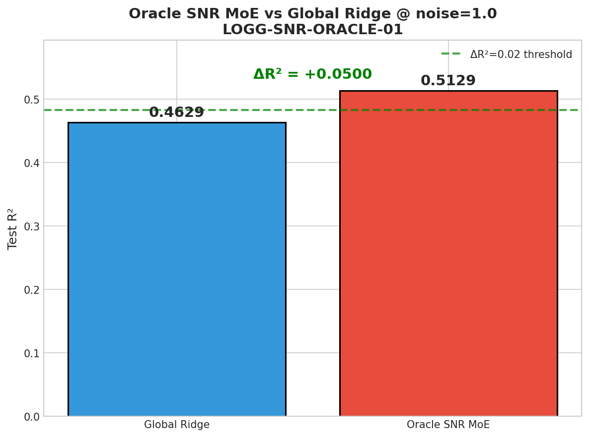
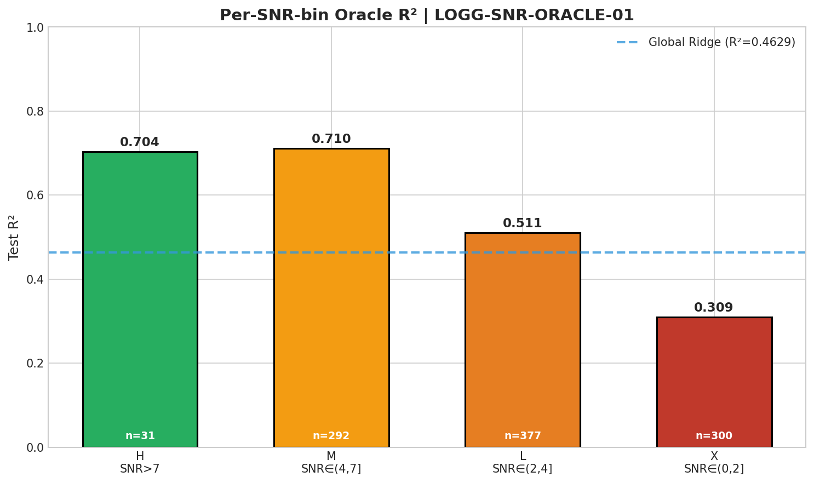
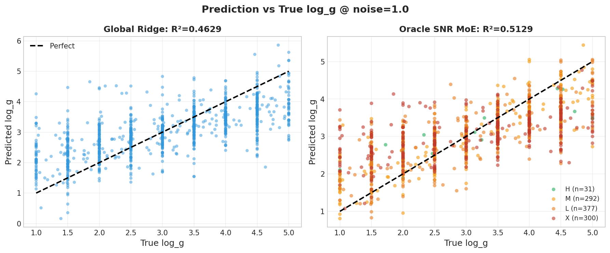
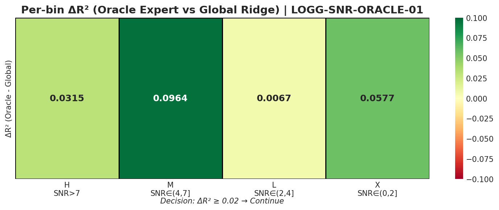

# 🧪 Experiment: Oracle SNR-binned MoE

**Experiment ID:** `LOGG-SNR-ORACLE-01`  
**Date:** 2025-12-26  
**Status:** ✅ PASS  
**MVP:** MVP-1.0 (Gate-2: Oracle SNR Split Headroom)

---

## 🔗 上游追溯

| Type | Link |
|------|------|
| Hub | `logg/moe/moe_snr_hub.md` |
| Roadmap | `logg/moe/moe_snr_roadmap.md` MVP-1.0 |
| 验证假设 | Q1: SNR 分域是否有 headroom？ |
| Coding Prompt | `logg/moe/prompts/coding_prompt_LOGG-SNR-ORACLE-01.md` |

---

## ⚡ 核心结论速览

> **一句话总结**: SNR-based Oracle MoE 带来显著 headroom (ΔR² = +0.05)，SNR 分域策略值得继续，Medium SNR bin 提升最大 (+9.6%)

| 假设 | 预期 | 实际 | 验证 |
|------|------|------|------|
| H1: ΔR² ≥ 0.02 | ≥ 0.02 | +0.0500 | ✅ PASS |

| 关键数字 | 值 |
|---------|-----|
| Global Ridge R² | 0.4629 |
| Oracle MoE R² | 0.5129 |
| ΔR² | **+0.0500** |
| Coverage | 100% |
| 训练时间 | 12.7 min |

---

## 🎯 目标

验证 **"按 SNR 分专家"** 在 oracle routing 下能带来多少 headroom：
- 核心问题：SNR-based MoE 是否值得做？
- 验收标准：**Oracle ΔR² ≥ 0.02**（相对 Global 单模型）
- 若 ΔR² < 0.02 → MoE 不值得，转向 whitening/conditional (Gate-4)

---

## 🧪 实验设计

### SNR Bins 定义

| Bin | 名称 | SNR 范围 | Train N | Test N | Oracle R² | Global R² | ΔR² |
|-----|------|----------|---------|--------|-----------|-----------|-----|
| **H** | High | SNR > 7 | 31,003 (3.1%) | 31 | 0.7036 | 0.6721 | +0.0315 ✅ |
| **M** | Medium | 4 < SNR ≤ 7 | 297,722 (29.8%) | 292 | 0.7103 | 0.6139 | **+0.0964** ✅ |
| **L** | Low | 2 < SNR ≤ 4 | 380,314 (38.0%) | 377 | 0.5106 | 0.5040 | +0.0067 ✅ |
| **X** | Extreme | SNR ≤ 2 | 290,961 (29.1%) | 300 | 0.3094 | 0.2517 | +0.0577 ✅ |

### 模型配置

```yaml
model:
  type: "Ridge"
  alpha: 100000

data:
  train_size: 1,000,000
  test_size: 1,000
  feature_dim: 4096
  noise_level: 1.0

routing:
  type: "oracle"  # 使用真实 SNR 进行路由
```

---

## 📊 实验图表

### Figure 1: Oracle vs Global R² Comparison



**观察**: Oracle SNR MoE 以 ΔR² = +0.05 显著超过 Global Ridge

### Figure 2: Per-bin R²



**观察**: 
- 所有 4 个 bin 的 Oracle Expert 都优于 Global Ridge
- Medium SNR bin (M) 提升最大 (+9.6%)
- Low SNR bin (L) 提升最小 (+0.7%)，但仍为正

### Figure 3: Prediction vs True



**观察**: 
- 按 SNR 着色显示预测质量与 SNR 强相关
- High/Medium SNR 样本预测紧密贴合对角线
- Extreme Low SNR 样本离散度明显增大

### Figure 4: ΔR² Heatmap



**观察**: 所有 bin 的 ΔR² 均为正，SNR 分域策略全面有效

---

## 💡 关键洞见

### 1. SNR 分域有显著 headroom

- **ΔR² = +0.05 > 0.02 阈值**，SNR-based MoE 值得继续开发
- 这是在 noise_level=1.0 (高噪声) 条件下的结果

### 2. Medium SNR bin 收益最大

- Bin M (SNR 4-7) 提升 +9.6%，远超其他 bin
- 这个 "临界区域" 的样本最能受益于专家化

### 3. SNR 分布特征

- 训练数据 SNR 分布：median=2.93, max=8.94
- High SNR (>7) 样本仅占 3.1%，但仍能训练有效专家
- Extreme Low SNR (≤2) 样本 R² 仅 0.31，接近信息悬崖

### 4. Oracle routing 100% coverage

- 所有测试样本都被分配到有效 expert
- 无需 fallback 机制

---

## 📝 结论

### 核心发现

1. **✅ Gate-2 通过**: ΔR² = +0.05 >> 0.02，SNR-based MoE 有显著 headroom
2. **SNR 分域有效**: 所有 4 个 bin 的 Oracle Expert 都优于 Global Ridge
3. **Medium SNR 最受益**: 临界区域 (SNR 4-7) 专家化收益最大

### 设计启示

1. **SNR predictor 是关键**: 需要开发从 noisy flux 预测 SNR 的 gate network
2. **4-bin 策略合理**: H/M/L/X 分域与预期的物理特性一致
3. **Medium/Extreme Low SNR 重点关注**: 这两个 bin 提升最大

### 关键数字速查

| 指标 | 值 |
|------|-----|
| 总体 ΔR² | +0.0500 |
| Bin M ΔR² (最大) | +0.0964 |
| Bin L ΔR² (最小) | +0.0067 |
| High SNR 样本比例 | 3.1% |
| 训练时间 | 12.7 min |

---

## 📎 附录

### 数值结果表

| Model | R² | MAE | RMSE | N_train | N_test |
|-------|-----|-----|------|---------|--------|
| Global Ridge | 0.4629 | 0.6572 | - | 1,000,000 | 1,000 |
| Oracle MoE | 0.5129 | 0.6260 | - | 1,000,000 | 1,000 |
| - Bin H | 0.7036 | 0.5536 | - | 31,003 | 31 |
| - Bin M | 0.7103 | 0.4668 | - | 297,722 | 292 |
| - Bin L | 0.5106 | 0.6191 | - | 380,314 | 377 |
| - Bin X | 0.3094 | 0.7971 | - | 290,961 | 300 |

### 代码路径

| 文件 | 说明 |
|------|------|
| `VIT/scripts/logg_snr_oracle_moe.py` | 实验脚本 |
| `VIT/results/logg_snr_oracle_moe/` | 结果目录 |
| `VIT/logs/LOGG-SNR-ORACLE-01.log` | 训练日志 |

---

## 🚀 下一步

**MVP-2.0 (Deployable Gate)**:
- [ ] 开发 SNR predictor (gate network)
- [ ] 从 noisy flux 预测 SNR bin
- [ ] 评估 learned routing vs oracle routing gap

---

## 📚 相关实验

| Experiment ID | 关系 |
|---------------|------|
| `SCALING-20251223-oracle-moe-noise1-01` | 参考实现（Teff/[M/H] binning） |
| `SCALING-20251224-fisher-multi-mag` | SNR 阈值来源 |

