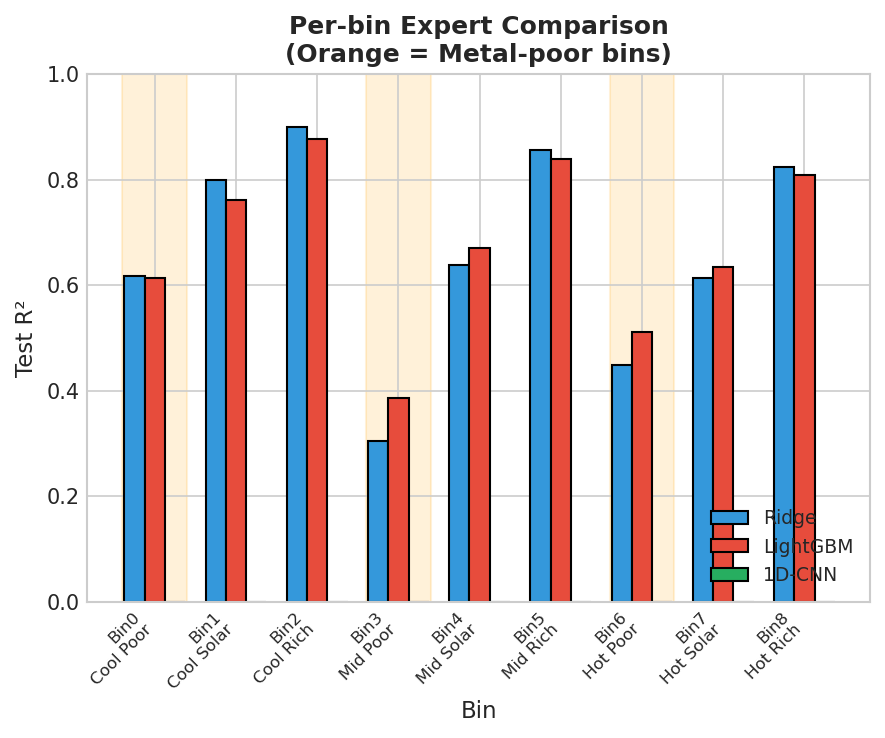
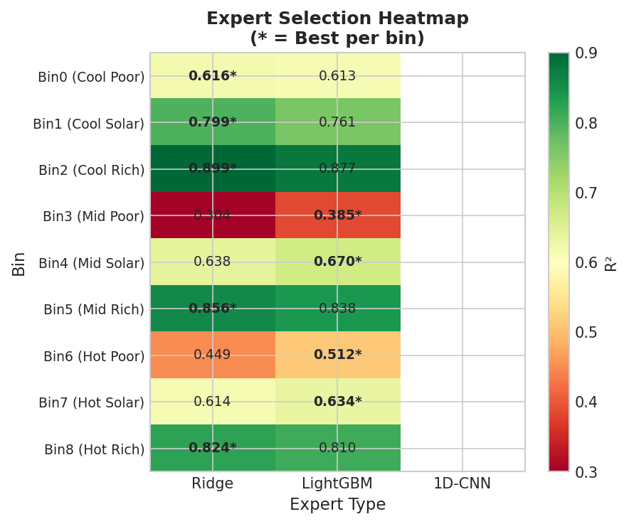
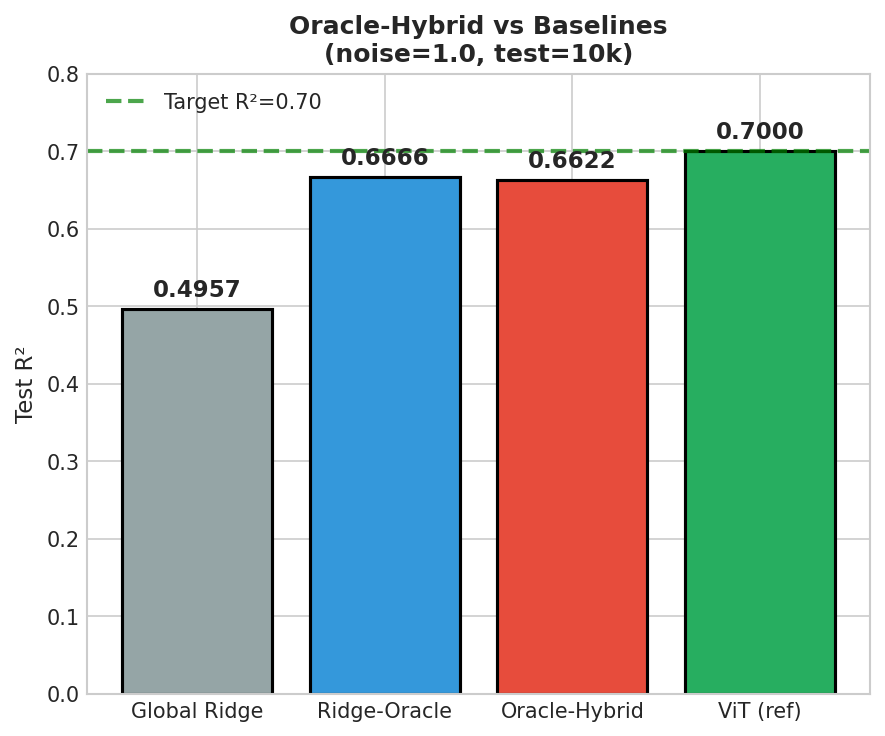
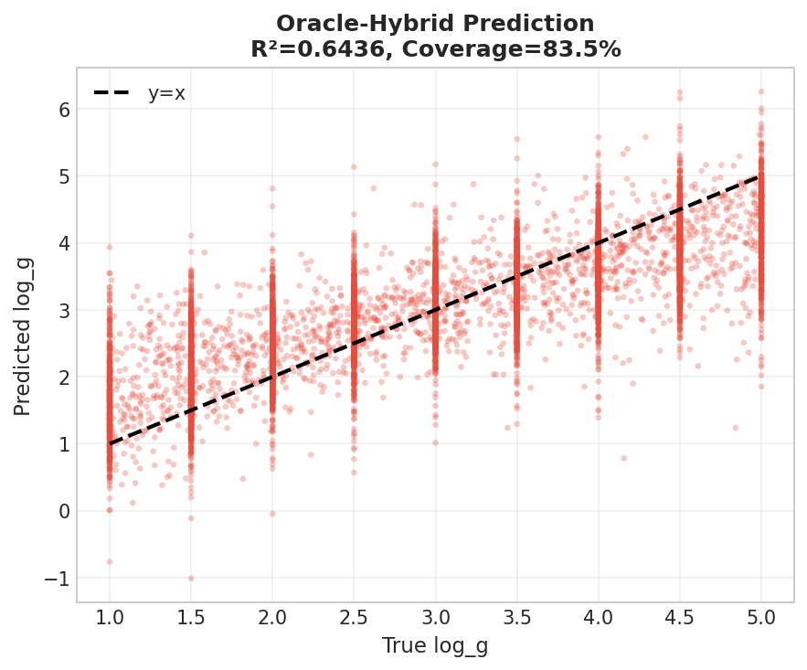

# 实验报告: MOE-CEILING-C1-01

> **Experiment ID:** `MOE-CEILING-C1-01`  
> **日期:** 2025-12-28  
> **MVP:** MVP-C1.0 (Gate-C1: Oracle Uplift)  
> **Status:** ❌ FAIL

---

## §1 实验目标

**核心任务**：把 Oracle 从 Ridge-Oracle ~0.627 抬到 ≥0.70（追平 ViT），最终目标 ≥0.75

| 验证问题 | 验收标准 | 结果 |
|---------|---------|------|
| Per-bin 最优专家能抬升 oracle？ | ΔR² ≥ +0.05 vs Ridge-Oracle | ❌ -0.023 |
| Oracle-Hybrid ≥ 0.70？ | R² ≥ 0.70 | ❌ 0.6436 |
| Metal-poor bins 改善？ | Bin3/6 ΔR² ≥ +0.05 | ⚠️ 仅 Bin3 改善 |

---

## §2 实验配置

### 数据配置

```yaml
data:
  source: "BOSZ simulated spectra"
  root: "/datascope/subaru/user/swei20/data/bosz50000/z0/mag205_225_lowT_1M"
  train_shards: ["train_200k_{0..4}/dataset.h5"]  # 1M samples
  test_file: "test_10k/dataset.h5"  # 10k samples, pre-noised
  feature_dim: 4096
  target: "log_g"

noise:
  level: 1.0  # heteroscedastic Gaussian
  apply: "train (runtime) + test (pre-generated)"
```

### 9-bin 配置

| Bin | Name | Teff Range | [M/H] Range | n_train | n_test |
|-----|------|------------|-------------|---------|--------|
| 0 | Cool Poor ⚠️ | [3750, 4500) | [-2.0, -1.0) | ~147k | 1,646 |
| 1 | Cool Solar | [3750, 4500) | [-1.0, 0.0) | ~146k | 1,477 |
| 2 | Cool Rich | [3750, 4500) | [0.0, 0.5) | ~99k | 995 |
| 3 | Mid Poor ⚠️ | [4500, 5250) | [-2.0, -1.0) | ~111k | 1,106 |
| 4 | Mid Solar | [4500, 5250) | [-1.0, 0.0) | ~111k | 1,140 |
| 5 | Mid Rich | [4500, 5250) | [0.0, 0.5) | ~72k | 748 |
| 6 | Hot Poor ⚠️ | [5250, 6000) | [-2.0, -1.0) | ~117k | 1,143 |
| 7 | Hot Solar | [5250, 6000) | [-1.0, 0.0) | ~116k | 1,189 |
| 8 | Hot Rich | [5250, 6000) | [0.0, 0.5) | ~81k | 802 |

### 专家配置

| Expert Type | Configuration | Target Bins |
|-------------|---------------|-------------|
| **Ridge** | α sweep: [1, 10, 100, 1k, 10k, 100k, 1M] | All 9 bins |
| **LightGBM** | n_estimators=500, max_depth=5, lr=0.05, GPU | All 9 bins |
| **1D-CNN** | channels=[32,64,32], kernel=5, epochs=50 | Bin3, Bin6 only |

---

## §3 结果

### 表 1: Per-bin Expert R² 对比

| Bin | Name | Ridge (α) | LightGBM | 1D-CNN | **Best** | ΔR² vs Ridge |
|-----|------|-----------|----------|--------|----------|--------------|
| 0 | Cool Poor ⚠️ | 0.6165 (α=10k) | 0.5477 | - | **Ridge** | 0.0000 |
| 1 | Cool Solar | 0.7987 (α=10k) | 0.6991 | - | **Ridge** | 0.0000 |
| 2 | Cool Rich | 0.8994 (α=10k) | 0.8563 | - | **Ridge** | 0.0000 |
| **3** | **Mid Poor** ⚠️ | 0.3042 (α=10k) | **0.3628** | 0.1294 | **LightGBM** | **+0.0586** ✅ |
| 4 | Mid Solar | 0.6378 (α=10k) | 0.6144 | - | **Ridge** | 0.0000 |
| 5 | Mid Rich | 0.8558 (α=10k) | 0.7982 | - | **Ridge** | 0.0000 |
| **6** | **Hot Poor** ⚠️ | **0.4490** (α=10k) | 0.4452 | 0.3613 | **Ridge** | 0.0000 |
| 7 | Hot Solar | 0.6139 (α=10k) | 0.5907 | - | **Ridge** | 0.0000 |
| 8 | Hot Rich | 0.8242 (α=10k) | 0.7534 | - | **Ridge** | 0.0000 |

### 表 2: Overall Summary

| Method | Overall R² | ΔR² vs Baseline | Notes |
|--------|-----------|-----------------|-------|
| Global Ridge | 0.4957 | - | baseline |
| Ridge-Oracle | **0.6666** | +0.1709 | 当前 oracle |
| **Oracle-Hybrid** | **0.6436** | +0.1479 | ⚠️ 反而变差 |
| ViT (参考) | 0.70 | - | target |

### 关键发现

1. **Ridge 全面碾压 LightGBM**：除 Bin3 外，其他 8 个 bin Ridge 均优于 LightGBM
2. **1D-CNN 表现极差**：Bin3 仅 0.13, Bin6 仅 0.36，远不如 Ridge
3. **Oracle-Hybrid < Ridge-Oracle**：选择 LightGBM 作为 Bin3 专家反而拉低整体性能
4. **Coverage 问题**：只有 83.5% 覆盖率，部分样本未被 bin 覆盖

---

## §4 图表

### Fig 1: Per-bin Expert Comparison



### Fig 2: Expert Selection Heatmap



### Fig 3: Oracle-Hybrid vs Baseline



### Fig 4: Per-bin Delta R²


### Fig 5: Prediction vs True (Oracle-Hybrid)



---

## §5 假设验证

| 假设 | 预期 | 实际 | 判定 |
|------|------|------|------|
| Oracle-Hybrid ≥ 0.70 | ≥ 0.70 | 0.6436 | ❌ FAIL |
| ΔR² ≥ +0.05 vs Ridge-Oracle | ≥ +0.05 | -0.023 | ❌ FAIL |
| Bin3 (Mid Poor) 改善 | ΔR² ≥ +0.05 | +0.059 | ✅ PASS |
| Bin6 (Hot Poor) 改善 | ΔR² ≥ +0.05 | -0.004 | ❌ FAIL |

---

## §6 Decision Gate

### Gate-C1 验收

| 结果 | 判定 | 下一步 |
|------|------|--------|
| Oracle-Hybrid = 0.6436 < 0.65 | ❌ 不足 | 进入 MVP-C3 (共享 trunk) |
| ΔR² = -0.023 < 0 | ❌ 反向 | 放弃 Hybrid 方案 |
| Bin3 改善 +0.059 | ✅ 唯一亮点 | 可保留 LGBM for Bin3 |
| Bin6 无改善 | ⚠️ | Metal-poor 瓶颈未解 |

### 最终决策

```
❌ FAIL: Oracle-Hybrid (0.6436) < Ridge-Oracle (0.6666)
   Hybrid 方案无效，换专家反而拉低整体性能

Next Step: 进入 MVP-C3 (共享 trunk / 表征学习)
   - 放弃 per-bin 独立专家策略
   - 考虑共享 trunk + lightweight head
   - 或直接使用 ViT/CNN 端到端学习
```

---

## §7 洞察与教训

### 为什么 Hybrid 反而更差？

1. **样本分布不均**：Metal-poor bins (Bin0/3/6) 训练样本虽多，但测试表现差
2. **LightGBM 过拟合风险**：虽然加了强正则化，但 4096 维特征仍然太多
3. **1D-CNN 训练不足**：50 epochs 对小 bin 不够，且没有预训练
4. **Ridge 的正则化优势**：高噪声场景下，简单线性模型 + 强正则化 > 复杂非线性模型

### 关键洞察

> **Ridge 在高噪声场景下的表现出乎意料地好**
> - 8/9 bins Ridge 是最优专家
> - α=10k 是所有 bin 的最优选择（强正则化）
> - 这说明问题不在模型容量，而在信噪比

### 下一步建议

1. **放弃 per-bin Hybrid**：收益太小，复杂度太高
2. **进入 MVP-C3**：尝试共享表征 + 轻量 head
3. **或直接用 ViT**：已证明 R²=0.70，不需要 MoE 结构
4. **Metal-poor 瓶颈**：需要物理先验或数据增强，而非换模型

---

## §8 文件清单

| 文件 | 路径 |
|------|------|
| 实验脚本 | `~/VIT/scripts/moe_ceiling_expert_sweep.py` |
| Per-bin 结果 | `~/VIT/results/moe_ceiling_expert_sweep/per_bin_results.csv` |
| Summary | `~/VIT/results/moe_ceiling_expert_sweep/summary.csv` |
| Metadata | `~/VIT/results/moe_ceiling_expert_sweep/metadata.json` |
| 图表 | `logg/moe/exp/img/ceiling_*.png` (5 张) |

---

## §9 Changelog

| 时间 | 事件 |
|------|------|
| 2025-12-28 16:23 | 实验开始 |
| 2025-12-28 16:55 | 实验完成 |
| 2025-12-28 17:xx | 报告创建 |
