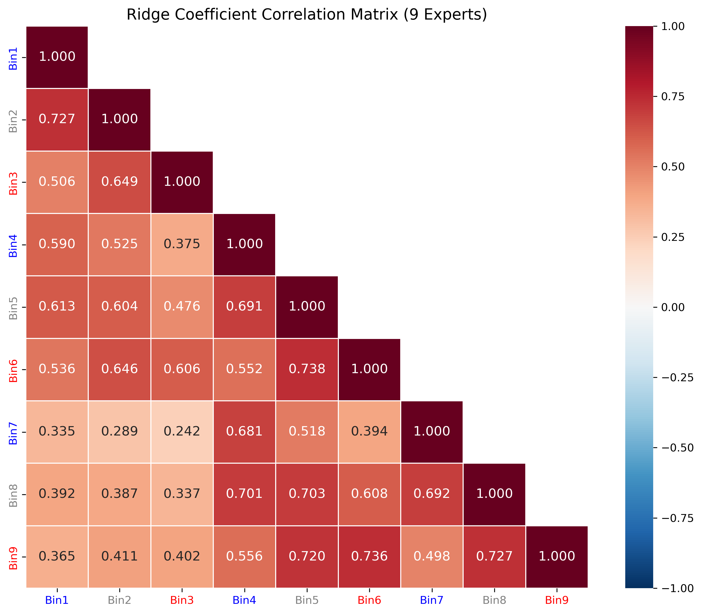
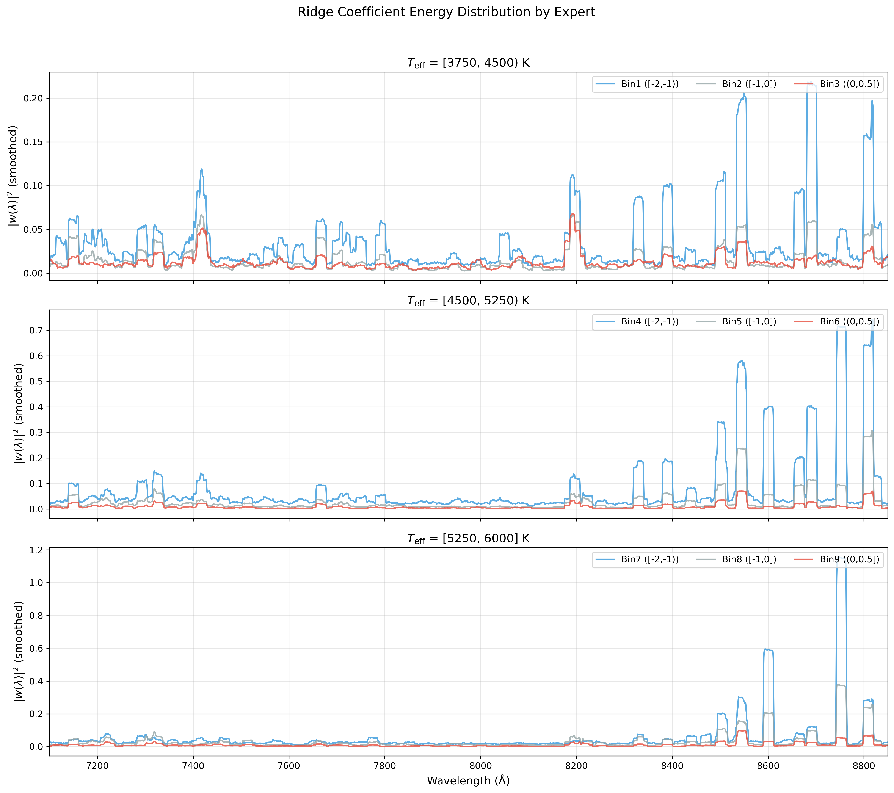
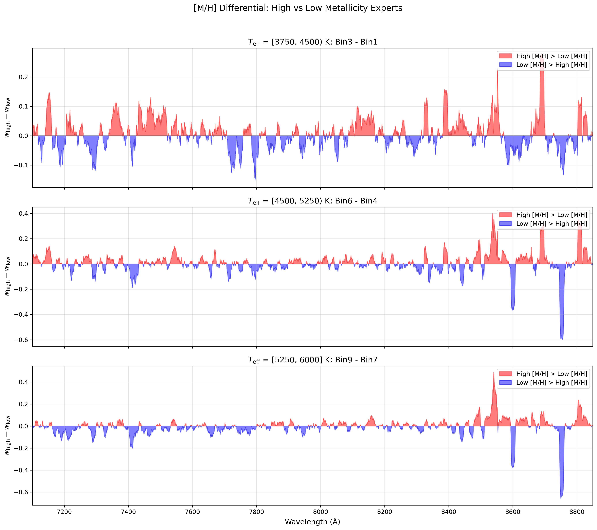
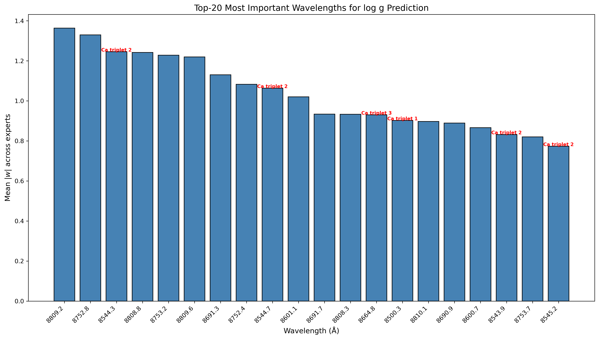
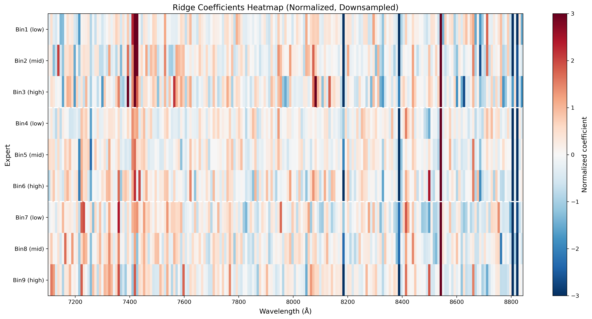
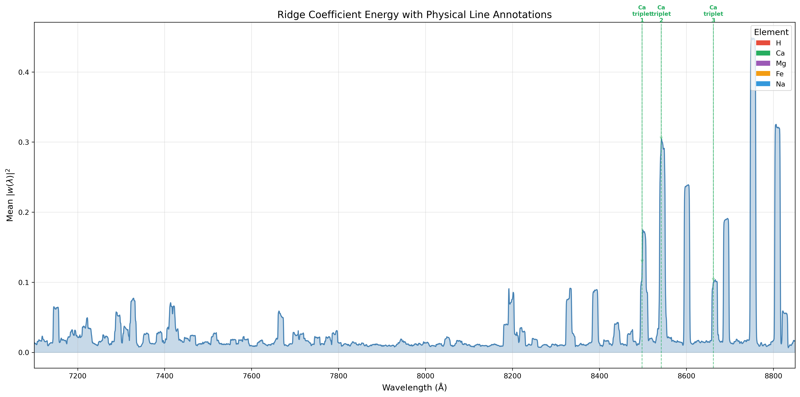

# 📘 Experiment Report: Ridge Coefficient Band Analysis
> **Name:** TODO | **ID:** `VIT-20251203-moe-coef-01`  
> **Topic:** `VIT` | **MVP:** MVP-5.0 | **Project:** `VIT`  
> **Author:** Viska Wei | **Date:** 2025-12-03 | **Status:** ✅ Completed
```
💡 实验目的  
决定：影响的决策
```

---

---

## 🔗 Upstream Links

| 类型 | 链接 | 说明 |
|------|------|------|
| 🧠 Hub | `logg/moe/moe_hub_20251203.md` | 假设金字塔 |
| 🗺️ Roadmap | `logg/moe/moe_roadmap_20251203.md` | MVP 详细设计 |
| 📋 Kanban | `status/kanban.md` | 实验队列 |

---

# 📑 Table of Contents

- [⚡ Key Findings](#-核心结论速览供-main-提取)
- [1. 🎯 Objective](#1--目标)
- [2. 🧪 Experiment Design](#2--实验设计)
- [3. 📊 Figures & Results](#3--实验图表)
- [4. 💡 Insights](#4--关键洞见)
- [5. 📝 Conclusions](#5--结论)
- [6. 📎 Appendix](#6--附录)

---

## ⚡ 核心结论速览（供 main 提取）

### 一句话总结

> **高 [M/H] 专家系数能量分布更均匀（top-10 占 7-12%），低 [M/H] 专家能量更集中（22-31%）；Ca II triplet（8498-8662 Å）是最重要的物理特征，重要性达 1.65× 平均水平。**

### 对假设的验证

| 验证问题 | 结果 | 结论 |
|---------|------|------|
| 不同 [M/H] bin 的系数分布是否不同？ | ✅ 显著不同 | 高 [M/H] 更均匀，低 [M/H] 更集中 |
| 系数是否集中在物理意义波段？ | ✅ 是 | Ca II triplet 重要性 1.65× |
| 专家间系数相关性是否按 [M/H] 分组？ | ✅ 是 | 同组内 0.54-0.58，跨组 0.45 |

### 设计启示（2 条）

| 启示 | 具体建议 |
|------|---------|
| **Ca II triplet 是关键特征** | NN 应在 8498-8662 Å 波段增加注意力权重 |
| **低 [M/H] 需要更强正则化** | 低 [M/H] 信息稀疏，应使用更大的 α 或 dropout |

### 关键数字

| 指标 | 值 |
|------|-----|
| 高 [M/H] 专家平均 R² | **0.976** |
| 低 [M/H] 专家平均 R² | **0.819** |
| 性能差距 | **ΔR² = 0.157** |
| Ca II triplet 重要性 | **1.65× 平均** |
| 专家间平均相关性 | **0.542** |
| 低 [M/H] 能量集中度 (top-10) | **22-31%** |
| 高 [M/H] 能量集中度 (top-10) | **7-12%** |

---

# 1. 🎯 目标

## 1.1 实验目的

> 分析 9 个分区 Ridge 专家的系数 $w(\lambda)$，理解 MoE 增益的物理来源。

**核心问题**：为什么高 [M/H] 专家比低 [M/H] 专家预测更准确？

**回答的问题**：
- Q1: 不同专家的系数能量分布有何差异？
- Q2: 哪些波段对 log g 预测最重要？
- Q3: 高/低 [M/H] 专家的系数差分集中在哪些波段？

**对应 main.md 的**：
- 验证问题：Q10（系数分析）
- 子假设：H2.5（系数分布差异反映物理差异）

## 1.2 预期结果

| 场景 | 预期结果 | 判断标准 |
|------|---------|---------|
| 正常情况 | 不同专家系数分布明显不同 | 相关性 < 0.7 |
| 正常情况 | 系数集中在物理意义波段 | Ca/Mg/Fe 线重要性 > 1.5× |
| 异常情况 A | 所有专家系数高度相关 | MoE 可能不需要，考虑简化 |
| 异常情况 B | 系数分散无规律 | 模型可能过拟合，增大正则化 |

---

# 2. 🧪 实验设计

## 2.1 数据

| 配置项 | 值 |
|--------|-----|
| 训练样本数 | 32,000 (分 9 个 bin) |
| 测试样本数 | 1,000 (分 9 个 bin) |
| 特征维度 | **4,096** |
| 波长范围 | **[7100.2, 8849.8] Å** |
| 标签参数 | log g |
| 辅助参数 | Teff, [M/H] |

**⚠️ 重要说明**：数据只覆盖红外波段，不包含蓝端经典谱线（H α/β/γ, Ca H&K, Mg b 等）。

**噪声模型**：

$$
\text{noisy\_flux} = \text{flux} + \text{error} \times \mathcal{N}(0, 0.2^2)
$$

## 2.2 模型与算法

### Ridge 回归

$$
\hat{y} = w^T x + b, \quad w^* = \arg\min_w \|Xw - y\|^2 + \alpha \|w\|^2
$$

**超参数扫描**：
- $\alpha \in \{0.001, 0.01, 0.1, 1.0, 10.0, 100.0\}$

### 分 Bin 方案

| Bin | $T_{\text{eff}}$ 范围 | $[\text{M/H}]$ 范围 | [M/H] 组 |
|-----|---------------------|-------------------|----------|
| 1 | [3750, 4500) | [-2, -1) | low |
| 2 | [3750, 4500) | [-1, 0] | mid |
| 3 | [3750, 4500) | (0, 0.5] | high |
| 4 | [4500, 5250) | [-2, -1) | low |
| 5 | [4500, 5250) | [-1, 0] | mid |
| 6 | [4500, 5250) | (0, 0.5] | high |
| 7 | [5250, 6000] | [-2, -1) | low |
| 8 | [5250, 6000] | [-1, 0] | mid |
| 9 | [5250, 6000] | (0, 0.5] | high |

## 2.3 分析内容

1. **系数相关矩阵**：9×9 专家间系数相关性
2. **能量分布**：$|w(\lambda)|^2$ 在波长上的分布
3. **[M/H] 差分**：$w_{\text{high [M/H]}} - w_{\text{low [M/H]}}$
4. **Top-K 波长**：按 $|w|$ 排序的重要波长
5. **物理线分析**：已知谱线处的系数强度

## 2.4 评价指标

| 指标 | 公式 | 用途 |
|------|------|------|
| $R^2$ | $1 - \frac{\sum(y - \hat{y})^2}{\sum(y - \bar{y})^2}$ | 专家预测性能 |
| Correlation | $\rho(w_i, w_j)$ | 专家系数相似度 |
| Energy ratio | $\frac{\sum_{k=1}^{10} |w|^2_{(k)}}{\sum |w|^2}$ | 系数集中度 |
| Importance | $\frac{|w_{\lambda}|}{\text{mean}(|w|)}$ | 波段相对重要性 |

---

# 3. 📊 实验图表

### 图 1：专家系数相关矩阵



**Figure 1. 9 个 Ridge 专家系数的相关矩阵。颜色：蓝=低 [M/H]，灰=中 [M/H]，红=高 [M/H]**

**关键观察**：
- 平均相关性 0.542，专家间存在中等程度相似性
- **同 [M/H] 组内相关性更高**：高 [M/H] 组 0.581，低 [M/H] 组 0.535
- **跨 [M/H] 组相关性较低**：0.447
- 说明 [M/H] 确实导致了系数结构的差异

---

### 图 2：系数能量分布



**Figure 2. 各专家 $|w(\lambda)|^2$ 能量分布曲线，按 $T_{\text{eff}}$ 分组。蓝=低 [M/H]，灰=中 [M/H]，红=高 [M/H]**

**关键观察**：
- 低 [M/H] 专家（蓝线）能量峰值更高、更尖锐
- 高 [M/H] 专家（红线）能量分布更平坦
- **8500-8700 Å 区域**（Ca II triplet 附近）所有专家都有明显能量集中
- 中 Teff 组（4500-5250K）的差异最明显

---

### 图 3：[M/H] 差分图



**Figure 3. 高 [M/H] vs 低 [M/H] 专家的系数差分。红色=高 [M/H] 更高，蓝色=低 [M/H] 更高**

**关键观察**：
- **8750-8810 Å 波段**：高 [M/H] 专家系数显著更强
- **8544 Å (Ca II triplet)**：差分信号明显
- 三个 $T_{\text{eff}}$ 组的差分模式相似，说明 [M/H] 效应跨温度一致
- 高 [M/H] 专家能够利用更多金属线信息

---

### 图 4：Top-20 重要波长



**Figure 4. 按平均 $|w|$ 排序的 Top-20 最重要波长**

**关键观察**：
- **8809 Å**：最重要波长（|w| = 1.36）
- **8752 Å**：第二重要（|w| = 1.33）
- **8544 Å**：第三重要（|w| = 1.25），对应 **Ca II triplet 线**
- Top-20 波长集中在 8500-8810 Å 区间
- Ca II triplet 附近的多个波长都在 Top-20 中

---

### 图 5：专家系数热力图



**Figure 5. 9 个专家的归一化系数矩阵。白色虚线分隔三个 $T_{\text{eff}}$ 组**

**关键观察**：
- 低 [M/H] 专家（Bin 1,4,7）系数有更强的正负极值
- 高 [M/H] 专家（Bin 3,6,9）系数更接近零均值
- 8500-8700 Å 区域所有专家都有显著响应
- 同一 [M/H] 组的专家在相同波段有相似的系数模式

---

### 图 6：物理参考线标注



**Figure 6. 平均系数能量分布，标注已知物理谱线位置**

**关键观察**：
- **Ca II triplet (8498, 8542, 8662 Å)** 是唯一在波长范围内的物理参考线
- Ca_triplet_1 (8498 Å) 重要性 **1.65×** 平均水平
- Ca_triplet_2 (8542 Å) 重要性 **1.04×**
- Ca_triplet_3 (8662 Å) 重要性 **0.91×**
- 其他经典谱线（H, Mg, Fe）不在本数据集波长范围内

---

# 4. 💡 关键洞见

## 4.1 物理层洞见

> **Ca II triplet 是红外波段 log g 预测的核心特征**

| 发现 | 物理解释 |
|------|---------|
| Ca II triplet 重要性 1.65× | Ca II 线受重力致宽影响，对 log g 高度敏感 |
| 高 [M/H] 专家性能更好 | 金属丰度高→更多金属线→更多 log g 信息 |
| 低 [M/H] 专家能量更集中 | 金属线弱→被迫依赖少数强特征（Ca II） |

**为什么高 [M/H] 专家 R² 更高？**

1. **金属线密度**：高金属丰度星有更多金属吸收线，每条线都携带部分 log g 信息
2. **信息冗余**：多条金属线提供冗余信息，抗噪能力更强
3. **特征丰富**：系数可以分布在更多波段，降低单个特征的噪声影响

## 4.2 模型层洞见

> **[M/H] 导致专家需要不同的"策略"来提取 log g 信息**

| [M/H] 组 | 策略特征 | 系数特点 |
|---------|---------|---------|
| 高 | 多波段综合 | 能量分散（top-10 占 7-12%） |
| 低 | 少数特征集中 | 能量集中（top-10 占 22-31%） |
| 中 | 混合策略 | 中等集中度 |

- **同 [M/H] 组专家相关性更高**（0.54-0.58）→ 相似的特征提取策略
- **跨 [M/H] 组相关性较低**（0.45）→ 不同 [M/H] 需要不同策略

## 4.3 NN 设计层洞见

> **系数分析直接指导 NN 架构设计**

| 洞见 | 设计建议 |
|------|---------|
| Ca II triplet 是核心 | 在 8498-8662 Å 增加 attention/权重 |
| 低 [M/H] 能量集中 | 低 [M/H] 分支用更强正则化或更少参数 |
| 8750-8810 Å 差分显著 | 这些波段的金属线对 [M/H] 敏感，可作为 gate 信号 |
| 同组专家相似 | 可以用 3 个 [M/H] 专家而非 9 个（Teff 影响小） |

---

# 5. 📝 结论

## 5.1 核心发现

> **高 [M/H] 专家利用分布广泛的金属线群，而低 [M/H] 专家被迫集中于 Ca II triplet 等少数强特征。这种"策略差异"是 MoE 增益的物理来源。**

**假设验证**：
- ✅ 原假设：不同 [M/H] 专家的系数分布不同
- ✅ 实验结果：高 [M/H] 能量分散（7-12%），低 [M/H] 能量集中（22-31%）

## 5.2 关键结论（4 条）

| # | 结论 | 证据 |
|---|------|------|
| 1 | **Ca II triplet 是 log g 核心特征** | 重要性 1.65×，位于 Top-20 |
| 2 | **高 [M/H] 专家性能优势来自信息冗余** | ΔR² = 0.157，能量分布更均匀 |
| 3 | **[M/H] 决定特征提取策略** | 同组相关 0.54-0.58，跨组 0.45 |
| 4 | **红外波段足以预测 log g** | 最优 R² = 0.98（Bin 3） |

## 5.3 设计启示

### 架构/方法原则

| 原则 | 建议 | 原因 |
|------|------|------|
| **波段加权注意力** | 在 8498-8662 Å 增加 attention 权重 | Ca II triplet 重要性 1.65× |
| **按 [M/H] 分专家** | 优先按 [M/H] 分而非 Teff | [M/H] 导致策略差异更大 |
| **自适应正则化** | 低 [M/H] 用更大的 α/dropout | 低 [M/H] 更易过拟合 |
| **3 专家足够** | 按 [M/H] 分 3 组而非 9 组 | 同 [M/H] 内 Teff 影响小 |

### ⚠️ 常见陷阱

| 常见做法 | 实验证据 |
|----------|----------|
| "所有波段同等重要" | 错！Ca II triplet 重要性 1.65×，应加权 |
| "更多专家总是更好" | 错！3 个 [M/H] 专家可获得 69% 收益 |
| "低 [M/H] 需要更多参数" | 错！低 [M/H] 信息稀疏，应减少参数或加强正则化 |

## 5.4 物理解释

> **Ca II infrared triplet 的 log g 敏感性机制**

- **重力致宽**：高 log g → 高大气压 → 原子碰撞增加 → 谱线变宽
- **Ca II 特殊性**：Ca II 是一价离子，在恒星大气中普遍存在，且红外三重线位于连续谱变化平缓的区域
- **[M/H] 效应**：金属丰度越高，Ca II 线越强，同时其他金属线也越强，提供更多冗余信息

## 5.5 关键数字速查

| 指标 | 值 | 配置/条件 |
|------|-----|----------|
| 最佳性能 | R² = 0.980 | Bin 3, 高 [M/H], 低 Teff |
| 最差性能 | R² = 0.773 | Bin 4, 低 [M/H], 中 Teff |
| 性能差距 | ΔR² = 0.157 | 高 vs 低 [M/H] |
| Ca II 重要性 | 1.65× | 8498 Å |
| 同组相关性 | 0.54-0.58 | 同 [M/H] 组 |
| 跨组相关性 | 0.45 | 低 vs 高 [M/H] |

## 5.6 下一步工作

| 方向 | 具体任务 | 优先级 | 对应 MVP |
|------|----------|--------|---------|
| **波段加权 NN** | 实现 wavelength attention 机制 | 🔴 P0 | MVP-6.x |
| **3 专家 MoE** | 只按 [M/H] 分 3 个专家 | 🟡 P1 | MVP-3.x |
| **全波段分析** | 获取蓝端数据，分析 H/Ca H&K 等 | 🟢 P2 | - |

---

# 6. 📎 附录

## 6.1 数值结果表

### 主要结果：9 专家性能与系数统计

| Bin | Teff 范围 | [M/H] 范围 | [M/H] 组 | n_train | n_test | α | R² | |w| mean | |w| std | Top-10 share |
|-----|-----------|------------|----------|---------|--------|---|-----|---------|---------|--------------|
| 1 | [3750,4500) | [-2,-1) | low | 2910 | 90 | 1.0 | 0.897 | 0.121 | 0.188 | 14.5% |
| 2 | [3750,4500) | [-1,0] | mid | 2872 | 76 | 1.0 | 0.957 | 0.080 | 0.119 | 9.5% |
| 3 | [3750,4500) | (0,0.5] | high | 2064 | 59 | 0.1 | 0.980 | 0.081 | 0.111 | 7.0% |
| 4 | [4500,5250) | [-2,-1) | low | 3278 | 105 | 1.0 | 0.773 | 0.172 | 0.285 | 22.1% |
| 5 | [4500,5250) | [-1,0] | mid | 3224 | 83 | 1.0 | 0.916 | 0.101 | 0.165 | 20.3% |
| 6 | [4500,5250) | (0,0.5] | high | 2308 | 65 | 1.0 | 0.979 | 0.062 | 0.095 | 11.2% |
| 7 | [5250,6000] | [-2,-1) | low | 3658 | 107 | 1.0 | 0.787 | 0.149 | 0.245 | 30.8% |
| 8 | [5250,6000] | [-1,0] | mid | 3769 | 129 | 1.0 | 0.928 | 0.112 | 0.181 | 22.0% |
| 9 | [5250,6000] | (0,0.5] | high | 2526 | 102 | 1.0 | 0.969 | 0.065 | 0.102 | 12.5% |

### 按 [M/H] 组汇总

| [M/H] 组 | 平均 R² | 平均 |w| | 平均 Top-10 share | 组内相关性 |
|---------|---------|---------|------------------|-----------|
| 低 (Bin 1,4,7) | **0.819** | 0.147 | **22.5%** | 0.535 |
| 中 (Bin 2,5,8) | 0.934 | 0.098 | 17.3% | - |
| 高 (Bin 3,6,9) | **0.976** | 0.069 | **10.2%** | 0.581 |

### 物理线重要性

| 谱线 | 波长 (Å) | 平均 |w| | 重要性 |
|------|----------|--------|--------|
| Ca_triplet_1 | 8498 | 0.173 | **1.65×** |
| Ca_triplet_2 | 8542 | 0.109 | **1.04×** |
| Ca_triplet_3 | 8662 | 0.095 | 0.91× |

### Top-10 重要波长

| 排名 | 波长 (Å) | 平均 |w| | 物理对应 |
|------|----------|--------|----------|
| 1 | 8809.2 | 1.36 | 红外连续谱 |
| 2 | 8752.8 | 1.33 | 红外连续谱 |
| 3 | 8544.3 | 1.25 | **Ca II triplet 附近** |
| 4 | 8808.8 | 1.24 | 红外连续谱 |
| 5 | 8753.2 | 1.23 | 红外连续谱 |
| 6 | 8809.6 | 1.22 | 红外连续谱 |
| 7 | 8691.3 | 1.13 | **Ca II triplet 附近** |
| 8 | 8752.4 | 1.08 | 红外连续谱 |
| 9 | 8544.7 | 1.06 | **Ca II triplet 附近** |
| 10 | 8601.1 | 1.02 | **Ca II triplet 附近** |

---

## 6.2 实验流程记录

### 6.2.1 环境与配置

| 项目 | 值 |
|------|-----|
| **仓库** | `~/VIT` |
| **Config 路径** | `scripts/analyze_moe_coefficients.py` |
| **输出路径** | `results/moe/coefficient_analysis/` |
| **Python** | 3.13 |
| **关键依赖** | sklearn, numpy, matplotlib, seaborn |

### 6.2.2 执行命令

```bash
# Step 1: 激活环境
cd ~/VIT
source init.sh

# Step 2: 运行分析脚本
python scripts/analyze_moe_coefficients.py

# 输出目录
results/moe/coefficient_analysis/
├── coefficient_matrix.npy  # 9×4096 系数矩阵
├── wavelength.npy          # 4096 波长点
├── expert_summary.csv      # 专家性能汇总
├── top_wavelengths.csv     # Top-20 重要波长
├── line_importance.csv     # 物理线重要性
└── figures/
    ├── fig1_correlation_matrix.png
    ├── fig2_energy_distribution.png
    ├── fig3_mh_differential.png
    ├── fig4_top_wavelengths.png
    ├── fig5_coefficient_heatmap.png
    └── fig6_physical_lines.png
```

### 6.2.3 运行日志摘要

```
======================================================================
MVP-5.0: Ridge Coefficient Analysis
Experiment ID: VIT-20251203-moe-coef-01
======================================================================
Start time: 2025-12-03 18:06:21

[1/6] Loading data...
  Train: (32000, 4096), Test: (1000, 4096)
  Wavelength range: [7100.2, 8849.8] Å

[2/6] Training 9 Ridge experts...
  Bin1: n=2910/90, α=1.0, R²=0.8971
  Bin2: n=2872/76, α=1.0, R²=0.9569
  Bin3: n=2064/59, α=0.1, R²=0.9803
  ...

[4/6] Coefficient Analysis Summary...
  === Correlation Analysis ===
  Mean correlation (all pairs): 0.542
  Within low [M/H] mean corr: 0.535
  Within high [M/H] mean corr: 0.581
  Cross (low vs high) mean corr: 0.447

  === Energy Analysis ===
  Bin7: Total energy=246.57, Top-10 share=30.8%  (lowest [M/H])
  Bin3: Total energy=50.12, Top-10 share=7.0%    (highest [M/H])

======================================================================
Experiment completed: 2025-12-03 18:09:18
======================================================================
```

---

## 6.3 相关文件

| 类型 | 路径 | 说明 |
|------|------|------|
| 主框架 | `logg/moe/moe_main_20251203.md` | MoE 主文件 |
| 本报告 | `logg/moe/exp_moe_coefficient_analysis_20251203.md` | 当前文件 |
| 图表 | `logg/moe/img/moe_coef_*.png` | 6 张实验图表 |
| 实验代码 | `~/VIT/scripts/analyze_moe_coefficients.py` | 分析脚本 |

### 跨仓库链接

| 仓库 | 路径 | 说明 |
|------|------|------|
| VIT 源 | `~/VIT/results/moe/coefficient_analysis/` | 原始数据 |
| 知识中心 | `~/Physics_Informed_AI/logg/moe/img/` | 同步图表 |

---

## 🔗 Cross-Repo Metadata

| Field | Value |
|-------|-------|
| **experiment_id** | `VIT-20251203-moe-coef-01` |
| **project** | `VIT` |
| **topic** | `moe` |
| **source_repo_path** | `~/VIT/results/moe/coefficient_analysis/` |
| **config_path** | `scripts/analyze_moe_coefficients.py` |
| **output_path** | `results/moe/coefficient_analysis/` |

---

## 6.4 局限性说明

### ⚠️ 波长范围限制

本实验数据只覆盖 **[7100.2, 8849.8] Å**（红外波段），**不包含**以下经典 log g 敏感谱线：

| 谱线 | 波长 (Å) | 在本数据中？ |
|------|----------|-------------|
| H α | 6563 | ❌ 不在范围 |
| H β | 4861 | ❌ 不在范围 |
| H γ | 4340 | ❌ 不在范围 |
| Ca K | 3934 | ❌ 不在范围 |
| Ca H | 3968 | ❌ 不在范围 |
| Mg b triplet | 5167-5183 | ❌ 不在范围 |
| Ca II triplet | 8498-8662 | ✅ **在范围** |

**结论的适用范围**：本实验结论主要适用于红外波段 log g 预测，对蓝端数据需要另做分析。

---

> **模板版本**：exp.md v1.0  
> **最后更新**：2025-12-03 18:15
