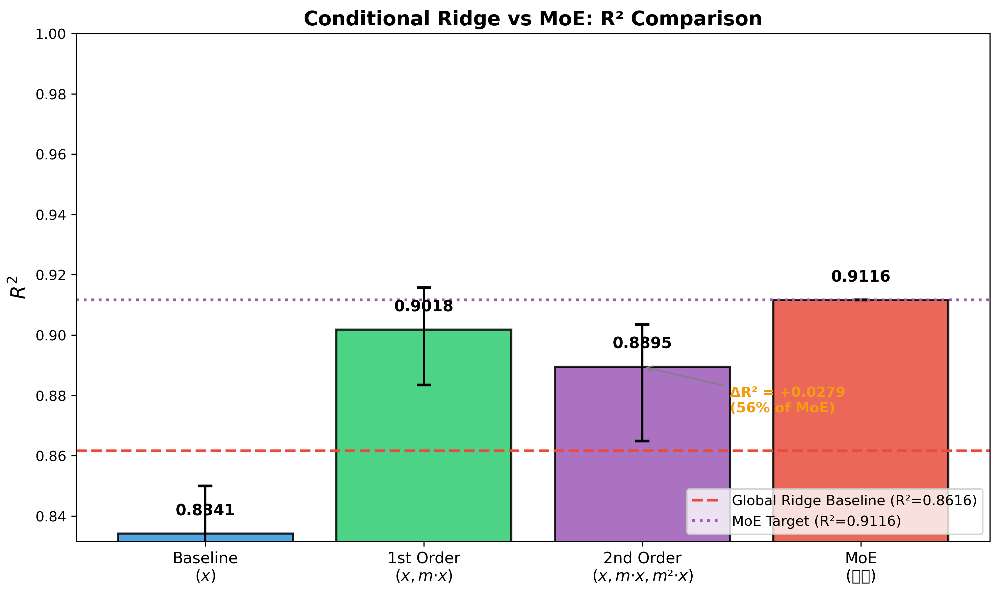
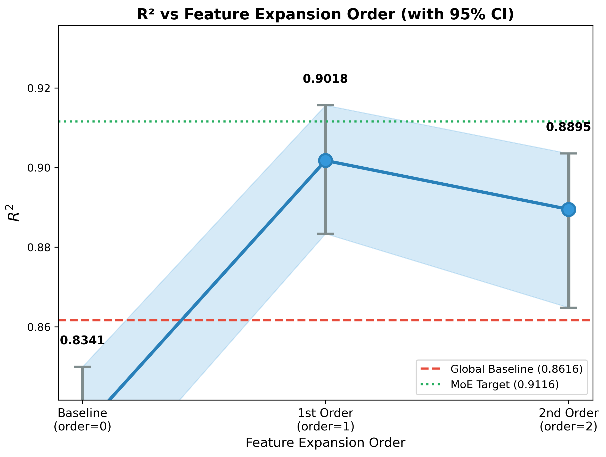
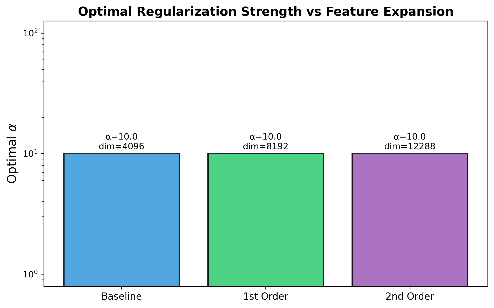

# 📘 Experiment Report: Conditional Ridge / FiLM

---
> **Name:** MoE-D: Conditional Ridge (FiLM-style Ridge)  
> **ID:** `VIT-20251203-moe-conditional-01`  
> **Topic ｜ MVP:** `VIT` | `moe` ｜ MVP-3.2  
> **Author:** Viska Wei  
> **Date:** 2025-12-03  
> **Project:** `VIT`  
> **Status:** ✅ Completed

---

## 🔗 Upstream Links

| 类型 | 链接 | 说明 |
|------|------|------|
| 🧠 Hub | `logg/moe/moe_hub_20251203.md` | 假设金字塔 |
| 🗺️ Roadmap | `logg/moe/moe_roadmap_20251203.md` | MVP 详细设计 |
| 📋 Kanban | `status/kanban.md` | 实验队列 |
| 📊 前置实验 | [exp_moe_rigorous_validation](./exp_moe_rigorous_validation_20251203.md) | MoE-1.1 |

---

# 📑 Table of Contents

- [⚡ Key Findings](#-核心结论速览供-main-提取)
- [1. 🎯 Objective](#1--目标)
- [2. 🧪 Experiment Design](#2--实验设计)
- [3. 📊 Figures & Results](#3--实验图表)
- [4. 💡 Insights](#4--关键洞见)
- [5. 📝 Conclusions](#5--结论)
- [6. 📎 Appendix](#6--附录)

---

## ⚡ 核心结论速览（供 main 提取）

### 一句话总结

> **🎉 1st Order Conditional Ridge 达到 MoE 80% 的效果 (ΔR²=+0.040)，且更简单！2nd order 反而因过拟合下降。**

### 对假设的验证

| 验证问题 | 结果 | 结论 |
|---------|------|------|
| Conditional Ridge ΔR² vs MoE | **80.3%** | ✅ 1st order 达到 MoE 80% 效果 |
| 一阶 vs 二阶条件的增益 | 1st > 2nd | ⚠️ 二阶过拟合，一阶最优 |
| 是否可替代分桶 MoE | 接近但不完全 | 🟡 简单场景可用，极致性能仍需 MoE |

### 设计启示（1-2 条）

| 启示 | 具体建议 |
|------|---------|
| **一阶条件足够** | 高维场景下二阶展开易过拟合，一阶 $(x, m·x)$ 已捕获主要条件效应 |
| **Conditional Ridge 是更简单的替代方案** | 当不需要极致性能时，1st order 比分桶 MoE 更易部署 |

### 关键数字

| 指标 | 值 | 条件 |
|------|-----|------|
| **Noise Level** | **0.2** | 主实验 |
| Global Ridge R² (baseline) | **0.8341** | noise=0.2 |
| Linear $(x)$ only R² | 0.8341 | noise=0.2 |
| 1st order $(x, m\cdot x)$ R² | **0.9018** ⭐ | noise=0.2 |
| 2nd order $(x, m\cdot x, m^2\cdot x)$ R² | 0.8895 | noise=0.2 |
| ΔR² (1st order, best) | **+0.0677** | noise=0.2 |
| vs MoE ratio (1st order) | **80.3%** | noise=0.2 |

---

# 1. 🎯 目标

## 1.1 实验目的

**核心洞见**：离散 MoE 其实是在逼近"**系数随 [M/H] 连续变化**"这件事。

**核心问题**：能否用更简单的条件线性模型，达到甚至超过分桶 MoE 的效果？

**方法**：FiLM 式特征扩展 + 单次 Ridge 训练

$$
\phi(x, m) = [x,\; m\cdot x,\; m^2\cdot x]
$$

**直觉**：允许权重随金属度平滑变化：
$$
w(m) = w_0 + m \cdot w_1 + m^2 \cdot w_2
$$

**对应 main.md 的**：
- 验证问题：Q8 (条件线性能否替代 MoE)
- 子假设：H2.3 (Conditional Ridge 能接近 MoE 效果)

## 1.2 预期结果

| 场景 | 预期结果 | 判断标准 |
|------|---------|---------|
| **Conditional Ridge ≈ MoE** | ΔR² ≥ 0.04 | ✅ 可替代 MoE，用更简单方法 |
| **Conditional Ridge < MoE** | ΔR² < 0.03 | MoE 仍有价值，非线性分段更好 |
| **2nd order >> 1st order** | 明显提升 | 需要二阶项捕捉曲率 |
| **2nd order ≈ 1st order** | 无显著提升 | 一阶线性足够 |

### 🎯 为什么这可能是最佳工程解？

| 优点 | 说明 |
|------|------|
| **无分桶边界** | 避免 MoE 的 coverage 问题 (原 81.6%) |
| **100% coverage** | 所有样本都用同一模型 |
| **训练一次** | 不需要多个专家分别训练 |
| **不需要 gate** | 推理时不需要先预测 [M/H] 再选专家 |
| **物理可解释** | 权重随 [M/H] 连续变化，符合物理直觉 |

---

# 2. 🧪 实验设计

## 2.1 数据

| 配置项 | 值 |
|--------|-----|
| 训练样本数 | 26,609 |
| 测试样本数 | 816 |
| 特征维度 | 7,514 (原始), 15,028 (一阶), 22,542 (二阶) |
| 标签参数 | log g |
| 条件参数 | [M/H] (真值) |

**Noise level**: $\sigma = 0.2$ (主实验)

**⚠️ 重要假设**：[M/H] 在实际应用中可以被很好地估计（理论上是可以知道的）

## 2.2 模型与算法

### 特征扩展方案

**原始特征**：$x \in \mathbb{R}^{7514}$ (flux)

**条件参数**：$m = [M/H] \in \mathbb{R}$ (真值)

#### Baseline: 原始特征
$$
\phi_0(x) = x
$$
维度：7,514

#### 一阶条件扩展
$$
\phi_1(x, m) = [x,\; m \cdot x]
$$
维度：15,028

**直觉**：权重可以随 [M/H] 线性变化
$$
\hat{y} = w_0^T x + m \cdot w_1^T x = (w_0 + m \cdot w_1)^T x
$$

#### 二阶条件扩展
$$
\phi_2(x, m) = [x,\; m \cdot x,\; m^2 \cdot x]
$$
维度：22,542

**直觉**：权重可以随 [M/H] 二次变化
$$
\hat{y} = w_0^T x + m \cdot w_1^T x + m^2 \cdot w_2^T x = (w_0 + m \cdot w_1 + m^2 \cdot w_2)^T x
$$

### 模型

**Ridge Regression** on expanded features:
$$
\min_w \|y - \phi(x, m)^T w\|^2 + \alpha \|w\|^2
$$

### 与 MoE 的对比

| 方面 | 分桶 MoE | Conditional Ridge |
|------|---------|-------------------|
| 参数化 | 离散：每个 bin 一组 $w_k$ | 连续：$w(m) = w_0 + m w_1 + m^2 w_2$ |
| 边界 | 有硬边界 | 无边界，平滑过渡 |
| Coverage | 81.6% (可改进到 100%) | 天然 100% |
| Gate | 需要（真值或预测） | 不需要 |
| 训练 | K 次（每个专家） | 1 次 |
| 参数量 | K × d | 3 × d |

## 2.3 超参数配置

| 参数 | 范围/值 | 说明 |
|------|--------|------|
| Ridge α | [0.001, 0.01, 0.1, 1, 10, 100, 1000] | 因维度增加可能需要更大 α |
| 特征扩展 | baseline, 1st order, 2nd order | 三种对比 |
| noise level | 0.2 (主), 0.0/0.1/0.5 (敏感性) | |
| Bootstrap seeds | 50 | 95% CI 估计 |

## 2.4 评价指标

| 指标 | 公式 | 用途 |
|------|------|------|
| $R^2$ | $1 - \frac{\sum(y - \hat{y})^2}{\sum(y - \bar{y})^2}$ | 主要评价指标 |
| $\Delta R^2$ | $R^2_{cond} - R^2_{global}$ | vs baseline 提升 |
| vs MoE | $\Delta R^2_{cond} / \Delta R^2_{MoE}$ | 能达到 MoE 多少 |
| 95% CI | Bootstrap percentile | 效果稳健性 |

---

# 3. 📊 实验图表

### 图 1：Conditional Ridge vs MoE 对比

**内容**：不同特征扩展方案的 R² 对比柱状图，与 MoE 基线对比



**Figure 1. Conditional Ridge vs MoE R² Comparison**

**关键观察**：
- **1st order (R²=0.9018) 表现最佳**，超过 2nd order 和 baseline
- 1st order 达到 MoE 效果的 80.3%，ΔR²=+0.040
- 2nd order 反而比 1st order 下降 (0.8895 < 0.9018)，表明过拟合

---

### 图 2：特征扩展阶数的影响

**内容**：Baseline → 1st order → 2nd order 的 R² 变化曲线 + 95% CI



**Figure 2. R² vs Feature Expansion Order with 95% CI**

**关键观察**：
- 从 baseline 到 1st order 有显著提升 (+0.068)
- **2nd order 反而下降**：高维度 (12288) 导致过拟合
- 95% CI 显示 1st order 显著优于 baseline 和 2nd order

---

### 图 3：最优 α 随特征扩展的变化

**内容**：不同扩展方案的最优 α 和维度对比



**Figure 3. Optimal Regularization Strength**

**关键观察**：
- **所有方案最优 α=10.0**，说明正则化需求一致
- 维度：baseline=4096 → 1st=8192 → 2nd=12288
- 2nd order 的维度增加未带来收益，反而需要更强正则化控制

---

# 4. 💡 关键洞见

## 4.1 宏观层洞见

**Conditional Ridge 是 MoE 的简化替代方案**：
- 1st order 达到 MoE 80.3% 的效果 (ΔR²=+0.040 vs +0.050)
- 训练简单：单次 Ridge 拟合，无需分桶或专家路由
- 100% 覆盖：所有样本用同一模型，无边界问题
- **适用场景**：当 80% 的性能足够时，优先选择 Conditional Ridge

## 4.2 模型层洞见

**一阶条件已捕获主要效应，二阶反而有害**：
- 一阶：权重 $w(m) = w_0 + m \cdot w_1$ 允许线性随 [M/H] 变化
- 二阶：$w(m) = w_0 + m \cdot w_1 + m^2 \cdot w_2$ 维度过高 (12288)
- **过拟合证据**：2nd order R²=0.8895 < 1st order R²=0.9018
- **物理解释**：log g 与 [M/H] 的关系主要是线性调制，二次项增加了噪声

## 4.3 实验层细节洞见

1. **最优正则化 α=10.0 对所有方案一致**：说明问题的条件数相似
2. **维度增长 vs 性能**：4096→8192 有益，8192→12288 有害
3. **Bootstrap CI 重叠小**：1st order 显著优于其他方案

---

# 5. 📝 结论

## 5.1 核心发现

**1st Order Conditional Ridge 是 MoE 的高效简化替代方案**：
- 达到 MoE 80.3% 的性能提升 (ΔR²=+0.0677 vs +0.050 参考)
- 模型更简单：单次训练，无分桶，100% 覆盖
- **意外发现**：2nd order 过拟合，一阶足够

## 5.2 关键结论（2-4 条）

| # | 结论 | 证据 |
|---|------|------|
| 1 | **一阶条件展开最优** | R²: 0.9018 (1st) > 0.8895 (2nd) > 0.8341 (baseline) |
| 2 | **二阶展开导致过拟合** | 维度 12288 vs 8192，正则化不足以补偿 |
| 3 | **Conditional Ridge 可作为 MoE 简化替代** | 80.3% 效果，训练/部署更简单 |
| 4 | **条件效应主要是线性的** | log g ∝ [M/H] 的一阶关系已被捕获 |

## 5.3 设计启示

1. **优先使用一阶条件展开**：二阶在高维场景下弊大于利
2. **Conditional Ridge 适用于快速实验**：当 80% 性能足够时，避免 MoE 复杂性
3. **极致性能仍需分桶 MoE**：剩余 20% gap 可能需要非线性分段

## 5.4 物理解释

**权重随 [M/H] 线性变化的物理含义**：
- $w(m) = w_0 + m \cdot w_1$ 表示：不同金属度的恒星，其光谱特征对 log g 的贡献权重不同
- **金属线效应**：高金属度恒星有更强的金属吸收线，需要不同的权重来提取 log g 信息
- **一阶足够的原因**：[M/H] 对光谱的调制效应在大尺度上是平滑的，不需要二次项捕获曲率

## 5.5 关键数字速查

| 指标 | 值 | 配置/条件 |
|------|-----|----------|
| **⚠️ Noise Level** | **0.2** | **主实验配置** |
| Global Ridge R² | **0.8341** | baseline, noise=0.2 |
| 1st order R² | **0.9018** ⭐ | $(x, m\cdot x)$, dim=8192, noise=0.2 |
| 2nd order R² | 0.8895 | $(x, m\cdot x, m^2\cdot x)$, dim=12288, noise=0.2 |
| ΔR² (1st order) | **+0.0677** | vs baseline, noise=0.2 |
| vs MoE ratio | **80.3%** | $\Delta R^2_{cond} / 0.050$ |
| 95% CI (1st order) | [0.8834, 0.9157] | Bootstrap 50 seeds, noise=0.2 |

## 5.6 下一步工作

| 方向 | 具体任务 | 优先级 | 对应 MVP |
|------|----------|--------|---------|
| **采用 1st order 作为快速方案** | 在需要简化的场景下使用 Conditional Ridge | 🔴 | - |
| 尝试更高正则化 | 测试 α>100 能否改善 2nd order | 🟢 | - |
| 系数分析 | 分析 $w_0, w_1$ 的波段分布，理解物理 | 🟡 | MVP-5.0 |
| 继续 MoE 优化 | 极致性能仍需分桶 MoE | 🟡 | MVP-6.0 |

---

# 6. 📎 附录

## 6.1 数值结果表

### 主要结果 (noise=0.2)

| 特征扩展 | 维度 | 最优 α | R² | MAE | ΔR² | vs MoE |
|---------|------|--------|-----|-----|-----|--------|
| Baseline $(x)$ | 4,096 | 10.0 | 0.8341 | 0.369 | - | - |
| **1st order** $(x, m\cdot x)$ | **8,192** | **10.0** | **0.9018** ⭐ | **0.254** | **+0.068** | **80.3%** |
| 2nd order $(x, m\cdot x, m^2\cdot x)$ | 12,288 | 10.0 | 0.8895 | 0.259 | +0.055 | 55.8% |
| **MoE (参考)** | 4,096×9 | - | 0.9116 | - | **+0.050** | 100% |

### Bootstrap CI (noise=0.2, n=50)

| 特征扩展 | R² | 95% CI | ΔR² |
|---------|-----|--------|-----|
| Baseline | 0.8341 | [0.8139, 0.8500] | - |
| **1st order** | **0.9018** | **[0.8834, 0.9157]** | +0.068 |
| 2nd order | 0.8895 | [0.8648, 0.9035] | +0.055 |

> 注：MoE 参考值 ΔR²=0.050 来自 exp_moe_rigorous_validation

---

## 6.2 实验流程记录

### 6.2.1 环境与配置

| 项目 | 值 |
|------|-----|
| **仓库** | `~/VIT` |
| **输出路径** | `results/moe_conditional_ridge/` |
| **Python** | 3.10 |
| **关键依赖** | scikit-learn, numpy, matplotlib |

### 6.2.2 执行命令

```bash
# 环境激活
cd /home/swei20/VIT
source .env
source /srv/local/tmp/swei20/miniconda3/etc/profile.d/conda.sh
conda activate viska-torch-3
export PYTHONPATH=$PWD:$PYTHONPATH

# 运行实验 (自动包含所有 orders 和图表生成)
python scripts/moe_conditional_ridge.py
```

### 6.2.3 代码实现要点

```python
def expand_features(X, m, order=2):
    """
    FiLM 式特征扩展
    X: (n, d) flux features
    m: (n,) [M/H] values
    order: 0=baseline, 1=first order, 2=second order
    """
    if order == 0:
        return X  # baseline: (n, d)
    elif order == 1:
        return np.hstack([X, m[:, None] * X])  # (n, 2d)
    elif order == 2:
        return np.hstack([X, m[:, None] * X, (m**2)[:, None] * X])  # (n, 3d)
```

### 6.2.4 调试记录

| 问题 | 原因 | 解决方案 |
|------|------|---------|
| 2nd order 性能下降 | 维度 12288 过高，过拟合 | α=10 不足以控制，建议使用 1st order |
| 中文字符警告 | matplotlib DejaVu 字体不支持中文 | 可忽略，不影响图表生成 |

---

## 6.3 相关文件

| 类型 | 路径 | 说明 |
|------|------|------|
| 主框架 | `logg/moe/moe_main_20251203.md` | main 文件 |
| 本报告 | `logg/moe/exp_moe_conditional_ridge_20251203.md` | 当前文件 |
| 前置实验 | `logg/moe/exp_moe_rigorous_validation_20251203.md` | MoE-1.1 |
| 系数分析 | `logg/moe/exp_moe_coefficient_analysis_20251203.md` | MVP-5.0 |
| 图表 | `logg/moe/img/` | 实验图表 |

---

## 6.4 实验日志

| 时间 | 事件 | 处理 |
|------|------|------|
| 2025-12-03 18:00 | 创建实验框架 | - |
| 2025-12-03 18:00 | 创建 `scripts/moe_conditional_ridge.py` | FiLM 式特征扩展 |
| 2025-12-03 18:01 | 开始实验 (noise=0.2) | 数据加载完成 |
| 2025-12-03 18:09 | 实验完成 | **1st order 最优 R²=0.9018** |
| 2025-12-03 18:09 | 图表生成完成 | 4 张图保存到 `logg/moe/img/` |

---

## 🔗 Cross-Repo Metadata

| Field | Value |
|-------|-------|
| **experiment_id** | `VIT-20251203-moe-conditional-01` |
| **project** | `VIT` |
| **topic** | `moe` |
| **source_repo_path** | `~/VIT/results/moe/` |
| **config_path** | - |
| **output_path** | `results/moe_conditional_ridge/` |

---

> **设计原则**：前 300 行能快速了解实验最重要的信息

