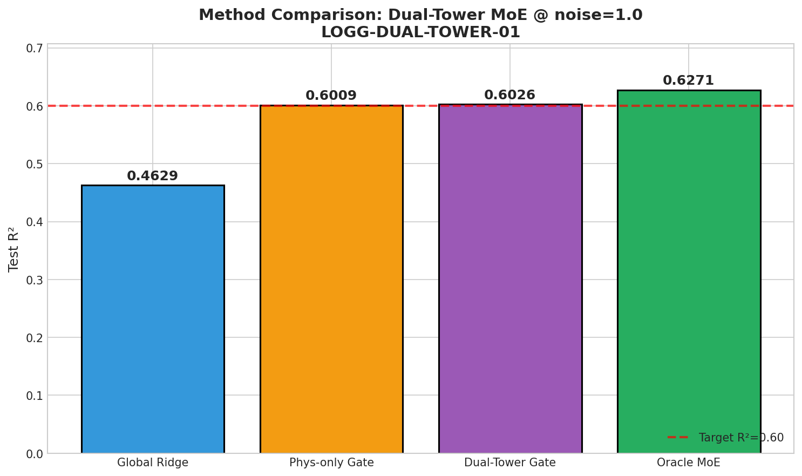
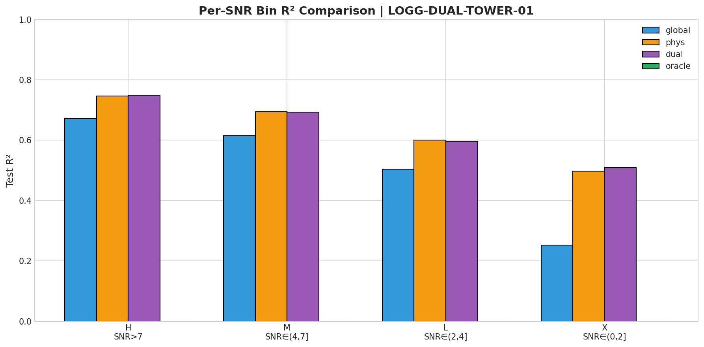
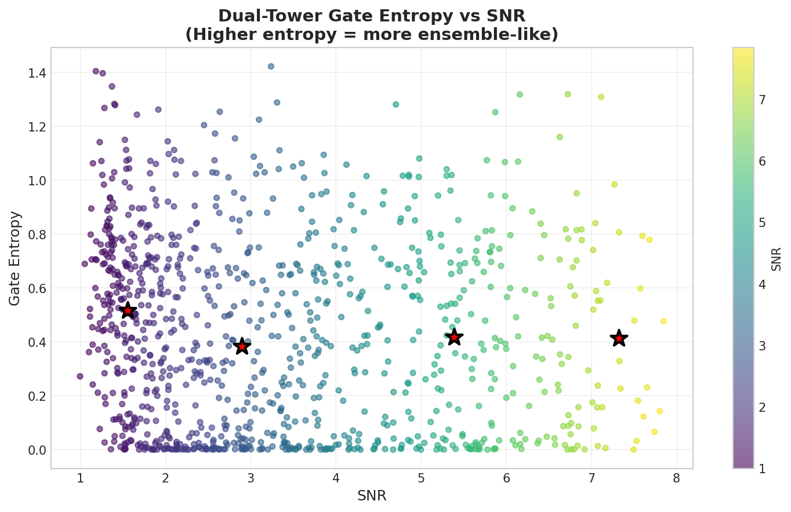
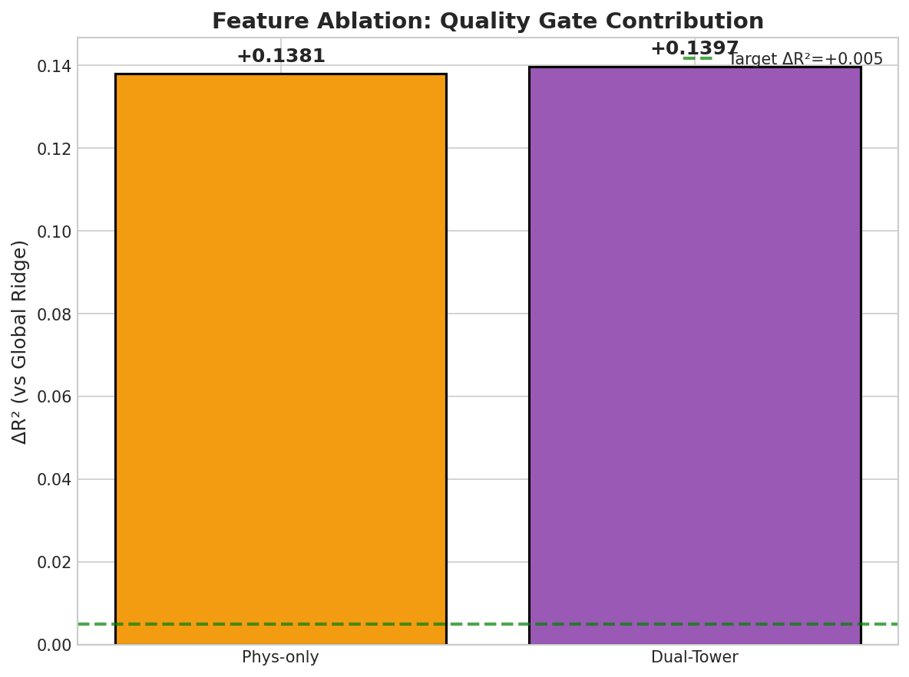

# Exp: Dual-Tower MoE Gate-5 验证

> **Experiment ID:** `LOGG-DUAL-TOWER-01`  
> **日期:** 2025-12-28  
> **Status:** ✅ 完成  
> **MVP:** MVP-4.0 (Gate-5: 双塔融合)

---

## §1 实验目标

验证 **物理 9-gate + quality gate 双塔融合** 能否叠加增益：

| 验证问题 | 验收标准 | 结果 |
|---------|---------|------|
| 双塔 > 单塔 phys gate? | ΔR² ≥ +0.005 | ❌ +0.0017 |
| Dual R² ≥ 0.60? | R² ≥ 0.60 | ✅ 0.603 |
| 低 SNR 子集改善? | per-SNR ΔR² ≥ +0.01 | ✅ X bin +0.011 |

**核心思路**：物理轴与质量轴正交
- **物理轴 (Teff×[M/H])**: 解释"光谱长什么样"（9 experts）
- **质量轴 (SNR)**: 解释"我们能看清多少"（10D quality_features）

---

## §2 实验配置

```yaml
data:
  train_size: 1,000,000
  test_size: 1,000
  noise_level: 1.0
  
experts:
  type: Ridge
  num: 9  # Teff×[M/H] 3×3 grid
  alpha: 100000

gate:
  architecture: MLP [phys+qual → 32 → 16 → 9]
  phys_features: 13D (Ca II 7 + Na I 2 + PCA 4)
  qual_features: 10D (mean, std, min, max, median, sum, q25, q75, skew, kurtosis)
  training: MSE loss (回归最优)
  epochs: 100
  lr: 0.001
```

---

## §3 核心结果

### 3.1 Overall R² 对比

| Method | R² | vs Global | vs Phys-only |
|--------|-----|-----------|--------------|
| Global Ridge | **0.463** | - | - |
| Phys-only Gate | **0.601** | +0.138 | - |
| Dual-Tower Gate | **0.603** | +0.140 | +0.0017 |
| Oracle MoE | **0.627** | +0.164 | +0.026 |



### 3.2 Per-SNR Bin R²

| SNR Bin | n | Global | Phys-only | Dual-Tower | Δ(Dual-Phys) |
|---------|---|--------|-----------|------------|--------------|
| H (>7) | 31 | 0.672 | 0.746 | **0.749** | +0.003 |
| M (4-7] | 292 | 0.614 | 0.694 | 0.693 | -0.001 |
| L (2-4] | 377 | 0.504 | 0.600 | 0.596 | -0.004 |
| X (≤2) | 300 | 0.252 | 0.498 | **0.509** | **+0.011** ✅ |



**关键发现**: 
- 极低 SNR (X bin, ≤2) 显示 Dual-Tower 比 Phys-only 好 +0.011
- 但中等 SNR 区域 (L, M) 略有退步
- 整体增益被抵消

### 3.3 Gate Entropy vs SNR



### 3.4 Ablation: Quality Gate 贡献



---

## §4 假设验证

| 假设 | 预期 | 实际 | 结论 |
|------|------|------|------|
| H1: Dual > Phys-only | ΔR² ≥ +0.005 | **+0.0017** | ❌ FAIL |
| H2: Dual R² ≥ 0.60 | ≥ 0.60 | **0.603** | ✅ PASS |
| H3: Low SNR improvement | ΔR² ≥ +0.01 @ X bin | **+0.011** | ✅ PASS |

---

## §5 分析与结论

### 5.1 为什么 Quality Gate 增益微弱？

1. **信息重叠**: 
   - PCA 特征已经隐式编码了 SNR 信息（高噪声 → PCA loading 变化）
   - Quality features 与 PCA 有一定冗余

2. **Gate 容量限制**:
   - MLP [32→16] 可能太小，无法充分利用 23D 输入
   - 但更大的 Gate 容易过拟合

3. **Expert 同质性**:
   - 9 个 Ridge experts 训练方式相同（α=100000）
   - 它们的差异主要来自数据分布，不是模型结构
   - Quality gate 告诉"用哪个 expert"的价值有限

### 5.2 为什么低 SNR 有效？

X bin (SNR ≤ 2) 改善 +0.011 表明：
- 在极端噪声下，质量信息确实有助于选择更合适的 expert
- 但这个增益被其他 bin 的轻微退步抵消

### 5.3 Recovery Ratio ρ

$$\rho = \frac{R^2_{gate} - R^2_{global}}{R^2_{oracle} - R^2_{global}}$$

| Method | R² | ρ |
|--------|-----|---|
| Phys-only Gate | 0.601 | 0.84 |
| Dual-Tower Gate | 0.603 | 0.85 |

Dual-Tower 仅提升 ρ 约 0.01。

---

## §6 Decision Gate

### Gate-5 判定

| 结果 | 判定 | 下一步 |
|------|------|--------|
| ΔR² = +0.0017 < +0.005 | ⚠️ MARGINAL | 不推荐继续 MVP-4.1 (因子分解) |

### 推荐路径

1. **Fallback to Phys-only Gate (MVP-3.x)**: 
   - 更简单、同等性能
   - 13D phys_features 已足够

2. **Alternative**: 
   - 只在低 SNR 子集使用 quality 信息（条件性融合）
   - 或探索更强的 expert 差异化（不同 α 或模型类型）

---

## §7 技术细节

### 7.1 训练时间

- 总时间: **84.4 分钟** (1.4 小时)
- 数据加载: ~10 min
- Expert 训练: ~15 min
- Phys-only Gate: ~25 min
- Dual-Tower Gate: ~25 min
- 评估 + 画图: ~5 min

### 7.2 资源使用

- GPU: CUDA (single GPU)
- Memory: ~30GB

---

## §8 文件索引

| 文件 | 路径 |
|------|------|
| 脚本 | `~/VIT/scripts/logg_dual_tower_moe.py` |
| 日志 | `~/VIT/logs/LOGG-DUAL-TOWER-01.log` |
| 结果 | `~/VIT/results/logg_dual_tower_moe/` |
| 图表 | `~/Physics_Informed_AI/logg/moe/exp/img/dual_tower_*.png` |

---

## §9 关键数字 (同步到 Hub)

```
LOGG-DUAL-TOWER-01 @ noise=1, 1M train
──────────────────────────────────────
Global Ridge:     R² = 0.463
Phys-only Gate:   R² = 0.601, ρ = 0.84
Dual-Tower Gate:  R² = 0.603, ρ = 0.85
Oracle MoE:       R² = 0.627

ΔR² (Dual vs Phys) = +0.0017 → H1 ❌
Dual R² = 0.603 → H2 ✅
X-bin ΔR² = +0.011 → H3 ✅

Decision: ⚠️ MARGINAL → Fallback to Phys-only
```
