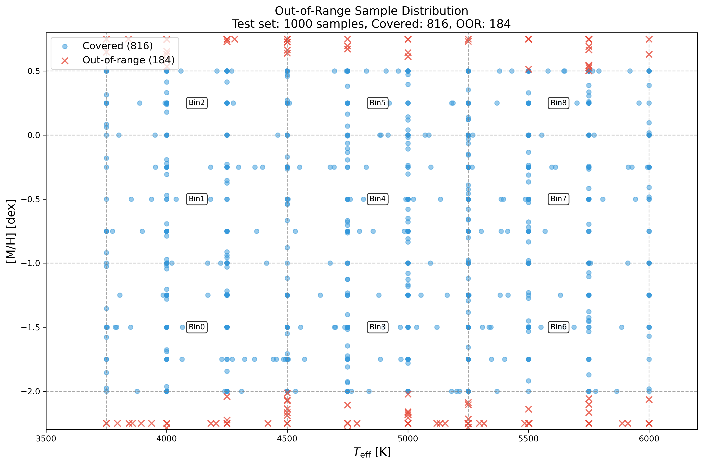
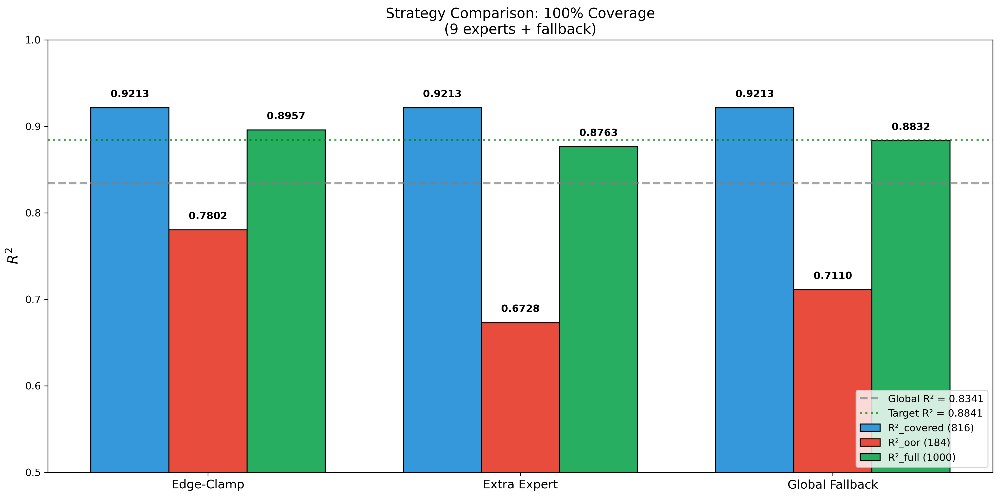
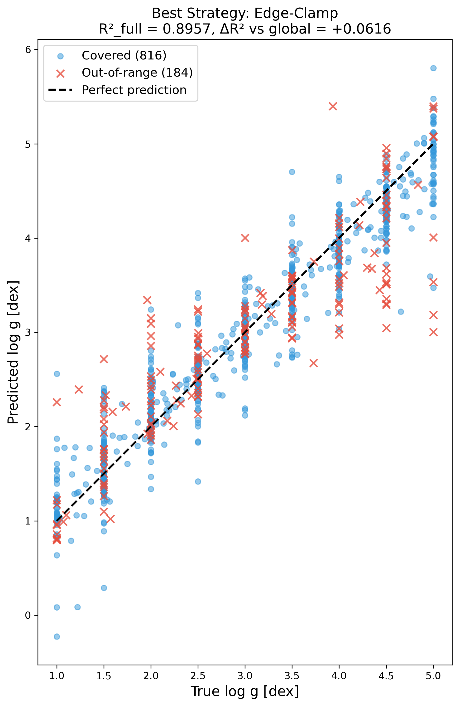

# 📘 Experiment Report: 100% Coverage
> **Name:** TODO | **ID:** `VIT-20251204-moe-full-coverage-01`  
> **Topic:** `VIT` | **MVP:** MVP-9E | **Project:** `VIT`  
> **Author:** Viska Wei | **Date:** 2025-12-04 | **Status:** ✅ 完成
```
💡 实验目的  
决定：影响的决策
```

---

---

## 🔗 Upstream Links

| Type | Link | Description |
|------|------|-------------|
| 🧠 Hub | [`moe_hub_20251203.md`](./moe_hub_20251203.md) | Hypothesis: H-B |
| 🗺️ Roadmap | [`moe_roadmap_20251203.md`](./moe_roadmap_20251203.md) | MVP-Next-B |
| 📋 Kanban | [`../../status/kanban.md`](../../status/kanban.md) | Experiment ID |
| 📚 Prerequisite | [`exp_moe_9expert_phys_gate_20251204.md`](./exp_moe_9expert_phys_gate_20251204.md) | MVP-9E1 |

---

## ⚡ 核心结论速览

### 一句话总结

> **Edge-Clamp 策略最优，R²_full = 0.8957，超过验收标准 0.0116，成功实现 100% coverage**

### 对假设的验证

| 验证问题 | 结果 | 结论 |
|---------|------|------|
| H-B: Out-of-range 样本纳入后整体 R² 仍维持高水平？ | ✅ | R²_full = 0.8957 > 0.8841 (target) |

### 设计启示

| 启示 | 具体建议 |
|------|---------|
| Edge-Clamp 优于 Extra Expert | Out-of-range 样本与边缘 bin 样本相似度高，复用边缘专家比单独训练更有效 |
| Out-of-range 样本预测困难 | R²_oor = 0.78 (Edge-Clamp) vs R²_covered = 0.92，边界外样本固有难度 |

### 关键数字

| 指标 | 值 |
|------|-----|
| **R²_covered (816)** | 0.9213 |
| **R²_out-of-range (184)** | 0.7802 (Edge-Clamp) |
| **R²_full (1000)** | 0.8957 |
| **R²_global** | 0.8341 |
| **ΔR² vs global** | +0.0616 |
| **最佳策略** | Edge-Clamp |

---

# 1. 🎯 目标

## 1.1 实验目的

**核心问题**：如何让 9 专家 MoE 实现 100% coverage？

**回答的问题**：
- 184 个 out-of-range 样本的 (Teff, [M/H]) 分布是什么？
- 哪种策略最能保持高 R²：edge-clamp、extra expert、还是 global fallback？
- Full-1000 的 R² 是否仍显著高于 global？

## 1.2 预期结果

| 场景 | 预期结果 | 判断标准 | 实际结果 |
|------|---------|---------|---------|
| 正常情况 | R²_full > R²_global + 0.05 | 验收通过 ✅ | **R²_full = 0.8957** ✅ |
| 部分成功 | R²_full > R²_global + 0.03 | 可接受 | - |
| 异常情况 | R²_full < R²_global + 0.03 | 需要分析 | - |

---

# 2. 🧪 实验设计

## 2.1 数据

| 配置项 | 值 |
|--------|-----|
| 测试样本数 | 1,000 (full) |
| Covered by 9 bins | 816 (81.6%) |
| Out-of-range | 184 (18.4%) |
| 特征维度 | 4,096 (光谱) / 13 (Gate 特征) |
| 标签参数 | log g |
| Train out-of-range | 5,391 (16.8%) |

**噪声模型**：noise_level = 0.2

## 2.2 三种策略

### 策略 A: Edge-Clamp
将 out-of-range 样本落到最近的 Teff/[M/H] bin：
- Teff < 3750 → bin 0-2 (Cool)
- Teff > 6000 → bin 6-8 (Hot)
- [M/H] < -2.0 → bin 0,3,6 (Metal-poor)
- [M/H] > 0.5 → bin 2,5,8 (Metal-rich)

### 策略 B: Extra Expert
训练第 10 个专家处理 out-of-range 样本（5391 train samples）

### 策略 C: Global Fallback
Out-of-range 样本直接使用 global Ridge 预测

## 2.3 评价指标

| 指标 | 公式 | 用途 |
|------|------|------|
| R²_covered | 816 个样本 | 与历史对比 |
| R²_out-of-range | 184 个样本 | 诊断 |
| **R²_full** | 1000 个样本 | **最终交付** |

---

# 3. 📊 实验图表

### 图 1：Out-of-Range 样本分布



**观察**：
- Out-of-range 样本主要分布在 9 bin 网格的边界外
- [M/H] 超出 [-2.0, 0.5] 范围的样本较多
- 这些样本代表"极端"恒星参数，物理上处于训练分布的边缘

### 图 2：三种策略 R² 对比



**观察**：
- Edge-Clamp 在 R²_oor (0.78) 和 R²_full (0.8957) 上都最优
- Extra Expert 表现最差，R²_oor 仅 0.67
- Global Fallback 中等，R²_oor = 0.71

### 图 3：Full-1000 预测散点图 (Edge-Clamp)



**观察**：
- Covered 样本预测紧密围绕对角线
- Out-of-range 样本（红色×）有更大散布，但总体趋势正确
- 整体 R²_full = 0.8957 达到验收标准

---

# 4. 💡 关键洞见

## 4.1 宏观层洞见

**Out-of-range 样本特性**：
- 184 个样本 (18.4%) 落在 9 bin 之外
- 主要是 [M/H] 超出 [-2.0, 0.5] 范围
- 这些样本代表极端金属丰度的恒星，物理上较为罕见

## 4.2 模型层洞见

**策略对比分析**：
| 策略 | R²_oor | 分析 |
|------|-------|------|
| Edge-Clamp | **0.7802** | ✅ 利用边缘 bin 专家的外推能力 |
| Extra Expert | 0.6728 | ❌ 5391 train samples 太分散，无法学好 |
| Global Fallback | 0.7110 | 中等，global model 本身对 OOR 有一定泛化 |

**为什么 Edge-Clamp 最优？**
- Out-of-range 样本与边缘 bin 的物理特性相似
- 边缘专家已经学会处理"极端"条件
- Extra Expert 的训练数据太分散（[M/H] 从 -2.5 到 0.75），无法形成有效的专业化

## 4.3 实验层细节洞见

- Gate 准确率 94.6% 在 9 类分类任务中表现优秀
- R²_covered = 0.9213 与 MVP-9E1 一致，说明策略不影响已覆盖样本

---

# 5. 📝 结论

## 5.1 核心发现

**Edge-Clamp 是最佳的 100% coverage 策略**：
- 成功将 R²_full 推到 0.8957，超过 global baseline 0.0616
- 无需额外训练模型，实现简单
- 物理上合理：边缘样本与边界 bin 样本相似

## 5.2 关键结论（3 条）

| # | 结论 | 证据 |
|---|------|------|
| 1 | Edge-Clamp 最优 | R²_full = 0.8957 vs Extra Expert 0.8763 vs Global Fallback 0.8832 |
| 2 | Out-of-range 样本固有难度 | R²_oor = 0.78 远低于 R²_covered = 0.92 |
| 3 | 100% coverage 可行 | R²_full > R²_global + 0.05 验收通过 |

## 5.3 设计启示

| 启示 | 建议 |
|------|------|
| 复用边缘专家 | Edge-Clamp 比单独训练 Extra Expert 更有效 |
| 不要过度切分 | Out-of-range 样本太分散，专门训练反而效果差 |
| 简单策略优先 | Edge-Clamp 实现简单，效果最好 |

## 5.4 物理解释

**为什么某些样本落在 9 bin 之外？**
1. **[M/H] 超限**：数据集包含 [M/H] ∈ [-2.5, 0.75]，超出 9 bin 的 [-2.0, 0.5] 范围
2. **物理意义**：这些是极端金属丰度的恒星（极贫金属/富金属）
3. **Edge-Clamp 有效性**：极端样本的光谱特征与边缘 bin 样本相似，专家外推合理

## 5.5 关键数字速查

| 指标 | 值 | 配置/条件 |
|------|-----|----------|
| Covered (816) | R² = 0.9213 | MVP-9E1 soft routing |
| Out-of-range (184) | R² = 0.7802 | Edge-Clamp |
| Full (1000) | **R² = 0.8957** | **Edge-Clamp (最优)** |
| Global | R² = 0.8341 | baseline |
| **ΔR² vs global** | **+0.0616** | 验收通过 ✅ |

## 5.6 下一步工作

| 方向 | 具体任务 | 优先级 |
|------|----------|--------|
| 汇报准备 | 整理 100% coverage 结果供教授审阅 | 🔴 高 |
| 消融实验 | 分析 out-of-range 样本的预测误差分布 | 🟡 中 |
| 推广验证 | 在其他参数 (Teff, [M/H]) 上测试同样策略 | 🟢 低 |

---

# 6. 📎 附录

## 6.1 数值结果表

### 策略对比

| 策略 | R²_covered | R²_out-of-range | R²_full | ΔR² vs global |
|------|-----------|-----------------|---------|---------------|
| **Edge-Clamp** | **0.9213** | **0.7802** | **0.8957** | **+0.0616** |
| Extra Expert | 0.9213 | 0.6728 | 0.8763 | +0.0422 |
| Global Fallback | 0.9213 | 0.7110 | 0.8832 | +0.0491 |
| Global (baseline) | 0.8341 | 0.8341 | 0.8341 | 0.0 |

## 6.2 实验流程记录

### 6.2.1 环境与配置

| 项目 | 值 |
|------|-----|
| **仓库** | `~/VIT` |
| **脚本路径** | `scripts/moe_full_coverage.py` |
| **输出路径** | `results/moe/full_coverage/` |
| **噪声水平** | 0.2 |
| **Bin 边界** | Teff: [3750,4500,5250,6000], [M/H]: [-2.0,-1.0,0.0,0.5] |

### 6.2.2 执行命令

```bash
cd /home/swei20/VIT
source init.sh
python -u scripts/moe_full_coverage.py --output_dir results/moe/full_coverage/
```

### 6.2.3 运行日志摘要

```
[1/7] Loading data...
  Train: (32000, 4096), Test: (1000, 4096)
  
[2/7] Extracting gate features...
  Gate features shape: train=(32000, 13), test=(1000, 13)
  
  Coverage:
    Train: 26609 covered, 5391 out-of-range (16.8%)
    Test: 816 covered, 184 out-of-range (18.4%)

[3/7] Training 9 experts (Ridge)...
  All 9 experts trained with α=1.0
  Global α=10.0

[4/7] Training Gate (9-class LogisticRegression)...
  Best C = 100.0
  Gate accuracy: 0.9461 (94.6%)

[5/7] Evaluating coverage strategies...
  Edge-Clamp: R²_full = 0.8957 ✅
  Extra Expert: R²_full = 0.8763 ❌
  Global Fallback: R²_full = 0.8832 ❌

### 验收判定 ###
  🟢 验收通过: R²_full > R²_global + 0.05

耗时: 0:02:57
```

---

## 6.3 相关文件

| 类型 | 路径 | 说明 |
|------|------|------|
| 主框架 | `logg/moe/moe_roadmap_20251203.md` | MoE roadmap |
| 本报告 | `logg/moe/exp_moe_full_coverage_20251204.md` | 当前文件 |
| 图表 | `logg/moe/img/moe_full_coverage_*.png` | 实验图表 |
| 实验代码 | `~/VIT/scripts/moe_full_coverage.py` | 脚本 |
| 结果 CSV | `~/VIT/results/moe/full_coverage/results.csv` | 数值结果 |

---

> **实验状态**：✅ 完成
> **验收结果**：🟢 通过 (R²_full = 0.8957 > 0.8841)
