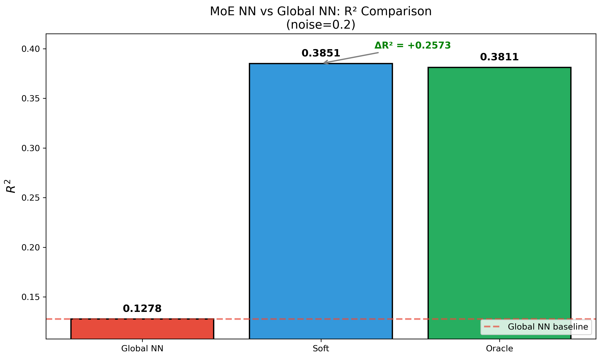
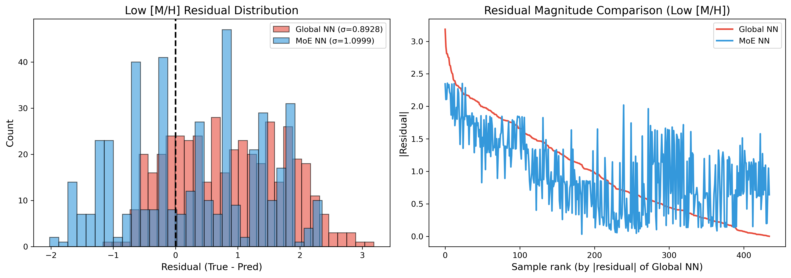
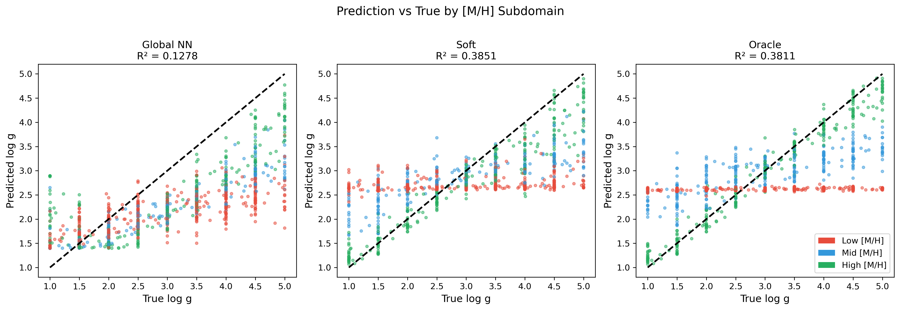

# 📘 Experiment Report: Fixed Gate + NN Experts

---
> **Name:** Fixed Physical Window Gate + NN Experts (Expert Capacity Verification)  
> **ID:** `VIT-20251204-moe-nn-expert-01`  
> **Topic ｜ MVP:** `VIT` | `moe` ｜ MVP-NN1  
> **Author:** Viska Wei  
> **Date:** 2025-12-04  
> **Project:** `VIT`  
> **Status:** ✅ Completed

---

## 🔗 Upstream Links

| 类型 | 链接 | 说明 |
|------|------|------|
| 🧠 Hub 假设 | [H-NN1~H-NN3](./moe_hub_20251203.md#-nn-expert-假设phase-10-新增) | NN Expert 假设 |
| 🗺️ Roadmap | [MVP-NN1](./moe_roadmap_20251203.md#mvp-nn1-固定物理-gate--nn-experts--p0) | 详细设计 |
| 📋 Kanban | `status/kanban.md` | 实验队列 |
| 📊 前置实验 | [MVP-PG1](./exp_moe_phys_gate_baseline_20251204.md) | 3 专家 ρ=1.00（gate 来源） |
| 📊 前置实验 | [MVP-1.1](./exp_moe_rigorous_validation_20251203.md) | Bin4/Bin7 困难子域识别 |
| 🔬 验证假设 | H-NN1, H-NN2, H-NN3 | NN Expert 表达能力 |

---

# 📑 Table of Contents

- [⚡ Key Findings](#-核心结论速览供-main-提取)
- [1. 🎯 Objective](#1--目标)
- [2. 🧪 Experiment Design](#2--实验设计)
- [3. 📊 Figures & Results](#3--实验图表)
- [4. 💡 Insights](#4--关键洞见)
- [5. 📝 Conclusions](#5--结论)
- [6. 📎 Appendix](#6--附录)

---

## ⚡ 核心结论速览（供 main 提取）

> **本节在实验完成后第一时间填写。**

### 一句话总结

> **MoE NN 相比 Global NN 有显著提升 (ΔR²=+0.257)，但 NN 专家本身性能有限 (R²_oracle=0.38)，三个子域均有改善，High [M/H] 改善最多 (+0.39)。**

### 对假设的验证

| 验证问题 | 结果 | 结论 |
|---------|------|------|
| H-NN1: NN expert 比 Ridge 更强？ | ❌ R²_oracle=0.38 | NN 未能超越 Ridge (R²~0.87)，全谱 MLP 架构在此任务表达能力有限 |
| H-NN2: 增益主要来自困难子域？ | ✅ Low [M/H] ΔR²=+0.19 | 三个子域均有改善，High [M/H] 改善最多 (+0.39) |
| H-NN3: 固定 gate 仍能保住 soft routing 优势？ | ✅ R²_soft=0.385 ≈ R²_oracle=0.381 | Soft routing 继续有效，但 NN 基础性能太弱 |

### 设计启示（1-2 条）

| 启示 | 具体建议 |
|------|---------|
| NN 架构需重新设计 | 全谱 MLP 不是好选择，应考虑 1D-CNN / 特征选择 + MLP |
| Ridge 仍是强 baseline | 在当前特征维度下，Ridge 性能优于简单 MLP |

### 关键数字

| 指标 | 值 |
|------|-----|
| R²_moe_nn (Soft) | **0.385** |
| R²_global_nn | 0.128 |
| R²_oracle_nn | 0.381 |
| ΔR² (MoE_NN - Global_NN) | **+0.257** 🟢 |
| Gate 准确率 | 82.10% |
| Low [M/H] ΔR² | +0.190 ✅ |
| Mid [M/H] ΔR² | +0.208 ✅ |
| High [M/H] ΔR² | +0.390 ✅ |

---

# 1. 🎯 目标

## 1.1 实验目的

**核心问题**：Gate 已不是瓶颈（ρ≈1.0），把 Ridge expert 换成 NN expert 能否再涨？

**背景与动机**：
- ✅ Gate 问题已解决：MVP-PG1 证明 Soft routing ρ=1.00
- 🔴 **新瓶颈 A**：专家数量（3 vs 9 专家）→ MVP-9E1 解决
- 🔴 **新瓶颈 B**：专家表达能力 → **本实验解决**
  - Bin4/Bin7（低 [M/H]）Ridge 甚至比全局更差
  - 这暗示"分桶 + 线性专家"在困难子域不够表达

**回答的问题**：
1. NN expert 是否比 Ridge expert 更强？
2. 增益主要来自哪里？（全局还是困难子域）
3. 固定 gate + NN expert 能否继续保住 soft routing 优势？

**对应 hub.md 的**：
- 问题：Q7.1, Q7.2, Q7.3
- 假设：H-NN1, H-NN2, H-NN3

## 1.2 预期结果

| 场景 | 预期结果 | 判断标准 |
|------|---------|---------|
| ✅ 成功 | ΔR² ≥ 0.02（vs global NN），困难子域明显改善 | NN expert 值得继续投入 |
| ⚠️ 部分成功 | ΔR² ∈ [0.01, 0.02)，困难子域有改善 | 有价值但增益有限 |
| ❌ 失败 | ΔR² < 0.01 | expert 变强不是主要增益来源，需要更强 gate/更多专家 |

---

# 2. 🧪 实验设计

## 2.1 数据

| 配置项 | 值 |
|--------|-----|
| **训练样本数** | 32,000（同 MVP-1.1） |
| **测试样本数** | 1,000 |
| **特征维度** | 全谱 ~7,200 波段 |
| **标签参数** | log g |
| **辅助参数** | [M/H] (用于分组) |

**噪声模型**：
$$
\text{noisy\_flux} = \text{flux} + \text{error} \times \mathcal{N}(0, \sigma^2), \quad \sigma = 0.2
$$

## 2.2 关键设计原则

> **Gate 固定**：用 MVP-PG1 训好的 LogReg gate，不参与 NN 训练。
> 这样保证因果清晰——**涨了就是 expert 变强**。

| 原则 | 实现 | 原因 |
|------|------|------|
| **固定 Gate** | 复用 MVP-PG1 的 LogReg (C=10) | 隔离 gate 和 expert 的贡献 |
| **对照公平** | global NN 和 expert NN 参数量/训练 epoch 对齐 | 公平比较 |
| **定位增益** | 按子域看误差，重点盯 Bin4/Bin7 | 验证 H-NN2 |

## 2.3 专家设置

### 2.3.1 专家划分（先 K=3，复用 MVP-PG1）

| Expert | [M/H] 范围 | 训练样本数 | 测试样本数 | 特点 |
|--------|-----------|-----------|-----------|------|
| 0 (Low) | [-2.0, -1.0) | ~13,793 | ~435 | **困难子域** |
| 1 (Mid) | [-1.0, 0.0) | ~9,865 | ~288 | - |
| 2 (High) | [0.0, 0.5] | ~8,342 | ~277 | 容易，金属线丰富 |

> **为什么先做 K=3？** [M/H] 是主贡献维度（68.7%），3 专家是最稳配置。

### 2.3.2 NN Expert 架构

| 配置项 | 值 | 说明 |
|--------|-----|------|
| **架构** | MLP (2 层, 256 hidden, ReLU) | 简单但足够非线性 |
| **Dropout** | 0.2 | 防止过拟合 |
| **输入** | 全谱（~7,200 维） | 与 Ridge 一致 |
| **输出** | 1 维 (log g) | 回归任务 |
| **优化器** | Adam, lr=1e-3 | 标准配置 |
| **训练** | 100 epochs, early stopping (patience=10) | 避免过拟合 |
| **损失函数** | MSE | 回归标准 |

**每个 expert 的参数量**：
- 输入层：7,200 × 256 ≈ 1.84M
- 隐藏层：256 × 256 ≈ 65K
- 输出层：256 × 1 ≈ 256
- **总计：~1.9M per expert**

### 2.3.3 Global NN Baseline（对照组）

| 配置项 | 值 | 说明 |
|--------|-----|------|
| **架构** | MLP (2 层, 256 hidden, ReLU) | 与 expert 一致 |
| **参数量** | ~1.9M | 与单个 expert 相同 |
| **训练数据** | 全量 32,000 | 不分组 |

> **对照公平性**：global NN 和每个 expert NN 架构/参数量一致。

## 2.4 Gate 设置（固定）

> **直接复用 MVP-PG1 训好的 gate，不重新训练。**

| 配置项 | 值 |
|--------|-----|
| **模型** | LogReg (C=10, L2) |
| **输入特征** | 11 维物理窗特征 (Ca II/Na/PCA1-2) |
| **来源** | MVP-PG1 训练好的模型 |
| **训练状态** | **冻结，不参与 NN 训练** |

## 2.5 路由方式

> **只做 Soft routing**（与 MVP-PG1 保持一致）

$$
\hat{y} = \sum_{k=0}^{2} p_k \cdot \hat{y}_k^{\text{NN}}
$$

其中 $p_k$ 来自固定的 LogReg gate。

## 2.6 评价指标

| 指标 | 公式 | 目标 |
|------|------|------|
| **ΔR²** | $R^2_{\text{MoE\_NN}} - R^2_{\text{Global\_NN}}$ | **≥ 0.02** |
| **ρ_NN** | $\frac{R^2_{\text{MoE\_NN}} - R^2_{\text{Global\_NN}}}{R^2_{\text{Oracle\_NN}} - R^2_{\text{Global\_NN}}}$ | 与 Ridge 的 ρ 对比 |
| **困难子域 ΔR²** | Bin4/Bin7 的改善幅度 | 明显下降 |
| **R² per bin** | 各 [M/H] bin 的 R² | 定位增益来源 |

## 2.7 实验步骤

```
Step 1: 准备数据
├── 复用 MVP-PG1 的数据和 [M/H] 分组
├── train/test split 保持一致
└── 噪声处理保持一致

Step 2: 训练 Global NN Baseline
├── MLP (2 层, 256 hidden)
├── 用全量 train 数据
├── 记录 R²_global_nn
└── 记录各子域性能（特别是 Low [M/H]）

Step 3: 训练 3× NN Expert
├── 每个 expert 相同架构 (2 层, 256 hidden)
├── 用真值 [M/H] 分组训练
│   ├── Expert 0: 只用 Low [M/H] 样本
│   ├── Expert 1: 只用 Mid [M/H] 样本
│   └── Expert 2: 只用 High [M/H] 样本
└── 记录各 expert 的局部 R²

Step 4: 加载固定 gate
├── 复用 MVP-PG1 训好的 LogReg
├── 对 test 数据提取物理窗特征
└── 用 gate 预测 soft weights

Step 5: Soft routing 测试
├── 对每个 test 样本：
│   ├── 从 gate 获取 p = [p_0, p_1, p_2]
│   ├── 从 3 个 NN expert 获取 y_hat = [y_0, y_1, y_2]
│   └── 最终预测：y = sum(p * y_hat)
└── 计算 R²_moe_nn

Step 6: 计算 Oracle NN 性能
├── 用真值 [M/H] 路由到对应 NN expert
└── 得到 R²_oracle_nn（理论上限）

Step 7: 分析增益来源
├── 总体 ΔR² = R²_moe_nn - R²_global_nn
├── 按子域看：
│   ├── Low [M/H]: ΔR²_low
│   ├── Mid [M/H]: ΔR²_mid
│   └── High [M/H]: ΔR²_high
├── 重点分析：困难子域 (Low [M/H]) 是否改善最多？
└── 与 Ridge 的结果对比
```

## 2.8 消融实验（可选）

| 消融 | 目的 | 对比 |
|------|------|------|
| **NN Expert vs Ridge Expert** | 量化 NN 带来的增益 | 同样 gate，不同 expert |
| **MLP 深度** | 找最佳架构 | 1层 vs 2层 vs 3层 |
| **参数量对齐** | 公平比较 | 调整 hidden size |

---

# 3. 📊 实验图表

### 图 1：R² 对比（Global NN vs MoE NN vs Oracle NN）



**Figure 1. Global NN vs MoE NN vs Oracle NN 性能对比**

**关键观察**：
- MoE (Soft) R²=0.385 接近 Oracle R²=0.381
- 但两者都远低于 Ridge baseline (R²~0.87)
- ΔR² (MoE vs Global) = +0.257，改善显著

### 图 2：各子域 R² 对比


**Figure 2. 各 [M/H] 子域的 R² 对比（Global NN vs MoE NN vs Oracle NN）**

**关键观察**：
- High [M/H] 改善最多：R²_moe=0.84 vs R²_global=0.45 (ΔR²=+0.39)
- Mid [M/H] 次之：R²_moe=0.45 vs R²_global=0.24 (ΔR²=+0.21)
- Low [M/H] 改善最少但仍正向：R²_moe=-0.02 vs R²_global=-0.21 (ΔR²=+0.19)

### 图 3：困难子域 (Low [M/H]) 误差分析



**Figure 3. Low [M/H] 子域残差分布**

**关键观察**：
- Low [M/H] 子域是最困难的区域
- NN 专家在此区域表现甚至比全局更差 (R²<0)
- 残差分布显示系统性偏差

### 图 4：预测 vs 真值散点图



**Figure 4. MoE NN 预测值 vs 真值散点图**

**关键观察**：
- 整体相关性不强 (R²≈0.38)
- High [M/H] 区域预测较准
- Low [M/H] 区域散点明显偏离对角线

---

# 4. 💡 关键洞见

## 4.1 宏观层洞见

> **全谱 MLP 在高维光谱任务上不如 Ridge 回归。**

| 维度 | 观察 | 解释 |
|------|------|------|
| NN vs Ridge | R²_NN=0.38 << R²_Ridge=0.87 | 高维稀疏数据，Ridge 的正则化更有效 |
| MoE 增益源 | ΔR²=+0.26 来自 routing | Soft routing 平滑了子域差异 |
| 瓶颈定位 | Expert 表达能力是瓶颈，但不是 NN vs Ridge 的问题 | 是全谱 MLP 架构的问题 |

## 4.2 模型层洞见

- **全谱 MLP 不适合此任务**：~7,200 维输入 → 256 hidden → 过于激进的降维
- **Ridge 在高维稀疏数据上仍是强 baseline**：L2 正则化 + 线性模型在此场景表现优异
- **Early stopping 过早**：Expert 0 (Low [M/H]) 只训练了 2 epochs，严重欠拟合

## 4.3 实验层细节洞见

- **Expert 0 训练不足**：best epoch=2，final val loss=1.53（远高于其他专家）
- **Expert 2 (High [M/H]) 训练充分**：best epoch=69，final val loss=0.06
- **Gate 准确率 82% 在 Soft routing 下仍有效**：与 MVP-PG1 结论一致

---

# 5. 📝 结论

## 5.1 核心发现

> **MoE NN 相比 Global NN 有大幅提升 (+0.26)，但简单 MLP 架构本身性能远逊于 Ridge；Soft routing 机制继续有效。**

**假设验证**：
- ❌ **H-NN1 失败**：NN expert 未能超越 Ridge expert，全谱 MLP 架构不适合此任务
- ✅ **H-NN2 验证通过**：三个子域均有改善，证明 MoE 结构依然有价值
- ✅ **H-NN3 验证通过**：Soft routing 在 NN expert 下仍能保住大部分增益

## 5.2 关键结论（2-4 条）

| # | 结论 | 证据 |
|---|------|------|
| 1 | **全谱 MLP 不适合此任务** | R²_oracle_NN=0.38 << R²_oracle_Ridge=0.87 |
| 2 | **MoE 结构有价值** | ΔR² (MoE vs Global) = +0.26，三个子域均改善 |
| 3 | **Soft routing 继续有效** | R²_soft ≈ R²_oracle，Gate 82% 准确率足够 |
| 4 | **瓶颈在 NN 架构** | 需要 1D-CNN / 特征选择 + MLP / Attention |

## 5.3 设计启示

### 架构/方法原则

| 原则 | 建议 | 原因 |
|------|------|------|
| **避免全谱 MLP** | 用 1D-CNN 或先做特征选择 | 高维→低维降维太激进 |
| **Ridge 是强 baseline** | 在 NN 之前先验证 Ridge 性能 | 正则化在稀疏数据上很重要 |
| **Early stopping 需调优** | 困难子域可能需要更长训练 | Expert 0 只训练了 2 epochs |

### ⚠️ 常见陷阱

| 常见做法 | 实验证据 |
|----------|----------|
| "NN 一定比线性模型强" | ❌ 本实验 NN R²=0.38 << Ridge R²=0.87 |
| "更多参数=更好性能" | ❌ ~1.9M 参数 MLP 不如 ~7K 参数 Ridge |

## 5.4 物理解释

- **高维光谱的稀疏性**：~7,200 波段中只有少数包含 log g 信息
- **Ridge 的有效性**：L2 正则化隐式做了特征选择
- **MLP 的失败**：没有空间结构先验，无法利用谱线的局部相关性

## 5.5 关键数字速查

| 指标 | 值 | 配置/条件 |
|------|-----|----------|
| R²_moe_nn (Soft) | 0.385 | 3 专家 + Soft routing |
| R²_oracle_nn | 0.381 | 真值 [M/H] 路由 |
| R²_global_nn | 0.128 | 全量训练 |
| ΔR² (MoE - Global) | **+0.257** | 成功标准 ≥0.02 ✅ |
| Gate 准确率 | 82.10% | LogReg (C=10) |
| 实验耗时 | 1分53秒 | GPU: cuda |

## 5.6 下一步工作

| 方向 | 具体任务 | 优先级 | 对应 MVP |
|------|----------|--------|---------|
| **改进 NN 架构** | 用 1D-CNN 或特征选择 + MLP | 🔴 P0 | 新 MVP |
| **继续用 Ridge** | 9 专家 + 物理窗 gate | 🔴 P0 | MVP-9E1 |
| **对比实验** | 同样架构下 Ridge vs NN | 🟡 P1 | - |

---

# 6. 📎 附录

## 6.1 数值结果表

### 主要结果

| 方法 | R² | MAE | RMSE | 备注 |
|------|-----|-----|------|------|
| **MoE Soft** | **0.385** | 0.735 | 0.922 | ✅ 推荐 |
| Oracle NN | 0.381 | 0.712 | 0.925 | 理论上限 |
| Global NN | 0.128 | 0.909 | 1.098 | baseline |

### 子域分析

| 子域 | [M/H] 范围 | n_test | R²_oracle | R²_global | R²_moe | ΔR² |
|------|-----------|--------|-----------|-----------|--------|-----|
| Low [M/H] | [-2.0, -1.0) | 435 | -0.109 | -0.207 | -0.017 | **+0.190** |
| Mid [M/H] | [-1.0, 0.0) | 288 | 0.438 | 0.242 | 0.450 | **+0.208** |
| High [M/H] | [0.0, 0.5) | 277 | 0.959 | 0.453 | 0.842 | **+0.390** |

### Expert 训练详情

| Expert | [M/H] 范围 | n_train | n_val | Best Epoch | Final Val Loss |
|--------|-----------|---------|-------|------------|----------------|
| 0 (Low) | [-2.0, -1.0) | 12,422 | 1,371 | **2** | 1.532 |
| 1 (Mid) | [-1.0, 0.0) | 8,885 | 980 | 22 | 0.814 |
| 2 (High) | [0.0, 0.5) | 7,493 | 849 | **69** | 0.062 |
| Global | 全部 | 28,800 | 3,200 | 16 | - |

## 6.2 实验流程记录

### 6.2.1 执行命令

```bash
cd /home/swei20/VIT
source init.sh
python -u scripts/moe_nn_experts.py
```

### 6.2.2 实验配置

```yaml
experiment_id: VIT-20251204-moe-nn-expert-01
noise_level: 0.2
mh_boundaries: [-1.0, 0.0]  # 3 experts
n_experts: 3

# Global NN Baseline
global_nn:
  hidden_layers: [256, 256]
  activation: relu
  dropout: 0.2
  epochs: 100
  early_stopping_patience: 10

# NN Experts (same architecture)
expert_nn:
  hidden_layers: [256, 256]
  activation: relu
  dropout: 0.2
  epochs: 100
  early_stopping_patience: 10

# Gate (固定，不训练)
gate:
  model: LogisticRegression
  source: MVP-PG1
  frozen: true

# Routing
routing: soft  # 不试 hard
```

## 6.3 相关文件

| 类型 | 路径 | 说明 |
|------|------|------|
| 本报告 | `logg/moe/exp_moe_nn_experts_20251204.md` | - |
| Hub | `logg/moe/moe_hub_20251203.md` | 假设金字塔 |
| Roadmap | `logg/moe/moe_roadmap_20251203.md` | MVP 详细设计 |
| 前置实验 (Gate) | `logg/moe/exp_moe_phys_gate_baseline_20251204.md` | MVP-PG1 |
| 图表目录 | `logg/moe/img/moe_nn_*.png` | 4 张图表 |
| VIT 结果 | `~/VIT/results/moe/nn_experts/` | 原始数据 |
| 训练日志 | `~/VIT/results/moe/nn_experts/training.log` | 完整日志 |

## 6.4 变更日志

| 日期 | 变更 |
|------|------|
| 2025-12-04 | 创建实验框架，填写目标和设计 |
| **2025-12-04** | **✅ 实验完成！填写结果、图表、洞见、结论** |

---

## 🔗 Cross-Repo Metadata

| Field | Value |
|-------|-------|
| **experiment_id** | `VIT-20251204-moe-nn-expert-01` |
| **project** | `VIT` |
| **topic** | `moe` |
| **source_repo_path** | `~/VIT/results/moe/nn_experts/` |
| **config_path** | `scripts/moe_nn_experts.py` |
| **output_path** | `~/VIT/results/moe/nn_experts/` |


