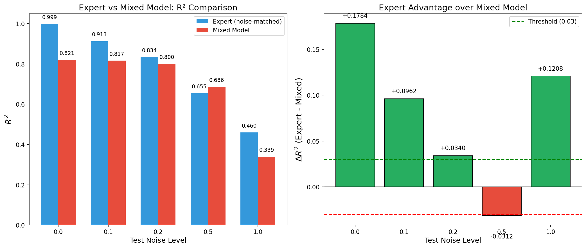
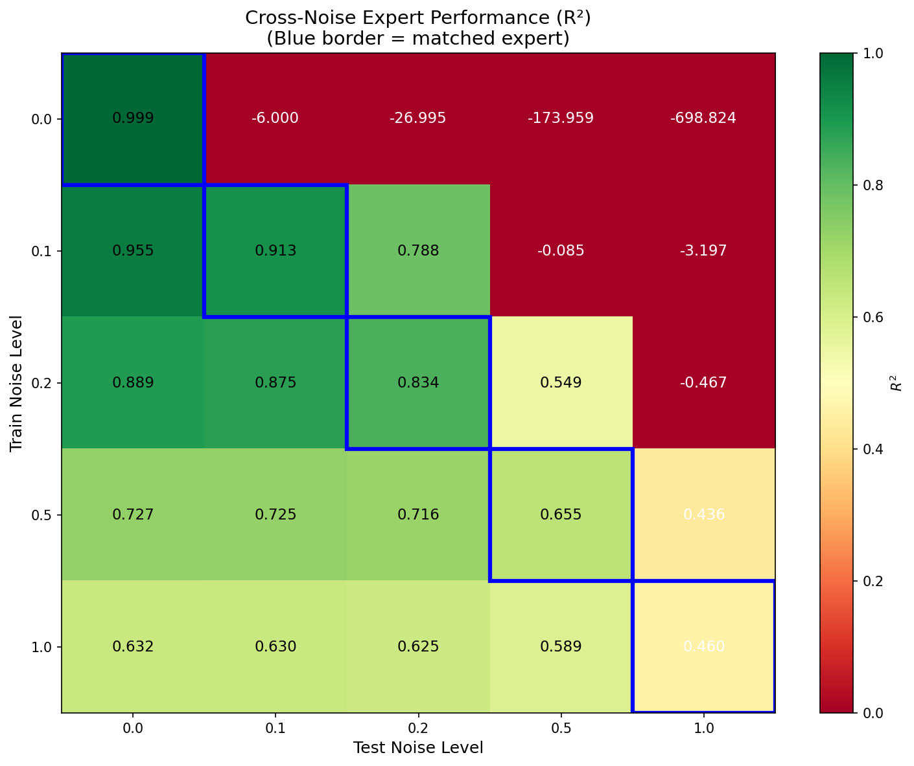
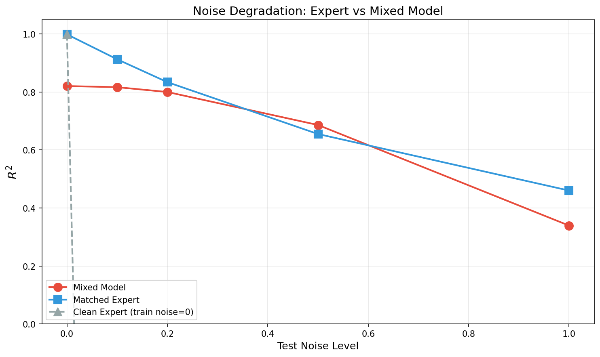

# 📘 Experiment Report: Noise-conditioned Ridge
> **Name:** TODO | **ID:** `VIT-20251203-moe-snr-02`  
> **Topic:** `VIT` | **MVP:** MVP-2.0 | **Project:** `VIT`  
> **Author:** Viska Wei | **Date:** 2025-12-03 | **Status:** ✅ Completed
```
💡 实验目的  
决定：影响的决策
```

---

---

## 🔗 Upstream Links

| 类型 | 链接 | 说明 |
|------|------|------|
| 🧠 Hub | `logg/moe/moe_hub_20251203.md` | 假设金字塔 |
| 🗺️ Roadmap | `logg/moe/moe_roadmap_20251203.md` | MVP 详细设计 |
| 📋 Kanban | `status/kanban.md` | 实验队列 |
| 📊 前置实验 | `logg/moe/exp_moe_piecewise_ridge_20251203.md` | MVP-1.0 |

---

# 📑 Table of Contents

- [⚡ Key Findings](#-核心结论速览供-main-提取)
- [1. 🎯 Objective](#1--目标)
- [2. 🧪 Experiment Design](#2--实验设计)
- [3. 📊 Figures & Results](#3--实验图表)
- [4. 💡 Insights](#4--关键洞见)
- [5. 📝 Conclusions](#5--结论)
- [6. 📎 Appendix](#6--附录)

---

## ⚡ 核心结论速览（供 main 提取）

### 一句话总结

> **Noise-conditioned MoE 有显著价值（平均 ΔR²=+0.08），但需要注意：noise=0 专家在有噪声数据上完全失效（负 R²），说明 noise-matched 训练是必要的。**

### 对假设的验证

| 验证问题 | 结果 | 结论 |
|---------|------|------|
| H1.3: 按 noise level 分专家可提升性能? | ✅ 平均 ΔR²=+0.0797 | **有价值** |
| Expert vs Mixed 哪个更好? | Expert 在 4/5 noise levels 更好 | Expert 优于 Mixed |
| 低噪声专家能否泛化到高噪声? | ❌ noise=0 专家在高噪声下 R² < 0 | **不能泛化，必须 matched** |

### 设计启示

| 启示 | 具体建议 |
|------|---------|
| Noise-matched 训练必要 | 部署时应知道测试数据的 SNR，选择对应专家 |
| 高噪声专家可泛化 | 如果不知道 SNR，用高噪声专家比 noise=0 专家安全 |

### 关键数字

| 指标 | 值 |
|------|-----|
| Expert (matched) 平均 R² | 0.7723 |
| Mixed Model 平均 R² | 0.6926 |
| **平均 ΔR²** | **+0.0797** |
| noise=0 时的 ΔR² | +0.1784 (最大提升) |
| noise=0.5 时的 ΔR² | -0.0312 (唯一 Expert 劣势) |

---

# 1. 🎯 目标

## 1.1 实验目的

**核心问题**：如果知道测试样本的 noise level，用 noise-matched 专家模型是否比单一混合模型更好？

**实验思路**：
1. **Expert Models**: 为每个 noise level 单独训练 Ridge
2. **Mixed Model**: 在所有 noise levels 混合数据上训练单一 Ridge
3. **对比**: 在相同 test noise 下，Expert vs Mixed

**对应假设**：H1.3 - 按 SNR/noise level 分专家可提升混合噪声场景的性能

## 1.2 预期结果

| 场景 | 预期 | 判断标准 |
|------|------|---------|
| Expert > Mixed | Expert 在 matched noise 下更优 | ΔR² > 0 |
| MoE 有价值 | 平均 ΔR² ≥ 0.03 | 继续 NN-MoE |
| 跨 noise 泛化 | Expert 在 mismatched noise 下是否还能 work | Cross-noise heatmap |

---

# 2. 🧪 实验设计

## 2.1 数据

| 配置项 | 值 |
|--------|-----|
| 训练样本数 | 32,000 |
| 测试样本数 | 1,000 |
| 特征维度 | 4,096 |
| Noise levels | 0.0, 0.1, 0.2, 0.5, 1.0 |

## 2.2 模型配置

### Expert Models (5 个)
- 每个 noise level 单独训练一个 Ridge
- Alpha 扫描: {0.001, 0.01, 0.1, 1.0, 10.0, 100.0}

### Mixed Model (1 个)
- 在所有 5 个 noise levels 的数据上混合训练
- 训练数据量: 32,000 × 5 = 160,000
- Alpha 同样扫描

## 2.3 评价方式

1. **Matched comparison**: Expert 在 train_noise == test_noise 时 vs Mixed
2. **Cross-noise evaluation**: Expert 在 train_noise ≠ test_noise 时的表现
3. **核心指标**: ΔR² = Expert R² - Mixed R²

---

# 3. 📊 实验图表

### 图 1：Expert vs Mixed Model R² 对比



**Figure 1. Noise-matched Expert vs Mixed Model 性能对比**

**关键观察**：
- noise=0.0: Expert 大幅领先 (+0.18)
- noise=0.1, 0.2: Expert 领先 (+0.03~0.10)
- noise=0.5: Mixed 略好 (-0.03) ← **唯一 Expert 劣势点**
- noise=1.0: Expert 领先 (+0.12)

---

### 图 2：Cross-Noise Expert 性能热图



**Figure 2. 专家在不同 train/test noise 组合下的 R²**

**关键观察**：
- **对角线 (matched) 表现最好**：这是预期的
- **noise=0 专家在高噪声下完全失效**：R² 为负数！
- **高噪声专家可以泛化到低噪声**：比反过来好得多

---

### 图 3：Noise 退化曲线



**Figure 3. 不同模型类型的 noise 退化曲线**

**关键观察**：
- Matched Expert 始终表现最好（蓝线）
- Clean Expert (noise=0 训练) 退化最快（灰线）
- Mixed Model 介于两者之间（红线）

---

# 4. 💡 关键洞见

## 4.1 宏观层洞见

### Noise-conditioned MoE 整体有效
| Test Noise | Expert R² | Mixed R² | ΔR² | Verdict |
|------------|-----------|----------|-----|---------|
| 0.0 | 0.9991 | 0.8207 | **+0.1784** | ✅ 大幅领先 |
| 0.1 | 0.9130 | 0.8168 | +0.0962 | ✅ |
| 0.2 | 0.8341 | 0.8001 | +0.0340 | ✅ |
| 0.5 | 0.6552 | 0.6863 | -0.0312 | ❌ 唯一劣势 |
| 1.0 | 0.4601 | 0.3393 | **+0.1208** | ✅ 高噪声下优势明显 |
| **平均** | **0.7723** | **0.6926** | **+0.0797** | **✅ MoE 有价值** |

### 为什么 noise=0.5 时 Expert 劣势？

可能原因：
1. noise=0.5 是"中间地带"，Mixed 模型在这个区间有更好的泛化
2. Expert 只在单一 noise 上训练，可能过拟合该 noise 的特性
3. 样本量差异：Mixed 有 5× 数据，Expert 只有 1×

## 4.2 模型层洞见

### Cross-noise 泛化分析

| 训练 Noise | → 测试 Noise | 泛化方向 | 结果 |
|------------|-------------|---------|------|
| 0.0 | → 1.0 | 低 → 高 | **R² = -699** (灾难性失败) |
| 1.0 | → 0.0 | 高 → 低 | R² = 0.632 (可用) |

**物理解释**：
- **noise=0 专家** 学到的是"纯净信号"的模式，看到噪声就完全懵了
- **高噪声专家** 学到的是"噪声-robust"的特征，在低噪声下也能 work

### 最优 Alpha 与 Noise 的关系

| Noise | Expert 最优 α | Mixed 最优 α |
|-------|--------------|--------------|
| 0.0 | 0.001 | 0.001 |
| 0.1 | 1.0 | 0.001 |
| 0.2 | 10.0 | 0.001 |
| 0.5 | 100.0 | 100.0 |
| 1.0 | 100.0 | 100.0 |

**观察**：Expert 随着 noise 增加需要更强的正则化，Mixed 模型因为数据多样性，低 noise 时也倾向于弱正则化。

## 4.3 实验层细节洞见

### Expert 优势最大的场景
1. **无噪声测试** (noise=0.0): ΔR² = +0.18
2. **高噪声测试** (noise=1.0): ΔR² = +0.12

### Expert 优势最小（甚至劣势）的场景
1. **中等噪声** (noise=0.5): ΔR² = -0.03

---

# 5. 📝 结论

## 5.1 核心发现

**Noise-conditioned MoE 有显著价值**，但需要注意：
1. **必须 noise-matched**：用错 expert 可能导致灾难性后果（R² < 0）
2. **如果不知道 SNR**：用高噪声专家比低噪声专家安全
3. **中等噪声区间**：Mixed 模型可能更稳定

## 5.2 关键结论

| # | 结论 | 证据 |
|---|------|------|
| 1 | **Noise-conditioned MoE 有价值** | 平均 ΔR² = +0.0797 ≥ 0.03 |
| 2 | **低噪声专家无法泛化到高噪声** | noise=0 专家在 noise=1 数据上 R² = -699 |
| 3 | **高噪声专家可泛化到低噪声** | noise=1 专家在 noise=0 数据上 R² = 0.63 |
| 4 | **部署时需要 SNR 估计** | 选择正确的 expert 是关键 |

## 5.3 设计启示

| 原则 | 建议 | 原因 |
|------|------|------|
| Gating 信号 | 使用 SNR 或 noise estimate 作为 gating | 不同 noise 需要不同专家 |
| 默认专家 | 如果 SNR 未知，默认用中高噪声专家 | 高噪声专家更 robust |
| 与 MoE-1 结合 | 可考虑 $(T_{\text{eff}}, [\text{M/H}], \text{SNR})$ 三维 gating | 同时利用参数空间和噪声信息 |

## 5.4 与 MoE-1 的对比

| 实验 | ΔR² | MoE 类型 | 判断 |
|------|-----|---------|------|
| MoE-1 (Piecewise Ridge) | +0.0781 | 按 $(T_{\text{eff}}, [\text{M/H}])$ 分专家 | ✅ 有价值 |
| MoE-2 (Noise-conditioned) | +0.0797 | 按 noise level 分专家 | ✅ 有价值 |

**两者都有价值，可以考虑组合使用！**

## 5.5 关键数字速查

| 指标 | 值 | 条件 |
|------|-----|------|
| Expert (matched) 平均 R² | 0.7723 | 5 noise levels |
| Mixed Model 平均 R² | 0.6926 | 5 noise levels |
| **平均 ΔR²** | **+0.0797** | ✅ MoE 有价值 |
| 最大 ΔR² | +0.1784 | noise=0.0 |
| 最小 ΔR² | -0.0312 | noise=0.5 |

## 5.6 下一步工作

| 方向 | 任务 | 优先级 |
|------|------|--------|
| ✅ 两个 MoE 都有价值 | 准备 NN-MoE | 🔴 高 |
| 组合 MoE-1 + MoE-2 | 三维 gating: $(T_{\text{eff}}, [\text{M/H}], \text{SNR})$ | 🟡 中 |
| SNR 估计 | 研究如何从光谱估计 SNR (用于 gating) | 🟡 中 |

---

# 6. 📎 附录

## 6.1 数值结果表

### Expert vs Mixed 详细对比

| Test Noise | Expert R² | Expert α | Mixed R² | Mixed α | ΔR² |
|------------|-----------|----------|----------|---------|-----|
| 0.0 | 0.9991 | 0.001 | 0.8207 | 0.001 | +0.1784 |
| 0.1 | 0.9130 | 1.0 | 0.8168 | 0.001 | +0.0962 |
| 0.2 | 0.8341 | 10.0 | 0.8001 | 0.001 | +0.0340 |
| 0.5 | 0.6552 | 100.0 | 0.6863 | 100.0 | -0.0312 |
| 1.0 | 0.4601 | 100.0 | 0.3393 | 100.0 | +0.1208 |

### Cross-Noise Expert R² Matrix

| Train \ Test | 0.0 | 0.1 | 0.2 | 0.5 | 1.0 |
|--------------|-----|-----|-----|-----|-----|
| **0.0** | **0.999** | -6.0 | -27.0 | -174.0 | -699.0 |
| **0.1** | 0.955 | **0.913** | 0.788 | -0.085 | -3.20 |
| **0.2** | 0.889 | 0.875 | **0.834** | 0.549 | -0.47 |
| **0.5** | 0.727 | 0.725 | 0.716 | **0.655** | 0.436 |
| **1.0** | 0.632 | 0.630 | 0.625 | 0.589 | **0.460** |

**注**：对角线（粗体）为 matched expert，负数表示完全失效。

---

## 6.2 实验日志

| 时间 | 事件 |
|------|------|
| 2025-12-03 16:28 | 创建实验脚本 |
| 2025-12-03 16:32 | 实验完成 |

## 6.3 相关文件

| 类型 | 路径 |
|------|------|
| 实验脚本 | `~/VIT/scripts/moe_noise_conditioned_ridge.py` |
| 结果 CSV | `~/VIT/results/moe/noise_conditioned/results.csv` |
| 图表 | `~/VIT/results/moe/noise_conditioned/figures/` |
| 知识中心图表 | `~/Physics_Informed_AI/logg/moe/img/` |

---

## 🔗 Cross-Repo Metadata

| Field | Value |
|-------|-------|
| **experiment_id** | `VIT-20251203-moe-snr-02` |
| **project** | `VIT` |
| **topic** | `moe` |
| **source_repo_path** | `~/VIT/` |
| **config_path** | `scripts/moe_noise_conditioned_ridge.py` |
| **output_path** | `results/moe/noise_conditioned/` |

---

> **结论确认**：
> 
> ✅ **Noise-conditioned MoE 有价值**（平均 ΔR² = +0.0797 ≥ 0.03）
> 
> **关键警告**：noise=0 专家不能用于有噪声数据！必须 noise-matched。
> 
> **下一步**：MoE-1 和 MoE-2 都成功，可以准备 NN-MoE（MVP-3.0）

