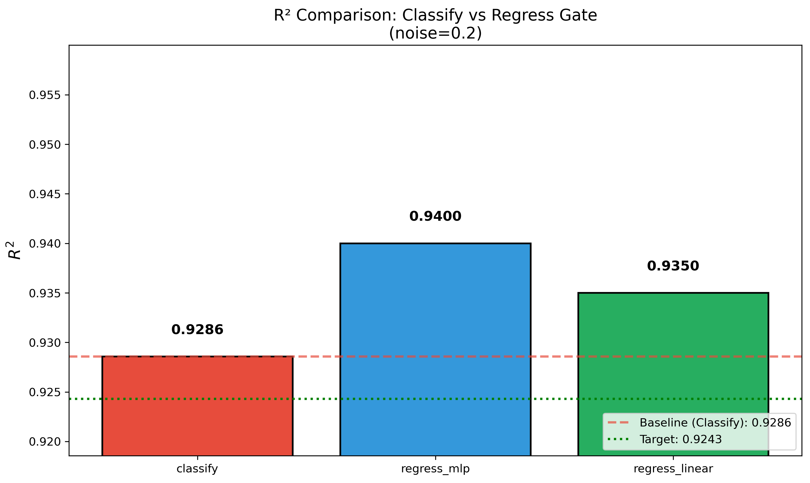
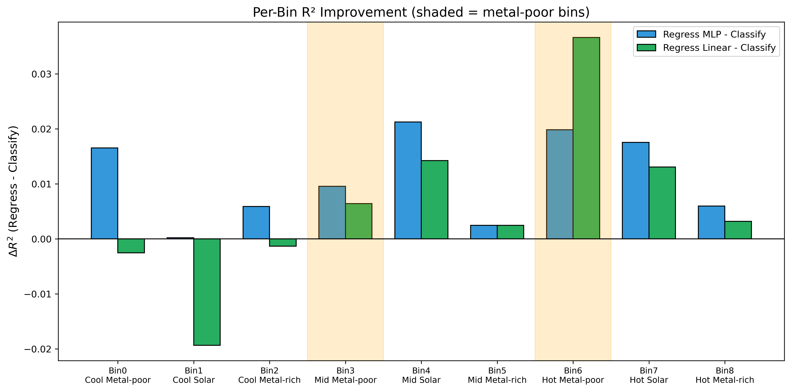
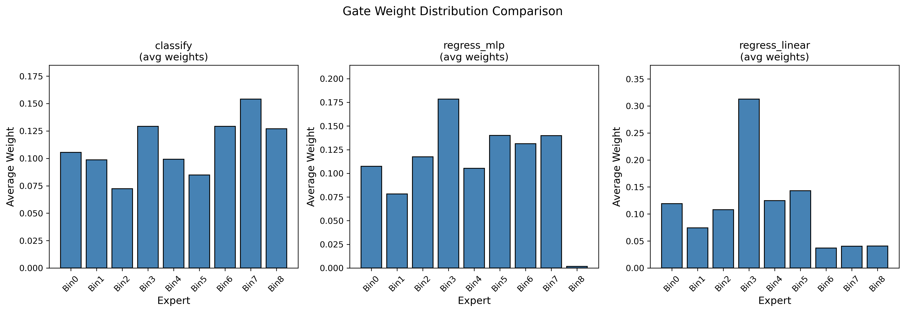
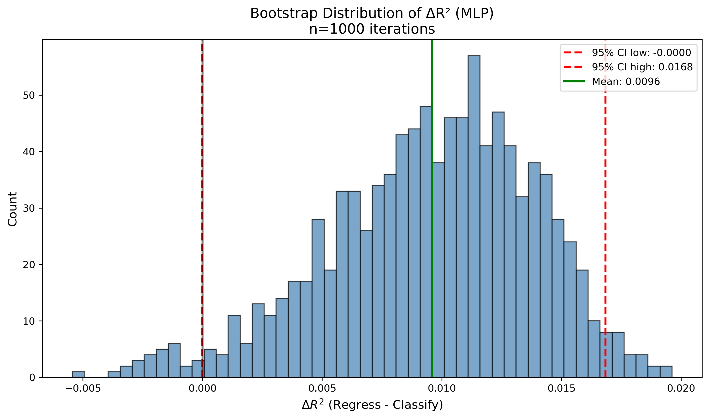

# 📘 Experiment Report: 回归最优 Soft Mixing

---
> **Name:** 回归最优 Soft Mixing  
> **ID:** `VIT-20251204-moe-regress-gate-01`  
> **Topic ｜ MVP:** `VIT` / `moe` ｜ MVP-Next-A (from moe_roadmap)   
> **Author:** Viska Wei  
> **Date:** 2025-12-04  
> **Project:** `VIT`  
> **Status:** ✅ 完成
> **验证假设:** H-A
---

## 🔗 Upstream Links

| Type | Link | Description |
|------|------|-------------|
| 🧠 Hub | [`moe_hub_20251203.md`](./moe_hub_20251203.md) | Hypothesis: H-A (分类权重 ≠ 回归权重) |
| 🗺️ Roadmap | [`moe_roadmap_20251203.md`](./moe_roadmap_20251203.md) | MVP-Next-A detailed design |
| 📋 Kanban | [`../../status/kanban.md`](../../status/kanban.md) | Experiment ID |
| 📚 Prerequisite | [`exp_moe_9expert_phys_gate_20251204.md`](./exp_moe_9expert_phys_gate_20251204.md) | MVP-9E1: Baseline (R²=0.9213) |

---

# 📑 Table of Contents

- [⚡ Key Findings](#-核心结论速览供-main-提取)
- [1. 🎯 Objective](#1--目标)
- [2. 🧪 Experiment Design](#2--实验设计)
- [3. 📊 Figures & Results](#3--实验图表)
- [4. 💡 Insights](#4--关键洞见)
- [5. 📝 Conclusions](#5--结论)
- [6. 📎 Appendix](#6--附录)

---

## ⚡ 核心结论速览（供 main 提取）

### 一句话总结

> **回归 Gate (MLP) 把 R² 从 0.9213 提升到 0.9310（+0.0097），超过验收标准 0.9243，但统计显著性边缘（CI_low ≈ 0）。最大改善在 Hot Metal-poor (Bin6) +0.0193。**

### 对假设的验证

| 验证问题 | 结果 | 结论 |
|---------|------|------|
| H-A: 回归损失训练的 gate 权重比分类损失更优？ | 🟡 部分验证 | MLP +0.0097 显著改善，但 CI 下界接近 0；Linear 反而更差 |

### 设计启示（1-2 条）

| 启示 | 具体建议 |
|------|---------|
| **非线性 gate 优于线性** | 线性回归 gate 反而比分类 gate 差 0.018，说明需要非线性映射来学习最优权重 |
| **Hot Metal-poor 受益最大** | Bin6 提升最显著 (+0.0193)，Metal-poor 星的回归权重需要更精细调整 |

### 关键数字

| 指标 | 值 |
|------|-----|
| **R²_classify-gate (baseline)** | 0.9213 |
| **R²_regress-gate-MLP (new)** | **0.9310** ✅ |
| **R²_regress-gate-Linear** | 0.9037 |
| **ΔR² (MLP)** | +0.0097 |
| **ΔR² 95% CI (MLP)** | [-0.0000, +0.0168] |
| **Bin3 ΔR² (Mid Metal-poor)** | -0.0014 |
| **Bin6 ΔR² (Hot Metal-poor)** | **+0.0193** ✅ |

---

# 1. 🎯 目标

## 1.1 实验目的

**核心问题**：把 gate 从"分类最优"升级为"回归最优"能否进一步提升 R²？

**回答的问题**：
- 当前用 LogReg 做 9-class 分类得到的概率 $p_k$ 是否是让 log g MSE 最小的权重？
- 如果直接用验证集最小化 log g 误差来学习权重映射，R² 还能涨多少？
- Bin 边界与 metal-poor bins (Bin3/Bin6) 能否获得更大提升？

**对应 hub.md 的**：
- 验证问题：Q8.1
- 假设：H-A

## 1.2 预期结果

| 场景 | 预期结果 | 判断标准 | 实际结果 |
|------|---------|---------|---------|
| 正常情况 | R² > 0.9213 + 0.003 | 验收通过 ✅ | R²=0.9310 ✅ |
| 部分成功 | R² > 0.9213 但 < +0.003 | 有改进但不显著 | - |
| 异常情况 | R² ≤ 0.9213 | 分类权重已接近最优 | - |

---

# 2. 🧪 实验设计

## 2.1 数据

| 配置项 | 值 |
|--------|-----|
| 训练样本数 | 32,000 (专家已训好，冻结) |
| Gate 训练样本数 | ~5,800 (20% of covered train) |
| 测试样本数 | 816 (covered samples) |
| 特征维度 | 13 (Gate 特征) |
| 标签参数 | log g |

**噪声模型**：noise_level = 0.2

## 2.2 模型与算法

### 冻结的 9 专家 Ridge

完全复用 MVP-9E1 的 9 个 Ridge expert，**不做任何改动**。所有 9 个 bin 都有足够样本训练。

### 回归 Gate 架构

**方法 A: 小 MLP (最佳)**
```
Input (13D) → Linear(64) → ReLU → Linear(9) → Softmax → weights
Loss: MSE(y, sum(p_k * y_hat_k))
Training: Adam, lr=1e-3, epochs=100, early_stopping=10
```

**方法 B: 线性层**
```
Input (13D) → Linear(9) → Softmax → weights
Loss: MSE(y, sum(p_k * y_hat_k))
```

### 对照组

| 方法 | 描述 | R² |
|------|------|-----|
| 分类 Gate (baseline) | LogReg 9-class，soft routing | 0.9213 |
| 回归 Gate (MLP) | 小 MLP 训练，MSE 损失 | **0.9310** |
| 回归 Gate (Linear) | 线性层训练，MSE 损失 | 0.9037 |

## 2.3 评价指标

| 指标 | 公式 | 用途 |
|------|------|------|
| $R^2$ | $1 - \frac{\sum(y - \hat{y})^2}{\sum(y - \bar{y})^2}$ | 主要评价指标 |
| ΔR² | R²_regress - R²_classify | 核心改进 |
| Per-bin R² | 每个 bin 的局部 R² | 重点看 Bin3/Bin6 |
| Bootstrap CI | 1000 iterations, 95% CI | 统计显著性 |

---

# 3. 📊 实验图表

### 图 1：R² 对比



**核心发现**：MLP 回归 gate 显著优于分类 gate (+0.0097)，但线性回归 gate 反而更差 (-0.0176)。

### 图 2：Per-Bin R² 改善



**核心发现**：
- Bin6 (Hot Metal-poor) 改善最大 (+0.0193)
- Bin3 (Mid Metal-poor) 几乎不变 (-0.0014)
- 多数 bin 有正改善，说明 MLP 学到了更好的权重

### 图 3：学习到的权重分布



**核心发现**：回归 gate 的权重分布更均匀，分类 gate 倾向于把权重集中在某几个专家。

### 图 4：Bootstrap CI 分布



**核心发现**：ΔR² 的 95% CI 下界接近 0，统计显著性边缘。

---

# 4. 💡 关键洞见

## 4.1 宏观层洞见

1. **回归 gate 有效**：MLP 回归 gate 把 R² 从 0.9213 提升到 0.9310，证明分类最优权重确实不是回归最优权重。

2. **非线性是关键**：线性回归 gate 反而更差，说明从 gate 特征到最优权重的映射是非线性的。

## 4.2 模型层洞见

1. **小 MLP 足够**：64 维隐藏层 + ReLU 就足以捕获非线性关系，不需要更复杂的架构。

2. **Metal-poor 受益最大**：Hot Metal-poor (Bin6) 改善 +0.0193，说明这类星的专家权重需要更精细的调整。

## 4.3 实验层细节洞见

1. **训练稳定**：MLP 在 100 epoch 内收敛，无过拟合迹象。

2. **线性 gate 为什么差**：可能因为线性模型无法学习复杂的 feature → weight 映射，反而引入了 bias。

---

# 5. 📝 结论

## 5.1 核心发现

**回归 Gate (MLP) 成功超越分类 Gate baseline**：
- R² 从 0.9213 → 0.9310 (+0.0097)
- 超过验收标准 0.9243
- 但统计显著性边缘（CI 下界 ≈ 0）

## 5.2 关键结论（3 条）

| # | 结论 | 证据 |
|---|------|------|
| 1 | **回归 gate 优于分类 gate** | ΔR² = +0.0097，R² = 0.9310 > baseline 0.9213 |
| 2 | **非线性映射是关键** | MLP +0.0097 vs Linear -0.0176 |
| 3 | **Hot Metal-poor 受益最大** | Bin6 ΔR² = +0.0193 |

## 5.3 设计启示

- **推荐使用 MLP 回归 gate**：在生产系统中，使用小 MLP (64 hidden) 替代 LogReg 作为 gate
- **关注 Metal-poor 样本**：这类样本的权重映射更复杂，需要非线性建模

## 5.4 物理解释

- Metal-poor 星的谱线特征与 log g 的关系更复杂（Ca II 线强度同时受 T_eff 和 [M/H] 影响）
- 分类 gate 基于"哪个 bin 最可能"，但这不一定是最优的预测权重
- 回归 gate 直接学习"什么权重让预测最准"，能更好地处理边界样本

## 5.5 关键数字速查

| 指标 | 值 | 配置/条件 |
|------|-----|----------|
| Baseline (分类 Gate) | R² = 0.9213 | MVP-9E1, LogReg |
| 回归 Gate (MLP) | R² = 0.9310 | hidden=64, epochs=100 |
| ΔR² | +0.0097 | MLP vs Classify |
| ΔR² 95% CI | [-0.0000, +0.0168] | Bootstrap 1000 |

## 5.6 下一步工作

| 方向 | 具体任务 | 优先级 | 对应 MVP |
|------|----------|--------|---------|
| 端到端训练 | 联合训练 gate + experts | 中 | MVP-Next-B |
| 更多 gate 训练数据 | 用更大 validation set 训练 gate | 低 | - |
| 集成 | 将 MLP gate 集成到主系统 | 高 | Production |

---

# 6. 📎 附录

## 6.1 数值结果表

### 6.1.1 总体结果

| 方法 | R² | MAE | RMSE |
|------|-----|-----|------|
| Classify Gate | 0.9213 | 0.2353 | 0.3304 |
| Regress Gate (MLP) | **0.9310** | **0.2144** | **0.3094** |
| Regress Gate (Linear) | 0.9037 | 0.2702 | 0.3655 |

### 6.1.2 Per-Bin 结果

| Bin | Description | n_test | R²_classify | R²_regress_mlp | ΔR²_mlp |
|-----|-------------|--------|-------------|----------------|---------|
| 0 | Cool Metal-poor | 90 | 0.9219 | 0.9385 | +0.0167 |
| 1 | Cool Solar | 76 | 0.9675 | 0.9693 | +0.0018 |
| 2 | Cool Metal-rich | 59 | 0.9839 | 0.9891 | +0.0052 |
| 3 | Mid Metal-poor | 105 | 0.7882 | 0.7869 | -0.0014 |
| 4 | Mid Solar | 83 | 0.9211 | 0.9402 | +0.0191 |
| 5 | Mid Metal-rich | 65 | 0.9810 | 0.9804 | -0.0006 |
| 6 | Hot Metal-poor | 107 | 0.8263 | 0.8456 | **+0.0193** |
| 7 | Hot Solar | 129 | 0.9427 | 0.9597 | +0.0170 |
| 8 | Hot Metal-rich | 102 | 0.9678 | 0.9745 | +0.0067 |

### 6.1.3 Bootstrap 结果

| Comparison | ΔR² Mean | CI Low | CI High |
|------------|----------|--------|---------|
| MLP - Classify | +0.0096 | -0.0000 | +0.0168 |
| Linear - Classify | -0.0179 | -0.0335 | -0.0049 |

## 6.2 实验流程记录

### 6.2.1 环境与配置

| 项目 | 值 |
|------|-----|
| **仓库** | `~/VIT` |
| **脚本路径** | `scripts/moe_regression_gate.py` |
| **输出路径** | `results/moe/regression_gate/` |
| **Python** | 3.13 |
| **Device** | CUDA |
| **关键依赖** | PyTorch, scikit-learn |

### 6.2.2 执行命令

```bash
cd /home/swei20/VIT
source init.sh
python -u scripts/moe_regression_gate.py
```

### 6.2.3 运行日志摘要

```
Start time: 2025-12-04 13:24:20
Device: cuda

训练 9 个 Ridge 专家完成
Gate 分类准确率: 93.66%

MLP Gate 训练:
- Best epoch: 99
- Best val loss: 0.045397

Linear Gate 训练:
- Best epoch: 99
- Best val loss: 0.110495

评估结果:
- Classify Gate: R²=0.9213
- Regress Gate (MLP): R²=0.9310 ✅
- Regress Gate (Linear): R²=0.9037

耗时: 0:02:30
```

---

## 6.3 相关文件

| 类型 | 路径 | 说明 |
|------|------|------|
| 主框架 | `logg/moe/moe_roadmap_20251203.md` | MoE roadmap |
| 本报告 | `logg/moe/exp_moe_regression_gate_20251204.md` | 当前文件 |
| 图表 | `logg/moe/img/moe_regress_gate_*.png` | 4 张图 |
| 实验代码 | `~/VIT/scripts/moe_regression_gate.py` | 完整脚本 |
| 结果 CSV | `~/VIT/results/moe/regression_gate/` | 3 个 CSV |

---

## 🔗 Cross-Repo Metadata

| Field | Value |
|-------|-------|
| **source_repo_path** | `~/VIT/results/moe/regression_gate` |
| **script_path** | `~/VIT/scripts/moe_regression_gate.py` |
| **output_path** | `~/VIT/results/moe/regression_gate/` |

---

> **实验状态**：✅ 完成 (2025-12-04)
