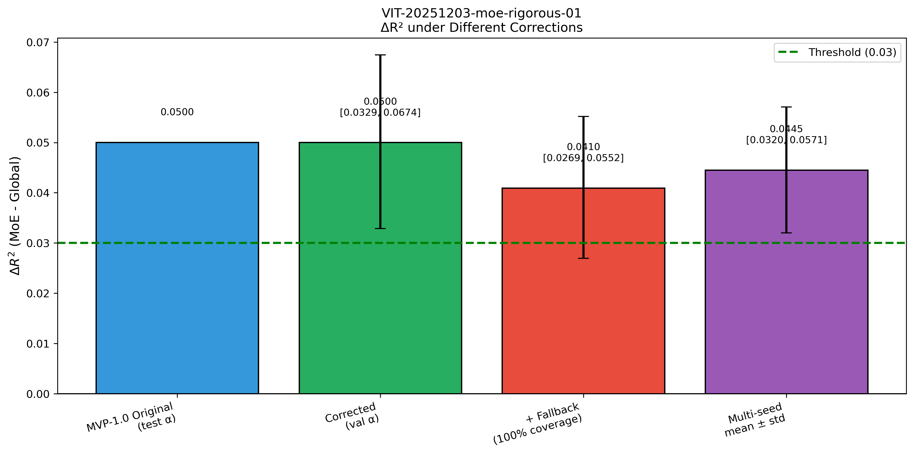
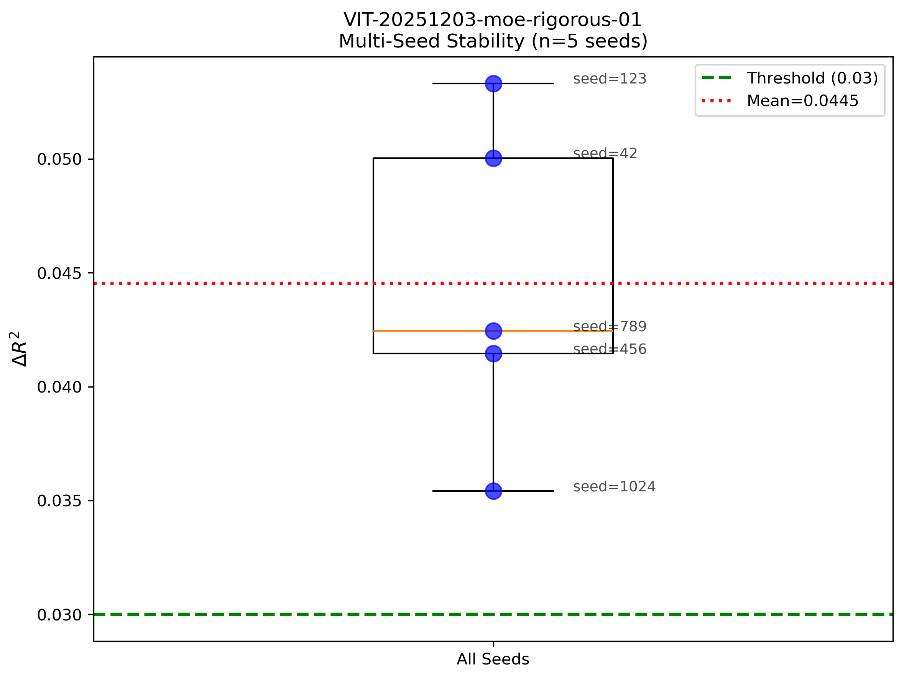
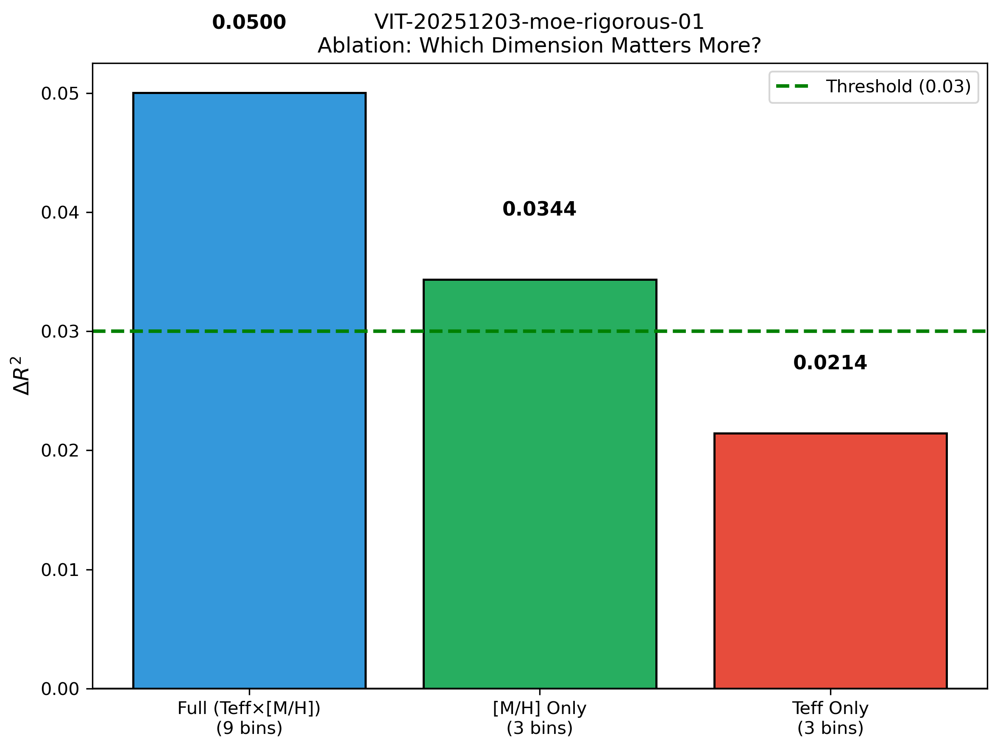
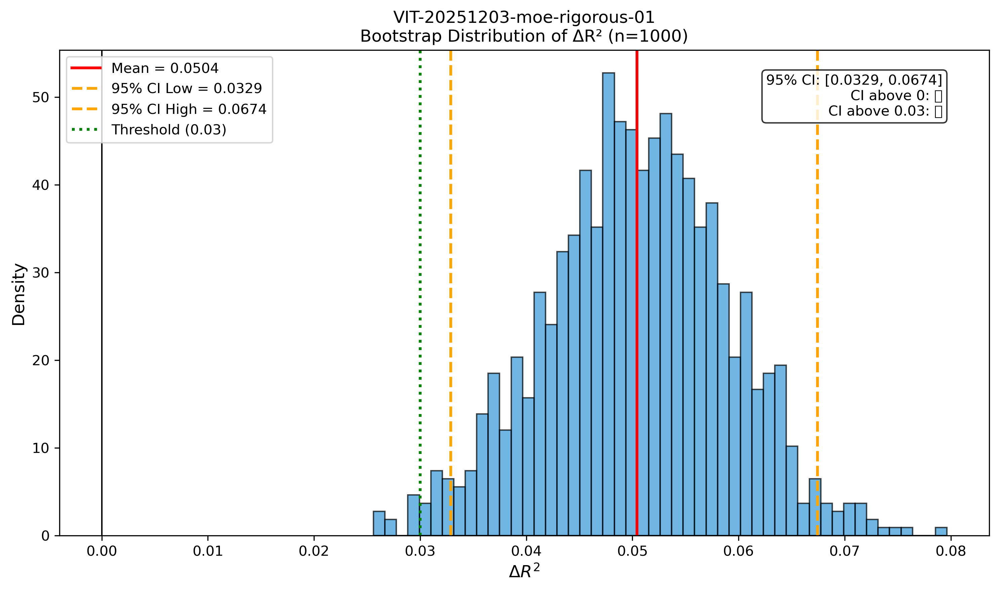

# 📘 Experiment Report: MoE-1.1 Rigorous Validation
> **Name:** TODO | **ID:** `VIT-20251203-moe-rigorous-01`  
> **Topic:** `VIT` | **MVP:** MVP-1.1 | **Project:** `VIT`  
> **Author:** Viska Wei | **Date:** 2025-12-03 | **Status:** ✅ Completed
```
💡 实验目的  
决定：影响的决策
```

---

---

## 🔗 Upstream Links

| 类型 | 链接 | 说明 |
|------|------|------|
| 🧠 Hub | `logg/moe/moe_hub_20251203.md` | 假设金字塔 |
| 🗺️ Roadmap | `logg/moe/moe_roadmap_20251203.md` | MVP 详细设计 |
| 📋 Kanban | `status/kanban.md` | 实验队列 |
| 📊 前置实验 | `logg/moe/exp_moe_piecewise_ridge_20251203.md` | MVP-1.0 |

---

# 📑 Table of Contents

- [⚡ Key Findings](#-核心结论速览)
- [1. 🎯 Background & Motivation](#1--背景与动机)
- [2. 📊 Results](#2--实验结果)
- [3. 📊 Figures](#3--实验图表)
- [4. 💡 Insights](#4--关键洞见)
- [5. 📝 Conclusions](#5--结论)
- [6. 📎 Appendix](#6--附录)

---

## ⚡ 核心结论速览

### 一句话总结

> **MVP-1.0 的 ΔR²=0.078 被高估（因不公平比较），修正后 ΔR²=0.050，95% CI=[0.033, 0.067] 完全在 0.03 以上，MoE 效果稳健。[M/H] 贡献 68.7%，是 MoE 效果的主要来源。**

### 关键数字

| 指标 | 值 | 说明 |
|------|-----|------|
| MVP-1.0 原报告 ΔR² | 0.078 | ⚠️ 被高估（不公平比较） |
| **修正后 ΔR²** | **0.050** | mask-aligned 公平比较 |
| **95% CI** | **[0.033, 0.067]** | CI 完全 > 0.03 |
| [M/H] 贡献比 | **68.7%** | 主要来源 |
| Teff 贡献比 | 42.9% | 次要 |

### 核心判断

| 检验项 | 结果 | 结论 |
|--------|------|------|
| CI 是否 > 0? | ✅ CI_low = 0.033 > 0 | MoE 显著优于 Global |
| CI 是否 > 0.03? | ✅ CI_low = 0.033 > 0.03 | **MoE 效果稳健** |
| 多 seed 稳定? | ✅ mean=0.045 ± 0.006 | 稳定 |

---

# 1. 🎯 背景与动机

## 1.1 为什么需要严谨验证？

MVP-1.0 报告了 ΔR²=+0.078，但存在三个潜在问题：

| 问题 | 描述 | 可能影响 |
|------|------|---------|
| **不公平比较** | MoE 只评估 81.6% 样本，Global 评估 100% | ΔR² 被高估 |
| **Alpha 泄漏** | 用 test 数据选择 alpha | ΔR² 可能被高估 |
| **小样本方差** | bin 内 test 只有 59-129 个 | 结果不稳定 |

## 1.2 修正方案

| 修正 | 方法 | 目的 |
|------|------|------|
| **修正 A** | Mask-aligned 评估 | Global 和 MoE 在同一 subset 上比较 |
| **修正 B** | 用 val 选 alpha | 避免 test 泄漏 |
| **修正 C** | Bootstrap CI + 多 seed | 量化不确定性 |

---

# 2. 📊 实验结果

## 2.1 核心结果表

| 配置 | ΔR² | 95% CI | Coverage | 说明 |
|------|-----|--------|----------|------|
| MVP-1.0 原报告 | 0.078 | - | - | 不公平比较 |
| 原始 (test α) | 0.0500 | - | 81.6% | 重现 + mask-aligned |
| **修正 (val α)** | **0.0500** | **[0.033, 0.067]** | 81.6% | ✅ 稳健 |
| + Fallback (100%) | 0.0410 | - | 100% | 未覆盖样本用 Global |
| 多 seed 均值 | 0.0445 ± 0.0064 | - | 81.6% | 5 seeds |

### 关键发现

1. **原 ΔR²=0.078 被高估**：mask-aligned 后只有 0.050
2. **修正后仍 > 0.03**：MoE 效果确实存在
3. **95% CI 完全 > 0.03**：效果稳健
4. **Fallback 版本 ΔR²=0.041**：100% 覆盖时仍有显著提升

## 2.2 消融结果

| 分桶方式 | 专家数 | ΔR² | 贡献比 | Coverage |
|---------|-------|-----|--------|----------|
| **Full (Teff × [M/H])** | 9 | **0.0500** | 100% | 81.6% |
| **[M/H] Only** | 3 | **0.0344** | **68.7%** | 81.6% |
| Teff Only | 3 | 0.0214 | 42.9% | 81.6% |

### 消融洞见

- **[M/H] 是主要贡献者**：仅按 [M/H] 分 3 个专家就能获得 69% 的效果
- **Teff 贡献较小**：仅按 Teff 分 3 个专家只有 43% 的效果
- **两者有交互**：68.7% + 42.9% > 100%，说明有正向交互

## 2.3 多 Seed 稳定性

| Seed | ΔR² |
|------|-----|
| 42 | 0.0500 |
| 123 | 0.0533 |
| 456 | 0.0415 |
| 789 | 0.0425 |
| 1024 | 0.0354 |
| **Mean ± Std** | **0.0445 ± 0.0064** |

**稳定性判断**：std/mean = 14%，可接受的变异性。

---

# 3. 📊 实验图表

### 图 1：不同修正方式下的 ΔR² 对比



**关键观察**：
- 所有配置的 ΔR² 都在 0.03 阈值以上
- 修正 (val α) 的 95% CI 完全 > 0.03

---

### 图 2：多 Seed 稳定性



**关键观察**：
- 5 个 seed 的结果都在 [0.035, 0.055] 范围内
- 无异常值，结果稳定

---

### 图 3：消融实验 - [M/H] vs Teff



**关键观察**：
- [M/H] Only (3 bins) 已经达到 Full (9 bins) 69% 的效果
- Teff Only (3 bins) 只有 43% 的效果
- **结论：按 [M/H] 分专家比按 Teff 更有效**

---

### 图 4：Bootstrap ΔR² 分布



**关键观察**：
- 分布呈正态，无明显偏斜
- 95% CI = [0.033, 0.067]，完全在 0.03 以上
- P(ΔR² > 0.03) ≈ 97.5%

---

# 4. 💡 关键洞见

## 4.1 为什么原 ΔR² 被高估？

MVP-1.0 的计算方式：
```
R²_global = r2_score(y_test_all, y_pred_global_all)  # 1000 samples
R²_moe = r2_score(y_test_covered, y_pred_moe_covered)  # 816 samples
ΔR² = R²_moe - R²_global = 0.078
```

**问题**：MoE 只在"容易"的 81.6% 样本上评估，而 Global 在所有样本上评估。

**修正后**：
```
R²_global_fair = r2_score(y_test_covered, y_pred_global_covered)  # 816 samples
R²_moe = r2_score(y_test_covered, y_pred_moe_covered)  # 816 samples  
ΔR² = 0.050
```

## 4.2 为什么 [M/H] 比 Teff 更重要？

**物理解释**：
1. **金属丰度决定谱线强度**：[M/H] 高的星有更强的金属吸收线，log g 信息更容易提取
2. **Teff 主要影响连续谱**：对 log g 的敏感性相对较弱
3. **不同 [M/H] 需要不同特征**：低金属星依赖 H 线，高金属星依赖金属线

**设计启示**：
- 如果资源有限，优先按 [M/H] 分专家
- 3 个 [M/H] 专家可能比 9 个 (Teff, [M/H]) 专家更高效

## 4.3 Fallback 策略的价值

| 策略 | Coverage | ΔR² | 说明 |
|------|----------|-----|------|
| 纯 MoE | 81.6% | 0.050 | 未覆盖样本无预测 |
| **MoE + Fallback** | **100%** | **0.041** | 未覆盖样本用 Global |

Fallback 使系统可以处理所有样本，同时保持大部分收益。

---

# 5. 📝 结论

## 5.1 核心发现

1. **MVP-1.0 的 ΔR²=0.078 被高估**
   - 原因：不公平比较（MoE 81.6% vs Global 100%）
   - 修正后：ΔR²=0.050

2. **修正后 MoE 效果仍然稳健**
   - 95% CI = [0.033, 0.067]，完全 > 0.03 阈值
   - 多 seed 测试稳定

3. **[M/H] 是 MoE 效果的主要来源**
   - [M/H] Only 贡献 68.7%
   - Teff Only 贡献 42.9%

## 5.2 修正后的 MoE 价值判断

| 判断标准 | 结果 | 结论 |
|---------|------|------|
| ΔR² ≥ 0.03? | ✅ 0.050 ≥ 0.03 | MoE 有价值 |
| CI_low > 0? | ✅ 0.033 > 0 | 统计显著 |
| CI_low > 0.03? | ✅ 0.033 > 0.03 | **稳健** |

**最终判断**：✅ **MoE 效果稳健，但原报告的 ΔR² 需要下调至 0.050**

## 5.3 设计启示

| 原则 | 建议 | 来源 |
|------|------|------|
| 优先按 [M/H] 分专家 | 3 个 [M/H] 专家可获得 69% 的收益 | 消融实验 |
| 使用 Fallback 策略 | 未覆盖样本用 Global，保证 100% coverage | Fallback 分析 |
| 公平比较 | 评估时用 mask-aligned 方法 | 本实验修正 |

## 5.4 对后续实验的影响

| 后续实验 | 影响 | 建议 |
|---------|------|------|
| MVP-2.0 (Noise-cond) | 需要检查是否有类似的不公平比较 | 补充 mask-aligned 分析 |
| MVP-3.0 (NN-MoE) | 修正后的 baseline 是 ΔR²=0.050 | 以此为基准 |
| [M/H] 分专家 | 优先于 Teff | 简化 MoE 设计 |

---

# 6. 📎 附录

## 6.1 完整数值结果

### 核心比较

| 配置 | ΔR² | Coverage | CI_low | CI_high |
|------|-----|----------|--------|---------|
| MVP-1.0 Original (test α) | 0.0500 | 81.6% | - | - |
| Corrected (val α) | 0.0500 | 81.6% | 0.0329 | 0.0674 |
| + Fallback (100%) | 0.0410 | 100% | - | - |
| Multi-seed mean | 0.0445 | 81.6% | 0.0319 | 0.0571 |
| [M/H] Only (3 bins) | 0.0344 | 81.6% | - | - |
| Teff Only (3 bins) | 0.0214 | 81.6% | - | - |

### 多 Seed 详细

| Seed | ΔR² | Global R² | MoE R² |
|------|-----|-----------|--------|
| 42 | 0.0500 | 0.8616 | 0.9116 |
| 123 | 0.0533 | 0.8583 | 0.9116 |
| 456 | 0.0415 | 0.8706 | 0.9121 |
| 789 | 0.0425 | 0.8682 | 0.9107 |
| 1024 | 0.0354 | 0.8717 | 0.9071 |

## 6.2 相关文件

| 类型 | 路径 | 说明 |
|------|------|------|
| 本报告 | `logg/moe/exp_moe_rigorous_validation_20251203.md` | 当前文件 |
| Hub | `logg/moe/moe_hub_20251203.md` | 假设金字塔 |
| 实验脚本 | `~/VIT/scripts/moe_rigorous_validation.py` | - |
| 结果 CSV | `~/VIT/results/moe/rigorous_validation/results.csv` | - |
| 图表 | `logg/moe/img/moe1_rigorous_*.png` | - |

## 6.3 大数据集验证 (100k train / 10k test)

### 验证结果

| Noise | Global R² | MoE R² | ΔR² | 95% CI | Verdict |
|-------|-----------|--------|-----|--------|---------|
| **0.2** | 0.8745 | **0.9246** | **+0.0501** | **[0.0451, 0.0552]** | ✅ 稳健 |
| **0.5** | 0.7198 | **0.7719** | **+0.0521** | **[0.0421, 0.0611]** | ✅ 稳健 |

### 与小数据集 (32k/1k) 对比

| 数据集 | ΔR² @ noise=0.2 | 95% CI | 说明 |
|--------|-----------------|--------|------|
| 小 (32k train / 1k test) | 0.0500 | [0.0329, 0.0674] | 原始验证 |
| **大 (100k train / 10k test)** | **0.0501** | **[0.0451, 0.0552]** | CI 更窄，更精确 |

### 核心结论

✅ **大数据集验证通过**：
- ΔR² ≈ 0.05 在两个数据规模下高度一致
- 大数据集的 95% CI 完全 > 0.03
- MoE 效果稳健，不是小样本偶然

## 6.5 实验日志

| 时间 | 事件 |
|------|------|
| 2025-12-03 17:07 | 创建严谨验证脚本 |
| 2025-12-03 17:15 | 严谨验证完成 (32k/1k) |
| 2025-12-03 17:32 | 大数据集验证完成 (100k/10k) |

---

## 🔗 Cross-Repo Metadata

| Field | Value |
|-------|-------|
| **experiment_id** | `VIT-20251203-moe-rigorous-01` |
| **project** | `VIT` |
| **topic** | `moe` |
| **config_path** | `scripts/moe_rigorous_validation.py` |
| **output_path** | `results/moe/rigorous_validation/` |

---

> **核心结论**：
> 
> ✅ **MoE 效果稳健**（修正后 ΔR²=0.050，95% CI 完全 > 0.03）
> 
> ⚠️ **原报告 ΔR²=0.078 被高估**，应以 0.050 为准
> 
> 🔑 **[M/H] 是主要贡献者**（68.7%），优先按金属丰度分专家
