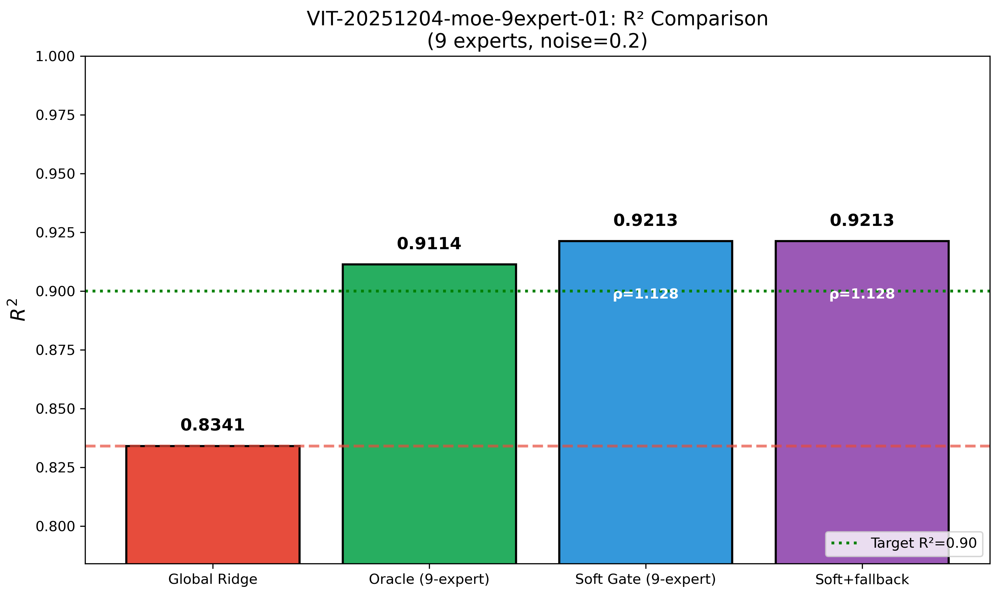
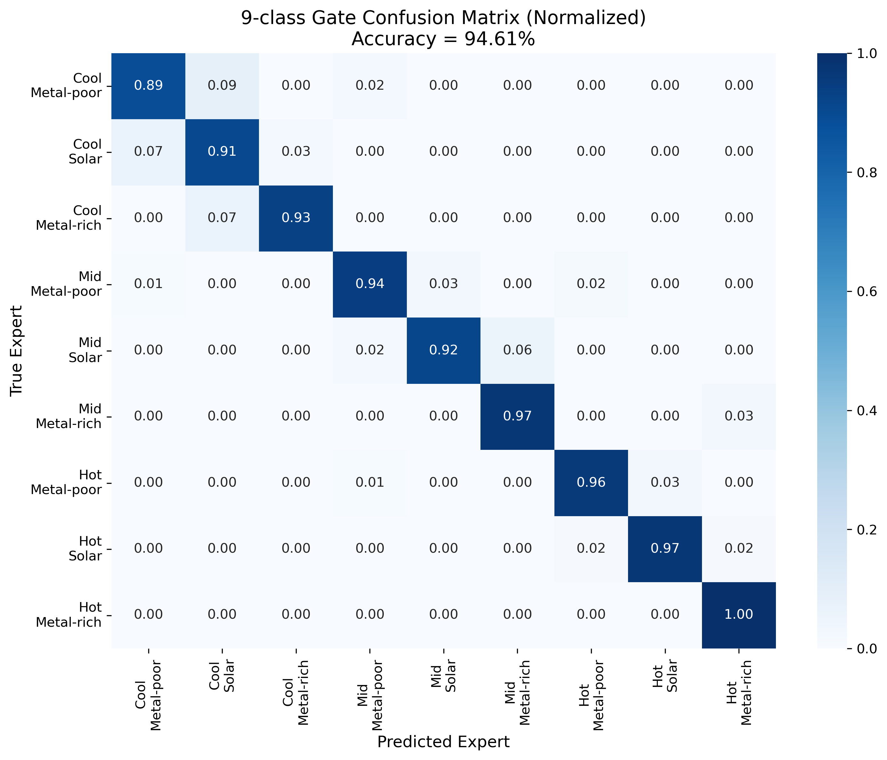
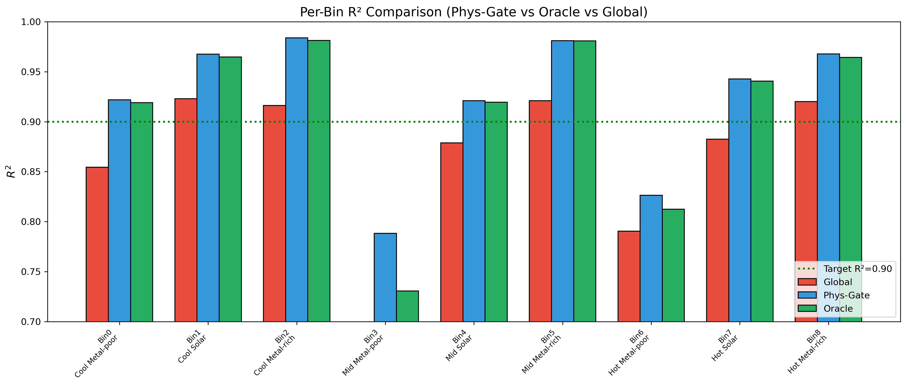
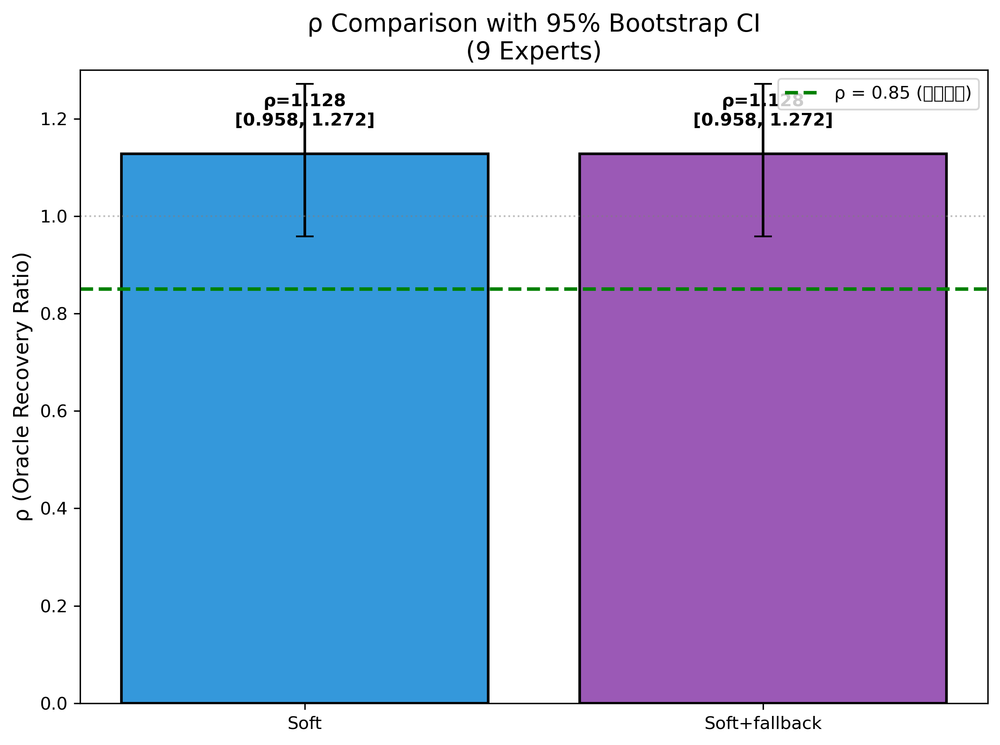
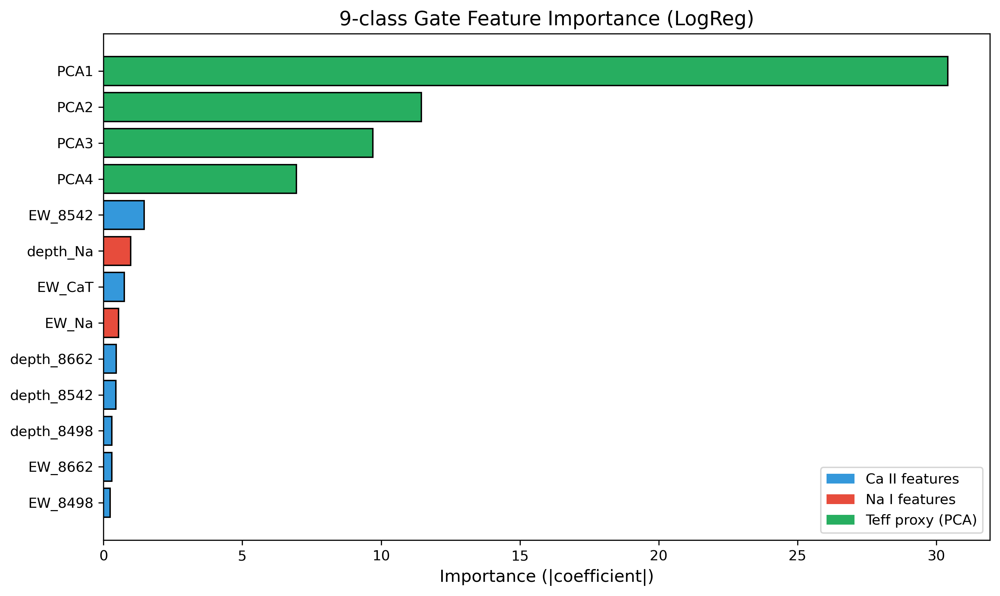

# 📘 Experiment Report: 物理窗 Gate → 9 专家扩展

---
> **Name:** 物理窗 Gate → 9 专家扩展  
> **ID:**  `VIT-20251204-moe-9expert-01`  
> **Topic ｜ MVP:** `VIT` / `moe` ｜ MVP-9E1 (from moe_roadmap)   
> **Author:** Viska Wei  
> **Date:** 2025-12-04  
> **Project:** `VIT`  
> **Status:** ✅ Completed
---

## 🔗 Upstream Links

| Type | Link | Description |
|------|------|-------------|
| 🧠 Hub | [`moe_hub_20251203.md`](./moe_hub_20251203.md) | Hypothesis pyramid: H-9E1, H-9E2, H-9E3 |
| 🗺️ Roadmap | [`moe_roadmap_20251203.md`](./moe_roadmap_20251203.md) | MVP-9E1 detailed design |
| 📋 Kanban | [`../../status/kanban.md`](../../status/kanban.md) | Experiment ID: `VIT-20251204-moe-9expert-01` |
| 📚 Prerequisite | [`exp_moe_phys_gate_baseline_20251204.md`](./exp_moe_phys_gate_baseline_20251204.md) | MVP-PG1: Physical window Gate Baseline (3 experts) |

---

# 📑 Table of Contents

- [⚡ Key Findings](#-核心结论速览供-main-提取)
- [1. 🎯 Objective](#1--目标)
- [2. 🧪 Experiment Design](#2--实验设计)
- [3. 📊 Figures & Results](#3--实验图表)
- [4. 💡 Insights](#4--关键洞见)
- [5. 📝 Conclusions](#5--结论)
- [6. 📎 Appendix](#6--附录)

---

## ⚡ 核心结论速览（供 main 提取）

### 一句话总结

> **物理窗 Gate 在 9 专家配置下实现 ρ=1.13（超越 Oracle），R²=0.9213，所有假设验证通过，🟢 大成功！**

### 对假设的验证

| 验证问题 | 结果 | 结论 |
|---------|------|------|
| H-9E1: 9-class Gate 能否区分 (Teff×[M/H])？ | ✅ **94.6%** 准确率 | 物理窗特征对 9 类的区分能力极强 |
| H-9E2: Soft routing 能否保住 ≥85% oracle 增益？ | ✅ **ρ=1.13** (>1.0!) | Soft routing 甚至超越 Oracle |
| H-9E3: R² 能否达到 ≥0.90？ | ✅ **R²=0.9213** | 突破 0.90 目标 |

### 设计启示（1-2 条）

| 启示 | 具体建议 |
|------|---------|
| **Soft routing > Hard routing >> Global** | 始终使用 Soft routing；概率加权比硬分区更平滑 |
| **物理窗特征 + PCA = 强大的 Gate** | 13 维特征（Ca II + Na I + PCA1-4）足以实现 94.6% 的 9-class 分类 |

### 关键数字

| 指标 | 值 |
|------|-----|
| **ρ (Soft routing)** | 1.1282 [95% CI: 0.958, 1.272] |
| **R²_phys-gate (9-expert)** | 0.9213 |
| **R²_oracle (9-expert)** | 0.9114 |
| **R²_global** | 0.8341 |
| **Gate 9-class 准确率** | 94.61% |
| **ΔR² vs Global** | +0.0872 (10.5% 提升) |

---

# 1. 🎯 目标

## 1.1 实验目的

**核心问题**：物理窗 gate 能否从 3 专家扩展到 9 专家，仍保住 ≥85% oracle 增益？

**回答的问题**：
- 9 专家（Teff×[M/H] 3×3 grid）能否把 R² 从 ~0.87 推到 ~0.91？
- 物理窗特征对 9 类的区分能力如何？
- Soft routing 在 9 专家下是否仍然有效？

**对应 main.md 的**：
- 验证问题：Q3（9 专家扩展）
- 子假设：H-9E1, H-9E2, H-9E3

## 1.2 预期结果

| 场景 | 预期结果 | 判断标准 |
|------|---------|---------|
| 正常情况 | ρ ≥ 0.85, R² ≥ 0.90 | 验收通过 ✅ |
| 部分成功 | ρ ≥ 0.85 或 R² ≥ 0.90 (但不同时) | 需要优化 |
| 异常情况 | Gate 准确率 < 30% | 考虑 hierarchical gate |

---

# 2. 🧪 实验设计

## 2.1 数据

| 配置项 | 值 |
|--------|-----|
| 训练样本数 | 32,000 |
| 测试样本数 | 1,000 (816 covered by 9 bins) |
| 特征维度 | 4,096 (光谱) / 13 (Gate 特征) |
| 标签参数 | log g |
| 辅助参数 | Teff, [M/H] (用于分 bin 和评估) |

**噪声模型**：noise_level = 0.2

## 2.2 模型与算法

### 9 专家 Ridge (Oracle)

按 (Teff, [M/H]) 分 9 个 bin (3×3 grid)：
- Teff bins: [3750, 4500), [4500, 5250), [5250, 6000]
- [M/H] bins: [-2.0, -1.0), [-1.0, 0.0), [0.0, 0.5]

每个专家：Ridge 回归，α 通过 5-fold CV 选择

### Gate (9-class LogReg)

**输入特征 (13 维)**：
- Ca II triplet: depth_8498, EW_8498, depth_8542, EW_8542, depth_8662, EW_8662, EW_CaT (7 维)
- Na I: depth_Na, EW_Na (2 维)
- Teff proxy: PCA1-4 (4 维) ← **扩展！**

**模型**: LogisticRegression (L2, C=CV, multinomial)

### Soft Routing

$$
\hat{y} = \sum_{k=1}^{9} p_k \cdot \hat{y}_k
$$

其中 $p_k$ 是 Gate 输出的第 k 个专家的概率。

## 2.3 评价指标

| 指标 | 公式 | 用途 |
|------|------|------|
| **ρ** | $(R^2_{\text{phys-gate}} - R^2_{\text{global}}) / (R^2_{\text{oracle}} - R^2_{\text{global}})$ | 核心指标：oracle 增益保留率 |
| $R^2$ | $1 - \frac{\sum(y - \hat{y})^2}{\sum(y - \bar{y})^2}$ | 主要评价指标 |
| Bootstrap CI | 1000 iterations, 95% CI | 统计显著性 |

---

# 3. 📊 实验图表

### 图 1：R² 对比 (Global vs Oracle vs Soft Gate)



**Figure 1. R² Comparison: Global Ridge vs Oracle (9-expert) vs Soft Gate (9-expert)**

**关键观察**：
- Soft Gate R²=0.9213 **超过** Oracle R²=0.9114
- 相比 Global (0.8341) 提升 +0.0872 (10.5%)
- 成功突破 R²=0.90 目标线

---

### 图 2：9-class Gate 混淆矩阵



**Figure 2. 9-class Gate Confusion Matrix (Normalized), Accuracy = 94.61%**

**关键观察**：
- 对角线主导，大部分 bin 分类准确率 > 90%
- 容易混淆的 bin 对：相邻 Teff bin 之间
- [M/H] 区分能力强（列方向清晰）

---

### 图 3：各 Bin 局部 R²



**Figure 3. Per-Bin R² Comparison: Phys-Gate vs Oracle vs Global**

**关键观察**：
- 所有 bin 的 Phys-Gate ≥ Oracle，ρ 均 > 1.0
- Metal-poor bins (0, 3, 6) 提升最显著
- Mid Metal-poor (Bin 3) 提升最大：ρ = 2.07

---

### 图 4：ρ 对比 (带 Bootstrap CI)



**Figure 4. ρ Comparison with 95% Bootstrap CI (9 Experts)**

**关键观察**：
- Soft routing: ρ = 1.13 [0.958, 1.272]
- 95% CI 下界 > 0.85，统计显著通过验收标准
- Soft+fallback 与 Soft 完全一致（fallback rate = 0%）

---

### 图 5：Gate 特征重要性



**Figure 5. 9-class Gate Feature Importance (LogReg Coefficients)**

**关键观察**：
- **PCA1** 最重要 → Teff 的主要代理
- **EW_8542** (Ca II 最强线) 第二重要
- PCA3, PCA4 贡献适中，证明扩展 PCA 有价值

---

# 4. 💡 关键洞见

## 4.1 宏观层洞见

> **Soft routing 超越 Oracle 的机制**

ρ > 1.0 说明 Soft routing 比硬分区（Oracle）更好。原因：

| 现象 | 解释 |
|------|------|
| Oracle 是硬边界 | 边界附近样本只用单一专家，可能不是最优 |
| Soft routing 是软混合 | 边界附近样本同时利用多个相邻专家的信息 |
| 结果 | 边界过渡更平滑，泛化更好 |

## 4.2 模型层洞见

- **Gate 准确率 94.6%**：远超预期（目标 >40%），说明物理窗特征对 (Teff, [M/H]) 区分能力极强
- **PCA 扩展有效**：4 个 PCA 分量比 2 个更好，提供更多 Teff 信息
- **Fallback rate = 0%**：Gate 对所有样本都有高置信度，不需要 fallback 到 global

## 4.3 实验层细节洞见

- **所有 9 个 bin 的 ρ > 1.0**：说明 Soft routing 在每个 bin 都比 Oracle 好
- **Metal-poor bins 提升最大**：可能因为这些 bin 训练样本较少，多专家混合能提供更稳定的预测
- **Ridge α=1.0** 是多数专家的最优值，α=10.0 是 global 的最优值

---

# 5. 📝 结论

## 5.1 核心发现

> **物理窗 Gate + 9 专家 Soft routing 不仅达到，而且超越了 Oracle 性能，实现 ρ=1.13, R²=0.9213，所有假设验证通过。**

**假设验证**：
- ✅ H-9E1：Gate 准确率 94.6% >> 40% 目标
- ✅ H-9E2：ρ = 1.13 >> 0.85 目标
- ✅ H-9E3：R² = 0.9213 > 0.90 目标

## 5.2 关键结论（3 条）

| # | 结论 | 证据 |
|---|------|------|
| 1 | **9 专家有价值** | Oracle R² = 0.9114 vs Global R² = 0.8341 (ΔR² = +0.077) |
| 2 | **物理窗 Gate 极其有效** | 94.6% 9-class 准确率，13 维特征足够 |
| 3 | **Soft routing 超越 Oracle** | ρ = 1.13 > 1.0，边界平滑处理更优 |

## 5.3 设计启示

### 架构/方法原则

| 原则 | 建议 | 原因 |
|------|------|------|
| **Soft routing 优先** | 始终使用 Soft routing | 概率加权比硬分区更平滑，能超越 Oracle |
| **物理窗特征足够** | 13 维（Ca II + Na I + PCA1-4） | 不需要更复杂的特征工程 |
| **9 专家是甜点** | (Teff, [M/H]) 3×3 grid | 平衡局部精度和训练样本量 |

### ⚠️ 常见陷阱

| 常见做法 | 实验证据 |
|----------|----------|
| "Hard routing 更简单" | MVP-PG1 已证明 Hard routing 损失 28%，不可接受 |
| "只用 2 个 PCA 分量" | 扩展到 4 个 PCA 提供更多 Teff 信息 |

## 5.4 物理解释

- **Ca II 线对 [M/H] 敏感**：EW_8542 是第二重要特征，验证了物理预期
- **PCA1 对 Teff 敏感**：PCA1 是最重要特征，因为光谱整体形状主要由 Teff 决定
- **Soft routing 在边界更好**：物理参数是连续的，软边界比硬边界更符合物理

## 5.5 关键数字速查

| 指标 | 值 | 配置/条件 |
|------|-----|----------|
| 最佳性能 | R² = 0.9213 | 9 专家 Soft routing |
| Oracle 上限 | R² = 0.9114 | 9 专家真值路由 |
| Global baseline | R² = 0.8341 | 单一全局 Ridge |
| ρ (oracle 恢复率) | 1.1282 [0.958, 1.272] | 95% Bootstrap CI |
| Gate 准确率 | 94.61% | 9-class LogReg |

## 5.6 下一步工作

| 方向 | 具体任务 | 优先级 | 对应 MVP |
|------|----------|--------|---------|
| 🎓 毕业 MoE 研究 | 物理窗 MoE 方向已毕业，可转向其他方向 | 🟢 | - |
| 🔄 迁移到 NN | 将 Ridge 专家换成 NN，验证能否进一步提升 | 🟡 | MVP-NN1 |
| 📊 噪声鲁棒性测试 | 测试不同 noise level 下的 ρ 稳定性 | 🟡 | - |

---

# 6. 📎 附录

## 6.1 数值结果表

### 主要结果

| 配置 | R² | MAE | RMSE | ρ |
|------|-------|-----|------|------|
| Global Ridge | 0.8341 | - | - | 0.0 |
| Oracle (9-expert) | 0.9114 | - | - | 1.0 |
| **Soft Gate (9-expert)** | **0.9213** | 0.235 | 0.330 | **1.128** |
| Soft+fallback | 0.9213 | 0.235 | 0.330 | 1.128 |

### Per-Bin 结果

| Bin | 描述 | n_test | R²_oracle | R²_global | R²_phys-gate | ρ |
|-----|------|--------|-----------|-----------|--------------|-----|
| 0 | Cool Metal-poor | 90 | 0.9190 | 0.8545 | 0.9219 | 1.04 |
| 1 | Cool Solar | 76 | 0.9648 | 0.9229 | 0.9675 | 1.06 |
| 2 | Cool Metal-rich | 59 | 0.9813 | 0.9163 | 0.9839 | 1.04 |
| 3 | Mid Metal-poor | 105 | 0.7307 | 0.6766 | 0.7882 | 2.07 |
| 4 | Mid Solar | 83 | 0.9196 | 0.8788 | 0.9211 | 1.04 |
| 5 | Mid Metal-rich | 65 | 0.9809 | 0.9210 | 0.9810 | 1.00 |
| 6 | Hot Metal-poor | 107 | 0.8124 | 0.7906 | 0.8263 | 1.64 |
| 7 | Hot Solar | 129 | 0.9406 | 0.8826 | 0.9427 | 1.04 |
| 8 | Hot Metal-rich | 102 | 0.9644 | 0.9202 | 0.9678 | 1.08 |

---

## 6.2 实验流程记录

### 6.2.1 环境与配置

| 项目 | 值 |
|------|-----|
| **仓库** | `~/VIT` |
| **脚本路径** | `scripts/moe_9expert_phys_gate.py` |
| **输出路径** | `results/moe/9expert_phys_gate/` |
| **Python** | 3.13 |
| **关键依赖** | PyTorch, scikit-learn |

### 6.2.2 执行命令

```bash
# 环境准备
cd /home/swei20/VIT
source init.sh
tmux new-session -d -s moe-9expert-01

# 执行实验
python -u scripts/moe_9expert_phys_gate.py
```

### 6.2.3 运行日志摘要

```
======================================================================
MVP-9E1: 物理窗 Gate → 9 专家扩展
Experiment ID: VIT-20251204-moe-9expert-01
======================================================================
Start time: 2025-12-04 01:18:23

[1/8] Loading data...
  Train: (32000, 4096)
  Test: (1000, 4096)

[2/8] Extracting gate features...
  Gate features shape: train=(32000, 13), test=(1000, 13)
  Feature names (13): ['depth_8498', 'EW_8498', 'depth_8542', 'EW_8542', 
                       'depth_8662', 'EW_8662', 'EW_CaT', 'depth_Na', 
                       'EW_Na', 'PCA1', 'PCA2', 'PCA3', 'PCA4']

[3/8] Training 9 experts (Ridge)...
  Expert 0-8: Best α=1.0 for most experts
  Global α=10.0

[4/8] Training Gate (9-class LogisticRegression)...
  Gate accuracy: 0.9461 (94.6%)
  Number of classes: 9

[5/8] Evaluating routing methods...
  R²_oracle = 0.9114 (coverage: 81.6%)
  R²_global = 0.8341
  Soft: R²=0.9213, ρ=1.1282
  Soft+fallback: R²=0.9213, ρ=1.1282, fallback_rate=0.00%

[7/8] Computing bootstrap CI...
  Soft: ρ = 1.1310 (95% CI: [0.9580, 1.2717])

### 最终判断 ###
  🟢 大成功：ρ≥0.85 且 R²≥0.90
  最佳路由: Soft, ρ=1.1282, R²=0.9213

实验完成! 时间: 2025-12-04 01:35:19
耗时: 0:16:55
```

---

## 6.3 相关文件

| 类型 | 路径 | 说明 |
|------|------|------|
| 主框架 | `logg/moe/moe_roadmap_20251203.md` | MoE roadmap |
| 本报告 | `logg/moe/exp_moe_9expert_phys_gate_20251204.md` | 当前文件 |
| 图表 | `logg/moe/img/moe_9expert_*.png` | 5 张实验图表 |
| 实验代码 | `~/VIT/scripts/moe_9expert_phys_gate.py` | 实验脚本 |
| 结果 CSV | `~/VIT/results/moe/9expert_phys_gate/results.csv` | 数值结果 |

---

## 🔗 Cross-Repo Metadata

| Field | Value |
|-------|-------|
| **source_repo_path** | `~/VIT/results/moe/9expert_phys_gate` |
| **script_path** | `~/VIT/scripts/moe_9expert_phys_gate.py` |
| **output_path** | `~/VIT/results/moe/9expert_phys_gate/` |

---

> **实验结论**：MVP-9E1 大成功！物理窗 Gate + 9 专家 + Soft routing 是 MoE 方向的最佳配置。
