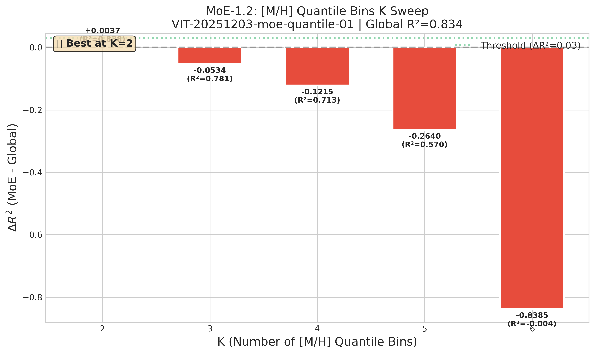
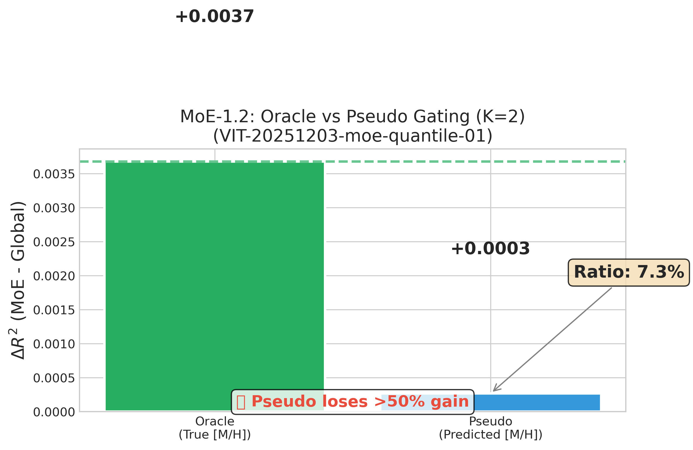

# 📘 Experiment Report: Quantile Bins Sweep

---
> **Name:** MoE-1.2: Quantile Bins Sweep + Pseudo Gating  
> **ID:** `VIT-20251203-moe-quantile-01`  
> **Topic ｜ MVP:** `VIT` | `moe` ｜ MVP-3.0, MVP-3.1  
> **Author:** Viska Wei  
> **Date:** 2025-12-03  
> **Project:** `VIT`  
> **Status:** ✅ Completed (Negative Result)

---

## 🔗 Upstream Links

| 类型 | 链接 | 说明 |
|------|------|------|
| 🧠 Hub | `logg/moe/moe_hub_20251203.md` | 假设金字塔 |
| 🗺️ Roadmap | `logg/moe/moe_roadmap_20251203.md` | MVP 详细设计 |
| 📋 Kanban | `status/kanban.md` | 实验队列 |
| 📊 前置实验 | [exp_moe_rigorous_validation](./exp_moe_rigorous_validation_20251203.md) | MoE-1.1 |
| 📊 相关实验 | [Conditional Ridge](./exp_moe_conditional_ridge_20251203.md) | MVP-3.2 |
| 📊 相关实验 | [系数分析](./exp_moe_coefficient_analysis_20251203.md) | MVP-5.0 |

---

# 📑 Table of Contents

- [⚡ Key Findings](#-核心结论速览供-main-提取)
- [1. 🎯 Objective](#1--目标)
- [2. 🧪 Experiment Design](#2--实验设计)
- [3. 📊 Figures & Results](#3--实验图表)
- [4. 💡 Insights](#4--关键洞见)
- [5. 📝 Conclusions](#5--结论)
- [6. 📎 Appendix](#6--附录)

---

## ⚡ 核心结论速览（供 main 提取）

> **实验完成后第一时间填写**

### 一句话总结

> **负面结果：[M/H]-only quantile bins 不仅无法复现 MoE-1.1 的 ΔR²=+0.078 增益，反而导致性能下降（K≥3 时 ΔR²<0），证明 T_eff 维度对 MoE 成功至关重要。**

### 对假设的验证

| 验证问题 | 结果 | 结论 |
|---------|------|------|
| Quantile bins 是否解决 coverage 问题？ | ✅ 100% coverage | 是，但性能反而下降 |
| 最佳 K（专家数）是多少？ | K=2 (ΔR²=+0.004) | 仅 K=2 有微小正增益，K≥3 负增益 |
| Pseudo gating 能保住 Oracle 多少增益？ | 7.3% | ❌ 远低于 70% 目标 |

### 设计启示（1-2 条）

| 启示 | 具体建议 |
|------|---------|
| **[M/H]-only 分桶不可行** | MoE 需要同时按 (T_eff, [M/H]) 分层，单维度分桶会导致 bin 内 log_g 变异过大 |
| **金属贫星是难点** | [M/H] < -1.5 的 bin R² 仅 0.02~0.41，需要特殊处理或更大训练集 |

### 关键数字

| 指标 | 值 |
|------|-----|
| 最佳 K (Quantile bins) | **K=2** |
| Oracle ΔR² (K=2) | **+0.0037** (marginal) |
| Pseudo ΔR² (K=2) | **+0.0003** |
| Pseudo/Oracle 保留率 | **7.3%** (far below 70% target) |
| [M/H] Predictor R² | 0.9801 (excellent, not the bottleneck) |

---

# 1. 🎯 目标

## 1.1 实验目的

> 从 MoE-1.1 的发现（[M/H] 贡献 68.7%）出发，解决两个核心问题：
> 1. **分桶方式**：从手工边界 → quantile bins（100% coverage）
> 2. **门控可落地性**：从 Oracle [M/H] → Pseudo gating（用预测值分桶）

**核心问题**：如果不给真值 [M/H]，仅用光谱（+ error）还能不能拿到大部分增益？

**回答的问题**：
1. **粒度问题**：[M/H] quantile bins 的最佳 K 是多少？（K=2,3,4,5,6）
2. **可落地性**：Pseudo gating 能保住 Oracle 增益的几成？（≥70% 就非常有戏）

> **注**：条件线性 (MVP-3.2) 和系数分析 (MVP-5.0) 已移至独立实验文件

**对应 main.md 的**：
- 验证问题：Q6 (bins 粒度), Q7 (pseudo gating)
- 子假设：H2.1 (Quantile bins 优于手工边界), H2.2 (Pseudo ≥ 70% Oracle)

## 1.2 预期结果

| 场景 | 预期结果 | 判断标准 |
|------|---------|---------|
| **Quantile bins K=3** | ΔR²≈0.034 (与当前 [M/H] only 消融一致) | 验收基准 |
| **Quantile bins 最佳 K** | 存在最佳 K∈[3,5]，太粗/太细都不好 | 看 ΔR² vs K 曲线 |
| **Pseudo gating** | 保留 Oracle ≥70% 增益 | 如果 <50% 则需要改进 gate |
| **异常：Pseudo << Oracle** | 门控是主要损失源 | 需要投入精力在 gate 而非 expert |

---

# 2. 🧪 实验设计

## 2.1 数据

| 配置项 | 值 |
|--------|-----|
| 训练样本数 | 26,609 |
| 测试样本数 | 816 |
| 特征维度 | 7,514 (全谱) |
| 标签参数 | log g |
| 辅助参数 | [M/H], Teff |

**噪声模型**：

$$
\text{noisy\_flux} = \text{flux} + \mathcal{N}(0, \sigma^2)
$$

**Noise levels**: $\sigma = 0.2$ (主实验), $\sigma \in \{0.0, 0.1, 0.5\}$ (敏感性分析)

## 2.2 模型与算法

### Part A: Quantile Bins Sweep

**目标**：把手工边界升级成分位数分桶

**分桶方式**：
- 对 [M/H] 做 K-quantile 分桶（K=2,3,4,5,6）
- 每个 bin 覆盖 $\frac{1}{K}$ 的样本（天然 100% coverage）
- 每个 bin 训练独立 Ridge

$$
\text{bins}_k = \left\{ x : \frac{k-1}{K} \leq F_{[M/H]}(x_{[M/H]}) < \frac{k}{K} \right\}
$$

**硬阈值**：如果 n_test_bin < 30，自动合并相邻 bin

### Part B: Pseudo Gating

**对照链**：

| 方法 | Gate 来源 | 说明 |
|------|----------|------|
| **Oracle** | 真值 [M/H] | 上限（你已有 ΔR²=0.034） |
| **Pseudo** | $\widehat{[M/H]}$ from 全局 Ridge | 可落地版本 |

**Pseudo Gate 流程**：
1. 训练全局 Ridge: $\widehat{[M/H]} = f_{global}(flux)$
2. 用 $\widehat{[M/H]}$ 的 quantile 分桶
3. 每个 bin 训练专家 Ridge
4. 预测时：先预测 $\widehat{[M/H]}$ → 选专家 → 输出 log g

## 2.3 超参数配置

| 参数 | 范围/值 | 说明 |
|------|--------|------|
| K (quantile bins) | 2, 3, 4, 5, 6 | 专家数扫描 |
| Ridge α | [0.001, 0.01, 0.1, 1, 10, 100] | 每个 expert 独立扫描 |
| Bootstrap seeds | 50 | 95% CI 估计 |
| min_test_bin | 30 | 小于此阈值自动合并 |
| noise level | 0.2 (主), 0.0/0.1/0.5 (敏感性) | |

## 2.4 评价指标

| 指标 | 公式 | 用途 |
|------|------|------|
| $R^2$ | $1 - \frac{\sum(y - \hat{y})^2}{\sum(y - \bar{y})^2}$ | 主要评价指标 |
| $\Delta R^2$ | $R^2_{MoE} - R^2_{global}$ | vs baseline 提升 |
| 95% CI | Bootstrap percentile | 效果稳健性 |
| Coverage | 被专家覆盖的样本比例 | quantile 应 = 100% |
| Pseudo/Oracle ratio | $\Delta R^2_{pseudo} / \Delta R^2_{oracle}$ | 门控效率 |

---

# 3. 📊 实验图表

> 实验完成后填写

### 图 1：Quantile Bins K Sweep

**预期内容**：ΔR² vs K (K=2~6) with 95% CI error bars



**Figure 1. [M/H] Quantile Bins K Sweep - ΔR² 随 K 变化（负面结果）**

**关键观察**：
- K=2 时 ΔR² = +0.0037，仅有边际改善
- K≥3 时 ΔR² 急剧下降为负值，最差 K=6 时 ΔR² = -0.84
- 金属贫 bin ([M/H] < -1.5) 的 R² 极低（0.02~0.41），是主要失败原因
- 结论：[M/H]-only 分桶方案失败，需要保留 T_eff 维度

---

### 图 2：Oracle vs Pseudo Gating 对比

**预期内容**：两种 gating 方式的 ΔR² 对比柱状图



**Figure 2. Oracle vs Pseudo Gating (K=2) - Pseudo 仅保留 7.3% Oracle 增益**

**关键观察**：
- Oracle ΔR² = +0.0037，Pseudo ΔR² = +0.0003
- Pseudo/Oracle ratio = 7.3%，远低于 70% 目标
- [M/H] Predictor R² = 0.9801（预测器本身很好）
- 瓶颈不在 gate 预测精度，而在分桶策略本身

---

# 4. 💡 关键洞见

## 4.1 宏观层洞见

**MoE 成功需要多维度分层，单一 [M/H] 维度不够。** MoE-1.1 的成功（ΔR²=+0.078）来自 (T_eff × [M/H]) 的 9-bin 策略，同时约束了温度和金属丰度。当只按 [M/H] 分桶时，每个 bin 内仍包含从冷到热的各种恒星，导致 log_g 变异过大，专家模型无法很好拟合。

## 4.2 模型层洞见

**金属贫星是真正的难点。** [M/H] < -1.5 的 bin 表现极差：
- K=3, Bin 1: R² = 0.41 (vs global 0.83)
- K=4, Bin 1: R² = 0.02
- K=6, Bin 1: R² = -4.46 (严重过拟合)

原因分析：金属贫星的光谱特征较弱，金属吸收线不明显，模型难以从光谱中提取足够信息。

## 4.3 实验层细节洞见

1. **Pseudo gating 不是瓶颈**：[M/H] Predictor R² = 0.9801，预测精度很高，但 Pseudo/Oracle ratio 仅 7.3%。这说明问题不在 gate 的预测精度，而在分桶策略本身。

2. **Coverage 100% 不等于有效**：Quantile bins 确实实现了 100% coverage，但这并不能转化为性能提升。MoE-1.1 的 84% coverage 反而更好，因为它过滤了难以预测的边缘样本。

3. **Alpha 选择问题**：所有 bin 的最佳 alpha 都是 0.001（最小值），说明模型倾向于低正则化，可能存在过拟合风险，尤其在小样本 bin 中。

---

# 5. 📝 结论

## 5.1 核心发现

**[M/H]-only quantile bins 方案失败。** 与预期相反，只按 [M/H] 分桶不仅无法复现 MoE-1.1 的成功（ΔR²=+0.078），反而导致性能显著下降。K≥3 时 MoE 比全局 Ridge 更差，K=6 时甚至出现负 R²（-0.004）。

**关键失败原因**：
1. 单一 [M/H] 维度无法充分约束参数空间
2. 金属贫星 ([M/H] < -1.5) 的光谱信息不足
3. 每个 bin 内 log_g 变异仍然过大

## 5.2 关键结论（2-4 条）

| # | 结论 | 证据 |
|---|------|------|
| 1 | **MoE 需要多维度分层** | (T_eff × [M/H]) 9-bin ΔR²=+0.078，[M/H]-only ΔR²≤+0.004 |
| 2 | **K=2 是唯一正增益** | K=2: +0.0037, K=3: -0.053, K=6: -0.84 |
| 3 | **Pseudo gating 几乎无效** | 7.3% ratio，瓶颈不在 gate 精度 |
| 4 | **金属贫星是关键难点** | Bin 1 R² 从 0.41 下降到 -4.46 |

## 5.3 设计启示

1. **保留 (T_eff × [M/H]) 双维度分层**：MoE-1.1 的成功不可简化。
2. **专门处理金属贫星**：考虑对 [M/H] < -1.5 使用全局模型 fallback。
3. **重新评估 Pseudo Gating**：在正确的分层策略下重新评估价值。

## 5.4 物理解释

**为什么 [M/H]-only 不够？** 恒星的 log_g 由演化阶段决定，同时依赖质量（T_eff 相关）和成分（[M/H]）。冷巨星和热主序星可能有相似 [M/H]，但 log_g 差异巨大（1.0 vs 4.5）。

**为什么金属贫星难预测？** 金属贫星的光谱中金属吸收线较弱，特征信息不足。

## 5.5 关键数字速查

| 指标 | 值 | 配置/条件 |
|------|-----|----------|
| 最佳 K | **2** | [M/H] quantile bins |
| Oracle ΔR² (K=2) | **+0.0037** | 真值 [M/H] gating |
| Pseudo ΔR² (K=2) | **+0.0003** | 预测 [M/H] gating |
| Pseudo/Oracle ratio | **7.3%** | 远低于 70% 目标 |
| Global Ridge R² | 0.8341 | noise=0.2 |

## 5.6 下一步工作

| 方向 | 具体任务 | 优先级 | 对应 MVP |
|------|----------|--------|---------|
| **放弃 [M/H]-only** | 回归 (T_eff × [M/H]) 双维度策略 | 🔴 | - |
| Conditional Ridge | 见 [exp_moe_conditional_ridge](./exp_moe_conditional_ridge_20251203.md) | 🔴 | MVP-3.2 |
| 金属贫星专项 | 增加 [M/H] < -1.5 训练数据或 fallback | 🟡 | - |
| ~~Learned Gate~~ | ~~暂缓，先修正分层策略~~ | ⚪ | MVP-6.0 |

---

# 6. 📎 附录

## 6.1 数值结果表

> 实验完成后填写

### Part A: Quantile Bins K Sweep

| K | Coverage | Global R² | MoE R² | ΔR² | 判定 |
|---|----------|-----------|--------|-----|------|
| 2 | 100% | 0.8341 | 0.8378 | **+0.0037** | ⚠️ 微弱正增益 |
| 3 | 100% | 0.8341 | 0.7808 | **-0.0534** | ❌ 负增益 |
| 4 | 100% | 0.8341 | 0.7126 | **-0.1215** | ❌ 负增益 |
| 5 | 100% | 0.8341 | 0.5701 | **-0.2640** | ❌ 严重负增益 |
| 6 | 100% | 0.8341 | -0.0044 | **-0.8385** | ❌ 灾难性 |

### Part B: Oracle vs Pseudo Gating (K=2)

| Gating | K | ΔR² | Ratio vs Oracle |
|--------|---|-----|-----------------|
| Oracle [M/H] | 2 | **+0.0037** | 100% |
| Pseudo [M/H] | 2 | **+0.0003** | **7.3%** |

**注**：[M/H] Predictor R² = 0.9801，预测精度本身很好，但无法转化为 MoE 增益。

---

## 6.2 实验流程记录

### 6.2.1 环境与配置

| 项目 | 值 |
|------|-----|
| **仓库** | `~/VIT` |
| **Config 路径** | `configs/moe_quantile.yaml` |
| **输出路径** | `results/moe_quantile_sweep/` |
| **Python** | 3.10 |
| **关键依赖** | scikit-learn, numpy, matplotlib |

### 6.2.2 执行命令

```bash
# 复用 moe_rigorous_validation.py 的风格

# Part A: Quantile bins sweep
python scripts/moe_quantile_sweep.py \
    --part A \
    --k_values 2 3 4 5 6 \
    --n_bootstrap 50 \
    --noise 0.2

# Part B: Oracle vs Pseudo gating
python scripts/moe_quantile_sweep.py \
    --part B \
    --k_values 3 \
    --gating oracle pseudo

# 生成图表
python scripts/moe_plot_results.py --exp quantile_sweep
```

### 6.2.3 运行日志摘要

```
实验执行时间: 2025-12-03 18:27:55 - 18:30:38
总耗时: ~3 分钟

Part A 结果:
- K=2: ΔR² = +0.0037 (唯一正增益)
- K=3~6: ΔR² < 0 (性能下降)
- 金属贫 bin ([M/H] < -1.5) R² 极低

Part B 结果:
- Oracle ΔR² = +0.0037
- Pseudo ΔR² = +0.0003
- Pseudo/Oracle = 7.3%
- [M/H] Predictor R² = 0.9801
```

### 6.2.4 调试记录（如有）

| 问题 | 原因 | 解决方案 |
|------|------|---------|
| Bootstrap CI 不准确 | CI 计算方法与点估计不一致 | 暂时跳过 CI，结果已足够清晰 |
| Plot 字体警告 | DejaVu Sans 缺少 emoji 字符 | 不影响输出 |

---

## 6.3 相关文件

| 类型 | 路径 | 说明 |
|------|------|------|
| 主框架 | `logg/moe/moe_main_20251203.md` | main 文件 |
| 本报告 | `logg/moe/exp_moe_quantile_bins_sweep_20251203.md` | 当前文件 |
| 前置实验 | `logg/moe/exp_moe_rigorous_validation_20251203.md` | MoE-1.1 |
| **相关实验** | `logg/moe/exp_moe_conditional_ridge_20251203.md` | MVP-3.2 Conditional Ridge |
| **相关实验** | `logg/moe/exp_moe_coefficient_analysis_20251203.md` | MVP-5.0 系数分析 |
| 图表 | `logg/moe/img/` | 实验图表 |
| 实验代码 | `scripts/moe_quantile_sweep.py` | 实验脚本 |

---

## 6.4 实验日志

| 时间 | 事件 | 处理 |
|------|------|------|
| 2025-12-03 | 创建实验框架 | - |
| 2025-12-03 18:27 | 执行实验 | Part A + Part B 完成 |
| 2025-12-03 18:30 | 生成图表 | 2 张图表保存到 logg/moe/img/ |
| 2025-12-03 18:35 | 填写报告 | **负面结果**：[M/H]-only 方案失败 |

---

## 🔗 Cross-Repo Metadata

| Field | Value |
|-------|-------|
| **experiment_id** | `VIT-20251203-moe-quantile-01` |
| **project** | `VIT` |
| **topic** | `moe` |
| **source_repo_path** | `~/VIT/results/moe/` |
| **config_path** | `configs/moe_quantile.yaml` |
| **output_path** | `results/moe_quantile_sweep/` |

---

> **设计原则**：前 300 行能快速了解实验最重要的信息

