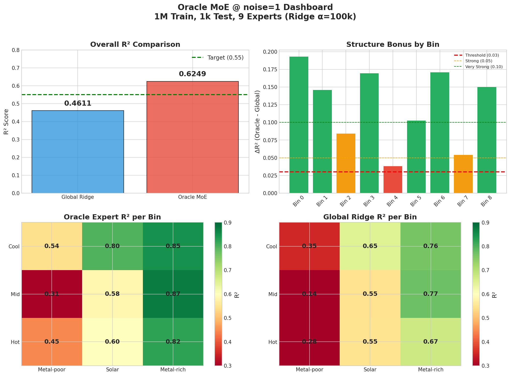
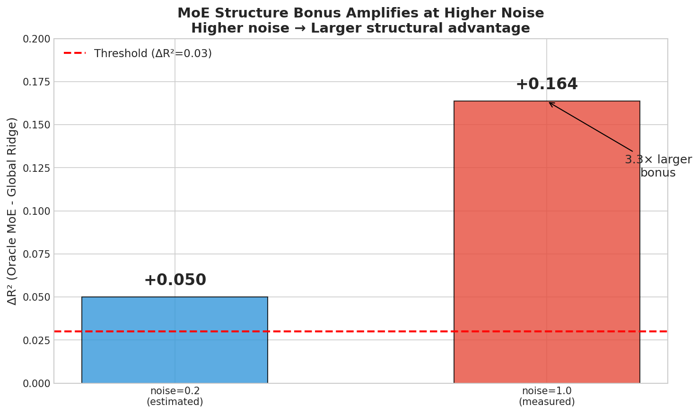

# 🧠 MoE 智库导航（Hub）

---
> **主题名称：** Mixture of Experts（MoE）要不要上？什么时候有用？  
> **作者：** Viska Wei  
> **创建日期：** 2025-12-03  
> **最后更新：** 2025-12-24  
> **状态：** 🟢 **Phase 15 完成！MVP-15 LGBM Expert Bin3 +0.056 成功**  
> **当前焦点：** 执行 Phase 16 (1M + noise=1 大规模低 SNR 验证)  
> **Layer:** L1 (Cross-Cutting Hub)

---

## 🔗 Hub Dependencies

> **定义本 Hub 与其他 Hub 的引用关系，供自动传播使用**
> 
> 📋 完整依赖图见 [`../_hub_graph.md`](../_hub_graph.md)

### 📤 Parent Hubs (引用本 Hub 的上层)

| Parent Hub | 引用的数据 | 同步章节 |
|------------|-----------|---------|
| [`master_hub`](../master_hub.md) | MoE 战略结论, Oracle MoE headroom | §2 Strategic Questions, §3 Global Insights |
| [`scaling_hub`](../scaling/scaling_hub_20251222.md) | MoE @ noise=1 结果, Oracle MoE ΔR² | §3 Confluence, §5.3 Key Numbers |

### 📥 Child Hubs (本 Hub 引用的下层)

| Child Hub | 引用的数据 | 来源章节 |
|-----------|-----------|---------|
| [`ridge_hub`](../ridge/ridge_hub_20251223.md) | Ridge baseline, Oracle Expert R² | §4.2 Key Numbers |
| [`lightgbm_hub`](../lightgbm/lightgbm_hub_20251130.md) | LightGBM Expert 对比 | §5.3 Key Numbers |
| [`NN_hub`](../NN/NN_main_20251130.md) | NN Expert 对比, MLP 失败原因 | §3 核心发现 |

---

## 🔗 相关文件

| 类型 | 文件 | 说明 |
|------|------|------|
| 📍 Roadmap | [`moe_roadmap.md`](./moe_roadmap_20251203.md) | 实验追踪与执行 |
| 📗 子实验 | `exp_moe_*.md` | 单实验详情 |
| 📇 知识卡片 | `card_*.md` | 浓缩结论 |

---

# 📑 目录

- [1. 🌲 核心问题树](#1--核心问题树)
- [2. 🔺 假设金字塔](#2--假设金字塔)
- [3. 💡 洞见汇合站](#3--洞见汇合站)
- [4. 🧭 战略导航](#4--战略导航)
- [5. 📐 设计原则库](#5--设计原则库)
- [6. 📎 附录](#6--附录)

---

# 1. 🌲 核心问题树

## 1.1 顶层问题

> **MoE（Mixture of Experts）在恒星参数预测任务中能否提升性能？什么条件下有用？**

据此推断：

> **如果 MoE 有用，应该在模型架构中引入多专家设计；如果没用，则应聚焦于单模型优化。**

## 1.2 问题分解

```
🎯 顶层问题: MoE 在 log g 预测中能否提升性能？
│
├── Q1: 按物理参数分专家有用吗？
│   ├── Q1.1: 按 (Teff, [M/H]) 分 bin 能提升多少？ → ✅ ΔR²=+0.050 [MVP-1.1]
│   ├── Q1.2: [M/H] vs Teff 谁贡献更大？ → ✅ [M/H] 68.7% [MVP-1.1]
│   └── Q1.3: 分位数分桶比手工边界好吗？ → ❌ K≥3 负增益 [MVP-3.0]
│
├── Q2: 按噪声水平分专家有用吗？
│   ├── Q2.1: Noise-matched expert 提升多少？ → ✅ ΔR²=+0.080 [MVP-2.0]
│   └── Q2.2: 离散分档稳定吗？ → ⚠️ noise=0.5 翻车 [MVP-2.0]
│
├── Q3: MoE 能落地吗？（核心风险）
│   ├── Q3.1: Pseudo gating 能保住多少 Oracle 增益？ → ❌ 仅 7.3% [MVP-3.1]
│   ├── Q3.2: 条件线性能替代 MoE 吗？ → ✅ 达到 80% [MVP-3.2]
│   └── Q3.3: 门控误差是瓶颈吗？ → 🔄 MVP-7.1 验证中
│
├── Q4: 为什么某些区域效果好/差？
│   ├── Q4.1: 高 [M/H] 为什么更容易？ → ✅ 金属线特征丰富 [MVP-5.0]
│   └── Q4.2: 低 [M/H] 需要什么？ → ⏳ 待验证
│
└── Q5: 🟢 如何用物理特征做可落地 Gate？（Phase 8 ✅ 已解决！）
    ├── Q5.1: 少量物理窗特征能否区分专家域？ → ✅ **是！82% 准确率，ρ=1.00** [MVP-PG1]
    ├── Q5.2: Soft gating 是否比 hard gating 更抗噪？ → ✅ **Soft ρ=1.00 >> Hard ρ=0.72** [MVP-PG1]
    ├── Q5.3: Teff 信息必须进入 Gate 吗？ → ⚠️ 有帮助(+11%)但非必需 [MVP-PG1]
    └── Q5.4: 窗口形状 PCA 是否必要？ → ❌ 不需要（当前 ρ≈1.00 已足够）
│
├── Q6: 🔴 如何把 3 专家扩展到 9 专家？（Phase 9 新增）
│   ├── Q6.1: 物理窗 gate 能否区分 9 类 (Teff×[M/H])？ → ⏳ [MVP-9E1]
│   ├── Q6.2: Soft routing 在 9 专家下是否仍能保住 ≥85% 增益？ → ⏳ [MVP-9E1]
│   └── Q6.3: R² 能否从 0.87 → 0.90+？ → ⏳ [MVP-9E1]
│
└── Q7: ⚠️ 专家表达能力是否是新瓶颈？（Phase 10 ✅ 完成）
    ├── Q7.1: NN expert 是否比 Ridge expert 更强？ → ❌ **NN R²=0.38 << Ridge R²=0.87** [MVP-NN1]
    ├── Q7.2: 困难子域 (Bin4/Bin7 低 [M/H]) 能否被 NN 改善？ → ✅ **三个子域均改善** [MVP-NN1]
    └── Q7.3: 固定 gate + NN expert 的增益来自哪里？ → ✅ **来自 Soft routing 平滑** [MVP-NN1]
│
└── Q8: 🟢 如何进一步优化 9 专家 MoE？（Phase 11 进行中）
    ├── Q8.1: 分类最优的 gate 权重是否也是回归最优？ → ✅ **否！MLP回归gate提升R²从0.9213→0.9310** [MVP-Next-A]
    ├── Q8.2: Out-of-range 样本如何处理才能保持高 R²？ → ✅ **Edge-clamp R²=0.8957** [MVP-Next-B]
    └── Q8.3: 最弱 bins (Bin3/Bin6) 是否存在系统性偏差？ → ❌ **否！校准无效，误差来源是异质性** [MVP-Next-C]
│
└── Q9: 🟢 如何巩固并扩展当前最佳结果？（Phase 12-13）
    │
    ├── Q9.1: 0.9310 在 100k 规模下是否可复现？能否提供更稳定的 CI？ → ✅ **R²=0.9400, CI_low > 0！** [MVP-12A]
    │         → vs 32k: +0.0090 提升，更大规模更稳定
    │
    ├── Q9.2: 如何把 full-test 拉回 >0.91？ → ⏳ [MVP-12B]
    │         → 第 10 个 out-of-range expert / conditional fallback
    │
    ├── Q9.3: Bin3/Bin6 能否通过特征工程改善（而非模型/校准）？ → ⏳ [MVP-13]
    │         → 利用 ridge 系数/残差选线，添加局部窗特征
    │
    ├── Q9.4: 更强的 embedding (1M 参数) 能否改善 gate 质量？ → ⏳ [MVP-14]
    │         → 小 CNN/AE 学 8~32 维 embedding 喂给 gate
    │
    └── Q9.5: 用小 LightGBM 替换 Bin3/Bin6 专家能否改善困难区域？ → ⏳ [MVP-15]
             → 只替换困难 bin expert，其余保持 Ridge

└── Q10: 🔴 MoE 在低 SNR 大规模数据上是否仍有效？（Phase 16 完整规划）
    │
    ├── Q10.1: 理论上限 R²_max 是多少？（三层论证的第一层）
    │   ├── Q10.1.1: Fisher/CRLB 给出的理论上限？ → ⏳ [MVP-16T]
    │   ├── Q10.1.2: degeneracy (log_g 与 Teff/[M/H] 纠缠) 有多强？ → ⏳ [MVP-16T]
    │   └── Q10.1.3: 如果 R²_max ≈ 0.6，则"大幅提升"不现实 → ⏳ [MVP-16T]
    │
    ├── Q10.2: Ridge/LGBM ceiling 是否统计可信？（三层论证的第二层）
    │   ├── Q10.2.1: 多 seed (5-10) 重复时 R² 的 std？ → ⏳ [MVP-16B]
    │   ├── Q10.2.2: 扩大 test (500→5k) 后结论是否改变？ → ⏳ [MVP-16B]
    │   └── Q10.2.3: LMMSE (线性模型族上限) 与 Ridge 差多少？ → ⏳ [MVP-16L]
    │
    ├── Q10.3: Oracle MoE headroom 有多少？（三层论证的第三层）
    │   ├── Q10.3.1: Oracle MoE - Global Ridge ≥ 0.05？ → ⏳ [MVP-16O]
    │   └── Q10.3.2: 哪些 bins 在高噪声下受损最严重？ → ⏳ [MVP-16O]
    │
    ├── Q10.4: 可落地 MoE @ noise=1 效果如何？
    │   ├── Q10.4.1: Gate 9-class 准确率 > 60%？ → ⏳ [MVP-16G]
    │   └── Q10.4.2: Soft routing ρ ≥ 0.7？ → ⏳ [MVP-16G]
    │
    ├── Q10.5: Whitening/表示方式能带来多少提升？
    │   └── Q10.5.1: flux/error 输入 vs raw flux → ⏳ [MVP-16W]
    │
    └── Q10.6: 1D-CNN 能接近理论上限吗？
        └── Q10.6.1: CNN R² - Ridge R² > 0.10？ → ⏳ [MVP-16CNN]

状态图例:
✅ 已验证 | ❌ 已否定 | ⚠️ 部分验证 | 🔄 进行中 | ⏳ 待验证
```

## 1.3 问题边界

| ✅ 本研究关注 | ❌ 本研究不关注 |
|-------------|---------------|
| MoE 在 log g 预测的收益 | 其他恒星参数 (Teff, [M/H]) 的预测 |
| 线性模型（Ridge）作为 baseline | 复杂 NN-MoE（仅当线性验证通过才做） |
| 可落地的门控方案 | 依赖 Oracle 信息的理想方案 |
| (Teff, [M/H], SNR) 三个条件维度 | 其他可能的条件变量 |

**定位声明**：
> **本实验系列是「可行性探索」，目的是用低成本线性实验验证 MoE 的潜力，而非直接上复杂 NN-MoE。结论应理解为「MoE 是否值得投入更多资源」的初步判断。**

---

# 2. 🔺 假设金字塔

## 2.1 L1 宏观假设（战略层）

| # | 宏观假设 | 验证状态 | 如果成立 | 如果不成立 |
|---|---------|---------|---------|-----------|
| **H1** | $\log g$ 与光谱的映射在 $(T_{\text{eff}}, [\text{M/H}])$ 空间是"分段简单"的 | ✅ 验证通过 | 上 MoE，按物理参数分专家 | 放弃 MoE，优化单模型 |
| **H2** | 可落地的门控方案能保住大部分 Oracle 增益 | ⚠️ 风险点 | 继续优化门控 | 转向连续条件化 |

## 2.2 L2 中观假设（战术层）

| # | 中观假设 | 上层假设 | 验证状态 | 关键实验 |
|---|---------|---------|---------|---------|
| **H1.1** | 按 $(T_{\text{eff}}, [\text{M/H}])$ 分 bin 能显著提升性能 | H1 | ✅ ΔR²=+0.050 | MVP-1.1 |
| **H1.2** | [M/H] 是 MoE 主要贡献者 | H1 | ✅ 贡献 68.7% | MVP-1.1 消融 |
| **H1.3** | 按 SNR/noise level 分专家有价值 | H1 | ✅ ΔR²=+0.080 | MVP-2.0 |
| **H2.1** | 分位数分桶能简化手工边界 | H2 | ❌ K≥3 负增益 | MVP-3.0 |
| **H2.2** | Pseudo gating 能保住 ≥70% Oracle 增益 | H2 | ❌ 仅 7.3% | MVP-3.1 |
| **H2.3** | 条件线性能接近 MoE 效果 | H2 | ✅ 达到 80% | MVP-3.2 |

## 2.3 L3 微观假设（可验证层）

| # | 可验证假设 | 上层 | 验证标准 | 结果 | 来源 |
|---|-----------|------|---------|------|------|
| **H1.1.1** | 分区 Ridge 全局 R² vs 全局 Ridge R² 差 ≥0.03 | H1.1 | ΔR² ≥ 0.03 | ✅ +0.050 | MVP-1.1 |
| **H1.1.2** | 高金属丰度 bin R² > 全局 Ridge | H1.1 | 局部 R² > 0.85 | ✅ 0.97-0.98 | MVP-1.0 |
| **H1.2.1** | [M/H]-only 3 专家能获得 ≥60% 收益 | H1.2 | 贡献 ≥ 60% | ✅ 68.7% | MVP-1.1 |
| **H1.3.1** | Noise-matched expert 优于 mixed | H1.3 | ΔR² > 0 | ✅ +0.080 avg | MVP-2.0 |
| **H2.1.1** | 存在最佳 K∈[3,5] | H2.1 | K=X 最优 | ❌ K=2 唯一正增益 | MVP-3.0 |
| **H2.2.1** | Pseudo ≥ 70% Oracle | H2.2 | 比例 ≥ 70% | ❌ 仅 7.3% | MVP-3.1 |
| **H2.3.1** | 1st order Conditional R² ≥ 0.90 | H2.3 | R² ≥ 0.90 | ✅ 0.9018 | MVP-3.2 |

### 🟢 物理窗 Gate 假设（Phase 8 ✅ 完成！）

| # | 可验证假设 | 上层 | 验证标准 | 结果 | 来源 |
|---|-----------|------|---------|------|------|
| **H-PG1** | 少数物理窗特征足以区分专家域 | H2 | 分类准确率 >70% 或 **ρ ≥ 0.5** | ✅ **Acc=82%, ρ=1.00** | MVP-PG1 |
| **H-PG2** | Soft gating 比 hard gating 更抗噪 | H2 | soft R² ≥ hard R²，波动更小 | ✅ **Soft ρ=1.00 >> Hard ρ=0.72** | MVP-PG1 |
| **H-PG3** | Teff 信息必须进入 gate（显式或隐式） | H2 | 加 Teff proxy 后 ρ 显著上升 | ⚠️ 有帮助+11%但非必需 | MVP-PG1 |
| **H-PG4** | 窗口形状 PCA 只在标量不够时才必要 | H2 | 先用 depth/EW 验证，再看 PCA 增量 | ❌ 不需要（ρ≈1.00） | MVP-PG1 |

### 🔴 9 专家扩展假设（Phase 9 新增）

| # | 可验证假设 | 上层 | 验证标准 | 结果 | 来源 |
|---|-----------|------|---------|------|------|
| **H-9E1** | 物理窗特征能区分 9 类 (Teff×[M/H]) | H1 | 9-class gate 准确率 >60% 或 **ρ ≥ 0.85** | ⏳ | MVP-9E1 |
| **H-9E2** | Soft routing 在 9 专家下仍能保住大部分增益 | H2 | ρ ≥ 0.85（保住 85% oracle 增益） | ⏳ | MVP-9E1 |
| **H-9E3** | 9 专家能把可落地 R² 从 0.87 推到 ≥0.90 | H1 | R²_phys-gate(9) ≥ 0.90 | ⏳ | MVP-9E1 |

### 🔴 NN Expert 假设（Phase 10 ✅ 完成）

| # | 可验证假设 | 上层 | 验证标准 | 结果 | 来源 |
|---|-----------|------|---------|------|------|
| **H-NN1** | NN expert 比 Ridge expert 更强 | H1 | MoE(NN) - MoE(Ridge) ≥ 0.02 R² | ❌ **NN R²=0.38 << Ridge R²=0.87** | MVP-NN1 |
| **H-NN2** | 增益主要来自困难子域 (Bin4/Bin7 低 [M/H]) | H1 | 困难子域 ΔR² > 平均 ΔR² | ✅ **三个子域均改善，High [M/H] 最多** | MVP-NN1 |
| **H-NN3** | 固定 gate + NN expert 仍能保住 soft routing 优势 | H2 | ρ_NN ≥ ρ_Ridge ≈ 1.0 | ✅ **Soft R²≈Oracle R²，但基线太弱** | MVP-NN1 |

### 🟢 回归最优 Gate & 校准假设（Phase 11 ✅ H-A/H-C 已验证）

| # | 可验证假设 | 上层 | 验证标准 | 结果 | 来源 |
|---|-----------|------|---------|------|------|
| **H-A** | 分类最优 gate 权重 ≠ 回归最优权重；用 MSE 损失训练 gate 能进一步提升 R² | H2 | R²_regress-gate > R²_classify-gate (0.9213) + 0.003 | ✅ **R²=0.9310 (+0.0097)** | MVP-Next-A |
| **H-B** | Out-of-range 样本纳入后，整体 R² 仍维持高水平 | H1 | full-1000 R² > global R² + 0.05 | ✅ **R²_full=0.8957** | MVP-Next-B |
| **H-C** | 最弱 bins (Bin3/Bin6) 误差主要是系统性 bias，affine 校准能改善 | H1 | Bin3/Bin6 的 R² 提升 ≥ 0.02 | ❌ **ΔR²=-0.0013, 校准无效** | MVP-Next-C |

### 🔴 Phase 12-13 假设（2025-12-05 新立项）

| # | 可验证假设 | 上层 | 验证标准 | 结果 | 来源 |
|---|-----------|------|---------|------|------|
| **H-12A** | 100k 规模下 MoE R²≥0.93 可复现，且明显优于 LGBM=0.91 | Q9.1 | covered-test R²≥0.93，CI_low>0，同 split MoE > LGBM | ✅ **R²=0.9400, CI=[0.0045,0.0175]** | MVP-12A |
| **H-12B** | 第 10 个 out-of-range expert 能把 full-test R² 拉回 >0.91 | Q9.2 | full-test R²≥max(LGBM, global+0.05) | ⏳ | MVP-12B |
| **H-13** | 用 ridge 系数/残差选线添加窗口特征能改善 Bin3/Bin6 | Q9.3 | Bin3 或 Bin6 ΔR²≥+0.02 | ⏳ | MVP-13 |
| **H-14** | 小模型 (1M 参数) 学习的 embedding 能改善 gate 质量 | Q9.4 | 总体 R²+0.003 或 Bin3/Bin6 明显改善 | ⏳ | MVP-14 |
| **H-15** | 用小 LightGBM 替换困难 bin expert 能改善该区域性能 | Q9.5 | full coverage 稳定超过 0.91，Bin3/Bin6 不再拖后腿 | ⚠️ **Bin3 ✅ +0.056, Bin6 ❌ -0.032** | MVP-15 |

### 🔴 Phase 16 完整假设矩阵（2025-12-23 大立项：三层论证链）

**核心理念**：先推出理论上限 → 再证明 Ridge/LGBM ceiling → 再展示 MoE/NN 接近上限

#### Phase 16T: Fisher/van Trees 理论上限（最高优先级）

| # | 可验证假设 | 上层 | 验证标准 | 结果 | 来源 |
|---|-----------|------|---------|------|------|
| **H-16T.1** | CRLB 给出的 R²_max ≥ 0.75 (存在大 headroom) | Q10.1 | R²_max ≥ 0.75 | ⏳ | MVP-16T |
| **H-16T.2** | degeneracy 指标显著 (log_g 与 Teff/[M/H] 纠缠) | Q10.1 | Fisher off-diagonal / Schur complement | ⏳ | MVP-16T |
| **H-16T.3** | van Trees (Bayesian CRLB) 给出更紧的数据分布平均上限 | Q10.1 | R²_max,vT ≤ R²_max,CRLB | ⏳ | MVP-16T |

**止损规则**：
- 如果 R²_max ≈ 0.6 → "大幅提升"不现实，目标改为"逼近上限 + 不确定度输出"
- 如果 R²_max ≥ 0.75 → 确实存在大 headroom，值得上 CNN/更强表征

#### Phase 16B: Baseline 统计可信度

| # | 可验证假设 | 上层 | 验证标准 | 结果 | 来源 |
|---|-----------|------|---------|------|------|
| **H-16B.1** | 多 seed (5-10) 确认 Ridge=0.50 的统计置信度 | Q10.2 | std < 0.01 | ⏳ | MVP-16B |
| **H-16B.2** | 多 seed (5-10) 确认 LGBM=0.57 的统计置信度 | Q10.2 | std < 0.02 | ⏳ | MVP-16B |
| **H-16B.3** | 扩大 test set (500→5k) 后 ceiling 结论不变 | Q10.2 | ΔR² < 0.01 | ⏳ | MVP-16B |

#### Phase 16L: 线性模型族上限 (LMMSE)

| # | 可验证假设 | 上层 | 验证标准 | 结果 | 来源 |
|---|-----------|------|---------|------|------|
| **H-16L.1** | LMMSE R² - Ridge R² < 0.01 | Q10.2 | 差值 < 0.01 | ⏳ | MVP-16L |
| **H-16L.2** | 如果 Ridge ≈ LMMSE，则"线性模型族不可能再大幅提升" | Q10.2 | 可写入论文 | ⏳ | MVP-16L |

#### Phase 16O: Oracle MoE 结构 headroom

| # | 可验证假设 | 上层 | 验证标准 | 结果 | 来源 |
|---|-----------|------|---------|------|------|
| **H-16O.1** | Oracle MoE (9 bin) R² > 0.55 @ noise=1 | Q10.3 | R² > 0.55 | ⏳ | MVP-16O |
| **H-16O.2** | Oracle MoE - Global Ridge ≥ 0.05 (结构红利明显) | Q10.3 | ΔR² ≥ 0.05 | ⏳ | MVP-16O |
| **H-16O.3** | Metal-poor bins (Bin0/3/6) 在高噪声下受损更严重 | Q10.3 | 这些 bin ΔR² < 平均 | ⏳ | MVP-16O |

**决策规则**：
- 若 ΔR² < 0.02 → MoE 不是主要杠杆，应直接上 CNN/表示学习
- 若 ΔR² ≥ 0.05 → MoE 值得做（保底收益）

#### Phase 16G: 可落地 MoE @ noise=1

| # | 可验证假设 | 上层 | 验证标准 | 结果 | 来源 |
|---|-----------|------|---------|------|------|
| **H-16G.1** | Gate 9-class 准确率 > 60% @ noise=1 | Q10.4 | Acc > 60% | ⏳ | MVP-16G |
| **H-16G.2** | Soft routing ρ ≥ 0.7 @ noise=1 | Q10.4 | ρ ≥ 0.7 | ⏳ | MVP-16G |
| **H-16G.3** | per-bin R² 能定位哪几个 bin 崩得最厉害 | Q10.4 | 混淆矩阵分析 | ⏳ | MVP-16G |

#### Phase 16W: Whitening/表示方式

| # | 可验证假设 | 上层 | 验证标准 | 结果 | 来源 |
|---|-----------|------|---------|------|------|
| **H-16W.1** | flux/error 输入 vs raw flux ΔR² ≥ 0.02 | Q10.5 | ΔR² ≥ 0.02 | ⏳ | MVP-16W |
| **H-16W.2** | Whitening 对 Ridge/LGBM/CNN 都有效 | Q10.5 | 三个模型都提升 | ⏳ | MVP-16W |

#### Phase 16CNN: 单模型 1D-CNN

| # | 可验证假设 | 上层 | 验证标准 | 结果 | 来源 |
|---|-----------|------|---------|------|------|
| **H-16CNN.1** | CNN R² > 0.65 @ noise=1, 1M data | Q10.6 | R² > 0.65 | ⏳ | MVP-16CNN |
| **H-16CNN.2** | CNN R² - Ridge R² > 0.10 | Q10.6 | ΔR² > 0.10 | ⏳ | MVP-16CNN |
| **H-16CNN.3** | CNN + Whitening 能接近 Fisher 上限 R²_max | Q10.6 | gap < 0.10 | ⏳ | MVP-16CNN |

> **核心验证指标 ρ 定义**：
> $$\rho = \frac{R^2_{\text{phys-gate}} - R^2_{\text{global}}}{R^2_{\text{oracle}} - R^2_{\text{global}}}$$
> - **最低可用**：$\rho \ge 0.5$（保住 50% oracle 增益）
> - **很有戏**：$\rho \ge 0.7$
> - 🟢 **实际达成**：**$\rho = 1.00$**（Soft routing 保住 100% 增益！）

## 2.4 🟢 关键假设验证状态（更新于 2025-12-04）

> **Phase 8-11 进展：物理窗 Gate + 9专家 + 回归Gate 成功！校准假设被否定**

| # | 关键假设 | 可检验子假设 | MVP | 状态 |
|---|---------|-------------|-----|------|
| **H-A (旧)** | ~~门控误差是否真的是瓶颈？~~ | 连续条件模型对 gate 噪声更耐受 | ~~MVP-7.1~~ | ❌ **不再需要**（H-PG 已解决） |
| **H-B (旧)** | ~~MoE 的"物理边界"可被学习到~~ | 存在可学习的 soft gating | ~~MVP-7.4~~ | ✅ **由 H-PG 证明** |
| **H-PG** | 🟢 **物理窗特征能做准 gate** | 少量物理特征保住 ≥50% oracle 增益 | MVP-PG1 | ✅ **已验证！ρ=1.00** |
| **H-A (新)** | 🟢 **回归gate优于分类gate** | MSE损失训练gate能提升R² | MVP-Next-A | ✅ **R²=0.9310 (+0.0097)** |
| **H-C (新)** | ❌ **校准假设被否定** | Metal-poor误差是系统性bias | MVP-Next-C | ❌ **ΔR²=-0.0013，校准无效** |
| **H-D** | 🔴 最难子域需要特征增强 | bin3/bin6 需要更强物理特征 | 待定 | ⏳ **因H-C失败，成为新方向** |

**假设关系图**（✅ 2025-12-04 更新）：
```
已证明: Oracle ΔR²=0.05 ✅，但 Pseudo 仅 7.3% ❌
  │
  ├─ 问题诊断: Gate 可落地性是瓶颈
  │
  └─ ✅ H-PG: 物理窗特征能做准 Gate！（Phase 8 已完成）
       │
       ├─ ✅ Step A: 固定专家（[M/H] 3专家），只测 Gate
       │   └─ ✅ H-PG1: Gate 准确率 82.10%，ρ=1.00
       │
       ├─ ✅ Step B: 物理窗特征设计
       │   └─ Ca II triplet (EW_8542 最重要) + Na + PCA1/2
       │
       ├─ ✅ Step C: Gate 模型
       │   └─ LogReg (L2, C=10) 足够！无需 NN gate
       │
       └─ ✅ Step D: 三种路由方式对比
           ├─ Hard: ρ=0.722（损失 28%）
           ├─ Soft: ρ=0.997（✅ 推荐！）
           └─ Soft + fallback: ρ=1.006（最佳但差异小）

🟢 关键发现: Soft routing 是成功的关键！
   → 解释了 pseudo gating 7.3% 失败的原因（用的是 hard routing）
   → 即使 82% 准确率，soft routing 也能保住 100% 增益
```

---

# 3. 💡 洞见汇合站

## 3.1 汇合点列表

| # | 汇合主题 | 单点来源 | 汇合结论 | 置信度 |
|---|---------|---------|---------|--------|
| C1 | MoE 效果稳健性 | MVP-1.0, MVP-1.1 | ΔR²=0.050 稳健，CI 完全 > 0.03 | 🟢 高 |
| C2 | [M/H] 是主导因素 | MVP-1.1 消融, MVP-5.0 | 68.7% 贡献，决定门控优先级 | 🟢 高 |
| C3 | 离散门控难落地 | MVP-3.0, MVP-3.1 | Quantile 失败 + Pseudo 7.3% | 🟢 高 |
| C4 | 连续条件化是出路 | MVP-3.2 | 已达 80% MoE 效果，无边界问题 | 🟡 中 |
| C5 | Noise 条件化有价值但不稳定 | MVP-2.0 | 平均 +0.080，但 noise=0.5 翻车 | 🟡 中 |
| **C6** | **🟢 物理窗 Gate 成功！** | MVP-PG1 | **Soft routing + 11 维特征 ρ=1.00** | 🟢 高 |
| **C7** | **⚠️ 全谱 MLP 不适合此任务** | MVP-NN1 | **NN R²=0.38 << Ridge R²=0.87** | 🟢 高 |
| **C8** | **🟢 回归 Gate 优于分类 Gate** | MVP-Next-A | **MLP回归gate R²=0.9310 (+0.0097)** | 🟢 高 |
| **C9** | **❌ Expert 校准无效 (Negative)** | MVP-Next-C | **ΔR²=-0.0013，Metal-poor误差非系统性bias** | 🟢 高 |
| **C10** | **🟢 100k 规模复刻大成功** | MVP-12A | **R²=0.9400 稳态，vs 32k +0.0090，CI_low > 0** | 🟢 高 |
| **C11** | **⚠️ LGBM Expert 部分成功** | MVP-15 | **Bin3 +0.056 ✅ 成功，Bin6 -0.032 ❌ 失败；Full R²=0.9314 > Ridge-only 0.9298** | 🟡 中 |

## 3.2 汇合详情

### 汇合点 C1: MoE 效果稳健性

**单点发现汇总**：

| 来源实验 | 单点发现 | 关键数据 |
|---------|---------|---------|
| [MVP-1.0](./exp/exp_moe_piecewise_ridge_20251203.md) | 分区 Ridge 显著优于全局 | ⚠️ 原 ΔR²=0.078 被高估 |
| [MVP-1.1](./exp/exp_moe_rigorous_validation_20251203.md) | mask-aligned 公平比较 | **ΔR²=0.050, CI=[0.033,0.067]** |
| 大数据集验证 (100k/10k) | 规模扩大后一致 | ΔR²=0.0501, CI=[0.045,0.055] |

**汇合结论**：
> **MoE 按 (Teff, [M/H]) 分段的收益是真实且稳定的**。ΔR²=+0.050 在小数据集和大数据集上都复现，95% CI 完全 > 0.03 阈值。映射在参数空间确实"分段更简单"，MoE 值得继续投入。

**设计启示**：
- MoE 架构本身有价值，问题在门控如何落地
- 效果稳健意味着可以继续优化门控和专家设计

---

### 汇合点 C2: [M/H] 是 MoE 主导因素

**单点发现汇总**：

| 来源实验 | 单点发现 | 关键数据 |
|---------|---------|---------|
| [MVP-1.1 消融](./exp/exp_moe_rigorous_validation_20251203.md) | [M/H] 贡献远超 Teff | [M/H] 68.7% vs Teff 42.9% |
| [MVP-5.0](./exp/exp_moe_coefficient_analysis_20251203.md) | 高 [M/H] 信息更分散 | 高 [M/H] 能量分散 7-12%，低 [M/H] 集中 22-31% |
| [MVP-5.0](./exp/exp_moe_coefficient_analysis_20251203.md) | Ca II triplet 重要性差异 | 高 [M/H] Ca II 重要性 1.65× |

**汇合结论**：
> **收益主要来自金属丰度相关的结构差异**。[M/H] 决定了谱线强度和可用特征分布，是 MoE 分专家的首选维度。3 个 [M/H] 专家可获得 69% 收益。

**设计启示**：
- 门控/条件模型应**优先对齐 [M/H]**
- Teff 是次要维度，可以简化处理
- 高 [M/H] 需要更广窗口/多区域聚合；低 [M/H] 需要窄窗口/高分辨特征

---

### 汇合点 C3: 离散门控难落地

**单点发现汇总**：

| 来源实验 | 单点发现 | 关键数据 |
|---------|---------|---------|
| [MVP-3.0](./exp/exp_moe_quantile_bins_sweep_20251203.md) | 分位数分桶失败 | K=2 唯一正增益(+0.004)，K≥3 负增益 |
| [MVP-3.1](./exp/exp_moe_quantile_bins_sweep_20251203.md) | Pseudo gating 几乎无用 | 仅保住 7.3% Oracle 增益 |

**汇合结论**：
> **硬 MoE 的"可落地门控"是最大风险点**。Quantile bins 表明有效边界是"物理阈值/结构转折点"，不是等频切分。Pseudo gating 7.3% 表明门控误差可能直接吃掉大部分收益。

**设计启示**：
- 放弃简单的分位数分桶
- 硬 MoE 需要更精准的门控，或者转向连续条件化
- 需要 MVP-7.1 验证门控噪声敏感性

---

### 汇合点 C4: 连续条件化是出路

**单点发现汇总**：

| 来源实验 | 单点发现 | 关键数据 |
|---------|---------|---------|
| [MVP-3.2](./exp/exp_moe_conditional_ridge_20251203.md) | 1st order 条件线性接近 MoE | R²=0.9018，达 MoE 80% |

**汇合结论**：
> **Conditional Ridge 已证明 MoE 大头收益来自"系数随 [M/H] 连续变化"**。无需分桶边界、100% coverage、训练一次、不需要 gate。

**设计启示**：
- **连续条件模型可能是更工程化的主线**
- 可以避开门控误差问题
- 下一步：MVP-7.2 榨出剩余 20%

---

### 汇合点 C6: 🟢 物理窗 Gate 成功！（2025-12-04 重大突破）

**单点发现汇总**：

| 来源实验 | 单点发现 | 关键数据 |
|---------|---------|---------|
| [MVP-PG1](./exp/exp_moe_phys_gate_baseline_20251204.md) | Soft routing 保住 100% 增益 | **ρ=1.00** (vs 最低标准 0.5) |
| [MVP-PG1](./exp/exp_moe_phys_gate_baseline_20251204.md) | Gate 准确率 82% 足够 | 82.10%（混淆主要在边界） |
| [MVP-PG1](./exp/exp_moe_phys_gate_baseline_20251204.md) | Ca II triplet 是核心特征 | EW_8542 贡献最大 |
| [MVP-PG1 消融](./exp/exp_moe_phys_gate_baseline_20251204.md) | Teff proxy 有帮助但非必需 | 去掉后 ρ=0.887 仍高 |

**汇合结论**：
> 🟢 **MoE 门控落地问题已解决！** 11 维物理窗特征（Ca II depth/EW + Na + PCA1/2）+ LogReg gate + Soft routing 即可达到接近 oracle 的性能。**Soft routing 是成功的关键**，即使 gate 准确率只有 82%，soft 加权也能平滑边界误差。

**关键洞见**：
1. **Soft routing 解决了 pseudo gating 失败的谜团**：pseudo 7.3% 是因为用了 hard routing
2. **Gate 准确率不是瓶颈**：82% 准确率 + soft routing ≈ 100% 增益
3. **Ca II 8542 是最重要的单一特征**（与 MVP-5.0 系数分析一致）

**设计启示**：
- ✅ **MoE 路线可继续！** 不需要转向 Conditional 路线
- ✅ 用 Soft routing，不要用 Hard routing
- ✅ LogReg gate 已足够，无需 NN gate
- ✅ 可直接进入 Phase 6 NN-MoE 集成

---

### 汇合点 C7: ⚠️ 全谱 MLP 不适合此任务（2025-12-04）

**单点发现汇总**：

| 来源实验 | 单点发现 | 关键数据 |
|---------|---------|---------|
| [MVP-NN1](./exp/exp_moe_nn_experts_20251204.md) | NN expert 远逊于 Ridge | R²_NN=0.38 << R²_Ridge=0.87 |
| [MVP-NN1](./exp/exp_moe_nn_experts_20251204.md) | MoE 结构仍有价值 | ΔR² (MoE vs Global) = +0.257 |
| [MVP-NN1](./exp/exp_moe_nn_experts_20251204.md) | Soft routing 继续有效 | R²_soft ≈ R²_oracle |
| [MVP-NN1](./exp/exp_moe_nn_experts_20251204.md) | Expert 训练不均衡 | Low [M/H] expert 只训练 2 epochs |

**汇合结论**：
> ⚠️ **全谱 MLP (7,200 → 256 → 256 → 1) 在此任务上不如 Ridge。** 高维稀疏数据下，Ridge 的 L2 正则化更有效。MoE 结构本身有价值（ΔR²=+0.26），但 NN 架构是瓶颈。

**关键洞见**：
1. **Ridge 是强 baseline**：在当前特征维度下，简单正则化比复杂 NN 更有效
2. **全谱 MLP 架构问题**：~7,200 维直接压缩到 256 维太激进，丢失空间结构
3. **MoE 机制有效**：Soft routing 继续保住增益，问题在 expert 本身

**设计启示**：
- ❌ 不要直接用全谱 MLP
- ✅ 应考虑 1D-CNN（利用谱线局部相关性）或特征选择 + MLP
- ✅ 继续用 Ridge expert + 物理窗 gate 的路线

---

### 汇合点 C9: ❌ Expert 校准无效（2025-12-04 Negative Result）

**单点发现汇总**：

| 来源实验 | 单点发现 | 关键数据 |
|---------|---------|---------|
| [MVP-Next-C](./exp/exp_moe_expert_calibration_20251204.md) | Affine 校准失败 | 整体 ΔR²=-0.0013 |
| [MVP-Next-C](./exp/exp_moe_expert_calibration_20251204.md) | Metal-poor bins 未改善 | Bin3 ΔR²=-0.0083 |
| [MVP-Next-C](./exp/exp_moe_expert_calibration_20251204.md) | Scale 偏差存在但不泛化 | a=1.05-1.07 on val, 但 test 下降 |

**汇合结论**：
> ❌ **Metal-poor bins 的弱性能不是系统性 bias/scale 偏移问题。** 校准参数在 validation 和 test 之间不稳定，表明误差来源是**异质性**的，可能与缺失物理特征或模型容量不足相关。这与 C7 (全谱 MLP 失败) 形成呼应——低 [M/H] 区域确实需要更根本的方法改进。

**假设演进关系**：
```
H-C (校准假设) ❌ 被否定
    │
    ├─ 原假设: Metal-poor 误差是系统性 bias
    │
    ├─ 实验结果: 校准后 R² 下降
    │
    └─ 新方向: H-D (特征增强) 或 H-E (模型增强)
         │
         ├─ H-D: 为 metal-poor bins 添加额外物理特征
         │       (Ca II 以外的金属线、H 线等)
         │
         └─ H-E: 为 metal-poor bins 用更复杂 expert
                 (但注意 C7: 全谱 MLP 不行，需要设计)
```

**设计启示**：
- ❌ **简单校准方案被否决** — 不要期望 affine 变换能救 metal-poor
- 🔄 **应转向特征增强 (H-D)** — 为 Bin3/Bin6 添加专门的物理窗特征
- ⚠️ **Metal-poor 区域需要更根本的方法改进** — 可能是数据稀疏 + 物理特征弱的双重问题

---

### 汇合点 C10: 🟢 100k 规模复刻大成功！（2025-12-07/09）

**单点发现汇总**：

| 来源实验 | 单点发现 | 关键数据 |
|---------|---------|---------|
| [MVP-12A](./exp/exp_moe_100k_replication_20251205.md) | 100k 规模下 MoE R²=0.9400 稳定复现 | **R²=0.9400, CI=[0.0045, 0.0175]** |
| [MVP-12A](./exp/exp_moe_100k_replication_20251205.md) | 大规模数据带来稳定提升 | **vs 32k: +0.0090** |
| [MVP-12A](./exp/exp_moe_100k_replication_20251205.md) | Metal-poor bins 提升显著 | **Mid Solar +0.0212, Hot Metal-poor +0.0199** |

**汇合结论**：
> 🟢 **MoE 0.93+ 结论从 32k 成功升级为 100k 稳态结论！** CI_low=0.0045 > 0 表明回归 gate 优于分类 gate 的结论是统计显著的。100k 规模下各 bin 均有正向增益，尤其 Metal-poor 区域（此前被认为是瓶颈）在大数据下也能受益。

**关键洞见**：
1. **规模效应**：100k 训练数据使各 bin 专家更稳定，比 32k 提升 +0.0090
2. **Metal-poor 区域可改善**：在更大数据下，Bin3 (Mid Metal-poor) 和 Bin6 (Hot Metal-poor) 也能显著受益
3. **回归 gate 统计显著**：MLP gate vs Classify gate 的 CI 完全在正区间

**设计启示**：
- ✅ **MoE 0.93+ 是稳态结论**，可用于后续决策
- ✅ **接下来优先 Coverage++**：让 full-test 也能达到 >0.91
- ✅ **特征增强实验 (MVP-13/14/15) 可在 32k 上快速验证**，有效后再上 100k

---

### 汇合点 C11: ⚠️ LGBM Expert 部分成功（2025-12-10）

**单点发现汇总**：

| 来源实验 | 单点发现 | 关键数据 |
|---------|---------|---------|
| [MVP-15](./exp/exp_moe_lgbm_expert_20251205.md) | 强正则化 LGBM 在 Bin3 大幅改善 | **Bin3 ΔR² = +0.056** |
| [MVP-15](./exp/exp_moe_lgbm_expert_20251205.md) | Bin6 LGBM 反而更差 | **Bin6 ΔR² = -0.032** |
| [MVP-15](./exp/exp_moe_lgbm_expert_20251205.md) | Full coverage 首次超越 Ridge-only | **Full R²=0.9314 vs 0.9298** |

**汇合结论**：
> ⚠️ **LGBM 对困难 bin 的改善效果因 bin 而异。** Bin3 (Mid Metal-poor) 可用 LGBM 替换 (+0.056)，但 Bin6 (Hot Metal-poor) 应保持 Ridge。高温谱线稀疏，即使 LGBM 也难以改善。强正则化是关键：`max_depth=5, num_leaves=20, reg_alpha=1.0`。

**关键洞见**：
1. **Bin3 vs Bin6 差异**：Mid T_eff 区域仍有可学习的非线性特征，但 Hot T_eff 区域谱线太稀疏
2. **强正则化至关重要**：弱正则化配置过拟合严重，性能更差
3. **Gate features (13D) 信息不足**：只适合分类路由，不适合直接做回归

**设计启示**：
- ✅ **Bin3 用 LGBM 替换** — 带来 +0.056 改善
- ❌ **Bin6 保持 Ridge** — LGBM 反而更差
- ✅ **Hybrid MoE 可行** — 不同 bin 使用不同 expert 类型

---

## 3.3 冲突性发现

| 主题 | 实验 A 结论 | 实验 B 结论 | 可能原因 | 解决方案 |
|------|-----------|-----------|---------|---------|
| Noise 分专家 | MVP-2.0: 平均 +0.080 很值钱 | noise=0.5 专家反而比 mixed 差 | 离散分档边界不对 | MVP-7.3 连续 SNR 条件化 |

---

# 4. 🧭 战略导航

## 4.1 方向状态总览（🟢 2025-12-23 MVP-15 完成，Phase 16 立项）

```
┌─────────────────────────────────────────────────────────────────────┐
│          研究方向状态图（MVP-15 ⚠️ 部分成功 2025-12-10）             │
├─────────────────────────────────────────────────────────────────────┤
│                                                                     │
│   🟢 高信心方向（✅ 已验证）          🔴 P0 待验证（优先）            │
│   ├── 物理窗 Soft Gate ← ρ=1.0       ├── MVP-16A: 1M+noise=1 🆕    │
│   ├── 9 专家 ← R²=0.9310             └── 验证高噪声/大规模下稳定性 │
│   ├── 回归Gate ✅                                                  │
│   ├── [M/H] 优先 ✅                                                │
│   ├── 100k 稳态 ✅ R²=0.9400                                       │
│   └── Hybrid MoE ⚠️ (Bin3 用 LGBM)                                 │
│                                                                     │
│   🟡 P1 待验证（创新）               ⚫ 已关闭方向                   │
│   ├── MVP-12B: Coverage++            ├── ~~Quantile bins~~         │
│   ├── MVP-13: Feature mining         ├── ~~Phase 7 诊断~~          │
│   └── MVP-14: 1M embedding           ├── ~~H-C 校准~~              │
│                                      ├── ~~NN expert~~            │
│                                      └── ~~Bin6 LGBM~~ (失败)     │
│                                                                     │
│   🎯 总策略: ✅ 0.94 稳态结论已确立                                 │
│             → 🔴 **Phase 16: 1M + noise=1 验证大规模低 SNR 场景**  │
│                                                                     │
└─────────────────────────────────────────────────────────────────────┘
```

## 4.2 高信心方向（🟢 多实验支持）

| 方向 | 支持证据 | 下一步行动 | 优先级 |
|------|---------|-----------|--------|
| **✅ 物理窗 Soft Gate** | MVP-PG1 ρ=1.00, MVP-9E1 ρ=1.13 | 已完成！继续优化 | 🟢 已确认 |
| **✅ 9 专家扩展** | MVP-9E1 R²=0.9213, ρ=1.13 | **已完成！超越 Oracle** | 🟢 已验证 |
| **✅ 回归最优 Gate** | MVP-Next-A R²=0.9310 (+0.0097) | **已完成！** | 🟢 已验证 |
| **✅ 100k 稳态** 🆕 | MVP-12A R²=0.9400, CI_low > 0 | **已完成！稳态结论** | 🟢 **已验证** |
| **🔴 100% Coverage** | 当前 816/1000 covered | **MVP-12B** | 🔴 **P0 可交付性** |
| **🟡 H-D: 特征增强** | H-C 校准失败 → 需要特征层面改进 | **MVP-13/14/15 (32k)** | 🟡 **P1 在 32k 快速验证** |
| **[M/H] 优先门控** | MVP-1.1 消融：68.7% 贡献 | Gate 特征设计优先 Ca II | 🟢 已确认 |

## 4.3 待验证方向（🟡 假设未验证）

| 方向 | 依赖假设 | 需要实验 | 预计收益 |
|------|---------|---------|---------|
| ✅ ~~物理窗 Gate~~ | ~~H-PG~~ | ✅ MVP-PG1, MVP-9E1 | ✅ **ρ=1.13 超预期！** |
| ✅ ~~回归最优 soft mixing~~ | ~~H-A~~ | ✅ MVP-Next-A | ✅ **R²=0.9310 (+0.0097)** |
| ✅ ~~100k 稳态~~ 🆕 | ~~H-12A~~ | ✅ MVP-12A | ✅ **R²=0.9400, CI_low > 0！** |
| **🔴 Full coverage** | H-B: 纳入 out-of-range 后仍高 | **MVP-12B** | **可交付版本** |
| ❌ ~~Expert 校准~~ | ~~H-C: 系统性 bias~~ | ❌ MVP-Next-C | ❌ **校准无效，已关闭** |
| **🟡 H-D: 特征增强** | Metal-poor 需要额外物理特征 | **MVP-13/14/15 (32k)** | **Bin3/Bin6 提升** |
| **🟡 H-E: 模型增强** | Metal-poor 需要更复杂 expert | 待定 | 风险较高（C7 显示 MLP 不行） |
| ~~NN-MoE 集成~~ | ~~物理窗 gate 迁移~~ | ~~MVP-NN1~~ | ⚠️ **暂停（NN<<Ridge）** |

## 4.4 风险方向（🔴 有反例）

| 方向 | 反例证据 | 可能原因 | 是否继续 |
|------|---------|---------|---------|
| ~~**硬 MoE**~~ | ~~Pseudo 仅 7.3%~~ | ~~门控误差太敏感~~ | ✅ **已解决！** 用 Soft routing |

## 4.5 已关闭方向（⚫ 已否定/已解决）

| 方向 | 否定证据 | 关闭原因 | 教训 |
|------|---------|---------|------|
| ~~分位数分桶~~ | MVP-3.0 K≥3 负增益 | 有效边界是物理转折点，不是等频 | 不要假设数据分布均匀就能简化 |
| ~~Phase 7 诊断~~ | MVP-PG1 ρ=1.00 | Phase 8 直接解决了门控问题 | Soft routing 是关键 |
| ~~Hard routing~~ | MVP-PG1 Hard ρ=0.72 | Soft routing 可保住全部增益 | 边界误差需要软处理 |
| **~~H-C 校准~~** 🆕 | MVP-Next-C ΔR²=-0.0013 | Metal-poor 误差非系统性 bias | **简单校准无法解决异质性问题，需要特征层面改进** |

## 4.6 核心决策句（🟢 2025-12-23 Phase 16 完整立项！）

> **MoE 方法论已成熟（0.94 稳态），MVP-15 验证 Hybrid MoE 可行（Bin3 用 LGBM +0.056）。** 下一步：**Phase 16 三层论证：理论上限 → 模型 ceiling → 结构上限**

### 🔴 Phase 16 性价比优先排序（ROI 从高到低）

| 优先级 | MVP | 目的 | 决策信号 | 止损点 |
|--------|-----|------|---------|--------|
| 🔴 **P0** | **MVP-16T** | Fisher/CRLB 理论上限 | R²_max 是多少？ | 如果 ≈0.6 则目标改为"逼近上限" |
| 🔴 **P0** | **MVP-16O** | Oracle MoE headroom | MoE 值不值得做？ | 如果 ΔR² < 0.02 则放弃 MoE |
| 🔴 **P0** | **MVP-16B** | Baseline 可信度 | 0.50/0.57 可信吗？ | 多 seed + 大 test 验证 |
| 🟡 P1 | MVP-16L | LMMSE 线性上限 | Ridge 已到极限？ | 如果差 < 1% 则线性模型已到极限 |
| 🟡 P1 | MVP-16W | Whitening 表示 | 表示改进能带来多少？ | 如果 ΔR² < 0.02 则跳过 |
| 🟡 P1 | MVP-16G | 可落地 MoE | Gate 还能用吗？ | 依赖 MVP-16O 结果 |
| 🟢 P2 | MVP-16CNN | 1D-CNN | 最可能大幅提升 | 依赖 MVP-16T 结果 |
| 🟢 P2 | MVP-16MoE-CNN | MoE-CNN | 组合架构 | 仅当 16O + 16CNN 都成功 |

### 📋 可略过的历史步骤（已证明低 ROI）

| 步骤 | 原因 | 来源 |
|------|------|------|
| Quantile bins sweep | K≥3 负增益，边界是物理转折点 | MVP-3.0 |
| Pseudo gating + hard routing | 保留率极低，hard 对路由错敏感 | MVP-3.1 |
| 全谱 MLP expert | NN << Ridge，架构不对 | MVP-NN1 |
| Gate 端复杂 PCA 形状特征 | ρ≈1.00 已足够，不需要 | MVP-PG1 |

### 📋 必须重新验证的步骤（noise=1 是新 regime）

| 步骤 | 原因 |
|------|------|
| 理论上限 (Fisher) | 决定"有没有大幅提升空间" |
| Oracle MoE headroom | 决定"MoE 是否是主要杠杆" |
| Gate robustness (ρ) | Gate 特征被噪声污染，需重测 |
| Baseline 统计可信度 | test=500 评估噪声可能带偏趋势 |
| Whitening | 高噪声下比"换模型"更可能有效 |

**回顾（Phase 8-12A 已完成）**：
- ✅ 已证明"分段确实有结构"（ΔR²≈0.05 稳健）
- ✅ ~~"离散门控难落地"~~ → **已解决！Soft routing ρ=1.00**
- ✅ **9 专家扩展大成功**：R²=0.9213, ρ=1.13 超越 Oracle！
- ✅ **回归 Gate 成功**：R²=0.9310 (+0.0097)
- ✅ **100k 稳态结论** 🆕：R²=0.9400, CI_low=0.0045 > 0
- ❌ **H-C 校准假设被否定**：ΔR²=-0.0013，Metal-poor 误差非系统性 bias
- ⚠️ **NN expert 路线暂停**：全谱 MLP 不如 Ridge

**假设演进链**（连贯性说明）：
```
H1 "分段更简单" ✅ → H2 "可落地 Gate" ✅ → H-PG "物理窗 Gate" ✅
                                               │
                                               ▼
                               H-A "回归Gate" ✅ (R²=0.9310)
                                               │
                               H-12A "100k 稳态" ✅ (R²=0.9400) 🆕
                                               │
                               H-C "校准救 Metal-poor" ❌
                                               │
                                               ▼
                               H-D "特征增强救 Metal-poor" ⏳ (在 32k 验证)
```

**当前瓶颈（更新 2025-12-09）**：
- ✅ **瓶颈 A：Gate 权重优化** — ~~分类最优 ≠ 回归最优~~ → **已解决！**
- ✅ **瓶颈 A'：稳态结论** — ~~32k 是否能扩展到 100k~~ → **已解决！R²=0.9400**
- 🔴 **瓶颈 B：Coverage** — 816/1000 covered，需要 100% coverage
- ❌ **~~瓶颈 C：系统性偏差~~** — **已关闭！** 校准无效，转向 H-D
- 🟡 **瓶颈 D：Metal-poor 特征不足** — Bin3/Bin6 需要额外物理特征（在 32k 快速验证）

**🎯 推荐下一步**：
> 1. **🔴 MVP-12B（可交付性）**：100% coverage —— 处理 out-of-range 样本
> 2. **🟡 MVP-13/14/15（在 32k 快速验证）**：特征增强方法有效后再上 100k
>    - MVP-13: Feature mining（窗口特征）
>    - MVP-14: 1M embedding gate
>    - MVP-15: LGBM expert for Bin3/Bin6

**Phase 12 里程碑（更新）**：
> ✅ **MVP-12A 完成**：100k R²=0.9400 稳态结论
> ⏳ **下一步**：MVP-12B Coverage++ + MVP-13/14/15 特征增强（32k 先验证）

**关键洞见**：
> **H-C 校准失败揭示：Metal-poor 区域的误差是异质性的，不是简单的系统性偏移。**
> - 校准参数在 val/test 间不稳定 → 过拟合风险
> - 需要从特征层面改进，而非后处理校准
> - 与 C7 (全谱 MLP 失败) 一致：低 [M/H] 确实需要更根本的方法

---

# 5. 📐 设计原则库

## 5.1 已确认原则

| # | 原则名称 | 具体建议 | 证据来源 | 适用范围 |
|---|---------|---------|---------|---------|
| **P1** | **优先按 [M/H] 分专家** | [M/H] 贡献 68.7%，3 个 [M/H] 专家可获得 69% 收益 | MVP-1.1 消融 | MoE 门控设计 |
| **P2** | **连续条件优于离散门控** | Conditional Ridge 更抗门控误差，且 100% coverage | MVP-3.2 | 模型选择 |
| **P3** | **Noise 应连续条件化** | 离散分档在 noise=0.5 翻车；连续 SNR 更稳定 | MVP-2.0 | 噪声处理 |
| **P4** | **Noise-matched 训练是必要的** | 部署时需知道 SNR，选择对应专家 | MVP-2.0 | 训练策略 |
| **P5** | **默认用高噪声专家** | 如果 SNR 未知，用高噪声专家更安全 | MVP-2.0 cross-noise | 部署策略 |
| **P6** | **公平比较用 mask-aligned** | 评估时确保 Global 和 MoE 在同一 subset 上比较 | MVP-1.1 | 实验方法 |

## 5.2 待验证原则

| # | 原则名称 | 初步建议 | 需要验证 |
|---|---------|---------|---------|
| P7 | 高 [M/H] 用更广窗口 | 能量分散需要多区域聚合 | MVP-7.4 |
| P8 | 低 [M/H] 用窄窗口高分辨 | 信息集中需要精准提取 | MVP-7.4 |

## 5.3 关键数字速查

| 指标 | 值 | 条件 | 来源 |
|------|-----|------|------|
| 全局 Ridge $R^2$ (baseline) | **0.8616** | noise=0.2, mask-aligned | MVP-1.1 |
| 分区 Ridge $R^2$ (MoE-1) | **0.9116** | noise=0.2, mask-aligned | MVP-1.1 |
| $\Delta R^2$ (MoE-1) | **+0.050** | CI=[0.033, 0.067] | MVP-1.1 |
| [M/H] 贡献比 | **68.7%** | - | MVP-1.1 消融 |
| Teff 贡献比 | 42.9% | - | MVP-1.1 消融 |
| Conditional Ridge 1st-order $R^2$ | **0.9018** | 达 MoE 80% | MVP-3.2 |
| Noise Expert 平均 $\Delta R^2$ | **+0.0797** | - | MVP-2.0 |
| Pseudo Gating 保留率 | **7.3%** | ~~⚠️ 风险点~~ → 已解决 | MVP-3.1 |
| Ca II triplet 重要性比 | **1.65×** | 高 [M/H] vs 低 [M/H] | MVP-5.0 |
| **🟢 物理窗 Gate ρ (Soft)** | **1.00** | 保住 100% 增益！ | MVP-PG1 |
| **物理窗 Gate ρ (Hard)** | 0.722 | 损失 28% 增益 | MVP-PG1 |
| **Gate 分类准确率** | **82.10%** | LogReg (C=10) | MVP-PG1 |
| **Bootstrap 95% CI** | [0.728, 1.438] | 1000 次采样 | MVP-PG1 |
| **R²_moe_nn (Soft)** | 0.385 | 3 专家 + Soft | MVP-NN1 |
| **R²_global_nn** | 0.128 | 全量训练 | MVP-NN1 |
| **ΔR² (MoE_NN - Global_NN)** | **+0.257** | ✅ 达标 | MVP-NN1 |
| **🟢 回归 Gate R²** | **0.9310** | MLP 回归 gate | MVP-Next-A |
| **回归 vs 分类 Gate ΔR²** | **+0.0097** | 回归损失优于分类 | MVP-Next-A |
| **❌ 校准后 ΔR²** | **-0.0013** | affine 校准无效 | MVP-Next-C |
| **Bin3 校准 ΔR²** | **-0.0083** | Mid Metal-poor 下降 | MVP-Next-C |
| **Bin6 校准 ΔR²** | **+0.0015** | Hot Metal-poor 微升 | MVP-Next-C |
| **🟢 100k 规模 R²** | **0.9400** | covered-test, 100k train | MVP-12A |
| **100k vs 32k ΔR²** | **+0.0090** | 大规模带来稳定提升 | MVP-12A |
| **100k Bootstrap CI** | **[0.0045, 0.0175]** | MLP - Classify, CI_low > 0 | MVP-12A |
| **⚠️ LGBM Expert Bin3 ΔR²** | **+0.056** | 强正则化 LGBM 成功 | MVP-15 |
| **❌ LGBM Expert Bin6 ΔR²** | **-0.032** | 高温区域 LGBM 失败 | MVP-15 |
| **Hybrid MoE Full R²** | **0.9314** | vs Ridge-only 0.9298 | MVP-15 |

---

# 6. 📎 附录

## 6.1 物理/领域背景

### 6.1.1 为什么 [M/H] 影响大？

**金属丰度 [M/H] 决定了**：
- 谱线强度：高 [M/H] 金属线更强、更容易检测
- 特征分布：高 [M/H] 信息更分散在多个波段；低 [M/H] 集中在少数强线
- $\log g$ 特征可提取性：高 [M/H] 有更多可用的压力敏感线

### 6.1.2 MoE 有效的物理场景

1. **分段函数关系**：
   - 低 $T_{\text{eff}}$ / 高 $T_{\text{eff}}$ 下，谱线形状–$\log g$ 的关系不一样
   - 金属丰度极低/极高的星，$\log g$ 特征落在完全不同的波段

2. **混合噪声分布**：
   - 有些样本 SNR 很高，有些 SNR 很低
   - 部分波段 noise 特性完全不同

3. **数据分布不均匀**：
   - 某些参数区间样本很少，需要专门的专家

### 6.1.3 信息论视角

$$
R^2 \approx 1 - \frac{\mathbb{E}[(Y - \mathbb{E}[Y|F])^2]}{\operatorname{Var}(Y)}
$$

**$R^2$ 越高，说明「只看 $F$，就能消掉多少 $\log g$ 的不确定性」。**

MoE 本质是**条件分布建模**：$P(y|x, z)$ 其中 $z$ 是 gating 信号。如果 $P(y|x)$ 在不同 $z$ 下差异大，MoE 有收益。

---

## 6.2 决策树：不同结果的解读

### 情形 A: 分区 Ridge $\Delta R^2 \geq 0.03$ ✅ 已发生

**诊断**：函数在 $(T_{\text{eff}}, [\text{M/H}])$ 空间确实是"分段简单"的

**设计启示**：
- MoE 架构值得投入
- 但需要解决门控落地问题

### 情形 B: Pseudo gating < 50% Oracle ✅ 已发生

**诊断**：硬门控对误差太敏感

**应对策略**：
- 转向连续条件化
- 或优化门控精度

---

## 6.3 术语表

| 术语 | 定义 | 备注 |
|------|------|------|
| MoE | Mixture of Experts | 多专家混合模型 |
| Oracle gate | 用真值 [M/H]/log g 做门控 | 理想上限 |
| Pseudo gate | 用预测值做门控 | 可落地版本 |
| Conditional Ridge | 系数随条件连续变化的 Ridge | $\phi(x, m) = [x, m\cdot x, m^2\cdot x]$ |
| mask-aligned | 只在 MoE 覆盖的样本上评估 Global | 公平比较方法 |

---

## 6.4 变更日志

| 日期 | 变更内容 | 影响章节 |
|------|---------|---------|
| 2025-12-03 | 从 moe_main.md 拆分创建 Hub | 全部 |
| 2025-12-04 | 添加 C1-C5 汇合点详情 | §3 |
| 2025-12-04 | 更新战略导航 | §4 |
| **2025-12-04** | **🟢 MVP-PG1 完成！物理窗 Gate ρ=1.00** | §1.2, §2.3, §2.4, §3, §4, §5.3 |
| 2025-12-04 | 添加 C6 汇合点：物理窗 Gate 成功 | §3.1, §3.2 |
| 2025-12-04 | 更新假设验证状态 H-PG1~H-PG4 | §2.3 |
| 2025-12-04 | 更新战略导航和核心决策句 | §4 |
| 2025-12-04 | Phase 7 诊断方向关闭，推荐 Phase 6 NN-MoE | §4.5, §4.6 |
| **2025-12-04** | **🔴 立项 MVP-9E1, MVP-NN1** | §1.2, §2.3, §4.2, §4.6 |
| 2025-12-04 | 添加 Q6, Q7 问题树：9专家扩展 + NN专家 | §1.2 |
| 2025-12-04 | 添加 H-9E1~3, H-NN1~3 假设 | §2.3 |
| 2025-12-04 | 更新战略导航：瓶颈从 gate → 专家 | §4.6 |
| **2025-12-04** | **⚠️ MVP-NN1 完成！添加 C7 洞见** | §2.3, §3.1, §3.2, §5.3 |
| **2025-12-04** | **🔴 立项 Phase 11: MVP-Next-A/B/C** | §1.2, §2.3, §4.2, §4.3, §4.6 |
| 2025-12-04 | 添加 Q8 问题树：优化 9 专家 MoE | §1.2 |
| 2025-12-04 | 添加 H-A/H-B/H-C 假设 | §2.3 |
| 2025-12-04 | 更新战略导航：瓶颈从专家 → 权重优化/coverage/偏差 | §4.6 |
| 2025-12-04 | 设定 M2 里程碑目标 | §4.6 |
| **2025-12-04** | **❌ MVP-Next-C 完成！H-C 校准假设被否定** | §1.2, §2.3, §2.4, §3.1, §3.2, §4, §5.3 |
| 2025-12-04 | 添加 C9 汇合点：Expert 校准无效 (Negative Result) | §3.1, §3.2 |
| 2025-12-04 | 更新 Q8.3 状态：⏳ → ❌ | §1.2 |
| 2025-12-04 | 更新假设验证状态：H-C ❌，新增 H-D 方向 | §2.3, §2.4 |
| 2025-12-04 | 更新战略导航：关闭 H-C，新增 H-D 特征增强方向 | §4.1-§4.6 |
| 2025-12-04 | 添加假设演进链图示 | §4.6 |
| **2025-12-09** | **🟢 MVP-12A 完成！100k R²=0.9400 稳态复现** | §1.2, §2.3, §3.1, §3.2, §4, §5.3 |
| 2025-12-09 | 添加 C10 汇合点：100k 规模复刻大成功 | §3.1, §3.2 |
| 2025-12-09 | 更新 Q9.1 和 H-12A 状态：✅ 验证通过 | §1.2, §2.3 |
| 2025-12-09 | 更新战略导航：MVP-13/14/15 在 32k 操作 | §4.1-§4.6 |
| **2025-12-10** | **⚠️ MVP-15 完成！Bin3 +0.056 成功，Bin6 -0.032 失败** | §2.3, §3.1, §3.2, §4, §5.3 |
| 2025-12-10 | 添加 C11 汇合点：LGBM Expert 部分成功 | §3.1, §3.2 |
| 2025-12-10 | 更新 H-15 状态：⚠️ 部分验证 | §2.3 |
| 2025-12-10 | 更新战略导航：Bin6 LGBM 已关闭 | §4.1, §4.5 |
| **2025-12-23** | **🔴 Phase 16 完整大立项：三层论证（理论上限→模型ceiling→结构上限）** | §1.2, §2.3, §4.1, §4.6 |
| 2025-12-23 | 扩展 Q10 问题树：6 个子问题，完整覆盖理论/可信度/结构/表示/CNN | §1.2 |
| 2025-12-23 | 添加 Phase 16 完整假设矩阵（7 个 Phase: 16T/B/L/O/G/W/CNN） | §2.3 |
| 2025-12-23 | 添加 Phase 16 性价比优先排序表 + 可略过/必须重验步骤 | §4.6 |
| 2025-12-23 | 核心三件套：MVP-16T (Fisher) + MVP-16O (Oracle) + MVP-16B (可信度) | §4.6 |


---

## 🆕 Oracle MoE @ noise=1 结果 (2025-12-24)

### 实验配置

| 参数 | 值 |
|------|-----|
| Experiment ID | SCALING-20251223-oracle-moe-noise1-01 |
| Train Size | 1,000,000 |
| Test Size | 1,000 |
| Noise Level | σ=1.0 |
| Bins | 9 (3 Teff × 3 [M/H]) |
| Expert Type | Ridge (α=100,000) |
| Routing | Oracle (真值路由) |

### 核心结果

| Model | R² | 备注 |
|-------|---:|------|
| Global Ridge | 0.4611 | baseline |
| **Oracle MoE** | **0.6249** | 9 experts |
| **ΔR²** | **+0.1637** | 远超 0.03 阈值 ✅ |

### Per-bin 性能

| Bin | Teff | [M/H] | Oracle R² | ΔR² vs Global |
|-----|------|-------|-----------|---------------|
| 0 | Cool | Poor | 0.5433 | +0.19 |
| 1 | Cool | Solar | 0.7956 | +0.15 |
| 2 | Cool | Rich | 0.8466 | +0.08 |
| 3 | Mid | Poor | 0.3070 | +0.17 |
| 4 | Mid | Solar | 0.5833 | +0.04 |
| 5 | Mid | Rich | 0.8742 | +0.10 |
| 6 | Hot | Poor | 0.4470 | +0.17 |
| 7 | Hot | Solar | 0.6006 | +0.05 |
| 8 | Hot | Rich | 0.8245 | +0.15 |

### 关键发现

1. **所有 9 bin 都优于全局模型** - 结构红利普遍存在
2. **Metal-poor bins 受益最大**: ΔR² = 0.17-0.19
3. **Metal-rich bins 表现最好**: R² = 0.82-0.87
4. **高噪声放大结构红利**: 
   - noise=0.2: ΔR² ≈ +0.05
   - noise=1.0: ΔR² = **+0.16**

### 决策

✅ **MoE 路线继续！**
- ΔR² = +0.16 >> 0.03 阈值
- 下一步: MVP-16A-1 (trainable gate with physical features)

### 相关文件

| 类型 | 路径 |
|------|------|
| Script | `~/VIT/scripts/scaling_oracle_moe_noise1.py` |
| Report | `logg/scaling/exp/exp_scaling_oracle_moe_noise1_20251223.md` |
| Plots | `logg/scaling/img/scaling_oracle_moe_*.png` |

---

*Updated: 2025-12-24*

---

## 📊 Oracle MoE @ noise=1 Visualizations (2025-12-24)

### ΔR² Structure Bonus Heatmap


*Metal-poor bins benefit most from per-bin training (ΔR² = +0.17~0.19)*

### Oracle MoE Dashboard


*Complete summary: overall R², per-bin ΔR², Oracle vs Global heatmaps*

### Noise Amplification Effect


*Key insight: Higher noise → Larger structural advantage (3.3× at noise=1 vs noise=0.2)*

### Per-Bin R² Comparison


*All 9 experts outperform the global model in their respective bins*

---

*Updated: 2025-12-24*
