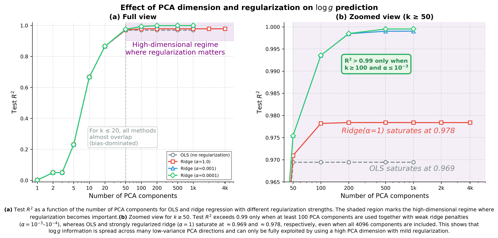

# 📘 📊 PCA + 线性回归：log g 信息维度实验报告
> **Name:** TODO | **ID:** `VIT-20251128-pca-01`  
> **Topic:** `pca` | **MVP:** MVP-X.X | **Project:** `VIT`  
> **Author:** Viska Wei | **Date:** 2025-11-28 | **Status:** 🔄
```
💡 实验目的  
决定：影响的决策
```

---


## 🔗 Upstream Links
| Type | Link |
|------|------|
| 🧠 Hub | `logg/pca/pca_hub.md` |
| 🗺️ Roadmap | `logg/pca/pca_roadmap.md` |

---

---

# ⚡ 核心结论速览（供 main 提取）

### 一句话总结

> **$\log g$ 信息分布在低方差 PCA 方向上，需要 100+ 个 PC 才能达到 $R^2 \geq 0.99$，线性模型可逼近 $R^2 \approx 0.9995$。**

### 对假设的验证

| 验证问题 | 结果 | 结论 |
|---------|------|------|
| PCA(10) 能否达到 $R^2 \geq 0.98$？ | ❌ 否，$R^2 = 0.67$ | "低维假设"不成立 |
| 达到 $R^2 \geq 0.99$ 需多少 PC？ | ✅ $k \geq 100$ | 有效维度 ~100-200 |
| $\log g$ 信息在哪些 PC 中？ | ✅ 分布在 PC 20-200 | 低方差方向重要 |

### 设计启示（1-2 条）

| 启示 | 具体建议 |
|------|---------|
| **Bottleneck ≥ 100 维** | NN 不能过度降维，PCA(10) 只保留 67% 信息 |
| **Variance-aware 正则** | 输入做 PCA + whitening，避免压制低方差方向 |

### 关键数字

| 指标 | 值 |
|------|-----|
| 最佳 $R^2$ | **0.99951** (Ridge α=0.0001, k=1000) |
| 达到 $R^2 \geq 0.99$ 的最小 k | **100** |
| 达到 $R^2 \geq 0.995$ 的最小 k | **200** |
| $\log g$ 有效信息维度 | **~100-200** |

---

# 📑 目录

- [1. 🎯 目标](#1--目标)
- [2. 🧪 实验设计](#2--实验设计experiment-design)
- [3. 📊 实验图表](#3--实验图表)
- [4. 💡 关键洞见](#4--关键洞见key-insights)
- [5. 📝 结论](#5--结论conclusion)
- [6. 📎 附录](#6--附录)

---

# 1. 🎯 目标

## 1.1 背景与动机

在设计用于恒星参数估计的神经网络时，一个核心问题是：**输入光谱的 4096 个像素中，究竟有多少维度的信息与 log g 相关？**

这个问题直接决定了：
- **网络容量**：如果 log g 信息是低维的（如 5-10 维），则 NN 的 bottleneck 层可以很窄
- **预处理策略**：是否可以先用 PCA 降维而不损失信息？
- **正则化强度**：有效自由度越低，需要的正则化越强

本实验通过 PCA + 线性回归的系统性扫描，量化 log g 在光谱空间中的**有效信息维度**，为后续 NN 架构设计提供理论依据。

## 1.2 核心假设

> **log g 由 flux 空间中的少数低维线性方向控制，用 $k \approx 5\text{-}10$ 个 PCA 分量即可达到 $R^2 \geq 0.98$。**

如果假设成立，意味着：
- log g 信息高度集中在前几个最大方差方向（PCA 分量）
- 神经网络只需学习一个低维线性映射
- 可以安全地用 PCA 预处理来降维

如果假设不成立，则需要重新理解 log g 在光谱空间中的几何分布。

## 1.3 验证问题

| # | 问题 | 验证目标 | 结果 |
|---|------|---------|------|
| Q1 | PCA(10) 能否达到 $R^2 \geq 0.98$？ | 验证"低维假设"是否成立 | ❌ 否，$R^2 = 0.67$ |
| Q2 | 达到 $R^2 \geq 0.99$ 需要多少个 PCA 分量？ | 量化 log g 的有效信息维度 | $k \geq 100$（弱正则） |
| Q3 | log g 信息在 PCA 空间中如何分布？ | 判断信息集中在高方差还是低方差方向 | 分布在大量**低方差**方向 |
| Q4 | 正则化强度 $\alpha$ 如何影响不同 $k$ 下的性能？ | 理解 bias-variance tradeoff | $k \leq 20$ 不敏感；$k > 50$ 小 $\alpha$ 显著优于大 $\alpha$ |
| Q5 | OLS 在高维 PCA 下是否过拟合？ | 评估正则化的必要性 | ✅ 是，$k > 50$ 后 OLS 的 $R^2$ 饱和在 ~0.97 |

## 1.4 结论摘要

### 1.4.1 实验结论

| 结论 | 说明 |
|------|------|
| **线性可逼近** | 使用 $k \sim 100\text{-}1000$ 个 PCA 分量 + 弱 Ridge 正则（$\alpha \approx 10^{-4}$），线性模型可达 $R^2 \approx 0.999$，接近 Bayes 极限 |
| **假设部分推翻** | log g 信息**不在**前几个最大方差方向；需要 $k \geq 100$ 才能达到 $R^2 \geq 0.99$ |
| **信息分布宽泛** | $w_j^2 \lambda_j$ 贡献谱在几百个分量上都保持显著，log g 依赖于**高维线性组合** |
| **正则化 = 维度选择** | 过强的 L2 会"剪掉"承载 log g 的低方差方向；小 $\alpha$ 能从高序号 PC 挖掘有效信号 |

### 1.4.2 对 NN 设计的启示

| 设计原则 | 具体建议 |
|---------|---------|
| **线性 shortcut** | 模型写成 $\hat{y} = w^\top x + g_\theta(x)$，让默认行为是线性的 |
| **Variance-aware 正则** | 输入前做 PCA + whitening，避免 weight decay 系统性压制低方差方向 |
| **容量不必大** | 线性模型已接近上限，NN 应侧重稳健性和不确定度估计 |
| **强 baseline** | 任何 NN 必须对比 Ridge 和 PCA+Ridge 基线 |

> **一句话总结**：log g 是一个**高维、分散在低方差方向上的近线性函数**。NN 设计应以"强线性先验 + variance-aware 正则 + 小非线性残差"为核心，而非盲目堆叠高容量非线性网络。

---

# 2. 🧪 实验设计（Experiment Design）

## 2.1 数据（Data）

| 配置项 | 值 |
|--------|-----|
| 训练样本数 | 32,000 |
| 测试样本数 | 512 |
| 原始特征维度 | 4,096 |
| 标签参数 | log g |
| 噪声水平 | 无噪声（clean flux） |

## 2.2 使用的特征类型

- **PCA 降维**：将 4096 维 flux 投影到前 $k$ 个主成分
- **PCA 维度范围**：$k \in \{1, 2, 3, 5, 10, 20, 50, 100, 200, 500, 1000, 2000, 4096\}$

**PCA 变换：**

$$
X_{\text{pca}} = (X - \bar{X}) V_k
$$

其中 $V_k \in \mathbb{R}^{4096 \times k}$ 为前 $k$ 个特征向量。

## 2.3 模型与算法（Model & Algorithm）

### Ridge 回归（L2 正则化线性回归）

$$
\hat{y} = X_{\text{pca}} w + b
$$

$$
w = (X_{\text{pca}}^\top X_{\text{pca}} + \alpha I)^{-1} X_{\text{pca}}^\top y
$$

### OLS（Ordinary Least Squares，无正则化）

$$
w = (X_{\text{pca}}^\top X_{\text{pca}})^{-1} X_{\text{pca}}^\top y
$$

## 2.4 超参数搜索空间

| 参数 | 搜索范围 |
|------|----------|
| PCA 维度 $k$ | 1, 2, 3, 5, 10, 20, 50, 100, 200, 500, 1000, 2000, 4096 |
| Ridge $\alpha$ | 0.0001, 0.001, 1.0 |
| OLS | 无正则化 |

## 2.5 实验配置汇总

| 实验目录 | 正则化 | 备注 |
|----------|--------|------|
| `pca_linear_regression/` | Ridge($\alpha=1.0$) | 强正则化 |
| `pca_linear_regression_a0.001/` | Ridge($\alpha=0.001$) | 中等正则化 |
| `pca_linear_regression_a0.0001/` | Ridge($\alpha=0.0001$) | 弱正则化 |
| `pca_linear_regression_ols/` | OLS | 无正则化 |

---

# 3. 📊 实验图表

## 📊 图 1：PCA 维度与正则化强度对 $\log g$ 预测的影响



**Figure 1. PCA 维度与正则化强度对 $\log g$ 预测测试 $R^2$ 的影响。**

**(a) 不同正则化配置下，测试 $R^2$ 随 PCA 维度 $k$ 的变化。** 浅色阴影表示高维区域，在该区域内正则化开始显著影响性能。

**(b) 放大视图（$k \geq 50$）。** 只有在使用至少约 100 个主成分并采用较弱的 Ridge 正则（$\alpha = 10^{-3}$–$10^{-4}$）时，测试 $R^2$ 才能超过 0.99；而 OLS 与强正则（$\alpha=1$）即使使用全部 4096 个分量，$R^2$ 也分别饱和在约 0.969 和 0.978。

**关键结论**：$\log g$ 的信息分散在大量低方差 PCA 方向上，只有在高维 PCA 空间配合适度正则化时才能被充分利用。

---

## 📊 图 2：累计解释方差 vs. $R^2$（打破"PCA 是万能的"幻觉）


**Figure 2. 累计解释方差 vs. $R^2$：即使前 95% 的 $X$ 方差已被解释，$\log g$ 的 $R^2$ 仍远未到位。**

**目的**：展示一个反直觉的事实：
> "即使前 95% 的 $X$ 方差已被解释，$\log g$ 的 $R^2$ 仍远未到位；
> 真正与 $\log g$ 相关的信息，藏在剩下那一点点 $X$ 方差里。"

**横轴计算**：PCA 的累计解释方差比

$$
\text{Cumulative Variance Ratio}(k) = \frac{\sum_{i=1}^{k} \lambda_i}{\sum_{j=1}^{D} \lambda_j}
$$

**图表设计**：

| 元素 | 设置 |
|------|------|
| **X 轴** | 累计解释方差（%）：80%, 90%, 95%, 98%, 99%, 99.5%, 99.9% |
| **Y 轴** | Test $R^2$（最优配置 Ridge $\alpha=0.001$） |
| **数据点** | 每个点对应一个 $k$，旁边小字标注 $k$ 值 |

**关键观察**：
- 即使前几个主成分已经解释了约 **97%** 的光谱方差（$k=5$），测试 $R^2$ 仍只有约 **0.23**
- 在 **99%** 方差（$k=10$）时，$R^2$ 也只有约 **0.67**
- 要达到 $R^2 > 0.97$ 并最终接近 $R^2 \gtrsim 0.999$，需要超过 **99.99%** 的方差以及 $k \gtrsim 100$ 个分量

**灰色虚线**表示假想关系 "$R^2$ = 解释的光谱方差"，真实曲线与其大幅偏离表明：

> **解释了大部分自变量方差 $\neq$ 解释了因变量方差。对 $\log g$ 来说，"剩余那几%的 $X$ 方差"才是关键。**

---

## 📊 图 3：PC 序号 vs. 对 $\log g$ 的贡献（$w^2 \lambda$）

| $k=200$ | $k=500$ |
|:-------:|:-------:|
|  |  |

**Figure 3. PC 序号 vs. 对 $\log g$ 的贡献：$\log g$ 的可解释方差由大量 PC 累加贡献，甚至不少贡献来自 index 很大的 PC。**

**目的**：展示 $\log g$ 的可解释方差由大量 PC 累加贡献，甚至不少贡献来自 index 很大的 PC。

**前提**：从训练好的 Ridge 模型提取系数。对于在 PCA 后的特征 $z_j$ 上的回归：
- 每个 PC $j$ 有 eigenvalue $\lambda_j$（对应方差）
- 回归系数 $w_j$（Ridge shrink 后的系数）
- 对 $y$ 方差的贡献近似为：

$$
\text{contribution}_j \approx w_j^2 \cdot \lambda_j
$$

**图表设计**：

| 元素 | 设置 |
|------|------|
| **X 轴** | PC index（$j = 1, 2, ..., k_{\max}$，$k_{\max} = 200$ 或 500） |
| **Y 轴（左）** | $\log_{10}(\lambda_j)$ — PCA eigen spectrum（蓝色虚线） |
| **Y 轴（右）** | $\log_{10}(w_j^2 \lambda_j)$ — 对 $\log g$ 方差的贡献（红色曲线） |

**关键观察**：
- **$\lambda_j$（蓝色虚线）**：单调下降近**四个数量级**（PCA 的自然特性）
- **$w_j^2 \lambda_j$（红色曲线）**：**不只集中在前几个 $j$**，而是 spread 到几十甚至上百个维度
- 贡献一直延伸到高序号、低方差成分

**结论**：
> **$\log g$ 信号在 PCA 基中是高度分散的，大量贡献来自低方差的模式。**

---

# 4. 💡 关键洞见（Key Insights）

## 4.1 宏观层洞见（用于指导 Neural Network 架构设计）

### 🔑 核心发现：log g 的"最重要特征方向"不是"方差最大的方向"

> **对 log g 而言，"最重要的特征方向"并不是"方差最大的方向"，而是很多方差很小的"细枝末节"方向的叠加。**

PCA 的"前几个分量"更多刻画的是"数据的主导变化（如 $T_{\text{eff}}$、金属丰度、仪器效应）"，而不是 log g 本身。

**关键证据：$R^2$ 曲线的三段式结构**

| 区间 | $R^2$ 表现 | 物理含义 |
|------|-----------|----------|
| $k \leq 20$ | 所有模型几乎重合（$R^2 \approx 0.67 \to 0.865$） | **Bias 主导**：特征不足，正则化无效 |
| $k \approx 20\text{-}50$ | 快速上升（$R^2: 0.865 \to 0.975$） | **信号富集区**：大量 log g 相关方向出现 |
| $k \geq 100$ | 曲线分化：小 $\alpha$ 继续上升，大 $\alpha$/OLS 饱和 | **Variance 主导**：谁能用好高阶 PC，谁赢 |

### 从 $R^2$ 曲线看 Bias–Variance 结构

以 Ridge $\alpha=0.0001$ 的 $1 - R^2$（残差误差）为例：

| $k$ | $1 - R^2$ | 相对上一级降幅 |
|-----|-----------|---------------|
| 10 | 0.333 | — |
| 20 | 0.134 | −60% |
| 50 | 0.0246 | −82% |
| 100 | 0.00646 | −74% |
| 200 | 0.00152 | −76% |
| 500 | 0.00050 | −67% |
| 1000 | 0.00049 | −2%（收敛） |

**规律**：残差按幂律/指数下降，直到触及"噪声地板"。

- $k \lesssim 50$：下降极快 → 任务相关信号集中在 PC 20–100
- $k \gtrsim 200$：增益微小 → 后续 PC 主要是高噪声、低信号
- $R^2 = 0.9995$ 很可能已接近 **Bayes error**（数据生成模型 + label 噪声的理论上限）

### log g 在 flux 特征空间的"几何位置"

从实验现象反推，log g 在 flux 特征空间里的几何特性：

| 特性 | 证据 | 含义 |
|------|------|------|
| **高维分布式** | 需要 50–100 个 PC 才饱和 | 不是单一方向，而是多模式的线性组合 |
| **投影在中小 eigenvalue 子空间** | 前 10 PC 只有 $R^2 \approx 0.67$ | 大方差方向被其他物理参数占据 |
| **信号弱但一致** | 小 $\alpha$ Ridge 能挖出"最后 1%"的 $R^2$ | 多个低方差方向的 coherent 叠加 |

**物理解释**：
- 大方差方向（PC1-PC10）对应 $T_{\text{eff}}$、[Fe/H]、仪器通道漂移等
- log g 更多体现在谱线形状的 subtle 变化，自然落在低方差 PC 上
- 在 flux PCA 空间里，**log g 像是"躲在很多角落里的小信号"，而非"占领舞台中央的大波动"**

### 对 NN 设计的核心启示

> **NN 需要学习的不是"前几个主要特征"，而是"多个细微特征的线性组合"。**

1. **有效自由度 ~100-200**
   - 不能简单用 PCA(10) 预处理
   - NN 需要至少 100 维的表达能力
   - Bottleneck 层不应小于 100 维

2. **信息聚合策略**
   - log g 不是 "dominant feature"
   - 需要从多个 "subtle features" 中 coherent 聚合
   - Attention 机制可能有助于识别关键分量

3. **正则化 = 有效维度控制**
   - $\alpha=1.0$ 等价于强行把"有效 DOF"压在前几十个 PC 上 → $R^2 \sim 0.978$
   - $\alpha=10^{-4}$ 允许模型信任更多高阶 PC → $R^2 \to 0.999+$
   - **对于"信号藏在低方差方向"的任务：宁可用更多特征 + 轻度正则化，也不要用少特征 + 重正则化**

## 4.2 模型层洞见（用于优化模型）

### $R^2$ 曲线的"相图"：三个关键区域

**观察：不同 $k$ 区间的模型行为完全不同**

| 区域 | $k$ 范围 | 现象 | 机制 |
|------|---------|------|------|
| **I. Bias 区** | $k \leq 20$ | 所有方法几乎重合 | 特征维度不足，正则化无用 |
| **II. 转折区** | $20 < k \leq 50$ | 快速上升，差异开始显现 | PC 20–50 富含 log g 信号 |
| **III. Variance 区** | $k > 50$ | 曲线剧烈分化 | 低方差 PC 的利用能力决定上限 |

### $k \leq 20$：Bias 主导

| $k$ | $R^2$（所有方法） | 解释 |
|-----|------------------|------|
| 10 | ~0.67 | 前 10 PC 本身就没有足够的 log g 信息 |
| 20 | ~0.865 | 所有模型 equally underfit |

**关键洞见**：此时正则化几乎不起作用，因为模型主要受限于 bias（特征不足），而不是 variance。

### $k \approx 50$：拐点区域

| 配置 | $R^2$ |
|------|-------|
| Ridge($\alpha$=0.0001) | 0.975 |
| Ridge($\alpha$=1.0) | 0.971 |
| OLS | 0.969 |

$k$ 从 20→50，$R^2$ 从 ~0.865→~0.975，提升巨大（+0.11）。

**关键洞见**：PC 20–50 里大量出现与 log g 强相关的方向，但整体噪声还不极端。

### $k \geq 100$："谁能用好高阶 PC，谁赢"

| $k$ | Ridge($\alpha$=0.0001) | Ridge($\alpha$=1.0) | OLS | 差距 |
|-----|------------------------|---------------------|-----|------|
| 100 | **0.994** | 0.978 | 0.969 | **2.5%** |
| 500 | **0.9995** | 0.978 | 0.969 | **3.1%** |
| 1000 | **0.99951** | 0.978 | 0.969 | **3.1%** |

**关键洞见**：

1. **log g 信号持续存在于 >100 个分量中**
2. **这些方向方差极小 + 噪声高** → OLS 完全 hold 不住，多加维度也不涨 test $R^2$
3. **小 $\alpha$ Ridge 利用"按 eigenvalue 加权 shrink"**，能从小方差方向挖出"最后 1% 的 $R^2$"
4. **大 $\alpha$ Ridge 等价于"只信任前几十个 PC"**，直接锁死在 ~0.978

### 最优 $\alpha$ 随 $k$ 的变化规律

| $k$ 范围 | 最优 $\alpha$ | 原因 |
|----------|--------------|------|
| $k \leq 20$ | **不敏感** | Bias 主导，正则化无效 |
| $20 < k \leq 50$ | ~0.001 | 中等正则化平衡 bias-variance |
| $k > 50$ | **0.0001** | 必须保留低方差分量中的信号 |

## 4.3 实验层细节洞见

### PCA 分量与 log g 的增量贡献分析

$$
\Delta R^2(k) = R^2(k) - R^2(k-1) \approx \text{第 } k \text{ 个分量对 log g 的增量贡献}
$$

| 分量范围 | $\Delta R^2$ | 累计 $R^2$ | 解读 |
|----------|-------------|-----------|------|
| PC 1-5 | +0.23 | 0.23 | 微弱的 log g 信息（被其他参数主导） |
| PC 5-10 | +0.44 | 0.67 | 开始出现 log g 相关模式 |
| PC 10-20 | +0.20 | 0.87 | 持续累积 |
| PC 20-50 | +0.11 | 0.975 | **信号富集区** |
| PC 50-100 | +0.02 | 0.994 | 精细调优 |
| PC 100-200 | +0.005 | 0.998 | 边际收益递减 |
| PC 200+ | +0.001 | 0.9995 | 逼近噪声地板 |

**结论**：log g 信息主要集中在 PC 5–100，但 PC 100–200 仍有不可忽略的 coherent 贡献。

### OLS vs Ridge 的分水岭：$k \approx 50$

| $k$ | OLS | Ridge($\alpha$=0.001) | 差距 |
|-----|-----|----------------------|------|
| 20 | 0.865 | 0.865 | 0% |
| 50 | 0.969 | 0.975 | 0.6% |
| 100 | 0.969 | **0.994** | **2.5%** |
| 500 | 0.969 | 0.999 | **3.0%** |

**关键观察**：OLS 的 $R^2$ 在 $k > 50$ 后完全停止增长！

**原因**：
- OLS 无法区分"信号方向"和"噪声方向"
- 高阶 PC 的噪声污染了回归系数
- Ridge 的"eigenvalue-weighted shrinkage"正好解决了这个问题

## 4.4 方法论启示

### ⚠️ Cautionary Tale: 无监督 PCA + 线性回归 ≠ 最优的监督降维

本实验清楚地说明：**如果只取"解释 $X$ 方差最多的前 5–10 个 PC"，会严重丢失 $y$ 信息。**

| 累计解释 $X$ 方差 | 大约对应 $k$ | log g 的 $R^2$ |
|------------------|-------------|---------------|
| ~95% | ~5-10 | 0.23–0.67 |
| ~99% | ~50-100 | 0.97–0.99 |
| ~99.9% | ~200+ | 0.998+ |

**关键 insight**：

$$
\text{解释了大部分 } X \text{ 方差} \neq \text{解释了 } y \text{ 方差}
$$

对 log g 来说，**"剩余那几%的 $X$ 方差"才是关键**。

### 对比方法建议

| 当前方法 | 问题 | 替代方案 |
|----------|------|---------|
| PCA + OLS | 无监督降维丢失 $y$ 信息 | Supervised PCA / PLS / CCA |
| 固定 $k$ 的 PCA | 可能欠拟合或过拟合 | 交叉验证选择最优 $k$ |
| 大 $\alpha$ Ridge | 过度压制低方差分量 | 自适应正则化 / Bayesian Ridge |

---

# 5. 📝 结论（Conclusion）

## 5.1 核心发现

> **对 $\log g$ 而言，"最重要的特征方向"不是"方差最大的方向"，而是很多方差很小的"细枝末节"方向的叠加。**

这一发现挑战了常见的 PCA 降维直觉：
- ❌ 原假设：前 5–10 个 PC 足以达到 $R^2 \geq 0.98$
- ✅ 实验结果：需要 **100+ 个 PC** 才能达到 $R^2 \geq 0.99$，最终可逼近 $R^2 \approx 0.9995$

## 5.2 三个关键结论

| # | 结论 | 证据 |
|---|------|------|
| 1 | **线性可逼近** | $k \sim 100\text{-}1000$ + 弱 Ridge（$\alpha \approx 10^{-4}$）可达 $R^2 \approx 0.999$ |
| 2 | **信息分布宽泛** | $\log g$ 信息不在前几个最大方差 PC，而是分散在 PC 20–200 的低方差方向 |
| 3 | **正则化 = 维度选择** | 过强 L2 会"剪掉"承载 $\log g$ 的低方差方向；小 $\alpha$ 能挖掘高序号 PC 中的信号 |

## 5.3 对 NN 设计的启示

### 架构原则

| 原则 | 建议 | 原因 |
|------|------|------|
| 不过度降维 | Bottleneck ≥ 100 维 | PCA(10) 只保留 67% 的 $\log g$ 信息 |
| 线性 shortcut | $\hat{y} = w^\top x + g_\theta(x)$ | 线性模型已接近上限，NN 侧重残差学习 |
| Variance-aware 正则 | 输入做 PCA + whitening | 避免 weight decay 系统性压制低方差方向 |

### 正则化策略

| $k$ 范围 | 推荐 $\alpha$ | 主导因素 |
|----------|--------------|----------|
| $k \leq 20$ | 不敏感 | Bias 主导 |
| $20 < k \leq 50$ | ~0.001 | 转折区 |
| $k > 50$ | **0.0001** | Variance 主导，需保留低方差信号 |

### ⚠️ "先 PCA 再回归"的陷阱

| 常见做法 | 实验证据 |
|----------|----------|
| "保留 95% 方差的 PC" | 95% $X$ 方差 → 只有 67% $R^2$ |
| "只用前 5-10 个 PC" | 需要 100+ PC 才达到 $R^2 > 0.99$ |
| "PCA 能去噪" | $\log g$ 信息恰好在"噪声般"的低方差 PC 中 |

**建议**：对于监督学习任务，考虑使用 **Supervised PCA / PLS / CCA** 等监督降维方法。

## 5.4 物理解释

**为什么 $\log g$ 信息分布在低方差 PC 中？**

- **大方差方向（PC1–10）** 被 $T_{\text{eff}}$、[Fe/H]、仪器效应占据
- **$\log g$ 效应** 体现在谱线翼部压力致宽、Ca II triplet 等**微妙形状变化**，自然落在低方差方向
- 有效信息维度 ~100，说明 $\log g$ 在光谱中是**分布式编码**的

## 5.5 关键数字速查

| 指标 | 值 |
|------|-----|
| 最佳 $R^2$ | **0.99951**（Ridge $\alpha=0.0001$, $k=1000$） |
| 达到 $R^2 \geq 0.99$ 的最小 $k$ | **100** |
| 达到 $R^2 \geq 0.995$ 的最小 $k$ | **200** |
| OLS / 强正则的性能天花板 | ~0.97 |
| $\log g$ 有效信息维度 | **~100–200** |

## 5.6 下一步工作

| 方向 | 具体任务 |
|------|----------|
| **物理解释** | 分析 PC 10–50 的波长权重，验证是否对应 Balmer / Ca II 谱线 |
| **噪声鲁棒性** | 在不同 SNR 下重复实验，观察最优 $k$ 的变化 |
| **NN 验证** | 验证 NN 是否能超越 PCA(100) + Ridge 基线（$R^2 = 0.994$） |

---

# 6. 📎 附录

## 6.1 数值结果表（Results）

### 6.1.1 完整对比表（Test $R^2$）

| k (PCA维度) | Ridge($\alpha$=0.0001) | Ridge($\alpha$=0.001) | Ridge($\alpha$=1.0) | OLS |
|------------:|----------------------:|---------------------:|-------------------:|----:|
| 1 | **0.00134** | **0.00134** | **0.00134** | **0.00134** |
| 2 | **0.04956** | **0.04956** | 0.04956 | **0.04956** |
| 3 | **0.04963** | 0.04963 | 0.04963 | 0.04963 |
| 5 | 0.23053 | **0.23053** | 0.23050 | 0.23053 |
| 10 | 0.66680 | 0.66680 | **0.66682** | 0.66680 |
| 20 | 0.86553 | **0.86553** | 0.86546 | 0.86553 |
| 50 | 0.97540 | **0.97540** | 0.97094 | 0.96942 |
| 100 | 0.99354 | **0.99356** | 0.97819 | 0.96942 |
| 200 | **0.99848** | 0.99843 | 0.97838 | 0.96943 |
| 500 | **0.99950** | 0.99900 | 0.97838 | 0.96942 |
| 1000 | **0.99951** | 0.99901 | 0.97838 | 0.96943 |
| 2000 | - | - | **0.97837** | - |
| 4096 | - | - | **0.97838** | - |

### 6.1.2 完整对比表（Test MAE）

| k (PCA维度) | Ridge($\alpha$=0.0001) | Ridge($\alpha$=0.001) | Ridge($\alpha$=1.0) | OLS |
|------------:|----------------------:|---------------------:|-------------------:|----:|
| 1 | 0.251072 | 0.251072 | **0.251072** | 0.251072 |
| 2 | 0.244564 | **0.244564** | 0.244564 | 0.244564 |
| 3 | **0.244627** | 0.244627 | 0.244628 | 0.244627 |
| 5 | 0.215716 | **0.215716** | 0.215732 | 0.215716 |
| 10 | **0.130799** | 0.130799 | 0.130802 | 0.130799 |
| 20 | 0.081294 | **0.081291** | 0.081403 | 0.081292 |
| 50 | 0.033522 | **0.033517** | 0.035142 | 0.037984 |
| 100 | 0.015970 | **0.015953** | 0.029513 | 0.037983 |
| 200 | **0.007535** | 0.007695 | 0.029396 | 0.037982 |
| 500 | **0.004237** | 0.006014 | 0.029397 | 0.037983 |
| 1000 | **0.004168** | 0.006008 | 0.029397 | 0.037982 |

### 6.1.3 每个 $k$ 的最佳配置

| k (PCA维度) | 最佳配置 | Test $R^2$ | Test MAE | Test RMSE |
|------------:|:---------|----------:|---------:|----------:|
| 1 | Ridge($\alpha$=1.0) | 0.00134 | 0.251072 | 0.291783 |
| 2 | Ridge($\alpha$=0.0001) | 0.04956 | 0.244564 | 0.284651 |
| 3 | Ridge($\alpha$=0.0001) | 0.04963 | 0.244627 | 0.284641 |
| 5 | Ridge($\alpha$=0.001) | 0.23053 | 0.215716 | 0.256122 |
| 10 | Ridge($\alpha$=1.0) | 0.66682 | 0.130802 | 0.168535 |
| 20 | Ridge($\alpha$=0.001) | 0.86553 | 0.081291 | 0.107068 |
| 50 | Ridge($\alpha$=0.001) | 0.97540 | 0.033517 | 0.045796 |
| **100** | Ridge($\alpha$=0.001) | **0.99356** | 0.015953 | 0.023423 |
| 200 | Ridge($\alpha$=0.0001) | 0.99848 | 0.007535 | 0.011385 |
| 500 | Ridge($\alpha$=0.0001) | 0.99950 | 0.004237 | 0.006527 |
| **1000** | Ridge($\alpha$=0.0001) | **0.99951** | **0.004168** | **0.006444** |

### 6.1.4 达到 $R^2 \geq 0.99$ 所需的最小 $k$

| 正则化配置 | 最小 $k$ ($R^2 \geq 0.99$) |
|------------|---------------------------|
| Ridge($\alpha$=0.0001) | **k = 100** |
| Ridge($\alpha$=0.001) | **k = 100** |
| Ridge($\alpha$=1.0) | ❌ 未达到 |
| OLS | ❌ 未达到 |

## 6.2 建议绘图（Plot Suggestions）

> 以下图表可进一步补充核心结论。

### 📊 建议图：正则化强度热力图

**设计规范**：

| 元素 | 设置 |
|------|------|
| **X 轴** | $\log_{10}(\alpha)$：−4, −3, 0 |
| **Y 轴** | PCA 维度 $k$（对数刻度） |
| **颜色** | Test $R^2$（colorbar） |

**目的**：可视化 $(\alpha, k)$ 的联合效应，展示最优区域。

## 6.3 相关文件

| 类型 | 路径 |
|------|------|
| 图表 | `exp/img/pca_*.png` |
| 结果 CSV | `results/pca_unified_results.csv` |
| 实验目录 | `results/pca_linear_regression*/` |

---

*Generated: 2025-11-28*
