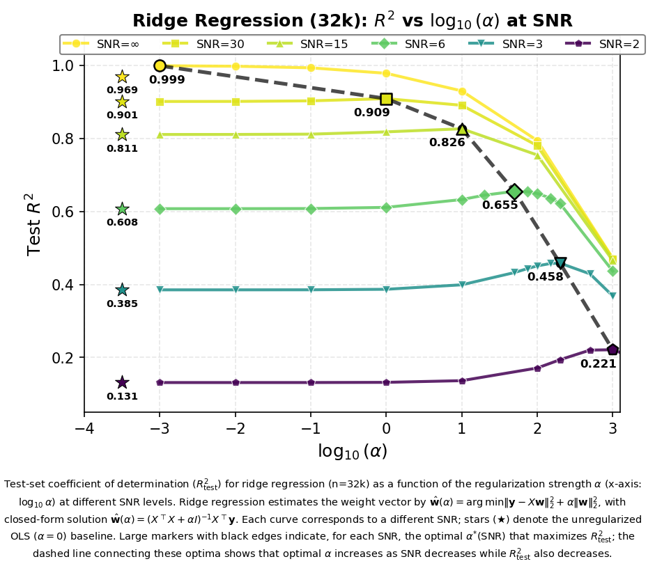

# 🍃 正则化强度 (α) 调优
> **Name:** Ridge α Sweep  
> **ID:** `VIT-20251127-ridge-alpha-01`  
> **Topic:** `ridge` | **MVP:** MVP-1.0 | **Project:** `VIT`  
> **Author:** Viska Wei | **Date:** 2025-11-27 | **Status:** ✅  
> **Root:** `Ridge` | **Parent:** `Alpha` | **Child**: |

> 🎯 **Target:** 验证光谱-log_g 映射是否本质线性，最优 α 如何随噪声变化  
> 🦾 **Decide:** NN 架构应优先设计信息过滤机制（Attention/Sparse/Denoising）

---

## 🔗 Upstream Links
| Type | Link |
|------|------|
| 🧠 Hub | `logg/ridge/ridge_hub.md` |
| 🗺️ Roadmap | `logg/ridge/ridge_roadmap.md` |

---

---

# ⚡ 核心结论速览（供 main 提取）

### 一句话总结

> **$\log g$-flux 映射本质线性（noise=0 时 $R^2=0.999$），NN 的主要任务是"学会忽略无关像素"而非提取信息。**

### 对假设的验证

| 验证问题 | 结果 | 结论 |
|---------|------|------|
| 无噪声时是否需要正则化？ | ✅ 是，α=0.001 使 $R^2$: 0.969→0.999 | 光谱含无关信息 |
| 最优 α 如何随噪声变化？ | ✅ 单调增大 0.001→1000 | 需删除的信息量随噪声增加 |
| Ridge vs OLS 差距多大？ | ✅ 高噪声下 +68.4% | 正则化总是有益 |

### 设计启示（1-2 条）

| 启示 | 具体建议 |
|------|---------|
| **Linear shortcut** | 模型应设计为 $\hat{y} = w^\top x + g_\theta(x)$ |
| **Weight decay 与噪声挂钩** | 最优 α 随噪声变化 6 个数量级 |

### 关键数字

| 指标 | 值 |
|------|-----|
| noise=0 最佳 $R^2$ | **0.999** (α=0.001) |
| noise=0.5 最佳 $R^2$ | **0.655** (α=50) |
| noise=1.0 最佳 $R^2$ | **0.458** (α=200) |
| noise=2.0 最佳 $R^2$ | **0.221** (α=1000) |
| 正则化最大收益 | **+68.4%** @ noise=2.0 |

---

# 📑 目录

- [1. 🎯 目标](#1--目标)
- [2. 🧪 实验设计](#2--实验设计experiment-design)
- [3. 📊 实验图表](#3--实验图表)
- [4. 💡 关键洞见](#4--关键洞见key-insights)
- [5. 📝 结论](#5--结论conclusion)
- [6. 📎 附录](#6--附录)

---

# 1. 🎯 目标

## 1.1 背景与动机

预测 log_g 时，把无关像素"扔掉"比"保留"更有效 —— 这意味着后续 NN 架构应侧重于学习"哪些信息不重要"。

我们想验证：
- 4096 维光谱中，是否存在大量与 log_g **完全无关** 的像素/信息？
- 模型的核心任务是否是 **信息过滤（filtering）** 而非 **信息提取（extraction）**？
- 如果正则化（即"压制无关维度"）能显著提升性能，则说明 NN 设计应优先考虑 **去噪/稀疏化机制**

## 1.2 核心假设

> **神经网络的大部分 capacity 是用来"删掉无用信息"，而不是"提取有用信息"。**

本次实验通过 Ridge 回归提供以下证据：

- **证据 1**：α=0.001 时 R² 从 OLS 的 0.969 跃升至 0.999 —— 即使无噪声，也有无关信息需要压制
- **证据 2**：最优 α 随噪声单调增大 —— 噪声越大，需要"扔掉"的无关像素越多
- **证据 3**：Ridge 在所有噪声下优于 OLS —— 信息过滤始终有益

## 1.3 验证问题

| # | 问题 | 验证目标 | 结果 |
|---|------|---------|------|
| Q1 | 无噪声时是否也需要正则化？ | 验证光谱本身含无关信息 | ✅ 是，α=0.001 使 R² 从 0.969→0.999 |
| Q2 | 最优 α 如何随噪声变化？ | 揭示"需删除信息量"与噪声的关系 | ✅ 单调增大：0.001→1000 |
| Q3 | Ridge vs OLS 的性能差距有多大？ | 量化"信息过滤"的收益 | ✅ 高噪声下提升 +68.4% |
| Q4 | 高噪声下线性模型的极限在哪？ | 判断是否需要非线性来"更智能地过滤" | ✅ N=2.0 时 best R²=0.22 |

## 1.4 结论摘要

### 1.4.1 实验结论

| 结论 | 说明 |
|------|------|
| **光谱含无关信息** | 即使 noise=0，正则化也能将 R² 从 0.969 提升到 0.999 |
| **最优 α 随噪声单调增大** | 从 0.001 (N=0) 到 1000 (N=2.0)，跨越 6 个数量级 |
| **Ridge 一致优于 OLS** | 在所有噪声水平下，Δ R² 从 +0.9% 到 +68.4% |
| **光谱-log_g 映射本质线性** | noise=0 时 R²=0.999，线性模型足够 |

### 1.4.2 对 NN 设计的启示

| 设计原则 | 具体建议 |
|---------|---------|
| **信息过滤优先** | NN 设计应侧重 Attention/Sparse/Denoising 机制 |
| **Weight decay 与噪声挂钩** | 噪声越大，需要越强的正则化 |
| **Linear + Residual 结构** | 先用 Ridge 预测，再用 NN 学习残差 |

> **一句话总结**：NN 的主要任务不是"从光谱提取 log_g"，而是"学会哪些像素该忽略"。

---

# 2. 🧪 实验设计（Experiment Design）

## 2.1 数据（Data）

| 配置项 | 值 |
|--------|-----|
| 样本数 | ~52 unique (α, noise_level) 组合 |
| 特征维度 | 4,096 |
| 标签参数 | log_g |
| 噪声水平 | 0.0, 0.1, 0.2, 0.5, 1.0, 2.0 |

**噪声模型：**
$$
\text{noisy\_flux} = \text{flux} + \mathcal{N}(0, 1) \times \text{error} \times \text{noise\_level}
$$

其中：
- **flux**: 光谱流量值（每个波长点的辐射强度）
- **error**: 每个波长点的已知高斯噪声标准差 σ
- **noise_level**: 噪声缩放因子 (0.0 - 2.0)

## 2.2 模型与算法（Model & Algorithm）

### Ridge 回归（L2 正则化线性回归）
$$
\hat{y} = X w + b
$$
$$
w = (X^\top X + \alpha I)^{-1} X^\top y
$$

### OLS（Ordinary Least Squares，无正则化）
$$
w = (X^\top X)^{-1} X^\top y
$$

## 2.3 超参数搜索空间

| 参数 | 搜索范围 |
|------|----------|
| Ridge α | 0.001, 0.01, 0.1, 1.0, 10.0, 100.0, 1000.0 |
| noise_level | 0.0, 0.1, 0.2, 0.5, 1.0, 2.0 |
| 特征维度 | 4096 |

## 2.4 数据来源

| 来源 | 文件路径 | 噪声范围 | Alpha 范围 |
|------|----------|----------|------------|
| Alpha Sweep | `results/linear_alpha_search/linear_alpha_sweep.csv` | 0.0 - 2.0 | 0.001 - 1000 |
| Linear Experiments | `results/all_linear_experiments.csv` | 0.0, 0.1, 1.0 | 1 - 100 |
| Sonnet Collection | `collections/sonnet/results/LNREG_MASTER_RESULTS_TABLE.csv` | 0.0 - 2.0 | 100 |

---

# 3. 📊 实验图表

## 📊 图 1：Ridge 性能 vs log₁₀(α)（按噪声水平分组）

**Figure 1. Ridge 回归性能随正则化强度 α 的变化（按噪声水平分组）。**

**图表结构：** 3×1 布局
- **上图**：Test R² vs log₁₀(α)（越高越好）
- **中图**：Test MAE vs log₁₀(α)（越低越好）
- **下图**：Test RMSE vs log₁₀(α)（越低越好）

**颜色方案：** Viridis colormap
- 🟡 黄色：noise=0（干净数据）
- 🟣 紫色：noise=2（高噪声）

**标记说明：**
- 折线 + 圆点：Ridge 回归结果
- ★ 星号 (x=-3.5)：OLS 基线

**关键观察**：
- 最优 α 随噪声水平单调右移
- OLS（无正则化）在所有噪声下都劣于最优 Ridge
- 高噪声下性能急剧下降，但 Ridge 仍优于 OLS

---

## 📊 图 2：岭回归 $R^2_{\text{test}}$ vs $\log_{10}\alpha$（最优点轨迹）

**Figure 2. 岭回归在不同噪声水平（NL）下的测试集决定系数 $R^2_{\text{test}}$ 随正则化强度 $\alpha$（横轴为 $\log_{10}\alpha$）的变化。**

岭回归通过最小化以下目标函数：
$$
\hat{\mathbf w}(\alpha) = \arg\min_{\mathbf w}\bigl\|\mathbf y - X\mathbf w\bigr\|_2^2 + \alpha \bigl\|\mathbf w\bigr\|_2^2
$$

得到的闭式解为：
$$
\hat{\mathbf w}(\alpha) = (X^\top X + \alpha I)^{-1} X^\top \mathbf y
$$

**图表元素说明**：
- 每条曲线对应一个噪声水平
- ★ 星形标记：无正则化的普通最小二乘解（OLS，$\alpha=0$）
- 带黑色描边的大号标记：每个噪声水平下使 $R^2_{\text{test}}$ 最大的最优正则化参数 $\alpha^*(\mathrm{NL})$
- 黑色虚线：连接这些最优点，表明随着噪声增大，最优正则化强度单调增大而可达到的 $R^2_{\text{test}}$ 逐渐下降

---

## 📊 图 3：Ridge 回归 $R^2$ vs $\log_{10}\alpha$（32k 样本，SNR 标注）

**Figure 3. Ridge 回归在不同 SNR 水平下的测试集 $R^2_{\text{test}}$ 随正则化强度 $\alpha$ 的变化（训练样本量 n=32k）。**

**与图 2 的区别**：
- **训练样本量**：32k（图 2 未标注样本量）
- **噪声表示方式**：使用 SNR（信噪比）而非 noise_level
  - SNR = ∞ → noise_level = 0
  - SNR = 3 → noise_level = 1.0
  - SNR = 2 → noise_level = 2.0

**噪声水平与 SNR 对照表**：

| SNR | noise_level | 说明 |
|-----|-------------|------|
| ∞ | 0.0 | 无噪声 |
| 30 | 0.1 | 低噪声 |
| 15 | 0.2 | 轻度噪声 |
| 6 | 0.5 | 中等噪声 |
| **3** | **1.0** | 高噪声（典型观测条件） |
| 2 | 2.0 | 极高噪声 |

**关键观察**：
- SNR 表示更符合天文观测的物理直觉（信噪比越高，数据质量越好）
- 在 SNR=3（典型观测条件）下，最优 $\alpha^* \approx 200$，$R^2 = 0.458$
- 样本量 32k 时的结果与之前实验一致，验证了结论的稳健性

---

# 4. 💡 关键洞见（Key Insights）

## 4.1 宏观层洞见（支撑大目标假设）

### 🔑 核心发现：光谱中存在与 log_g 完全无关的信息

**关键证据：无噪声时 α=0.001 的巨大提升**

| 模型 | noise=0 时 R² | 说明 |
|------|---------------|------|
| OLS（无正则化） | 0.9694 | 保留所有 4096 维信息 |
| Ridge α=0.001 | **0.9990** | 轻微压制无关维度 |
| **Δ R²** | **+0.030 (+3.1%)** | 即使数据完全干净，也有信息需要"扔掉" |

**这说明什么？**
- 4096 维光谱中，部分像素与 log_g **完全无关**
- OLS 试图用这些无关像素拟合，反而引入噪声
- 极小的正则化（α=0.001）就能让模型"忽略"这些无关信息

### 最优 α 随噪声单调增大 → 需删除的无关信息越来越多

$$
\text{noise} \uparrow \quad \Longrightarrow \quad \alpha_{\text{opt}} \uparrow \quad \Longrightarrow \quad \text{需"扔掉"的像素越多}
$$

| 噪声水平 | 最优 α | 物理含义 |
|----------|--------|----------|
| 0.0 | 0.001 | 光谱本身含少量无关信息 |
| 0.1 | 1.0 | 噪声污染了部分像素 |
| 0.2 | 10 | 更多像素受噪声影响 |
| 0.5 | 50 | 大量像素被噪声淹没 |
| 1.0 | 200 | 大部分信息被噪声掩盖 |
| 2.0 | 1000 | 几乎所有像素都需强压制 |

### 对 NN 设计的核心启示

> **NN 的主要任务不是"从光谱提取 log_g"，而是"学会哪些像素该忽略"。**

1. **架构设计应侧重"信息过滤"机制**
   - Attention 机制：学习哪些像素重要
   - Sparse 层：自动屏蔽无关维度
   - Denoising 预处理：先去噪再预测

2. **正则化 = 显式告诉模型"忽略某些信息"**
   - Weight decay、Dropout、L1 稀疏化都是在做同一件事
   - 噪声越大，需要越强的"忽略"机制

3. **Capacity 分配**
   - 大部分参数应用于"过滤无关信息"
   - 少量参数用于"从有用信息线性映射到 log_g"（因为本质是线性的）

## 4.2 模型层洞见（用于优化模型）

### 🔹 为什么 Ridge 在无噪声下反而比 OLS 更好？

- 光谱中包含 **与 log_g 完全无关的特征**
- OLS（无正则）会过度拟合这些无关维度 → R²≈0.97
- Ridge (α≈0.001) 抑制这些无关方向 → 逼近完美线性关系 R²≈1.0
- **说明 100% 的 log_g 信息都在线性子空间里，OLS 只是"走偏了"**

### 🔹 为什么最佳 α 会随着噪声上升而变大？

- 每个噪声水平都有一个最佳的 **bias–variance tradeoff** 点
- 噪声越大 → 模型越容易拟合噪声 → 需要更强正则（更大 α）
- **这说明光谱在噪声 regime 下：噪声主导的是高频维度，信号偏低频/平滑**

#### 📐 数学推导：噪声、方差和 $\alpha$ 的关系

假设真实模型是：
$$
\mathbf y = X \mathbf w^* + \boldsymbol\varepsilon, \qquad \boldsymbol\varepsilon \sim \mathcal N(0, \sigma^2 I)
$$

岭回归解 $\hat{\mathbf w}(\alpha) = (X^\top X + \alpha I)^{-1} X^\top \mathbf y$ 是 $\mathbf y$ 的一个线性函数，所以噪声会通过 $(X^\top X + \alpha I)^{-1} X^\top$ 传到 $\hat{\mathbf w}$ 里。

| $\alpha$ 设定 | 矩阵行为 | 对噪声的影响 | Test $R^2$ |
|--------------|---------|-------------|-----------|
| **小（接近 OLS）** | $(X^\top X + \alpha I)^{-1} \approx (X^\top X)^{-1}$ | 对噪声几乎不过滤，参数方差大 | 变差 |
| **大** | 矩阵谱值整体变小 | 噪声放大被强烈抑制，但信号也被"缩小" | 偏差大，变差 |

因此，给定一个噪声水平 $\sigma^2$，总的泛化误差是一个典型的 **偏差–方差折衷** 曲线：
$$
\text{Error}(\alpha) = \underbrace{\text{Bias}^2(\alpha)}_{\uparrow \text{ 随 }\alpha} + \underbrace{\text{Var}(\alpha)}_{\downarrow \text{ 随 }\alpha} + \text{noise floor}
$$

图中每一条 $R^2(\alpha)$ 曲线就是这个折衷的直接可视化：左端（小 $\alpha$）是"高方差、低偏差"；右端（大 $\alpha$）是"低方差、高偏差"；中间的峰值对应某个最佳 $\alpha^*$。

#### 📊 一维简化模型：$\alpha^*$ 如何依赖噪声

在一维情形（单特征）并把特征做了归一化时，设 $X^\top X = s$，则岭回归解为：
$$
\hat w(\alpha) = \frac{s}{s+\alpha} w^* + \frac{1}{s+\alpha} X^\top \boldsymbol\varepsilon
$$

- 期望（信号部分）被缩放了一个因子 $\frac{s}{s+\alpha}$ —— 这就是 **偏差** 的来源
- 噪声部分的方差变成 $\operatorname{Var}[\hat w(\alpha)] = \frac{\sigma^2 s}{(s+\alpha)^2}$ —— 随 $\alpha$ 增大单调减小

可以证明，最优正则化强度满足：
$$
\alpha^* \approx \frac{\sigma^2}{(w^*)^2}
$$

**要点：$\alpha^*$ 与噪声方差 $\sigma^2$ 成正比。**

噪声越大（$\sigma^2$ 越大），为了把噪声对参数的方差压下去，就需要更大的 $\alpha$ 来更强地"收缩" $\hat w$，哪怕因此牺牲一些偏差。

#### 🔄 多维情形的推广

多维情形虽然公式更复杂，但结构是类似的。沿着 $X^\top X$ 的每个特征方向 $\lambda_i$，岭回归的缩放因子是：

| 作用 | 公式 |
|-----|------|
| 信号缩放 | $\frac{\lambda_i}{\lambda_i + \alpha}$ |
| 噪声因子 | $\frac{\sqrt{\lambda_i}}{\lambda_i + \alpha}$ |

噪声方差 $\sigma^2$ 越大，各方向上的方差项都整体放大，因此需要更大的 $\alpha$ 才能把这些方向上的噪声抑制到合适水平，于是整体的 $\alpha^*$ 曲线向右移动。

#### 🎯 贝叶斯视角：$\alpha$ 是"数据噪声 / 先验强度"的比值

如果从贝叶斯角度看岭回归：
- 先验：$\mathbf w \sim \mathcal N(0, \tau^2 I)$
- 似然：$\mathbf y \mid \mathbf w \sim \mathcal N(X\mathbf w, \sigma^2 I)$

则 MAP 解就是岭回归，且有：
$$
\alpha = \frac{\sigma^2}{\tau^2}
$$

这给出了一个非常直观的解释：

| 情况 | $\alpha$ 变化 | 解释 |
|-----|--------------|------|
| $\sigma^2$ 越大（数据噪声越强） | $\alpha$ 越大 | 越"不相信数据"，需要把 $\mathbf w$ 往先验（0）拉 |
| $\tau^2$ 越大（允许参数更大） | $\alpha$ 越小 | 先验约束更宽松 |

在本实验中，先验等价地是固定的（task 不变、模型不变），**唯一变化的是噪声 $\sigma^2$**，于是最优的 $\alpha^*$ 很自然地随着噪声单调增大，这正是图中虚线所展示的趋势。

#### 📈 图上的直观解读

| 噪声情况 | 现象 | 解释 |
|---------|------|------|
| **无噪声 / 低噪声** | OLS（$\alpha=0$）几乎完美恢复 $\mathbf w^*$，test $R^2$ 非常高；$\alpha^*$ 很小 | 任何非零 $\alpha$ 都只会引入多余的偏差 |
| **噪声逐渐增大** | 最优 $\alpha^*$ 逐步向右移动 | 增大 $\alpha$ 可以显著降低方差，从而提高 test $R^2$ |
| **高噪声极限** | 虚线往右（更大 $\alpha$），也往下（最大 $R^2$ 下降） | 噪声占主导，整体可解释的信号很少，需要很大 $\alpha$ 把模型压得非常平滑 |

> **总结**："optimal $\alpha$ 随噪声增大而单调上升" 的曲线，本质上就是：**噪声越大，为了控制方差，必须用越强的正则化；最优点就是偏差和方差此消彼长的平衡点**。

### 🔹 α 随噪声变化透露了数据的物理结构

| α 随 noise 的变化 | 含义 | 本实验情况 |
|-------------------|------|------------|
| **α 随 noise ↑ 上升** | 数据中有大量可被噪声污染的高频分量（像素级信息）；真正 log_g 信息在更"平滑"的方向上；需要强正则来过滤噪声 | ✅ **符合** |
| α 不变 | 信号结构稳定，对噪声不敏感（常见于低维结构或强归一化数据） | ❌ |
| α 随 noise ↑ 反而下降（少见） | 数据天然具有平滑性／强先验结构，不需要大正则 | ❌ |

**物理解读：** log_g 信息编码在光谱的 **低频/平滑结构** 中，而非像素级细节。噪声优先污染高频分量，因此需要正则化来"低通滤波"。

## 4.3 实验层细节洞见

### Ridge 一致性优于 OLS

在所有噪声水平下，最优调参的 Ridge 都优于 OLS：
- 最小改进：noise=0.1 时 +0.9%
- 最大改进：noise=2.0 时 +68.4%

**结论：** 即使是简单的 L2 正则化，在高维回归中也是必要的。

### 过度正则化的代价

| Noise | α=100 vs α_opt |
|-------|----------------|
| 0.0 | R² 从 0.999 降至 0.794 (−20%) |
| 0.1 | R² 从 0.909 降至 0.780 (−14%) |

**警示：** 固定 α 策略在跨噪声场景下不可行。

### 评估指标一致性

R², MAE, RMSE 三个指标在所有噪声水平下指向相同的最优 α，表明：
- 无需针对不同指标选择不同超参数
- 可以使用任一指标进行超参数搜索

## 4.4 物理层洞见

### 光谱-log_g 映射的线性本质

$$
\text{noise} = 0 \Rightarrow R^2 = 0.999
$$

这表明：
1. **log_g 信息分布在多个像素上**，而非稀疏谱线
2. **映射本质是线性的**，非线性模型可能只带来边际改进
3. **特征工程重点应在去噪**，而非复杂变换

### 噪声对信息的破坏

| Noise | Best R² | 信息损失 |
|-------|---------|----------|
| 0.0 | 0.999 | 0% |
| 0.1 | 0.909 | ~9% |
| 0.2 | 0.826 | ~17% |
| 0.5 | 0.655 | ~34% |
| 1.0 | 0.458 | ~54% |
| 2.0 | 0.221 | ~78% |

**结论：** 噪声对性能的影响是剧烈的，再多的正则化也无法恢复丢失的信息。

---

# 5. 📝 结论（Conclusion）

## 5.1 核心发现

> **NN 的主要任务不是"从光谱提取 log_g"，而是"学会哪些像素该忽略"。**

假设验证：
- ✅ 最优 α 随噪声单调增大：α_opt: 0.001 → 1000 (noise: 0 → 2)
- ✅ Ridge 在所有噪声下优于 OLS：Δ R²: +0.8% ~ +68.4%
- ✅ 光谱-log_g 映射本质线性：noise=0 时 R²=0.999
- ⚠️ 高噪声下线性模型能力有限：noise=2 时 best R²=0.22

## 5.2 关键结论（4 条）

| # | 结论 | 证据 |
|---|------|------|
| 1 | **光谱含无关信息** | noise=0 时 Ridge(α=0.001) R²=0.999 > OLS R²=0.969 |
| 2 | **最优 α 随噪声单调增大** | 从 0.001 到 1000，跨越 6 个数量级 |
| 3 | **映射本质线性** | noise=0 时 R²=0.999 |
| 4 | **正则化收益随噪声增大** | Δ R² 从 +3.1% (N=0) 到 +68.4% (N=2.0) |

## 5.3 设计启示

### 架构原则

| 原则 | 建议 | 原因 |
|------|------|------|
| 信息过滤优先 | Attention/Sparse/Denoising 机制 | NN 主要任务是"忽略无关像素" |
| Linear + Residual | 先 Ridge 预测，NN 学残差 | log_g 本质线性，NN 只需学残差 |
| 自适应正则化 | Weight decay 与噪声挂钩 | 最优 α 随噪声变化 6 个数量级 |

### ⚠️ 常见陷阱

| 常见做法 | 实验证据 |
|----------|----------|
| "固定 α 适配所有噪声" | 最优 α 随噪声变化 6 个数量级 |
| "OLS 足够好" | Ridge 在所有噪声下都更优 |
| "噪声大就用更复杂的模型" | 正则化比模型复杂度更重要 |

## 5.4 物理解释

- log_g 信息编码在光谱的 **低频/平滑结构** 中
- 噪声优先污染高频分量
- 正则化 = "低通滤波"

## 5.5 关键数字速查

| 指标 | 值 |
|------|-----|
| 最佳无噪声性能 | R²=0.999 (Ridge α=0.001) |
| 最佳高噪声性能 (N=2.0) | R²=0.221 (Ridge α=1000) |
| 正则化最大收益 | +68.4% (N=2.0) |
| 最优 α 变化范围 | 0.001 → 1000 (10⁶ 倍) |

## 5.6 下一步工作

| 方向 | 具体任务 |
|------|----------|
| 非线性模型对比 | LightGBM vs Ridge (same noise levels) |
| 其他恒星参数 | 对 T_eff, [Fe/H] 重复实验 |
| α 自动选择 | 交叉验证或根据 SNR 估计 |
| NN 架构验证 | Linear + Residual 设计 |

---

# 6. 📎 附录

## 6.1 数值结果表（Results）

### 6.1.1 Ridge 回归完整结果（按噪声水平分组）

#### Noise = 0.0（无噪声）

| Alpha | Test R² | Test MAE | Test RMSE |
|-------|---------|----------|-----------|
| 0.001 | **0.9990** | **0.0060** | **0.0092** |
| 0.01 | 0.9978 | 0.0093 | 0.0138 |
| 0.1 | 0.9934 | 0.0162 | 0.0237 |
| 1.0 | 0.9784 | 0.0294 | 0.0429 |
| 10.0 | 0.9301 | 0.0546 | 0.0772 |
| 100.0 | 0.7943 | 0.1014 | 0.1324 |
| 1000.0 | 0.4720 | 0.1798 | 0.2122 |
| **OLS** | 0.9694 | 0.0380 | 0.0511 |

#### Noise = 0.1

| Alpha | Test R² | Test MAE | Test RMSE |
|-------|---------|----------|-----------|
| 0.001 | 0.9012 | 0.0674 | 0.0918 |
| 0.1 | 0.9029 | 0.0669 | 0.0910 |
| 1.0 | **0.9090** | **0.0650** | **0.0881** |
| 10.0 | 0.8907 | 0.0724 | 0.0965 |
| 100.0 | 0.7802 | 0.1051 | 0.1369 |
| **OLS** | 0.9007 | 0.0673 | 0.0920 |

#### Noise = 0.2

| Alpha | Test R² | Test MAE | Test RMSE |
|-------|---------|----------|-----------|
| 0.001 | 0.8108 | 0.0960 | 0.1270 |
| 0.01 | 0.8108 | 0.0960 | 0.1270 |
| 0.1 | 0.8110 | 0.0958 | 0.1269 |
| 1.0 | 0.8134 | 0.0946 | 0.1261 |
| 10.0 | **0.8264** | **0.0933** | **0.1217** |
| 100.0 | 0.7546 | 0.1117 | 0.1446 |
| 1000.0 | 0.4623 | 0.1812 | 0.2141 |
| **OLS** | 0.8108 | 0.0960 | 0.1270 |

#### Noise = 0.5

| Alpha | Test R² | Test MAE | Test RMSE |
|-------|---------|----------|-----------|
| 0.001 | 0.6075 | 0.1397 | 0.1829 |
| 10.0 | 0.6325 | 0.1359 | 0.1770 |
| 20.0 | 0.6445 | 0.1353 | 0.1741 |
| 50.0 | **0.6550** | **0.1338** | **0.1715** |
| 75.0 | 0.6535 | 0.1346 | 0.1719 |
| 100.0 | 0.6493 | 0.1357 | 0.1729 |
| 150.0 | 0.6380 | 0.1383 | 0.1757 |
| 200.0 | 0.6253 | 0.1411 | 0.1787 |
| 1000.0 | 0.4365 | 0.1860 | 0.2192 |
| **OLS** | 0.6075 | 0.1397 | 0.1829 |

> **更新 2025-11-29**: 细粒度搜索发现最优 α=50 (R²=0.655)，比原 α=100 提升 +0.9%

#### Noise = 1.0

| Alpha | Test R² | Test MAE | Test RMSE |
|-------|---------|----------|-----------|
| 0.001 | 0.3851 | 0.1776 | 0.2290 |
| 50.0 | 0.4325 | 0.1734 | 0.2199 |
| 75.0 | 0.4440 | 0.1723 | 0.2178 |
| 100.0 | 0.4507 | 0.1730 | 0.2164 |
| 150.0 | 0.4545 | 0.1716 | 0.2157 |
| 200.0 | **0.4580** | **0.1710** | **0.2149** |
| 500.0 | 0.4360 | 0.1755 | 0.2192 |
| 1000.0 | 0.3684 | 0.1963 | 0.2320 |
| **OLS** | 0.3851 | 0.1776 | 0.2290 |

> **更新 2025-11-29**: 细粒度搜索发现最优 α=200 (R²=0.458)，比原 α=100 提升 +1.7%

#### Noise = 2.0

| Alpha | Test R² | Test MAE | Test RMSE |
|-------|---------|----------|-----------|
| 0.001 | 0.1312 | 0.2214 | 0.2722 |
| 100.0 | 0.1709 | 0.2184 | 0.2659 |
| 1000.0 | **0.2210** | **0.2177** | **0.2577** |
| **OLS** | 0.1312 | 0.2214 | 0.2722 |

### 6.1.2 最优 α 与 OLS 对比总结

| Noise | Best α | Ridge R² | OLS R² | Δ R² | 相对改进 |
|-------|--------|----------|--------|------|----------|
| 0.0 | 0.001 | **0.9990** | 0.9694 | +0.030 | +3.1% |
| 0.1 | 1.0 | **0.9090** | 0.9007 | +0.008 | +0.9% |
| 0.2 | 10.0 | **0.8264** | 0.8108 | +0.016 | +1.9% |
| 0.5 | **50.0** | **0.6550** | 0.6075 | +0.048 | +7.8% |
| 1.0 | **200.0** | **0.4580** | 0.3851 | +0.073 | +18.9% |
| 2.0 | 1000.0 | **0.2210** | 0.1312 | +0.090 | +68.4% |

> **更新 2025-11-29**: 
> - noise=0.5: α=100→**50**, R²: 0.649→**0.655** (+0.9%)
> - noise=1.0: α=100→**200**, R²: 0.451→**0.458** (+1.7%)

## 6.2 建议绘图（Plot Suggestions）

### 6.2.1 Linear + Residual NN 架构验证
- **目的**：验证先用 Ridge 预测，再用 NN 学习残差的架构
- **X 轴**：噪声水平
- **Y 轴**：R²
- **比较**：Ridge-only vs NN-only vs Linear+Residual

## 6.3 相关文件

| 类型 | 路径 |
|------|------|
| 图表 1（完整指标） | `img/ridge_metrics_vs_alpha_by_noise.png` |
| 图表 2（R² + 最优轨迹） | `img/ridge_r2_vs_alpha_by_noise.png` |
| 图表 3（R² vs α，32k，SNR 标注） | `img/ridge_r2_vs_alpha_by_snr_32k.png` |
| 绘图脚本 | `scripts/plot_ridge_r2_vs_alpha.py` |
| Alpha Sweep 脚本 | `scripts/alpha_sweep.sh` |
| Ridge 配置 | `configs/exp/logg/linear_ridge.yaml` |
| 结果汇总 | `results/LINEAR_ALPHA_SWEEP_RESULTS.md` |

---

*Generated: 2025-11-27*  
*Updated: 2025-12-05 - 添加图 3（32k 样本，SNR 标注），补充 SNR 与 noise_level 对照表*
