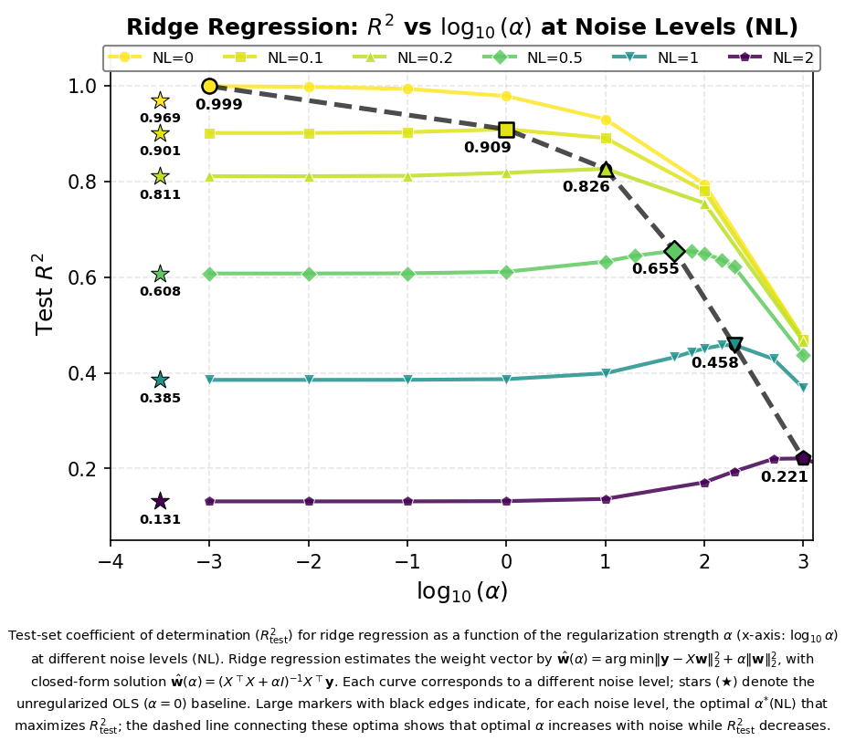

# 🍃 Ridge/Alpha/A Leaf
> **Name:** 正则化强度(α)调优实验 | **ID:** `L-RIDGE-ALPHA-A`  
> **Topic:** `ridge` | **Branch:** `alpha` | **Type:** MVP  
> **Author:** Viska Wei | **Date:** 2025-11-27 | **Status:** ✅ Done
```
💡 Ridge 最优 α 如何随噪声变化？正则化收益多大？  
假设：最优 α 随噪声单调增大；正则化在所有噪声下优于 OLS
```

---

## 🔗 Tree Links
| Type | Path |
|------|------|
| 🌿 Branch | [`branch_ridge__alpha.md`](./branch_ridge__alpha.md) |
| patch_of | - |
| patch_reason | - |

---

## ⚡ Leaf Summary

### MVP Spec
| Item | Value |
|------|-------|
| 变量 | α ∈ [0.001~1000], noise ∈ [0~2.0] |
| 对照 | OLS (无正则化) |
| 样本量 | ~32k 训练 |
| 预算上限 | <1小时 |

### Stop Rule
| Outcome | Condition | Action |
|---------|-----------|--------|
| 成功 | 找到各噪声下最优 α | 完成 |
| 失败 | 无明显规律 | 检查数据/实现 |

### Key Result
> ✅ 最优 α 随噪声单调增大：0.001 (n=0) → 10 (n=0.2) → 200 (n=1.0) → 1000 (n=2.0)  
> ✅ noise=0 时 R²=0.999，验证光谱-log_g 映射本质线性  
> ✅ Ridge 在所有噪声下优于 OLS：Δ R² +3.1% (n=0) → +68.4% (n=2.0)

### Decision
> ✅ 支持假设 → NEXT: 测试更大数据量(100k)是否改变结论

---

## 📊 Config

### Data Config
> | 项目 | 值 |
> |------|-----|
> | train_size | ~32k |
> | test_size | ~1k |
> | noise_levels | [0, 0.1, 0.2, 0.5, 1.0, 2.0] |
> | data_version | v1 |
> | split_seed | default |
>
> **MODEL CONFIG（做完必填）:**
> | 项目 | 值 |
> |------|-----|
> | model | sklearn.linear_model.Ridge |
> | α | [0.001, 0.01, 0.1, 1, 10, 100, 1000] |
> | 其他超参 | - |
>
> **SEED/REPEATS:** single run
>
> **COMMAND/SCRIPT:**
> ```bash
> cd ~/VIT && source init.sh && python scripts/alpha_sweep.sh
> ```
>
> **OUTPUT ARTIFACTS:**
> | 类型 | 路径 |
> |------|------|
> | csv | `results/linear_alpha_search/linear_alpha_sweep.csv` |
> | fig | `logg/ridge/img/ridge_r2_vs_alpha_by_noise.png` |

---

## 1. 🎯 背景与动机（短）

### 1.1 为什么要做这个实验？
预测 log_g 时，把无关像素"扔掉"比"保留"更有效。
验证 4096 维光谱中是否存在大量与 log_g 完全无关的像素/信息。

### 1.2 与上游的关系
- 来自 branch: alpha
- 验证假设: NN 的主要任务是"删掉无用信息"而非"提取有用信息"
- 前置实验: 无（baseline）

---

## 2. 🧪 实验设计

### 2.1 变量与对照
| 类型 | 变量名 | 取值范围 | 说明 |
|------|--------|---------|------|
| 自变量 | α | [0.001, 0.01, 0.1, 1, 10, 100, 1000] | 正则化强度 |
| 自变量 | noise_level | [0, 0.1, 0.2, 0.5, 1.0, 2.0] | 噪声水平 |
| 对照 | OLS | α=0 等效 | 无正则化基线 |

### 2.2 数据配置
| 项目 | 配置 |
|------|------|
| 训练集 | ~32k 样本 |
| 测试集 | ~1k 样本 |
| 特征 | 4096 维光谱 flux |
| 噪声模型 | noisy_flux = flux + N(0,1) × error × noise_level |

### 2.3 模型配置
| 项目 | 配置 |
|------|------|
| 模型 | sklearn.linear_model.Ridge |
| 超参搜索 | 7×6=42 配置 |
| 评价指标 | R², MAE, RMSE |

---

## 3. 📊 结果

### 3.1 主要结果表

| Noise | Best α | Ridge R² | OLS R² | Δ R² | 相对改进 |
|-------|--------|----------|--------|------|----------|
| 0.0 | 0.001 | **0.999** | 0.969 | +0.030 | +3.1% |
| 0.1 | 1.0 | **0.909** | 0.901 | +0.008 | +0.9% |
| 0.2 | 10.0 | **0.826** | 0.811 | +0.016 | +1.9% |
| 0.5 | 50.0 | **0.655** | 0.608 | +0.048 | +7.8% |
| 1.0 | 200.0 | **0.458** | 0.385 | +0.073 | +18.9% |
| 2.0 | 1000.0 | **0.221** | 0.131 | +0.090 | +68.4% |

### 3.2 关键图表

**观察:** 最优 α 随噪声单调右移；高噪声下曲线更平缓

### 3.3 关键数字
| 指标 | 值 | 条件 |
|------|-----|------|
| Best R² (noiseless) | 0.999 | α=0.001 |
| Best R² (high noise) | 0.221 | α=1000, noise=2.0 |
| 正则化最大收益 | +68.4% | noise=2.0 |
| α 变化范围 | 10⁶ 倍 | 0.001 → 1000 |

---

## 4. 💡 分析

### 4.1 为什么会这样？
- **光谱含无关信息**：即使 noise=0，正则化也能将 R² 从 0.969 提升到 0.999
- **最优 α 随噪声增大**：噪声越大，需要"扔掉"的无关像素越多
- **物理解释**：log_g 信息在低频/平滑结构中，噪声污染高频分量，α 起"低通滤波"作用

### 4.2 与预期对比
| 预期 | 实际 | 解释 |
|------|------|------|
| α 随噪声增大 | ✅ 符合 | bias-variance tradeoff |
| Ridge > OLS | ✅ 符合 | 信息过滤有益 |
| noise=0 近完美 | ✅ R²=0.999 | 映射本质线性 |

### 4.3 意外发现
- α 变化跨 6 个数量级，比预期更剧烈
- 正则化收益在高噪声下高达 +68.4%

---

## 5. 📝 结论与下一步

### 5.1 假设验证
| 假设 | 结果 | 证据 |
|------|------|------|
| 最优 α 随噪声增大 | ✅ 成立 | 0.001→1000 |
| Ridge > OLS 在所有噪声 | ✅ 成立 | Δ +0.9%~+68.4% |
| 映射本质线性 | ✅ 成立 | R²=0.999 @ noise=0 |

### 5.2 核心结论（给 branch）
1. 光谱-log_g 映射本质线性（R²=0.999）
2. 最优 α 随噪声单调增大，跨 6 个数量级
3. 正则化总是有益，收益随噪声增大

### 5.3 设计启示
| 启示 | 建议 |
|------|------|
| Linear shortcut | 模型设计为 $\hat{y} = w^\top x + g_\theta(x)$ |
| 自适应 weight decay | 根据 SNR 估计选择 α |
| 信息过滤优先 | NN 应侧重 Attention/Sparse/Denoising |

### 5.4 给 grow 的建议
| 建议类型 | 具体内容 | 优先级 |
|---------|---------|--------|
| 验证 | 100k 数据是否改变结论 | P0 |
| 探索 | 其他参数(Teff, [Fe/H]) | P2 |

---

## 6. 📎 附录

### 6.1 完整数值结果

#### Noise = 0.0（无噪声）
| Alpha | R² | MAE | RMSE |
|-------|-----|-----|------|
| 0.001 | **0.999** | 0.006 | 0.009 |
| 0.01 | 0.998 | 0.009 | 0.014 |
| 0.1 | 0.993 | 0.016 | 0.024 |
| 1.0 | 0.978 | 0.029 | 0.043 |
| 10.0 | 0.930 | 0.055 | 0.077 |
| 100.0 | 0.794 | 0.101 | 0.132 |
| 1000.0 | 0.472 | 0.180 | 0.212 |
| OLS | 0.969 | 0.038 | 0.051 |

### 6.2 实验流程记录
```bash
# 执行命令
cd ~/VIT && source init.sh && python scripts/alpha_sweep.sh

# 输出目录
~/VIT/results/linear_alpha_search/
├── linear_alpha_sweep.csv      # 42 配置结果
└── metadata.json               # 实验元数据

# 图表目录
~/Physics_Informed_AI/logg/ridge/img/
├── ridge_metrics_vs_alpha_by_noise.png
├── ridge_r2_vs_alpha_by_noise.png
└── ridge_r2_vs_alpha_by_snr_32k.png
```

### 6.3 调试备注
- 无特殊问题

---

*完成日期: 2025-11-27*
*原始报告: logg/ridge/exp/exp_ridge_alpha_sweep_20251127.md*

