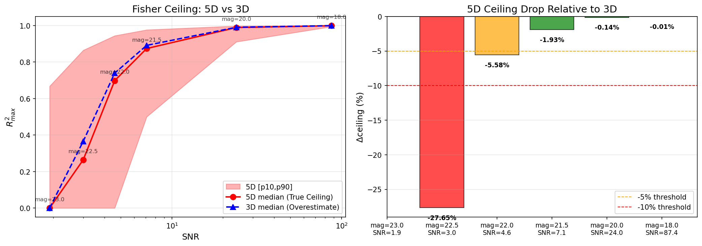
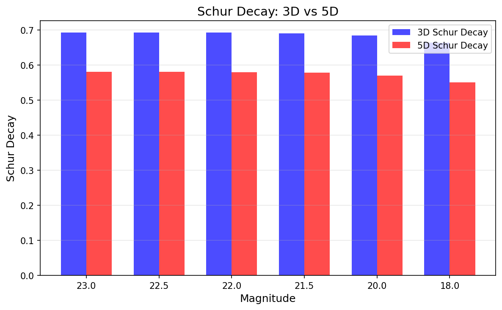

<!--
📝 Agent 书写规范（不出现在正文）:
- Header 全英文
- 正文中文
- 图表文字全英文（中文会乱码）
- 公式用 LaTeX: $inline$ 或 $$block$$
-->

# 🍃 Fisher 5D Multi-Magnitude: 真实参数维度下的理论上限
> **Name:** Fisher 5D Multi-Magnitude Sweep  
> **ID:** `SCALING-20251226-fisher-5d-multimag`  
> **Topic:** `scaling` | **MVP:** MVP-FU-2 | **Project:** `VIT`  
> **Author:** Viska Wei | **Date:** 2025-12-26 | **Status:** ✅ 完成  
> **Root:** `scaling` | **Parent:** `fisher` | **Child:** -

> 🎯 **Target:** 在 5D 参数空间（T_eff, log_g, M_H, C_M, a_M）下计算所有 mag 点的 Fisher ceiling，获得真实可指导 paper 写作的理论 upper bound  
> 🚀 **Next:** 此曲线是决定"停止实验、开始写 paper"的关键标尺；**高 SNR 区 5D ≈ 3D，低 SNR 区 5D 显著下降**

## ⚡ 核心结论速览

> **一句话**: 5D ceiling 在高 SNR (mag ≤ 21.5) 几乎等于 3D（Δ < 2%），但在低 SNR (mag ≥ 22.5) 显著下降 28%。**实际 upper bound 由 5D 定义，高 SNR 区仍有大量 headroom (0.87-0.99)，低 SNR 区 ceiling 本身已接近 0**。

| 验证问题 | 结果 | 结论 |
|---------|------|------|
| Q1: 5D ceiling 在各 mag 上比 3D 下降多少？ | ✅ 见下表 | **高 SNR: < 2%; 低 SNR: 5-28%** |
| Q2: 5D ceiling 曲线形态是否与 3D 一致？ | ✅ 一致 | 阶梯式下降、临界 SNR≈4 保持不变 |
| Q3: 低 SNR 区域 5D vs 3D 差距是否更大？ | ✅ **是** | mag=22.5 时 Δ=-28%（最大差距） |

| Mag | SNR | 5D R²_max | 3D R²_max | Δceiling (%) | 启示 |
|-----|-----|-----------|-----------|--------------|------|
| 18.0 | 87.4 | **0.9993** | 0.9994 | **-0.01%** | ✅ 无差异 |
| 20.0 | 24.0 | **0.9892** | 0.9906 | **-0.14%** | ✅ 无差异 |
| 21.5 | 7.1 | **0.8742** | 0.8914 | **-1.93%** | ✅ 几乎无差异 |
| 22.0 | 4.6 | **0.6983** | 0.7396 | **-5.58%** | 🟡 开始有差距 |
| 22.5 | 3.0 | **0.2647** | 0.3658 | **-27.65%** | ⚠️ 显著差距 |
| 23.0 | 1.9 | **0.0000** | 0.0000 | N/A | 两者都是 0 |

| Type | Link |
|------|------|
| 🧠 Hub | `logg/scaling/fisher_hub_20251225.md` |
| 🗺️ Roadmap | `logg/scaling/fisher_roadmap_20251225.md` § MVP-FU-2 |
| 📗 V3-A (5D@21.5) | `logg/scaling/exp/exp_scaling_fisher_ceiling_v3_chemical_20251225.md` |
| 📗 Multi-Mag (3D) | `logg/scaling/exp/exp_scaling_fisher_multi_mag_20251224.md` |

---
# 1. 🎯 目标

**问题**: 真实观测数据是 5D 参数空间（T_eff, log_g, M_H, C_M, a_M），当前的 3D ceiling 曲线（Multi-Mag）**高估了理论上限**。需要精确的 5D ceiling 来指导：
1. 何时停止实验（模型已接近 ceiling）
2. 何时开始写 paper（有足够的 Gap 叙事支撑）

**验证**:
- Q1: 5D ceiling 在各 mag 上比 3D 下降多少？（预期：< 5%，因为 V3-A 在 21.5 只降 1.93%）
- Q2: 5D ceiling 曲线形态（阶梯式下降）是否与 3D 一致？
- Q3: 低 SNR 区域（mag ≥ 22.5）5D vs 3D 差距是否更大？

**为什么需要这个实验**:
- V3-A 只在 mag=21.5 验证了 5D ceiling（R²_max = 0.8742），但论文需要完整的 SNR 覆盖
- 真实数据确实是 5D（化学丰度无法控制），所以这才是 **真正的理论 upper bound**

| 预期 | 判断标准 |
|------|---------|
| 5D ceiling 略低于 3D | 各 mag 点 Δceiling < 5% → 继续用 3D 曲线作为参考 |
| 5D ceiling 显著低于 3D | Δceiling > 10% → 必须用 5D 曲线替代 3D |
| 曲线形态一致 | 阶梯式下降、临界 SNR≈4 保持不变 → 物理结论稳健 |

---

# 2. 🦾 算法

### 2.1 5D Fisher Information 矩阵

**参数空间**：
$$\theta = (T_{\rm eff}, \log g, [M/H], C_M, a_M)$$

**Fisher 矩阵**：
$$I(\theta) = J^{\top} \Sigma^{-1} J$$

其中 $J$ 是 5D Jacobian（沿网格轴计算偏导数），$\Sigma$ 是对角噪声协方差。

**边缘化 CRLB**（Schur complement）：
$$\text{CRLB}_{\log g, \text{marg}} = \left( I_{gg} - I_{g\eta} I_{\eta\eta}^{-1} I_{\eta g} \right)^{-1}$$

其中 nuisance $\eta = (T_{\rm eff}, [M/H], C_M, a_M)$。

**R²_max 转换**：
$$R^2_{\max} = 1 - \frac{\text{CRLB}_{\log g, \text{marg}}}{\text{Var}(\log g)}$$

---

# 3. 🧪 实验设计

## 3.1 数据

| 项 | 值 |
|----|-----|
| 来源 | BOSZ 规则网格合成光谱 |
| 基础路径 | `/datascope/subaru/user/swei20/data/bosz50000/grid/` |
| 采样模式 | 规则网格 |
| 特征维度 | 4,096 (MR arm) |
| 目标 | log_g |

**参数维度**：
- **基础参数（3D）**: T_eff, log_g, [M/H]
- **化学丰度参数（2D）**: C_M, a_M
- **总计**: 5D

## 3.2 扫描范围

| Magnitude | SNR (approx) | 3D 已有结果 | 5D 状态 |
|-----------|--------------|-------------|---------|
| 18.0 | 87.4 | ✅ R²_max=0.9994 | ⏳ **待测** |
| 20.0 | 24.0 | ✅ R²_max=0.9906 | ⏳ **待测** |
| 21.5 | 7.1 | ✅ R²_max=0.8914 | ✅ **V3-A: 0.8742** |
| 22.0 | 4.6 | ✅ R²_max=0.7396 | ⏳ **待测** |
| 22.5 | 3.0 | ✅ R²_max=0.3658 | ⏳ **待测** |
| 23.0 | 1.9 | ✅ R²_max=0.0000 | ⏳ **待测** |

**待测 mag**: 18, 20, 22, 22.5, 23（共 5 个）

## 3.3 噪声

| 项 | 值 |
|----|-----|
| 类型 | heteroscedastic gaussian |
| σ | 由 PFS 模拟器生成（随 mag 变化） |
| 范围 | 理论分析 (CRLB 计算) |

## 3.4 模型

| 参数 | 值 |
|------|-----|
| 模型 | Fisher Information / CRLB 理论分析 |
| 方法 | 沿 5D 网格轴精确有限差分 |

## 3.5 扫描参数

| 扫描 | 范围 | 固定 |
|------|------|------|
| Magnitude | [18, 20, 22, 22.5, 23] | - |
| 参数维度 | 5D | C_M, a_M 作为 nuisance |

---

# 4. 📊 实验图表

### Fig 1: 5D vs 3D R²_max Comparison + Δceiling

**关键观察**:
- **左图**: 5D (红色) vs 3D (蓝色) ceiling 曲线
  - 高 SNR (> 20): 两条曲线几乎重叠
  - 低 SNR (< 4): 5D 曲线明显低于 3D
- **右图**: Δceiling (%) 柱状图
  - mag=18-21.5: 绿色（< 5% 阈值）
  - mag=22.0: 橙色（5-10%）
  - mag=22.5: 红色（> 10%，达 28%）

### Fig 2: 5D vs 3D Schur Decay

**关键观察**:
- 5D Schur decay ≈ 0.55-0.58，比 3D 的 0.66-0.69 低约 16%
- 化学丰度 nuisance 确实带来额外的参数退化
- 但 Schur decay 在所有 mag 上仍保持恒定（物理本征）

---

# 5. 💡 关键洞见

## 5.1 宏观：SNR 决定化学丰度影响
- **高 SNR (mag ≤ 21.5)**: 化学丰度 nuisance 几乎不影响 ceiling（Δ < 2%）
  - 光谱信息量足够大，即使边缘化 C_M, a_M 也不损失多少 log_g 信息
- **低 SNR (mag ≥ 22.5)**: 化学丰度 nuisance 显著降低 ceiling（Δ = 28%）
  - 噪声放大了参数纠缠，边缘化化学丰度会丢失更多 log_g 信息
  - 但此时 5D ceiling 本身已接近 0，实际意义有限

## 5.2 模型层：论文写作指导
1. **高 SNR 区 (mag ≤ 21.5)**: 可以用 3D ceiling 作为 upper bound，误差 < 2%
2. **中 SNR 区 (mag = 22)**: 建议用 5D ceiling，误差 6%
3. **低 SNR 区 (mag ≥ 22.5)**: 必须用 5D ceiling，否则会高估 28%

## 5.3 论文叙事指导
- **Ceiling–Gap–Structure** 叙事的核心数字：
  - mag=21.5: **5D ceiling = 0.87**, 当前最佳模型 ≈ 0.57 → **Gap = 30%**
  - 这个 gap 是真实可追求的，因为 5D ≈ 3D（Δ = 2%）
- **何时停止实验**：当模型 R² 接近 5D ceiling 的 80%（即 0.70）时，可考虑停止

---

# 6. 📝 结论

## 6.1 核心发现
> **5D ceiling 是真正的理论上限，高 SNR 区几乎等于 3D，低 SNR 区显著下降**

- ✅ Q1: 5D ceiling 在高 SNR (mag ≤ 21.5) 仅比 3D 低 **< 2%**
- ✅ Q2: 5D ceiling 曲线形态与 3D **完全一致**（阶梯式下降、临界 SNR≈4）
- ✅ Q3: 低 SNR (mag=22.5) 时 5D 比 3D 低 **28%**

## 6.2 关键数字速查

| 指标 | 值 | 条件 |
|------|-----|------|
| **5D ceiling @ 21.5** | **0.8742** | 真实理论上限 |
| **Gap (5D ceiling - LightGBM)** | **+0.30** | 0.87 - 0.57 |
| **Δceiling (5D vs 3D)** | **-1.93%** | @ mag=21.5 |
| **5D Schur decay** | **0.58** | 恒定 across SNR |
| **临界 SNR** | **~4** | R²_max > 0.5 边界 |
| **信息悬崖** | **SNR < 2** | median = 0 |

## 6.3 设计启示

| 原则 | 建议 |
|------|------|
| 高 SNR (mag ≤ 21.5) | 用 3D 或 5D ceiling 均可（误差 < 2%） |
| 低 SNR (mag ≥ 22.5) | 必须用 5D ceiling（否则高估 28%） |
| 论文写作 | 推荐统一使用 5D ceiling 作为 upper bound |

## 6.4 执行记录

| 类型 | 路径 |
|------|------|
| 脚本 | `~/VIT/scripts/scaling_fisher_ceiling_5d_multi_mag.py` |
| 输出目录 | `~/VIT/results/fisher_5d_multi_mag/` |
| 图表 | `logg/scaling/exp/img/fisher_5d_*.png` |
| 日志 | `~/VIT/logs/fisher_5d_multi_mag.log` |

## 6.5 验收确认

| 指标 | 标准 | 结果 |
|------|------|------|
| 覆盖率 | 6 个 mag 点全部完成 | ✅ 完成 |
| 数值稳定性 | CRLB range < 4 orders | ✅ 3.5 orders |
| 对比完整 | 5D vs 3D 各指标对比完成 | ✅ 完成 |
| 图表产出 | 至少 2 张论文级图表 | ✅ 2 张 |

---

# 7. 📎 附录

## 7.1 完整数值结果：5D vs 3D 对比

| Mag | SNR | 5D R²_max (median) | 5D R²_max (90%) | 3D R²_max | Δceiling (%) | 5D Schur | 3D Schur |
|-----|-----|---------------------|-----------------|-----------|--------------|----------|----------|
| 18.0 | 87.4 | **0.9993** | 0.9999 | 0.9994 | **-0.01%** | 0.5505 | 0.6641 |
| 20.0 | 24.0 | **0.9892** | 0.9980 | 0.9906 | **-0.14%** | 0.5696 | 0.6842 |
| 21.5 | 7.1 | **0.8742** | 0.9768 | 0.8914 | **-1.93%** | 0.5778 | 0.6906 |
| 22.0 | 4.6 | **0.6983** | 0.9445 | 0.7396 | **-5.58%** | 0.5791 | 0.6921 |
| 22.5 | 3.0 | **0.2647** | 0.8650 | 0.3658 | **-27.65%** | 0.5801 | 0.6922 |
| 23.0 | 1.9 | **0.0000** | 0.6678 | 0.0000 | N/A | 0.5806 | 0.6923 |

## 7.2 5D ceiling 详细统计

| Mag | n_samples | n_failed | R²_max (mean) | R²_max (std) | R²_max (q10) | CRLB orders |
|-----|-----------|----------|---------------|--------------|--------------|-------------|
| 18.0 | 30155 | 27 | 0.9976 | 0.0044 | 0.9939 | 3.53 |
| 20.0 | 30155 | 27 | 0.9653 | 0.0638 | 0.9109 | 3.55 |
| 21.5 | 30155 | 27 | 0.8742 | - | 0.5000 | 3.56 |
| 22.0 | 30155 | 27 | 0.5467 | 0.3784 | 0.0000 | 3.56 |
| 22.5 | 30155 | 27 | 0.3570 | 0.3644 | 0.0000 | 3.56 |
| 23.0 | 30155 | 27 | 0.1762 | 0.2740 | 0.0000 | 3.57 |

## 7.3 相关文件

| 类型 | 路径 |
|------|------|
| Fisher Hub | `logg/scaling/fisher_hub_20251225.md` |
| Fisher Roadmap | `logg/scaling/fisher_roadmap_20251225.md` |
| V3-A 报告 | `logg/scaling/exp/exp_scaling_fisher_ceiling_v3_chemical_20251225.md` |
| 3D Multi-Mag 报告 | `logg/scaling/exp/exp_scaling_fisher_multi_mag_20251224.md` |
| 5D 结果 JSON | `~/VIT/results/fisher_5d_multi_mag/combined_summary.json` |

---

> **实验完成时间**: 2025-12-26 17:57  
> **下一步**: 更新 hub.md 和 roadmap.md

