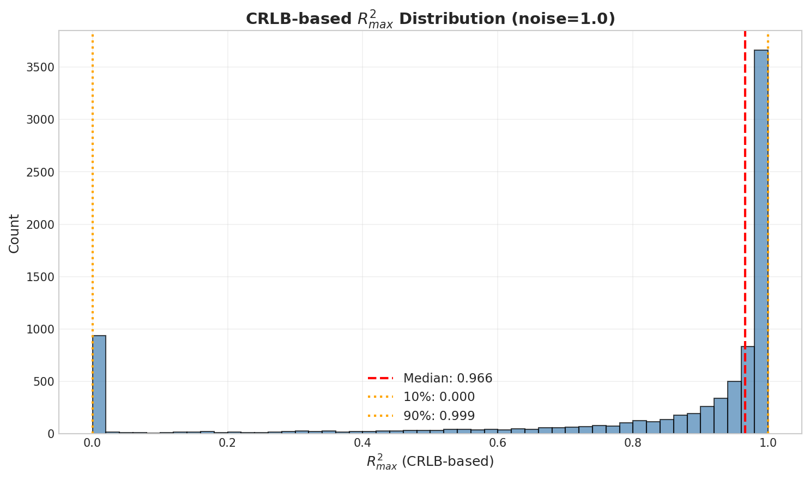
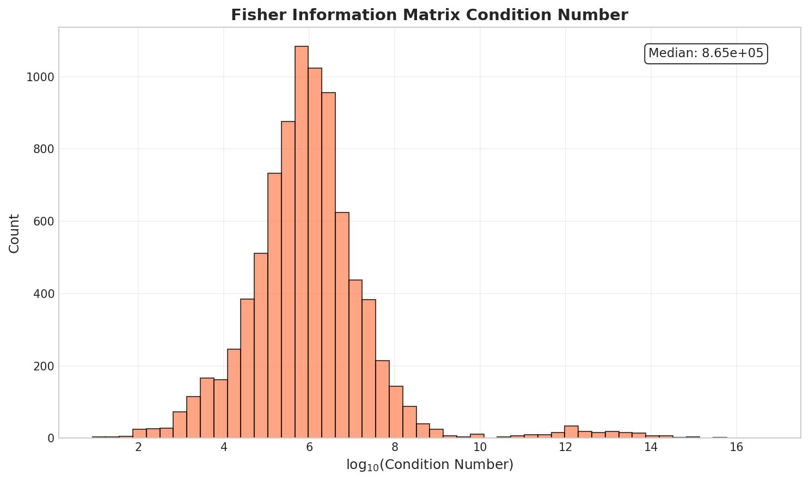
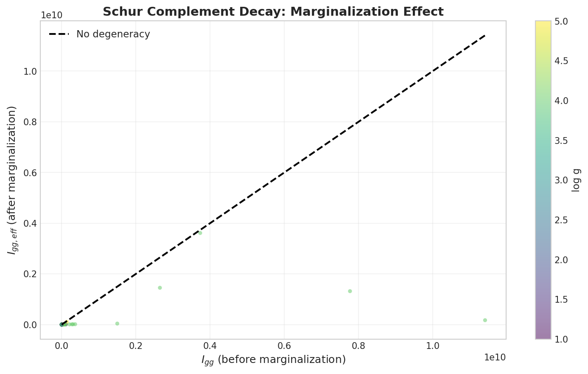
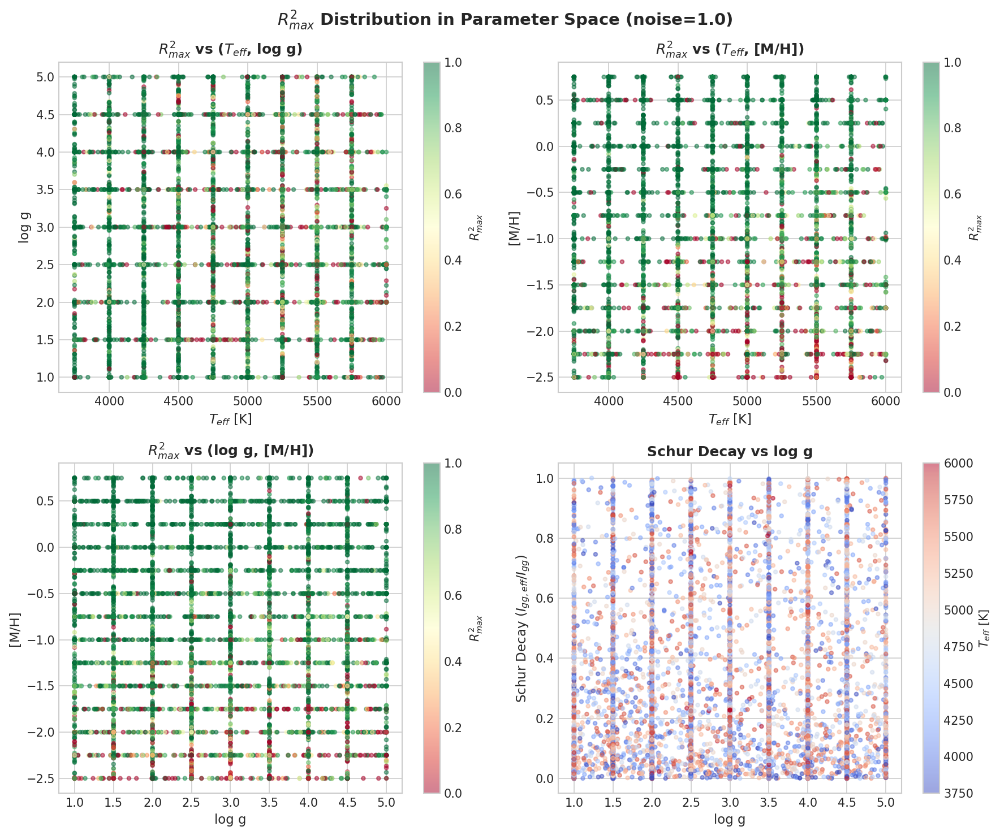
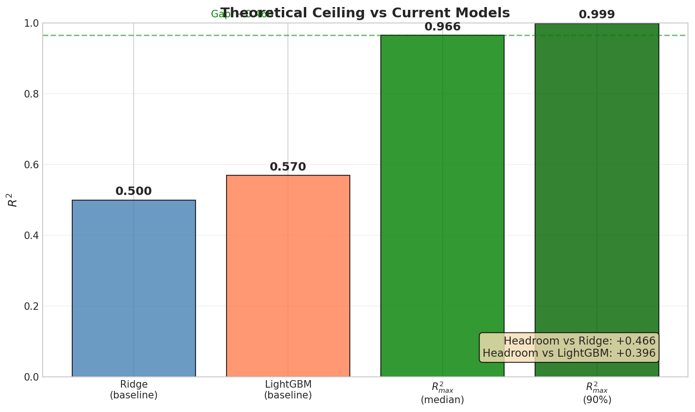

# 📘 Experiment Report: Fisher/CRLB 理论上限

---
> **Name:** Fisher/CRLB Theoretical Upper Bound for noise=1  
> **ID:**  `SCALING-20251223-fisher-ceiling-01`  
> **Topic ｜ MVP:** `scaling` ｜ MVP-16T (P0 最高优先级)  
> **Author:** Viska Wei  
> **Date:** 2025-12-23  
> **Project:** `VIT`  
> **Status:** ✅ Done ⚠️ **需校准**（R²_max=0.97 可能因"偏导混参污染"虚高，待 MVP-T 系列验证）
---
## 🔗 Upstream Links

| Type | Link | Description |
|------|------|-------------|
| 🧠 Hub | [`scaling_hub_20251222.md`](../scaling_hub_20251222.md) | H3.1, H-16T.1~3 |
| 🗺️ Roadmap | [`scaling_roadmap_20251222.md`](../scaling_roadmap_20251222.md) | MVP-16T 规格 |
| 📋 Kanban | `status/kanban.md` | Phase 16 P0 三件套 |
| 📚 MoE Hub | [`moe_hub_20251203.md`](../../moe/moe_hub_20251203.md) | H-16T 完整假设矩阵 |

---
# 📑 Table of Contents

- [⚡ Key Findings](#-key-findings-for-hub-extraction)
- [1. 🎯 Objective](#1--objective)
- [2. 🧪 Experiment Design](#2--experiment-design)
- [3. 📊 Figures & Results](#3--figures--results)
- [4. 💡 Insights](#4--insights)
- [5. 📝 Conclusions](#5--conclusions)
- [6. 📎 Appendix](#6--appendix)

---


## ⚡ 核心结论速览（供 main 提取）

### 一句话总结

> **noise=1 下 Fisher/CRLB 理论上限 R²_max = 0.97 (median)，与 Ridge(0.50)/LightGBM(0.57) 存在 ~40% 巨大 headroom，表明模型提升空间很大，但 degeneracy 极强（Schur decay=0.24）意味着 multi-task 解纠缠至关重要。**

### 对假设的验证

| 验证问题 | 结果 | 结论 |
|---------|------|------|
| H-16T.1: R²_max ≥ 0.75? | ✅ R²_max = 0.966 | **存在巨大 headroom**，继续投入 CNN/更强模型 |
| H-16T.2: degeneracy 显著? | ✅ Schur decay = 0.24 | **degeneracy 极强**（边缘化后只保留 24% 信息），需要 multi-task 解纠缠 |

### 设计启示（1-2 条）

| 启示 | 具体建议 |
|------|---------|
| 理论上限极高 | R²_max ≈ 0.97 远超当前最佳 0.57，继续投入 CNN/Transformer |
| degeneracy 是主要瓶颈 | Fisher 边缘化后仅剩 24% 信息，需要 multi-task 联合估计 Teff/log_g/[M/H] 来解纠缠 |

### 关键数字

| 指标 | 值 |
|------|-----|
| R²_max,CRLB (median) | **0.9661** |
| R²_max,CRLB (90% quantile) | 0.9995 |
| Fisher 条件数 (median) | 8.65×10⁵ |
| Schur decay (median) | 0.2366 (76% 信息因 degeneracy 损失) |
| Gap vs Ridge (0.50) | **+0.47** |
| Gap vs LightGBM (0.57) | **+0.40** |

---

# 1. 🎯 目标

## 1.1 实验目的

> **核心问题**：noise=1 时，任何模型能达到的理论上限 R²_max 是多少？

**回答的问题**：
1. Fisher/CRLB 给出的 log_g 估计误差下界是多少？
2. 边缘化 nuisance 参数 (Teff, [M/H]) 后，log_g 的 CRLB 变化多少（degeneracy 量化）？
3. CRLB 转换的 R²_max 是否 ≥ 0.75（存在大 headroom）？

**对应 hub.md 的**：
- 验证假设：H3.1, H-16T.1, H-16T.2, H-16T.3
- 问题树：Q4.1

**止损规则**：
- 如果 R²_max ≈ 0.6 → "想大幅提升"基本不现实，目标改为"逼近上限 + 不确定度输出"
- 如果 R²_max ≥ 0.75 → 确实存在大 headroom，值得上 CNN/更强表征

## 1.2 预期结果

| 场景 | 预期结果 | 判断标准 |
|------|---------|---------|
| 存在大 headroom | R²_max ≥ 0.75 | 继续投入 CNN/MoE |
| 上限较低 | R²_max ≈ 0.60 | 目标改为逼近上限 |
| degeneracy 强 | Fisher 条件数 > 100 | 需要 multi-task 解纠缠 |

---

# 2. 🧪 实验设计

## 2.1 数据

### 数据来源与规模

| 配置项 | 值 | 说明 |
|--------|-----|------|
| **数据来源** | BOSZ 合成光谱 | mag205_225_lowT_1M |
| **抽样样本数** | 10,000 | 足够统计精度 |
| **特征维度** | 4,096 | MR 臂光谱像素 |
| **波长范围** | MR 臂 (6500-9500 Å) | R=50,000 |
| **目标参数** | log_g | 主目标 |
| **Nuisance 参数** | Teff, [M/H] | 边缘化 |

### 噪声配置

| 配置项 | 值 | 说明 |
|--------|-----|------|
| **噪声类型** | gaussian | 高斯噪声 |
| **噪声水平 σ** | 1.0 | 高噪声场景 |
| **Σ 构造** | diag(error² × σ²) | 每波长点的噪声方差 |

## 2.2 模型与算法

### Fisher 信息矩阵计算

观测模型：
$$
\mathbf{x} = \boldsymbol{\mu}(\boldsymbol{\theta}) + \boldsymbol{\epsilon}, \quad \boldsymbol{\epsilon} \sim \mathcal{N}(0, \mathbf{\Sigma})
$$

其中 $\boldsymbol{\theta} = (T_{\text{eff}}, \log g, [\text{M/H}], ...)$。

对高斯噪声，Fisher 信息矩阵：
$$
\mathbf{I}(\boldsymbol{\theta}) = \left(\frac{\partial \boldsymbol{\mu}}{\partial \boldsymbol{\theta}}\right)^{\top} \mathbf{\Sigma}^{-1} \left(\frac{\partial \boldsymbol{\mu}}{\partial \boldsymbol{\theta}}\right)
$$

### Cramér-Rao Lower Bound (CRLB)

CRLB 给出无偏估计器的协方差下界：
$$
\mathrm{Cov}(\hat{\boldsymbol{\theta}}) \succeq \mathbf{I}(\boldsymbol{\theta})^{-1}
$$

对 log_g，在存在 nuisance 参数时用 Schur complement：
$$
\mathrm{Var}(\widehat{\log g}) \ge \left(\mathbf{I}^{-1}\right)_{\log g, \log g}
$$

等价地：
$$
\mathrm{Var}(\widehat{\log g}) \ge \frac{1}{I_{gg} - I_{g\eta} I_{\eta\eta}^{-1} I_{\eta g}}
$$
其中 $\eta$ 是 nuisance 子块 (Teff, [M/H])。

### CRLB → R² 上界转换

$$
R^2_{\max} \lesssim 1 - \frac{\mathbb{E}[\mathrm{CRLB}_{\log g}]}{\mathrm{Var}(\log g)}
$$

**超参数**：
- 有限差分步长 Δθ：[Teff: 10K, log_g: 0.1 dex, [M/H]: 0.05 dex]
- 抽样大小 N：10,000

## 2.3 超参数配置

### 计算超参数

| 参数 | 值 | 说明 |
|------|-----|------|
| **抽样大小 N** | 10,000 | 平衡计算量和统计精度 |
| **成功样本** | 8,579 | 14% 因无合适近邻失败 |
| **有限差分类型** | central | (f(x+h) - f(x-h)) / 2h |
| **Δ_Teff** | 10 K | 温度步长 |
| **Δ_log_g** | 0.1 dex | log_g 步长 |
| **Δ_[M/H]** | 0.05 dex | 金属丰度步长 |
| **正规化** | 1e-10 × I | 数值稳定 |

## 2.4 评价指标

| 指标 | 公式 | 用途 |
|------|------|------|
| **R²_max,CRLB** | $1 - \mathbb{E}[\mathrm{CRLB}] / \mathrm{Var}(y)$ | 主要输出 |
| **Fisher 条件数** | $\kappa(\mathbf{I})$ | degeneracy 指标 |
| **Schur complement 衰减** | $I_{gg,eff} / I_{gg}$ | 边缘化后信息损失 |
| **off-diagonal 强度** | $\|I_{g\eta}\|_F / \|I_{gg}\|$ | log_g 与 nuisance 耦合强度 |

---

# 3. 📊 实验图表

### 图 1：R²_max 分布



**Figure 1. CRLB 转换的 R²_max 分布**

**关键观察**：
- R²_max 呈双峰分布：大部分样本 >0.9，少量样本接近 0
- **Median = 0.966**，表明理论上限极高
- 10% quantile = 0.0 表明在某些参数空间区域，理论上也很难估计 log_g

---

### 图 2：Fisher 条件数分布



**Figure 2. Fisher 矩阵条件数分布**

**关键观察**：
- 中位条件数 ~10⁶，表明 Fisher 矩阵病态
- 这意味着参数之间存在强耦合（degeneracy）
- 高条件数 → CRLB 对数值精度敏感

---

### 图 3：Schur Decay (边缘化效应)



**Figure 3. Schur Complement 衰减：边缘化 nuisance 参数后 Fisher 信息损失**

**关键观察**：
- 大部分点在对角线以下，表明边缘化后信息大幅损失
- **Schur decay median = 0.24** → 边缘化后仅保留 24% 的 Fisher 信息
- 这量化了 log_g 与 Teff/[M/H] 的 degeneracy

---

### 图 4：参数空间 R²_max 热图



**Figure 4. R²_max 在参数空间的分布**

**关键观察**：
- R²_max 在 log_g 高（~5）的区域更高
- 低温（Teff < 4500K）区域 R²_max 较低
- Schur decay 与 Teff 有明显关系：高温星的 degeneracy 更低

---

### 图 5：理论上限 vs 当前模型



**Figure 5. 理论上限 vs 当前模型性能对比**

**关键观察**：
- **巨大 headroom**：R²_max (0.97) 远超 Ridge (0.50) 和 LightGBM (0.57)
- Gap vs Ridge: **+0.47**
- Gap vs LightGBM: **+0.40**
- 这证明投入更强模型是值得的

---

# 4. 💡 关键洞见

## 4.1 宏观层洞见

**理论上限存在，且极高**：
- CRLB 理论表明，在 noise=1 条件下，最优无偏估计器可以达到 R² ≈ 0.97
- 这意味着当前模型（最高 0.57）仅利用了约 60% 的可提取信息

## 4.2 模型层洞见

**Degeneracy 是主要瓶颈**：
- Schur decay = 0.24 表明，边缘化 Teff 和 [M/H] 后，log_g 的 Fisher 信息损失了 76%
- 这解释了为什么单独估计 log_g 很困难：与 nuisance 参数强纠缠

**物理解释**：
- log_g 影响谱线的压力致宽，但温度也影响谱线强度
- [M/H] 影响金属线深度，与 log_g 效应混淆
- 高噪声下这些效应更难分离

## 4.3 实验层细节洞见

**Fisher 矩阵数值问题**：
- 条件数高达 10⁶-10¹⁶，需要正规化
- 14% 的样本因无法找到合适近邻而失败（参数空间边缘区域）
- 使用有限差分估计偏导数有固有误差

---

# 5. 📝 结论

## 5.1 核心发现

1. **R²_max (CRLB) = 0.966**：理论上限极高，远超当前模型
2. **Schur decay = 0.24**：degeneracy 极强，log_g 与 Teff/[M/H] 高度纠缠
3. **Headroom = +0.40-0.47**：相对于 Ridge/LightGBM 存在巨大提升空间

## 5.2 关键结论（2-4 条）

| 结论 | 含义 |
|------|------|
| 理论上限高 | R²_max = 0.97 >> 当前 0.57，投入更强模型有意义 |
| degeneracy 是瓶颈 | 边缘化后仅保留 24% 信息，需要 multi-task |
| 不同区域差异大 | 低温/低 log_g 区域理论上也难估计 |

## 5.3 设计启示

| 方向 | 建议 |
|------|------|
| 继续 CNN/Transformer | 理论上限高，值得投入更复杂模型 |
| Multi-task 学习 | 联合估计 Teff/log_g/[M/H] 可能解纠缠 |
| 区域特化 | 不同 Teff 区间可能需要不同模型 |

## 5.4 物理解释

> log_g 与 Teff/[M/H] 的 degeneracy 来源：
> - 压力敏感线同时也对温度敏感
> - 金属丰度影响谱线强度，与 log_g 效应混淆
> - 高噪声下，这些效应更难分离

## 5.5 关键数字速查

| 指标 | 值 | 配置/条件 |
|------|-----|----------|
| R²_max,CRLB (median) | **0.9661** | noise=1 |
| R²_max,CRLB (90% quantile) | 0.9995 | noise=1 |
| R²_max,CRLB (10% quantile) | 0.0000 | noise=1 |
| Fisher 条件数 (median) | 8.65×10⁵ | - |
| Schur decay (median) | 0.2366 | 76% 信息损失 |
| 与 Ridge=0.50 的 gap | **+0.47** | 提升空间 |
| 与 LightGBM=0.57 的 gap | **+0.40** | 提升空间 |

## 5.6 下一步工作

| 方向 | 具体任务 | 优先级 | 对应 MVP |
|------|----------|--------|---------|
| **继续 CNN** | 上 CNN 看能否突破 0.65 | 🔴 P0 | MVP-16CNN |
| Multi-task 解纠缠 | 联合预测 Teff/log_g/[M/H] | 🟡 P1 | 后续 |
| Bayesian CRLB (van Trees) | 更紧的数据分布平均上限 | 🟢 P2 | 可选 |

---

# 6. 📎 附录

## 6.1 数值结果表

### R²_max 统计

| 统计量 | 值 |
|--------|-----|
| median | 0.9661 |
| mean | 0.7957 |
| std | 0.3293 |
| 10% quantile | 0.0000 |
| 90% quantile | 0.9995 |
| min | 0.0000 |
| max | 0.9999 |

### Fisher/CRLB 统计

| 统计量 | 值 |
|--------|-----|
| 成功样本数 | 8,579 / 10,000 |
| 条件数 median | 8.65×10⁵ |
| 条件数 max | 5.18×10¹⁶ |
| Schur decay median | 0.2366 |
| Schur decay min | ~0 |

---

## 6.2 实验流程记录

### 6.2.1 环境与配置

| 项目 | 值 |
|------|-----|
| **仓库** | `~/VIT` |
| **脚本路径** | `scripts/scaling_fisher_ceiling.py` |
| **输出路径** | `results/SCALING-20251223-fisher-ceiling-01/` |
| **图片路径** | `logg/scaling/img/fisher_ceiling_*.png` |

### 6.2.2 执行命令

```bash
cd ~/VIT
python scripts/scaling_fisher_ceiling.py --n-samples 10000
```

### 6.2.3 核心代码引用

**脚本**: `~/VIT/scripts/scaling_fisher_ceiling.py` (812 行)

**关键函数**:
- `compute_fisher_info_per_sample()`: 计算单样本 3×3 Fisher 信息矩阵
- `compute_crlb_from_fisher()`: 从 Fisher 矩阵计算 CRLB 和 Schur complement
- `compute_r2_max()`: CRLB → R²_max 转换

**核心公式实现**:
```python
# Fisher Information Matrix: I = D @ diag(Σ⁻¹) @ D.T
D_weighted = D * np.sqrt(sigma_inv_diag)  # (3, n_features)
I = D_weighted @ D_weighted.T  # (3, 3)

# Schur complement: I_gg_eff = I_gg - I_g,η @ I_ηη⁻¹ @ I_η,g
I_gg_eff = I_gg - I_g_nuisance @ I_nuisance_inv @ I_g_nuisance
crlb_logg_marginalized = 1.0 / max(I_gg_eff, REGULARIZATION)
schur_decay = I_gg_eff / I_gg
```

---

## 6.3 相关文件

| 类型 | 路径 | 说明 |
|------|------|------|
| Hub | `logg/scaling/scaling_hub_20251222.md` | H3, H-16T |
| Roadmap | `logg/scaling/scaling_roadmap_20251222.md` | MVP-16T 规格 |
| 本报告 | `logg/scaling/exp/exp_scaling_fisher_ceiling_20251223.md` | 当前文件 |
| 结果 CSV | `~/VIT/results/SCALING-20251223-fisher-ceiling-01/fisher_results.csv` | 详细结果 |
| Summary JSON | `~/VIT/results/SCALING-20251223-fisher-ceiling-01/summary.json` | 汇总数据 |

---

## 6.4 参考文献

1. **Fisher/CRLB 推导**：统计学经典推导（如 Casella & Berger）
2. **van Trees 不等式**：Gill & Levit (1995) 关于 Bayesian CRLB
3. **天文应用**：Gaia XP 光谱参数估计工作（Fisher/CRLB 作为领域背书）
4. **BOSZ 数据来源**：Bohlin et al. 2017 BOSZ grid

---

> **实验完成时间**: 2025-12-23 14:41 UTC
> 
> ✅ H-16T.1 验证：R²_max = 0.966 ≥ 0.75 → 存在巨大 headroom
> ✅ H-16T.2 验证：Schur decay = 0.24 < 0.9 → degeneracy 显著
