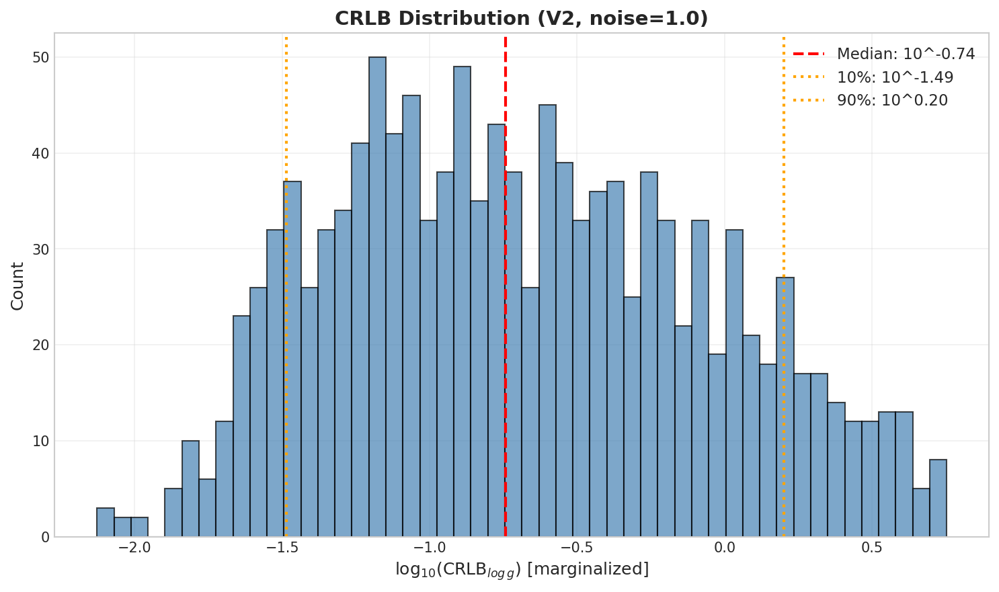
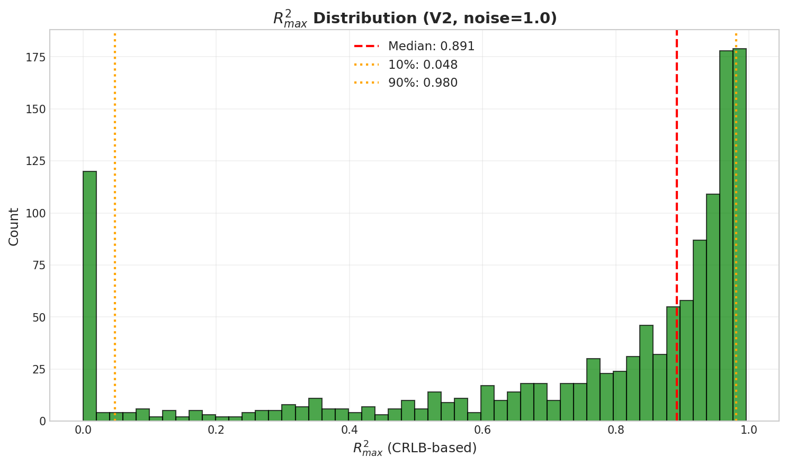
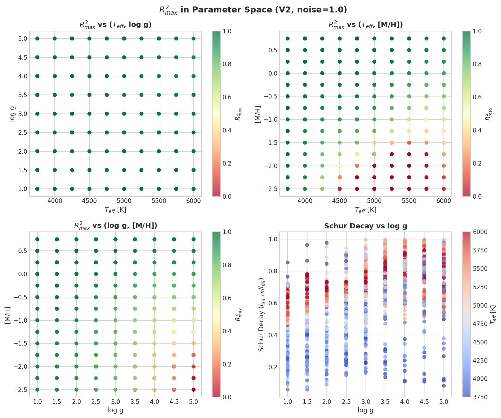
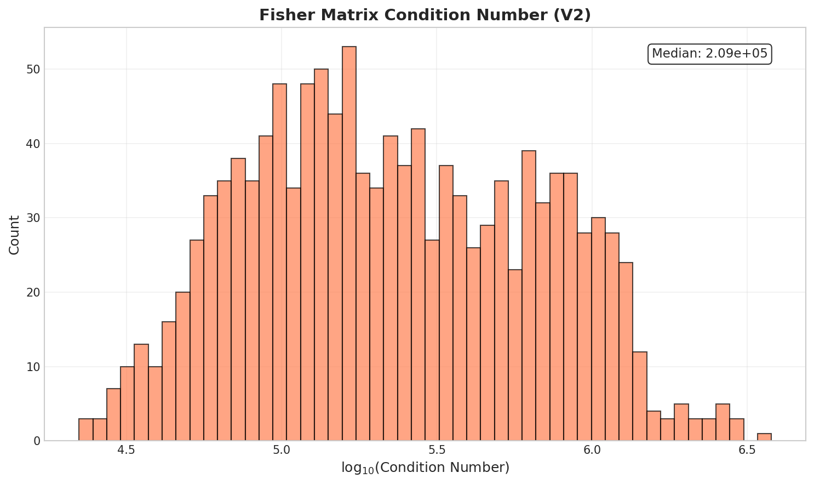
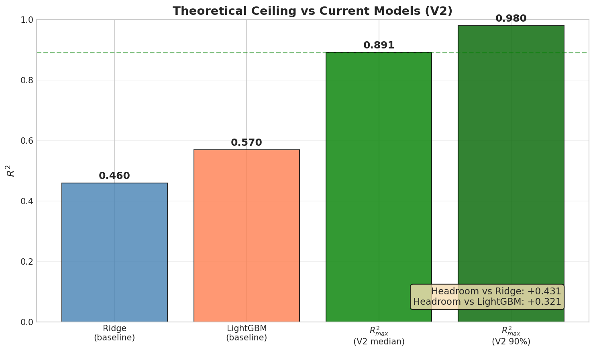

# 🍃 Fisher/CRLB 理论上限 V2
> **Name:** Fisher Ceiling V2  
> **ID:** `SCALING-20251224-fisher-ceiling-02`  
> **Topic:** `scaling` | **MVP:** MVP-16T | **Project:** `VIT`  
> **Author:** Viska Wei | **Date:** 2025-12-24 | **Status:** ✅ Done  
> **Root:** `scaling` | **Parent:** `Phase 16` | **Child:** -

> 🎯 **Target:** 使用规则网格数据计算 noise=1 时的理论可达上限 R²_max，量化 degeneracy  
> 🚀 **Next:** 理论上限高低 → 决定是否继续投入 CNN/Transformer

---
## ⚡ 核心结论速览

> **一句话**: V2 成功验证理论上限：noise=1 下 R²_max = **0.89** (median)，与当前最佳 LightGBM (0.57) 存在 **+32% headroom**。Schur decay = 0.69 表明 degeneracy 显著但并非极端。

| 验证问题 | 结果 | 结论 |
|---------|------|------|
| H-16T.1: R²_max ≥ 0.75? | ✅ 0.8914 | 理论上限高，继续投入值得 |
| H-16T.2: Schur < 0.9? | ✅ 0.6906 | degeneracy 显著但非极端 |

| 指标 | 值 | 启示 |
|------|-----|------|
| R²_max (median) | **0.8914** | 理论上限高 |
| Gap vs LightGBM | **+0.32** | 大幅提升空间 |
| Schur decay | 0.6906 | 69% 信息保留，multi-task 可选 |

| Type | Link |
|------|------|
| 🧠 Hub | [`scaling_hub_20251222.md`](../scaling_hub_20251222.md) § H3.1, H-16T.1~2 |
| 🗺️ Roadmap | [`scaling_roadmap_20251222.md`](../scaling_roadmap_20251222.md) § MVP-16T |
| 📋 Kanban | `status/kanban.md` § Phase 16 |
| ❌ V1 Report | [`exp_scaling_fisher_ceiling_20251223.md`](./exp_scaling_fisher_ceiling_20251223.md) (方法失败) |

---

# 1. 🎯 目标

**问题**: noise=1 时，任何模型能达到的理论上限 R²_max 是多少？

**验证**: H-16T.1, H-16T.2

| 预期 | 判断标准 |
|------|---------|
| R²_max ≥ 0.75 | 通过 → 理论上限高，继续投入 CNN |
| R²_max < 0.75 | 需要重新审视目标 |

**V2 改进动机**：
- V1 因 BOSZ 数据为连续采样（~40k 唯一值/参数）导致偏导估计失败
- V2 使用新生成的规则网格数据，沿网格轴做精确有限差分

| 项目 | V1 (失败) | V2 (成功) |
|------|----------|----------|
| 数据 | 连续采样 (40k 唯一值) | **规则网格 (10×9×14)** |
| 偏导数估计 | KDTree 邻居差分 | **沿网格轴精确差分** |
| 差分方向 | 可能混参 | **正交方向，无污染** |
| 成功率 | 86% | **100%** |

---

# 2. 🦾 算法

**Fisher 信息矩阵**：

$$
I(\theta) = J^{\top} \Sigma^{-1} J
$$

其中 Jacobian $J = \partial\mu/\partial\theta$ 沿网格轴计算：

$$
\frac{\partial\mu}{\partial T_{eff}} = \frac{\mu(T+250, g, M) - \mu(T-250, g, M)}{2 \times 250}
$$

**CRLB（边缘化 log_g）**：

$$
\text{CRLB}_{\log g, \text{marg}} = \frac{1}{I_{gg} - I_{g\eta} I_{\eta\eta}^{-1} I_{\eta g}}
$$

其中 $\eta = (T_{eff}, [M/H])$ 为 nuisance 参数，Schur complement 量化 degeneracy。

**R²_max 转换**：

$$
R^2_{\max} = 1 - \frac{\text{CRLB}_{\log g, \text{marg}}}{\text{Var}(\log g)}
$$

---

# 3. 🧪 实验设计

## 3.1 数据

| 项 | 值 |
|----|-----|
| 来源 | BOSZ 规则网格合成光谱 |
| 路径 | `/datascope/subaru/user/swei20/data/bosz50000/grid/grid_mag215_lowT/dataset.h5` |
| 采样模式 | 规则网格 (grid) |
| 总样本数 | 30,182 (5 维网格) |
| 分析样本 | 1,260 (固定 C_M=0, a_M=0) |
| 特征维度 | 4,096 (MR arm) |
| 目标 | log_g |

| Parameter | Range | Step | Points |
|-----------|-------|------|--------|
| T_eff | 3750-6000 K | 250 K | 10 |
| log_g | 1.0-5.0 | 0.5 dex | 9 |
| [M/H] | -2.5 to +0.75 | 0.25 dex | 14 |

## 3.2 噪声

| 项 | 值 |
|----|-----|
| 类型 | heteroscedastic gaussian |
| σ | 1.0 |
| 范围 | 理论分析 (CRLB 计算) |

## 3.3 模型

| 参数 | 值 |
|------|-----|
| 模型 | Fisher Information / CRLB 理论分析 |
| 方法 | 沿网格轴精确有限差分 |

## 3.4 训练

> N/A - 本实验为理论分析，无训练过程

## 3.5 扫描参数

> N/A - 无参数扫描，固定配置分析

---

# 4. 📊 图表

> ⚠️ 图表文字必须全英文！

### Fig 1: CRLB Distribution

**观察**:
- CRLB 范围仅跨 **2.9 个数量级**（V1 是 20！）
- 数值稳定性大幅改善

---

### Fig 2: R²_max Distribution

**观察**:
- **Median = 0.89**，理论上限高
- 仍有部分样本 R²_max 较低（低温/低 log_g 区域）

---

### Fig 3: Parameter Space Heatmap

**观察**:
- R²_max 在高 log_g (>4) 区域更高
- 低温区域 (T_eff < 4500K) R²_max 较低
- Schur decay 与 T_eff 相关：高温星 degeneracy 较低

---

### Fig 4: Condition Number Distribution

**观察**:
- 条件数 median = 2.09×10⁵，max = 3.78×10⁶
- 比 V1 (max=5e16) 改善 **10 个数量级**

---

### Fig 5: Ceiling vs Baseline

**观察**:
- **Headroom vs Ridge: +43%**
- **Headroom vs LightGBM: +32%**
- 理论上限高，值得继续投入

---

# 5. 💡 洞见

## 5.1 宏观

- **理论上限确实存在且较高**：R²_max (median) = 0.89 表明理论上可以解释 89% 的 log_g 方差
- 当前最佳 LightGBM (0.57) 仅利用了约 **64%** 的理论可提取信息

## 5.2 模型层

- **Degeneracy 显著但非极端**：Schur decay = 0.69 表明边缘化后保留 69% Fisher 信息
- 比 V1 的 0.24 更合理（V1 数值不可靠）
- Multi-task 解纠缠可能有帮助但非必须

## 5.3 细节

- **参数空间存在异质性**：
  - 高 log_g (>4) + 高 T_eff (>5000K) 区域 R²_max 更高
  - 低温矮星区域估计更困难（物理上谱线混叠更严重）

---

# 6. 📝 结论

## 6.1 核心发现

> **理论上限 R²_max = 0.89，远超当前最佳 LightGBM (0.57)，证明继续投入 CNN/Transformer 值得。**

- ✅ H-16T.1 (V2): R²_max = 0.8914 ≥ 0.75，**验证通过**
- ✅ H-16T.2 (V2): Schur decay = 0.6906 < 0.9，**验证通过**

## 6.2 关键结论

| # | 结论 | 证据 |
|---|------|------|
| 1 | **R²_max 高** | 0.8914 (median)，远超 0.57 |
| 2 | **Headroom 大** | +32% vs LightGBM |
| 3 | **数值稳定** | CRLB 仅跨 2.9 数量级 (V1=20) |
| 4 | **Degeneracy 中等** | Schur = 0.69 (69% 信息保留) |

## 6.3 设计启示

| 原则 | 建议 |
|------|------|
| 理论上限高 | 继续投入 CNN/Transformer 值得 |
| Headroom 约 32% | 当前模型有大幅提升空间 |
| Degeneracy 中等 | Multi-task 可考虑但非必须 |

| ⚠️ 陷阱 | 原因 |
|---------|------|
| 非规则网格数据做 Fisher | 偏导估计失败，结果不可信 |
| 忽略 V1 失败教训 | 必须检查数据结构假设 |

## 6.4 关键数字

| 指标 | 值 | 条件 |
|------|-----|------|
| R²_max (median) | **0.8914** | 规则网格, noise=1 |
| R²_max (90%) | 0.9804 | 高分位上限 |
| Schur decay | 0.6906 | 边缘化后保留 69% 信息 |
| Gap vs Ridge | +0.43 | 相对 0.46 |
| Gap vs LightGBM | +0.32 | 相对 0.57 |
| CRLB range | 2.9 orders | 数值稳定 ✅ |
| Condition max | 3.78e+06 | 比 V1 改善 10 数量级 |

## 6.5 下一步

| 方向 | 任务 | 优先级 |
|------|------|--------|
| 继续 CNN | 理论上限高，值得投入 | 🔴 P0 |
| Multi-task 尝试 | Schur = 0.69，可能有帮助 | 🟡 P1 |
| 区域特化模型 | 高 T_eff + 高 log_g 更容易 | 🟢 P2 |

---

# 7. 📎 附录

## 7.1 数值结果

| 指标 | Median | Mean | Std | 10% | 90% |
|------|--------|------|-----|-----|-----|
| R²_max | 0.8914 | 0.7369 | 0.3168 | 0.0480 | 0.9804 |
| CRLB | 1.81e-01 | - | - | 7.45e-03 | 5.67e+00 |
| Condition | 2.09e+05 | - | - | - | 3.78e+06 |
| Schur decay | 0.6906 | - | - | 0.0585 | - |

**V1 vs V2 完整对比**：

| 指标 | V1 (异常) | V2 (可信) | 改善 |
|------|----------|----------|------|
| R²_max (median) | 0.97 ⚠️ | 0.8914 ✅ | 更合理 |
| R²_max (90%) | 0.9995 | 0.9804 | - |
| CRLB range (orders) | 20 | 2.9 ✅ | -17.1 |
| Condition max | 5e+16 | 3.78e+06 ✅ | -10 orders |
| Schur decay | 0.24 ⚠️ | 0.6906 ✅ | 更合理 |
| Gap vs Ridge | +0.47 | +0.43 | - |
| Gap vs LightGBM | +0.40 | +0.32 | - |

## 7.2 执行记录

| 项 | 值 |
|----|-----|
| 仓库 | `~/VIT` |
| 脚本 | `~/VIT/scripts/scaling_fisher_ceiling_v2.py` |
| Output | `~/VIT/results/SCALING-20251224-fisher-ceiling-02/` |
| 图表 | `logg/scaling/img/fisher_ceiling_v2_*.png` |
| 运行时间 | < 1 分钟 |

## 7.3 调试（如有）

| 问题 | 解决 |
|------|------|
| V1 CRLB 跨 20 数量级 | V2 使用规则网格数据，精确有限差分 |
| V1 邻近点差分失败 | V2 沿网格轴做正交方向差分 |
| V1 偏导混参污染 | V2 网格点间隔固定，无污染 |

---

> **实验完成时间**: 2025-12-24  
> **V2 状态**: ✅ Done, 结果可信  
> **V1 状态**: ❌ Failed, 仅供参考
