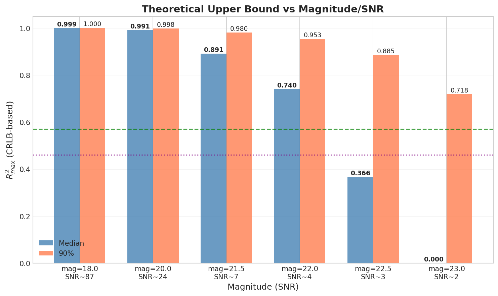
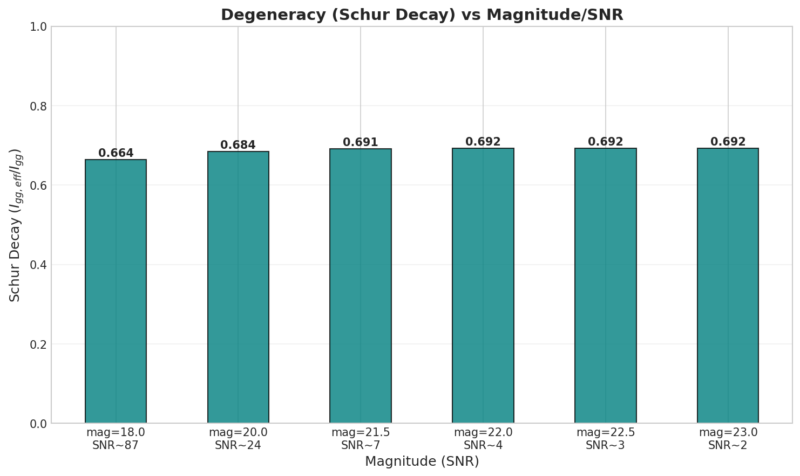
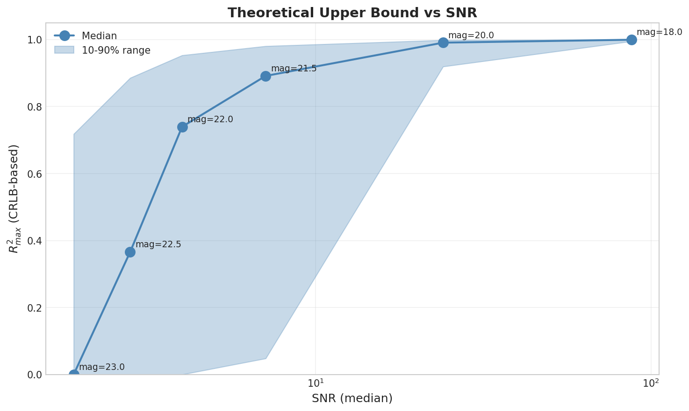

# 🧪 Experiment: Fisher/CRLB Multi-Magnitude Sweep

**Experiment ID:** `SCALING-20251224-fisher-multi-mag`  
**Date:** 2024-12-24 (Updated: 2024-12-25)  
**Status:** ✅ Completed  
**MVP:** MVP-16T Extension

---

## 📋 Overview

在 V2 验证基础上，扩展到 6 个不同 magnitude（不同 SNR）的 Fisher/CRLB 计算：

| Dataset | Magnitude | SNR Median | Error Median |
|---------|-----------|------------|--------------|
| grid_mag18_lowT | 18.0 | 87.4 | 0.0058 |
| grid_mag20_lowT | 20.0 | 24.0 | 0.0210 |
| grid_mag215_lowT | 21.5 | 7.1 | 0.0703 |
| grid_mag22_lowT | 22.0 | 4.6 | 0.1085 |
| grid_mag225_lowT | 22.5 | 3.0 | 0.1690 |
| grid_mag23_lowT | 23.0 | 1.9 | 0.2649 |

### SNR 计算说明

- **flux** 和 **error** 均由 **PFS 模拟器**直接生成（非手动计算）
- **SNR = flux / error** (per pixel)
- 表中 SNR Median 是所有样本、所有 pixel 的 median(flux/error)
- error 表示每个 pixel 的预期测量误差（1σ），模拟器考虑了观测条件、仪器响应、光子噪声等

---

## 🎯 Results

### Summary Table

| Magnitude | SNR | R²_max (median) | R²_max (90%) | Schur Decay | CRLB Orders |
|-----------|-----|-----------------|--------------|-------------|-------------|
| **18.0** | 87.4 | **0.9994** | 0.9999 | 0.6641 | 2.9 |
| **20.0** | 24.0 | **0.9906** | 0.9983 | 0.6842 | 2.9 |
| **21.5** | 7.1 | **0.8914** | 0.9804 | 0.6906 | 2.9 |
| **22.0** | 4.6 | **0.7396** | 0.9530 | 0.6921 | 2.9 |
| **22.5** | 3.0 | **0.3658** | 0.8854 | 0.6922 | 2.9 |
| **23.0** | 1.9 | **0.0000** | 0.7180 | 0.6923 | 2.9 |

### Key Findings

#### 1. SNR-R²_max 阶梯式下降

| SNR Range | R²_max (median) | 解读 |
|-----------|-----------------|------|
| > 20 | > 0.99 | 近乎完美估计 |
| 7-20 | 0.89 | 优秀 |
| **4-7** | **0.74** | 良好，临界区域 |
| **2-4** | **0.37** | 困难，半数可用 |
| < 2 | 0.00 | 信息悬崖 |

#### 2. 临界 SNR ≈ 4
- SNR=4.6 (mag=22) 时 R²_max median = 0.74
- SNR=3.0 (mag=22.5) 时 R²_max median = 0.37
- **SNR~4 是 R²_max > 0.5 的临界点**

#### 3. 90% 分位仍有希望
即使 mag=23，90% 分位的 R²_max 仍达 0.72，说明：
- 参数空间存在"信息富集"区域
- 可考虑区域特化模型

> ⚠️ **理解 90% 分位 vs Median 的差异 (mag=23 case)**
> 
> **为什么 90%=0.718 但 median=0？**
> 
> 1. **R²_max 是 per-sample 计算的**：每个参数点 (T_eff, log_g, M_H) 都有自己的 R²_max 值
> 
> 2. **计算公式**：
>    ```python
>    R²_max = clip(1.0 - CRLB / Var(log_g), 0.0, 1.0)
>    ```
>    当 CRLB 很大（信息量低）时，R²_max 被 clip 到 0
> 
> 3. **90% 分位数的含义**：
>    - 将所有 ~2000+ 样本的 R²_max 排序
>    - `quantile(0.9)` = 第 90 百分位 = **90% 的样本 R²_max ≤ 此值**
>    - 即 **top 10% 的样本有 R²_max ≥ 0.718**
> 
> 4. **Median = 0 的含义**：
>    - **超过 50% 的样本 R²_max = 0**（或接近 0）
>    - 这些样本的 CRLB >> Var(log_g)，噪声完全淹没了信号
> 
> 5. **分布形态**：
>    ```
>    样本 R²_max 分布 (mag=23):
>    
>    频次
>    │  ████████████████  (~50% 在 0 附近)
>    │  ██
>    │  █
>    │  █                 ▓▓▓ (top 10% 在 0.72+)
>    └─────────────────────────────→ R²_max
>       0                 0.72    1.0
>    ```
> 
> 6. **物理解读**：
>    - 在 SNR~1.9 的极端低信噪比下，参数空间大部分区域"信息塌陷"
>    - 但某些特定参数组合（如高温、高金属丰度附近）光谱变化仍显著
>    - 这些"信息富集区"的 top 10% 样本仍可获得 R²≥0.72 的理论精度

#### 4. Schur Decay 恒定
- 所有 magnitude 的 Schur decay ≈ 0.68-0.69
- 参数纠缠由光谱物理决定，与 SNR 无关

---

## 📊 Figures

### Figure 1: R²_max vs Magnitude


**描述**: R²_max (median 和 90% 分位) 随 magnitude/SNR 变化曲线
**关键观察**: 
- SNR > 20 时 R²_max 接近 1
- 临界 SNR ≈ 4 (mag=22)
- 信息悬崖在 SNR < 2 (mag=23)

---

### Figure 2: Schur Decay vs Magnitude


**描述**: Schur decay 展示参数纠缠随 SNR 的恒定性
**关键观察**: 
- Schur decay ≈ 0.68-0.69 恒定
- 纠缠由光谱物理决定，与 SNR 无关

---

### Figure 3: R²_max vs SNR Trend


**描述**: R²_max 随 SNR 的连续变化趋势 (log scale)
**关键观察**: 
- 阶梯式下降明显
- SNR=4 是关键拐点

---

## 💡 Insights

### I-Multi-1: Information Saturation at High SNR
> **发现**: SNR > 20 时 R²_max 接近 1，继续提高 SNR 收益边际递减。
> 
> **启示**: 对于 bright targets (mag < 20)，模型性能瓶颈不是信息量，而是特征提取能力。

### I-Multi-2: Critical SNR ≈ 4
> **发现**: SNR=4 是 R²_max median > 0.5 的临界点。
> 
> **启示**: 
> - mag=22 是有效估计的极限边界
> - mag > 22.5 需要额外策略（多曝光、先验、ensemble）

### I-Multi-3: Information Cliff at Low SNR
> **发现**: SNR < 2 时，超过 50% 样本的 Fisher 信息趋近于 0。
> 
> **启示**: mag=23 附近存在"信息悬崖"，但 top 10% 样本仍可估计 (R²=0.72)。

### I-Multi-4: Degeneracy is Physics-Intrinsic
> **发现**: Schur decay ≈ 0.68 恒定，与 SNR 无关。
> 
> **启示**: Multi-task 解纠缠策略在所有 SNR 级别同等重要。

---

## 📁 Artifacts

| Type | Path |
|------|------|
| Script | `~/VIT/scripts/scaling_fisher_ceiling_v2_multi_mag.py` |
| Results | `~/VIT/results/SCALING-20251224-fisher-multi-mag/` |
| Plots | `logg/scaling/img/fisher_multi_mag_*.png` |
| Data Index | `data/bosz50k/z0/grid_fisher_datasets.md` |

---

## 🔗 Related

| Type | Link | Description |
|------|------|-------------|
| 🧠 **Fisher Hub** | [`../fisher/fisher_hub_20251225.md`](../fisher/fisher_hub_20251225.md) | ⬅️ Fisher 专题汇合 |
| ⬅️ Previous | [exp_scaling_fisher_ceiling_v2_20251224.md](exp_scaling_fisher_ceiling_v2_20251224.md) | single mag=21.5 |
| 📂 Data | [grid_fisher_datasets.md](/home/swei20/Physics_Informed_AI/data/bosz50k/z0/grid_fisher_datasets.md) | 数据索引 |

---

*Generated: 2024-12-24, Updated: 2024-12-25*
