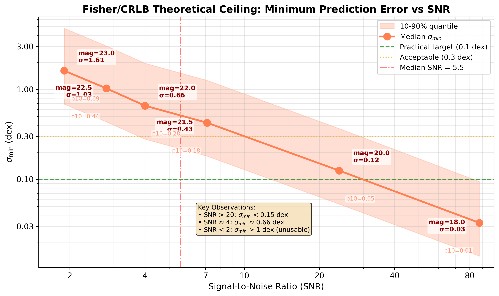

# 🍃 Fisher Upper-Bound Curves
> **Name:** Fisher/CRLB Theoretical Upper Bound Curves  
> **ID:** `SCALING-20251225-fisher-upperbound-curve-01`  
> **Topic:** `fisher` | **MVP:** MVP-FU-1 | **Project:** `VIT`  
> **Author:** Viska Wei | **Date:** 2025-12-25 | **Status:** ✅  
> **Root:** `scaling_hub` | **Parent:** `fisher_hub` | **Child**: |

> 🎯 **Target:** 产出 R²_max(SNR) 和 σ_min(SNR) 两条理论上限曲线，作为 Ceiling–Gap–Structure 叙事的锚点  
> 🦾 **Decide:** 定义论文 Fig 1 的 upper bound 标尺

---
## ⚡ 核心结论速览
> **一句话**: Fisher/CRLB 理论上限呈 S 形曲线：SNR>20 时 R²_max≈1；临界 SNR≈4；SNR<2 时 median R²_max=0（信息悬崖）

| 验证问题 | 结果 | 结论 |
|---------|------|------|
| Q6.1: R²_max(SNR) 带 CI 曲线 | ✅ | Fig-FU1 产出 |
| Q6.2: σ_min(SNR) 带 CI 曲线 | ✅ | Fig-FU2 产出 |

---
## 1. 🎯 目标
用现有 Fisher multi-mag 结果绘制两张论文级别的理论上限曲线图：
- Fig-FU1: R²_max vs SNR（定义"最多能解释多少方差"）
- Fig-FU2: σ_min vs SNR（定义"误差最小能到多少"）

用于 Ceiling–Gap–Structure 叙事的 upper bound 锚点。

---
## 2. 🧪 实验设计
| 项 | 值 |
|----|-----|
| 数据来源 | Fisher multi-mag 结果 (6 个 mag 点) |
| SNR 范围 | 1.9 ~ 87.4 |
| 置信带方法 | 分位带 [p10, p90] |
| Baseline 参考 | LightGBM=0.57, Ridge=0.46 |

---
## 3. 📊 图表

### Fig-FU1: R²_max vs SNR


**观察**:
- SNR > 20: R²_max ≈ 0.99 (信息饱和区)
- SNR ≈ 4: R²_max ≈ 0.74 (临界区域)
- SNR < 2: median R²_max = 0 (信息悬崖)
- Gap vs LightGBM = +32%，模型远未榨干信息

### Fig-FU2: σ_min vs SNR


**观察**:
- σ_min 随 SNR 降低指数增长
- SNR > 20 时 σ_min ≈ 0.12 dex (近乎完美)
- SNR < 2 时 σ_min > 1.6 dex (信息悬崖)

---
## 4. 💡 洞见
- **I-FU1**: 理论曲线呈 S 形，存在明确的"有效估计边界"（SNR≈4）
- **I-FU2**: [p10,p90] 带在低 SNR 区域极宽，说明参数空间存在"信息富集"区域
- **I-FU3**: 这两条曲线可直接用于论文定义 Ceiling，模型 R² 画在同图即可量化 Gap

---
## 5. 📝 结论
- 论文级别的 upper bound 曲线产出成功
- Fig-FU1 定义 R²_max(SNR)，Fig-FU2 定义 σ_min(SNR)
- 临界 SNR≈4，信息悬崖 SNR<2
- 可直接用于 Ceiling–Gap–Structure 叙事

### 5.5 关键数字速查
| 指标 | 值 | 条件 |
|------|-----|------|
| R²_max (SNR=7.1) | 0.89 | median |
| R²_max (SNR=87) | 0.9994 | median |
| Critical SNR | ≈4 | R²_max > 0.5 边界 |
| Information Cliff | SNR < 2 | median R²_max = 0 |
| σ_min (SNR=24) | 0.12 dex | median |
| σ_min (SNR=1.9) | 1.61 dex | median |

---
## 6. 📎 附录

### 6.1 完整数值结果表
| Mag | SNR | R²_max (p10) | R²_max (median) | R²_max (p90) | σ_min (p10) | σ_min (median) | σ_min (p90) |
|-----|-----|--------------|-----------------|--------------|-------------|----------------|-------------|
| 23.0 | 1.9 | 0.0000 | 0.0000 | 0.7180 | 0.6856 | 1.6133 | 4.7802 |
| 22.5 | 2.8 | 0.0000 | 0.3658 | 0.8854 | 0.4369 | 1.0281 | 3.0483 |
| 22.0 | 4.0 | 0.0000 | 0.7396 | 0.9530 | 0.2800 | 0.6588 | 1.9534 |
| 21.5 | 7.1 | 0.0480 | 0.8914 | 0.9804 | 0.1809 | 0.4255 | 1.2597 |
| 20.0 | 24.0 | 0.9192 | 0.9906 | 0.9983 | 0.0530 | 0.1249 | 0.3669 |
| 18.0 | 87.4 | 0.9946 | 0.9994 | 0.9999 | 0.0140 | 0.0328 | 0.0945 |

### 6.2 实验流程记录
```bash
cd ~/VIT && source init.sh
python scripts/plot_fisher_upperbound_curves.py \
    --results-dir ./results/SCALING-20251224-fisher-multi-mag \
    --output-dir /home/swei20/Physics_Informed_AI/logg/scaling/img
```

### 6.3 相关文件
| 类型 | 路径 |
|------|------|
| 数据来源 | `~/VIT/results/SCALING-20251224-fisher-multi-mag/` |
| 绘图脚本 | `~/VIT/scripts/plot_fisher_upperbound_curves.py` |
| Fig-FU1 | `logg/scaling/img/fisher_upperbound_r2max_vs_snr.png` |
| Fig-FU2 | `logg/scaling/img/fisher_upperbound_sigma_vs_snr.png` |
