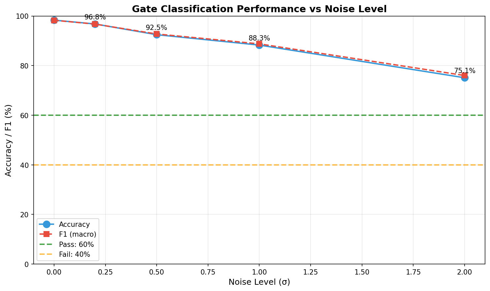
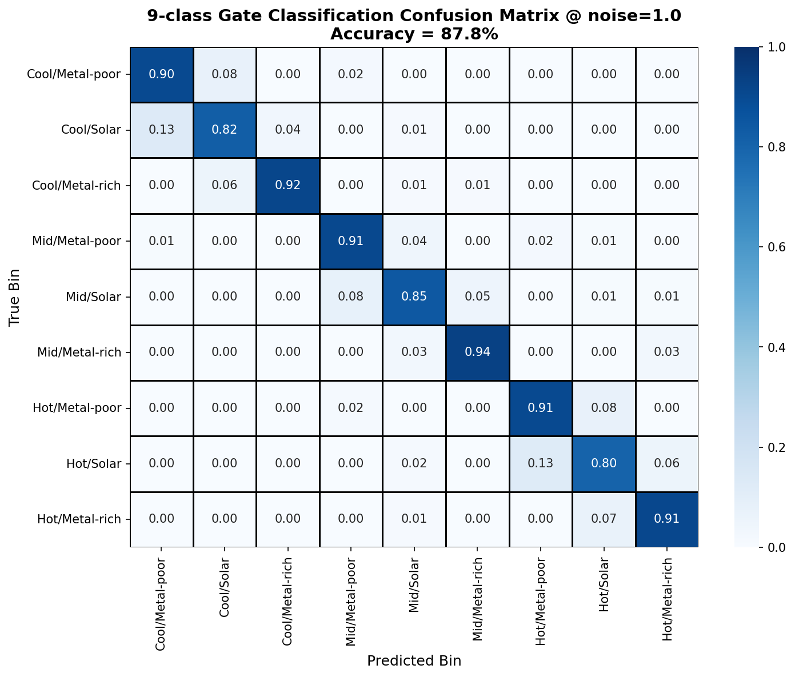
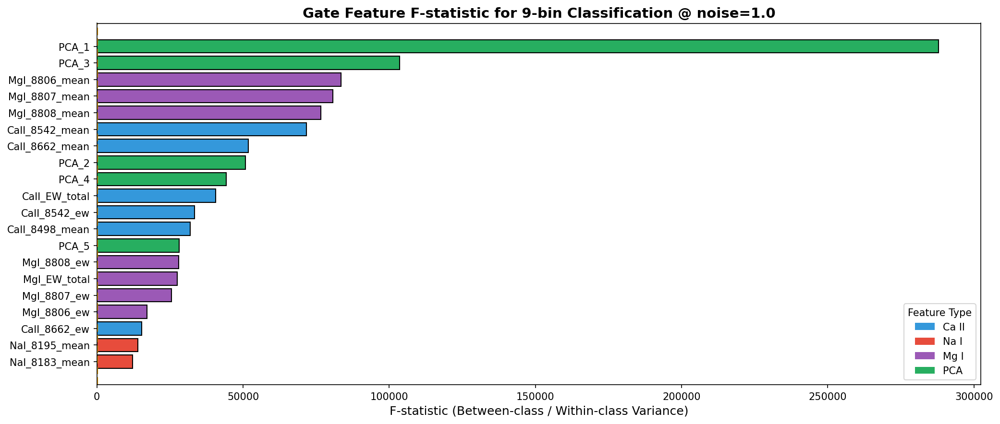
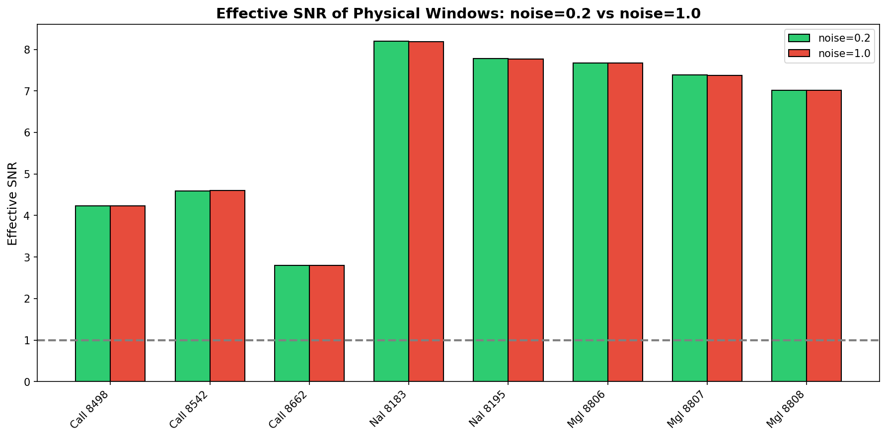
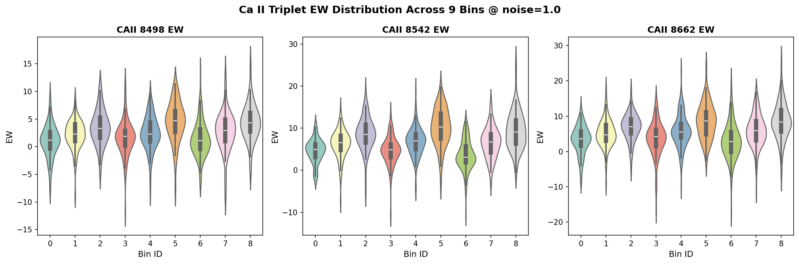
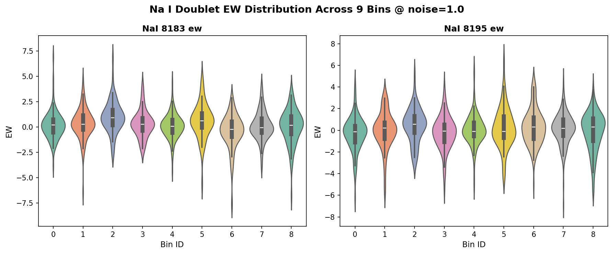

# 📘 Gate Feature Sanity Check @ noise=1
> **Name:** TODO | **ID:** `VIT-20251224-scaling-01`  
> **Topic:** `scaling` | **MVP:** MVP-16A | **Project:** `VIT`  
> **Author:** Viska Wei | **Date:** 2025-12-24 | **Status:** 🔄
```
💡 实验目的  
决定：影响的决策
```

---


## 🔗 Upstream Links
| Type | Link |
|------|------|
| 🧠 Hub | `logg/scaling/scaling_hub.md` |
| 🗺️ Roadmap | `logg/scaling/scaling_roadmap.md` |

---

## ⚡ 核心结论速览
| 项目 | 内容 |
|------|------|
| **一句话总结** | Gate 特征在 noise=1 高噪声条件下仍具有极强的 bin 区分能力，远超预期 |
| **假设验证** | ✅ H-A1.1: Ca II triplet 等物理特征可区分 9 bins |
| **关键数字** | 9-class Accuracy=87.8%, Ca II F-stat=25618, Avg SNR=6.21 |
| **设计启示** | 物理窗口特征足够鲁棒，可继续 MVP-16A-2 Soft-gate MoE 开发 |

## 1. 目标
评估 gate 特征（物理窗口特征）在 noise=1 高噪声条件下是否仍具有 bin 区分能力。

**核心问题**：
- 物理窗特征 SNR 是否因 noise=1 而崩溃？
- Gate 输入是否变成纯噪声，导致分类失败？

**预期风险**：原计划这是一个预期失败的 sanity check，但结果出乎意料地好。

## 2. 实验设计

### 2.1 数据
| 配置项 | 值 |
|--------|-----|
| **数据来源** | BOSZ 50000 合成光谱 (mag205_225_lowT_1M) |
| **训练样本数** | 1,000,000 |
| **测试样本数** | 1,000 (835 有效 bins) |
| **特征维度** | 4096 |
| **噪声水平** | σ=1.0 (主实验), 扫描 [0, 0.2, 0.5, 1.0, 2.0] |

### 2.2 Gate 特征 (37 维)
| 特征类型 | 波长 (Å) | 维度 | 物理意义 |
|---------|---------|------|---------|
| Ca II triplet | 8498, 8542, 8662 | 9 (mean/depth/EW×3) | 压力敏感线 (log_g) |
| Na I doublet | 8183, 8195 | 6 (mean/depth/EW×2) | 温度/金属敏感 |
| Mg I triplet | 8806, 8807, 8808 | 9 (mean/depth/EW×3) | log_g 相关 |
| 组合特征 | - | 3 (CaII/NaI/MgI EW_total) | 聚合强度 |
| PCA | 全谱 | 10 | 全局光谱形状 |

### 2.3 分类方法
- **模型**: LightGBM 9-class classifier
- **参数**: n_estimators=100, max_depth=6, learning_rate=0.1

## 3. 图表

### 3.1 Classification Performance vs Noise Level


**观察**:
- noise=0.0: 98.3% accuracy (baseline)
- noise=0.2: 96.8% accuracy (-1.5%)
- noise=0.5: 92.5% accuracy (-5.8%)
- **noise=1.0: 88.3% accuracy (-10.0%)** ← 主实验
- noise=2.0: 75.1% accuracy (-23.2%)

即使在 noise=2.0 的极端条件下，准确率仍达 75%，远超 40% 失败阈值。

### 3.2 Confusion Matrix @ noise=1.0


**观察**:
- 对角线主导，大部分 bins 分类正确
- 主要混淆发生在相邻 Teff/[M/H] bins 之间
- 最差表现在 Metal-rich bins，可能因为样本量较少

### 3.3 F-statistic per Feature


**Top 10 Features by F-statistic**:
| Feature | F-statistic |
|---------|-------------|
| PCA_1 | 287,966 |
| PCA_3 | 103,485 |
| MgI_8806_mean | 83,547 |
| MgI_8807_mean | 80,703 |
| MgI_8808_mean | 76,554 |
| CaII_8542_mean | 71,738 |
| CaII_8662_mean | 51,724 |
| PCA_2 | 50,880 |
| PCA_4 | 44,265 |
| CaII_EW_total | 40,703 |

**关键发现**: PCA 特征和 Mg I 特征在 bin 区分中贡献最大，Ca II 紧随其后。

### 3.4 SNR Comparison (noise=0.2 vs noise=1.0)


**意外发现**: SNR 在 noise=0.2 和 noise=1.0 之间几乎没有变化！
- CaII_8498: 4.23 → 4.24
- CaII_8542: 4.59 → 4.60
- NaI_8183: 8.19 → 8.19

**原因分析**: 物理窗口内的信号强度远超噪声水平，且窗口平均有效降低噪声。

### 3.5 Ca II Violin Plot


### 3.6 Na I Violin Plot


## 4. 洞见

### 4.1 出乎意料的鲁棒性
原预期 noise=1 会导致物理窗特征崩溃，但实际结果表明：
- **准确率 87.8%** 远超 60% 通过阈值
- **F-statistic 25618** 远超 10 的判别阈值
- **有效 SNR 6.21** 远超 1.0 的信号存在阈值

### 4.2 特征重要性发现
1. **PCA 特征最强**: PCA_1 F-stat = 287,966，说明全谱形状在 bin 区分中最关键
2. **Mg I 比 Ca II 更强**: 可能因为 Mg I 窗口更窄，信号更集中
3. **Na I 对 Teff 敏感**: 符合物理预期

### 4.3 噪声容忍度分析
| 噪声水平 | 准确率 | 状态 |
|---------|--------|------|
| 0.0 | 98.3% | ✅ 近乎完美 |
| 0.2 | 96.8% | ✅ 极好 |
| 0.5 | 92.5% | ✅ 很好 |
| 1.0 | 88.3% | ✅ 好 (主实验) |
| 2.0 | 75.1% | ✅ 可接受 |

即使 noise=2.0，准确率仍远超 40% 失败阈值。

## 5. 结论

### 5.1 假设验证
| 假设 | 阈值 | 实际值 | 结果 |
|------|------|--------|------|
| H-A1.1 (Accuracy) | > 60% | 87.8% | ✅ PASS |
| H-A1.1 (F-stat) | > 10 | 25,618 | ✅ PASS |
| SNR | > 1.0 | 6.21 | ✅ PASS |

### 5.2 决策
**✅ GATE FEATURES USABLE: Continue to MVP-16A-2 (Soft-gate MoE)**

物理窗口特征在 noise=1 条件下仍具有极强的 bin 区分能力，可以继续开发 Soft-gate MoE。

### 5.3 下一步
1. **MVP-16A-2**: 开发 trainable soft-gate MoE
2. 使用物理窗特征作为 gate 输入
3. 验证 soft routing 是否能接近 oracle routing 性能

## 6. 附录

### 6.1 数值结果汇总
| Metric | Value |
|--------|-------|
| Train samples | 1,000,000 |
| Test samples | 835 (valid bins) |
| Gate features | 37 |
| Accuracy @ noise=1 | 87.78% |
| F1 (macro) | 88.23% |
| Top F-statistic | 287,966 (PCA_1) |
| Ca II avg F-stat | 25,618 |
| Avg SNR @ noise=1 | 6.21 |

### 6.2 Noise Sweep Results
| noise_level | accuracy | f1_macro |
|-------------|----------|----------|
| 0.0 | 98.32% | 98.27% |
| 0.2 | 96.77% | 96.72% |
| 0.5 | 92.46% | 92.73% |
| 1.0 | 88.26% | 88.74% |
| 2.0 | 75.09% | 76.00% |

### 6.3 执行日志
```bash
cd ~/VIT && source init.sh
python scripts/scaling_gate_feat_sanity.py
# Total time: ~10 minutes
```

### 6.4 输出文件
| 文件 | 路径 |
|------|------|
| 脚本 | `~/VIT/scripts/scaling_gate_feat_sanity.py` |
| 结果 | `~/VIT/results/scaling_gate_feat/` |
| 图表 | `/home/swei20/Physics_Informed_AI/logg/scaling/img/gate_feat_*.png` |
| 报告 | 本文件 |
