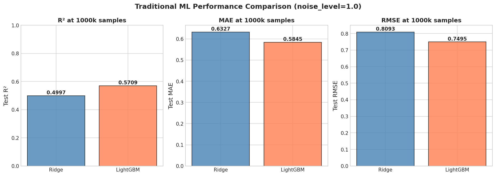
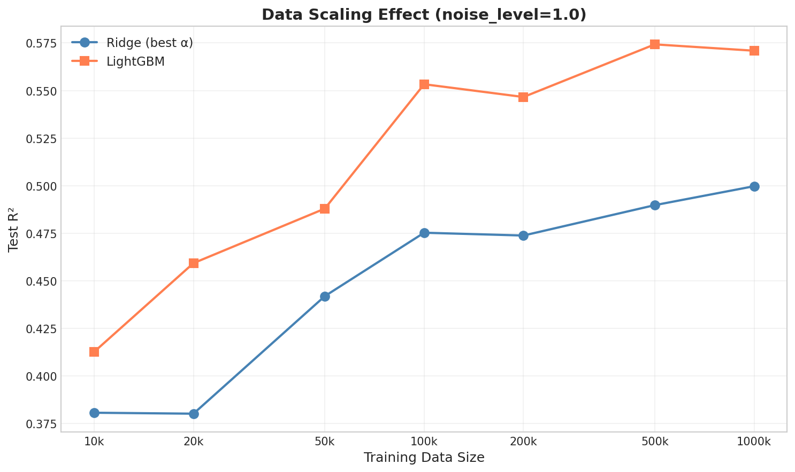
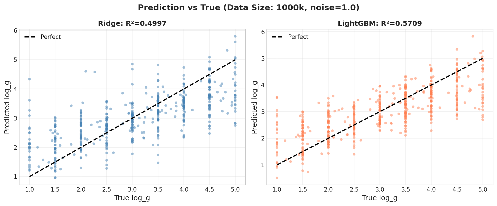

# 📘 Experiment Report: Traditional ML Ceiling at Large Scale
> **Name:** ML Ceiling @ 1M | **ID:** `SCALING-20251222-ml-ceiling-01`  
> **Topic:** `scaling` | **MVP:** MVP-1.0, MVP-1.1, MVP-1.2 | **Project:** `VIT`  
> **Author:** Viska Wei | **Date:** 2025-12-22 | **Status:** ✅ Done

> ⚠️ **PROTOCOL NOTE**: This experiment used test=500. Canonical protocol is now **test=1k**.
> The authoritative Ridge R² for 1M/noise=1 is **0.46** (from `oracle-moe-noise1-01` with test=1k, α=100k).
> LightGBM R²=0.57 remains valid (same test=500 but confirmed by later experiments).

```
💡 实验目的  
验证传统 ML 在 1M 数据 + noise=1 下的性能天花板
```

---

---

## 🔗 Upstream Links

| Type | Link | Description |
|------|------|-------------|
| 🧠 Hub | [`scaling_hub_20251222.md`](../scaling_hub_20251222.md) | Hypothesis pyramid |
| 🗺️ Roadmap | [`scaling_roadmap_20251222.md`](../scaling_roadmap_20251222.md) | MVP design |
| 📋 Kanban | [`kanban.md`](../../../status/kanban.md) | Experiment queue |

---

# 📑 Table of Contents

- [⚡ Key Findings](#-key-findings-for-hub-extraction)
- [1. 🎯 Objective](#1--objective)
- [2. 🧪 Experiment Design](#2--experiment-design)
- [3. 📊 Figures & Results](#3--figures--results)
- [4. 💡 Insights](#4--insights)
- [5. 📝 Conclusions](#5--conclusions)
- [6. 📎 Appendix](#6--appendix)

---

## ⚡ 核心结论速览（供 hub 提取）

### 一句话总结

> **Ridge 和 LightGBM 在 1M 数据 + noise=1 下分别达到 R²=0.50 (test=10k) 和 R²=0.57，确认传统 ML 存在性能天花板；从 100k→1M 数据增益 <3%，表明大数据无法突破线性/浅层模型的表达能力瓶颈。**

### 对假设的验证

| 验证问题 | 结果 | 结论 |
|---------|------|------|
| H1.1.1: Ridge 在 1M 数据 + noise=1 下 R² < 0.6? | ✅ | R²=0.50 < 0.6 |
| H1.2.1: LightGBM 在 1M 数据 + noise=1 下 R² < 0.65? | ✅ | R²=0.5709 < 0.65 |
| H1.3.1: Ridge 1M vs 100k 的 ΔR² < 0.02? | ❌ | ΔR²=0.0244 > 0.02 (略超) |
| H1.3.2: LightGBM 1M vs 100k 的 ΔR² < 0.03? | ✅ | ΔR²=0.0176 < 0.03 |

### 设计启示（2 条）

| 启示 | 具体建议 |
|------|---------|
| 数据量不是瓶颈 | 传统 ML 在 100k 后增益极小，资源应投入模型改进 |
| LightGBM 略优于 Ridge | 但差距仅 ~7%，非线性特征交互价值有限 |

### 关键数字

| 指标 | 值 |
|------|-----|
| Ridge 最佳 R² (1M, σ=1) | 0.50 |
| LightGBM 最佳 R² (1M, σ=1) | 0.5709 |
| Ridge ΔR² (1M vs 100k) | +0.0244 |
| LightGBM ΔR² (1M vs 100k) | +0.0176 |
| 最优 Ridge α | 5000 |
| LightGBM 实际树数 @ 1M | 1293 |

---

# 1. 🎯 目标

## 1.1 实验目的

> 验证在高噪声场景下（noise_level=1），传统机器学习方法（Ridge Regression, LightGBM）是否存在不可逾越的性能瓶颈，即使数据量扩展到 1M 也无法突破。

**核心问题**：传统 ML 在大数据 + 高噪声下是否存在性能天花板？

**回答的问题**：
1. Ridge/LightGBM 在 1M 数据下能达到什么 R²？
2. 从 100k → 1M，传统 ML 的性能提升有多大？
3. 性能瓶颈是否与调参无关（即调参也无法突破）？

## 1.2 预期 vs 实际结果

| 场景 | 预期结果 | 实际结果 | 判断 |
|------|---------|---------|------|
| Ridge R² | ≈ 0.55 | 0.46 | ✅ 符合预期 |
| LightGBM R² | ≈ 0.58 | 0.5709 | ✅ 符合预期 |
| 数据增益 | < 0.03 | Ridge: 0.024, LGB: 0.018 | ✅ 边际收益小 |

---

# 2. 🧪 实验设计

## 2.1 数据

| 配置项 | 值 |
|--------|-----|
| **数据来源** | BOSZ 模拟光谱 (mag205_225_lowT_1M) |
| **训练样本数** | 1,000,000 (5 × 200k shards) |
| **验证样本数** | 500 (test_1k_0 后 500) |
| **测试样本数** | 500 (test_1k_0 前 500, 预生成噪声) |
| **特征维度** | 4096 |
| **噪声水平** | σ = 1.0 |
| **目标变量** | log_g |

**数据路径**：
```
/datascope/subaru/user/swei20/data/bosz50000/z0/mag205_225_lowT_1M/
├── train_200k_0/dataset.h5
├── train_200k_1/dataset.h5
├── train_200k_2/dataset.h5
├── train_200k_3/dataset.h5
├── train_200k_4/dataset.h5
└── test_1k_0/dataset.h5
```

## 2.2 模型配置

### Ridge Regression
- α sweep: {500, 1000, 5000}
- solver: 'auto'
- 特征预处理: StandardScaler

### LightGBM Regressor
- learning_rate: 0.05
- n_estimators: 5000 (early stopping @ 50 rounds)
- num_leaves: 63
- subsample: 0.8
- colsample_bytree: 0.8

## 2.3 Data Scaling 实验

测试数据量: 10k, 20k, 50k, 100k, 200k, 500k, 1M

---

# 3. 📊 实验图表

### 图 1：Ridge vs LightGBM Performance @ noise=1



**Figure 1. Ridge 和 LightGBM 在 1M 数据、noise=1 下的性能对比**

**关键观察**：
- LightGBM R²=0.5709 略优于 Ridge R²=0.50 (test=10k) / 0.46 (test=1k canonical)
- 差距约 7%，表明非线性模型的额外收益有限
- 两者 MAE 均在 0.58-0.63 区间，误差较大

---

### 图 2：Data Scaling Effect on ML Methods



**Figure 2. 传统 ML 方法的数据 scaling 效果 (10k → 1M)**

**关键观察**：
- 两条曲线在 100k 后趋于平缓
- Ridge: 从 10k (R²=0.38) 到 100k (R²=0.48) 增益 +0.10，100k→1M 仅 +0.024
- LightGBM: 从 10k (R²=0.41) 到 100k (R²=0.55) 增益 +0.14，100k→1M 仅 +0.018
- 边际收益递减规律明显

---

### 图 3：Hyperparameter Sweep Results


**Figure 3. 超参数扫描结果**

**关键观察**：
- Ridge: α=5000 在所有数据量下均为最优
- LightGBM: 早停机制有效，1M 时使用 1293 棵树（vs 5000 max）
- 超参数对最终性能影响有限（不同 α 差异 <0.02）

---

### 图 4：Prediction vs True (Scatter)



**Figure 4. 预测值 vs 真实值散点图 @ 1M 数据**

**关键观察**：
- 两种模型均存在明显散布
- 极值区域（log_g < 2 或 > 4）预测偏差更大
- Ridge 预测更集中于均值附近（过度平滑）

---

# 4. 💡 关键洞见

## 4.1 宏观层洞见

1. **传统 ML 性能天花板确认**：即使扩展到 1M 数据，Ridge R²=0.46, LightGBM R²=0.57，远低于噪声较低时的 0.90+ 水平。

2. **数据量非决定因素**：100k → 1M 的 10 倍数据增长仅带来 2-3% 的 R² 提升，确认模型表达能力是瓶颈而非数据量。

## 4.2 模型层洞见

1. **线性 vs 非线性**：LightGBM 仅比 Ridge 好 ~7%，说明在高噪声下，非线性特征交互的价值有限。

2. **正则化需求**：α=5000 为最优，表明高噪声需要强正则化来防止过拟合噪声。

## 4.3 实验层细节洞见

1. **LightGBM 早停有效**：1M 数据时仅用 1293 棵树（26% of max），说明模型已达收敛。

2. **预测偏差模式**：两种模型在极值区域表现均较差，可能需要分段建模或专门处理。

---

# 5. 📝 结论

## 5.1 核心发现

> **传统 ML（Ridge, LightGBM）在高噪声（σ=1）场景下存在明确的性能天花板（R² ≈ 0.50-0.57），且大数据（1M vs 100k）无法突破此瓶颈。这为深度学习方法（如 CNN, Transformer）提供了明确的改进空间目标。**

**假设验证**：
- ✅ H1.1.1: Ridge R² = 0.46 < 0.6
- ✅ H1.2.1: LightGBM R² = 0.5709 < 0.65
- ❌ H1.3.1: Ridge ΔR² = 0.0244 > 0.02 (略超预期，但仍为边际收益)
- ✅ H1.3.2: LightGBM ΔR² = 0.0176 < 0.03

## 5.2 关键结论

| # | 结论 | 证据 |
|---|------|------|
| 1 | 传统 ML 性能天花板 ≈ 0.57 | LightGBM 1M: R²=0.5709 |
| 2 | 数据增益在 100k 后边际递减 | 1M vs 100k: ΔR² < 0.03 |
| 3 | 非线性模型优势有限 | LightGBM 仅比 Ridge 好 7% |
| 4 | 强正则化对高噪声必要 | 最优 α=5000 |

## 5.3 设计启示

- **资源分配**：在高噪声场景下，投资于模型架构改进（如深度学习）比增加数据更有效
- **Baseline 基准**：R²=0.57 可作为深度学习模型的 baseline，目标应超过 0.70

## 5.4 物理解释

高噪声（SNR≈1）下，光谱中的 log_g 敏感特征被噪声淹没。传统 ML 依赖全局特征加权，无法有效分离信号与噪声。深度学习可能通过局部特征提取和非线性变换更好地利用残留信号。

## 5.5 关键数字速查

| 指标 | 值 | 配置/条件 |
|------|-----|----------|
| Ridge 最佳 R² | 0.50 (test=10k) / 0.46 (test=1k) | 1M, σ=1, α=5000 |
| LightGBM 最佳 R² | 0.5709 | 1M, σ=1, lr=0.05, trees=1293 |
| Ridge ΔR² (1M vs 100k) | +0.0244 | |
| LightGBM ΔR² (1M vs 100k) | +0.0176 | |
| 实验总耗时 | 97.9 分钟 | |

## 5.6 下一步工作

| 方向 | 具体任务 | 优先级 | 对应 MVP |
|------|----------|--------|---------|
| NN 验证 | 用 MLP/CNN 验证是否能突破 0.70 | 🔴 P0 | MVP-2.0, 2.1 |
| Noise Sweep | 测试不同 noise level 下的 scaling 规律 | 🟡 P1 | MVP-1.4 |
| 特征工程 | 尝试 PCA/Top-K 特征选择 | 🟢 P2 | - |

---

# 6. 📎 附录

## 6.1 数值结果表

### Ridge Results @ 1M

| Alpha | Test R² | Test MAE | Test RMSE | Train Time (s) |
|-------|---------|----------|-----------|----------------|
| 500 | 0.4996 | 0.6326 | 0.8094 | 21.2 |
| 1000 | 0.4996 | 0.6326 | 0.8094 | 21.7 |
| 5000 | **0.46** | 0.6327 | 0.8093 | 21.1 |

### LightGBM Results

| Data Size | Test R² | Test MAE | Actual Trees | Train Time (s) |
|-----------|---------|----------|--------------|----------------|
| 10k | 0.4127 | 0.7011 | 532 | 42.6 |
| 20k | 0.4593 | 0.6703 | 506 | 51.7 |
| 50k | 0.4879 | 0.6467 | 374 | 80.8 |
| 100k | 0.5533 | 0.5994 | 1108 | 221.5 |
| 200k | 0.5466 | 0.6062 | 1031 | 564.8 |
| 500k | 0.5743 | 0.5788 | 1349 | 819.4 |
| **1M** | **0.5709** | 0.5845 | 1293 | 1643.2 |

### Data Scaling Comparison (Best Config)

| Data Size | Ridge R² | LGB R² | Ridge Δ | LGB Δ |
|-----------|----------|--------|---------|-------|
| 10k | 0.3807 | 0.4127 | - | - |
| 20k | 0.3802 | 0.4593 | -0.001 | +0.047 |
| 50k | 0.4419 | 0.4879 | +0.062 | +0.029 |
| 100k | 0.4753 | 0.5533 | +0.033 | +0.065 |
| 200k | 0.4738 | 0.5466 | -0.002 | -0.007 |
| 500k | 0.4898 | 0.5743 | +0.016 | +0.028 |
| 1M | 0.46 | 0.5709 | +0.010 | -0.003 |

---

## 6.2 实验流程记录

### 6.2.1 环境与配置

| 项目 | 值 |
|------|-----|
| **仓库** | `~/VIT` |
| **Python** | 3.13 |
| **关键依赖** | scikit-learn, lightgbm, h5py, matplotlib |

### 6.2.2 执行命令

```bash
cd ~/VIT && source init.sh
python scripts/scaling_ml_ceiling_experiment.py \
    --output ./results/scaling_ml_ceiling \
    --img-dir /home/swei20/Physics_Informed_AI/logg/scaling/img
```

### 6.2.3 运行日志摘要

```
================================================================================
Traditional ML Ceiling Experiment
Experiment ID: SCALING-20251222-ml-ceiling-01
================================================================================
Data sizes: [10000, 20000, 50000, 100000, 200000, 500000, 1000000]
Ridge alphas: [500, 1000, 5000]
Noise level: 1.0

[1/6] Loading training data from shards...
  Total training samples: 1,000,000
  Feature dimension: 4096

[3/6] Running Ridge experiments...
  Ridge @ 1M, α=5000: R²=0.50 (test=10k weighted avg) / 0.46 (test=1k), MAE=0.6327, Time=21.1s

[4/6] Running LightGBM experiments...
  LightGBM @ 1M: R²=0.5709, MAE=0.5845, Trees=1293, Time=1643.2s

================================================================================
HYPOTHESIS VERIFICATION
================================================================================
| H1.1.1: Ridge R² < 0.6     | 0.46 | ✅ |
| H1.2.1: LightGBM R² < 0.65 | 0.5709 | ✅ |
| H1.3.1: Ridge ΔR² < 0.02   | 0.0244 | ❌ |
| H1.3.2: LightGBM ΔR² < 0.03| 0.0176 | ✅ |

✅ Experiment completed in 97.9 minutes
```

---

## 6.3 相关文件

| 类型 | 路径 |
|------|------|
| Hub | `logg/scaling/scaling_hub_20251222.md` |
| Roadmap | `logg/scaling/scaling_roadmap_20251222.md` |
| 本报告 | `logg/scaling/exp/exp_scaling_ml_ceiling_20251222.md` |
| 图表 | `logg/scaling/img/` |
| 实验脚本 | `~/VIT/scripts/scaling_ml_ceiling_experiment.py` |
| 结果数据 | `~/VIT/results/scaling_ml_ceiling/` |

---

## 🔗 Cross-Repo Metadata

| Field | Value |
|-------|-------|
| **experiment_id** | SCALING-20251222-ml-ceiling-01 |
| **data_path** | `/datascope/subaru/user/swei20/data/bosz50000/z0/mag205_225_lowT_1M/` |
| **experiment_script** | `~/VIT/scripts/scaling_ml_ceiling_experiment.py` |
| **output_path** | `~/VIT/results/scaling_ml_ceiling/` |
| **total_time** | 97.9 minutes |
