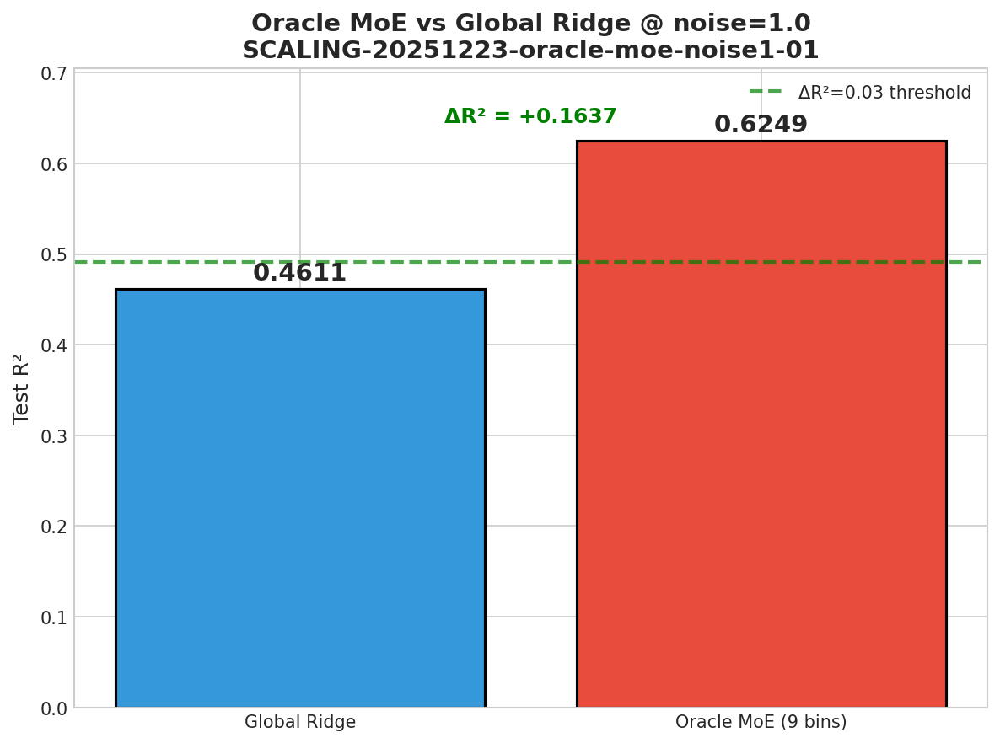
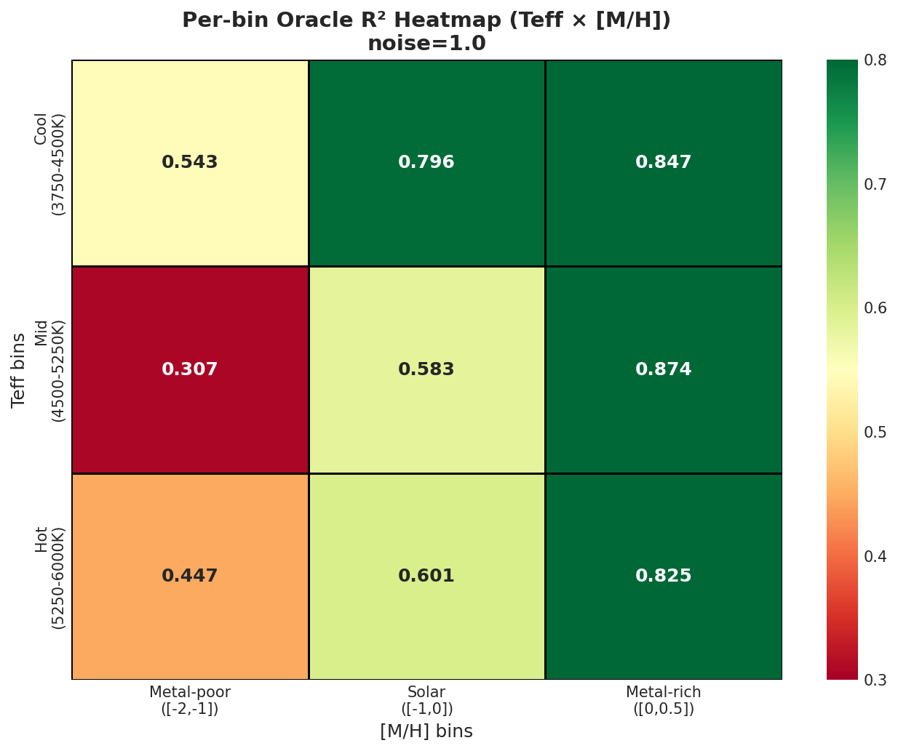
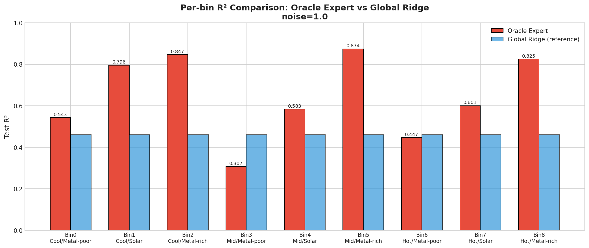
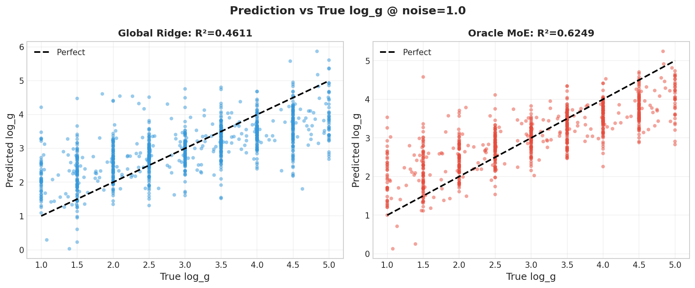
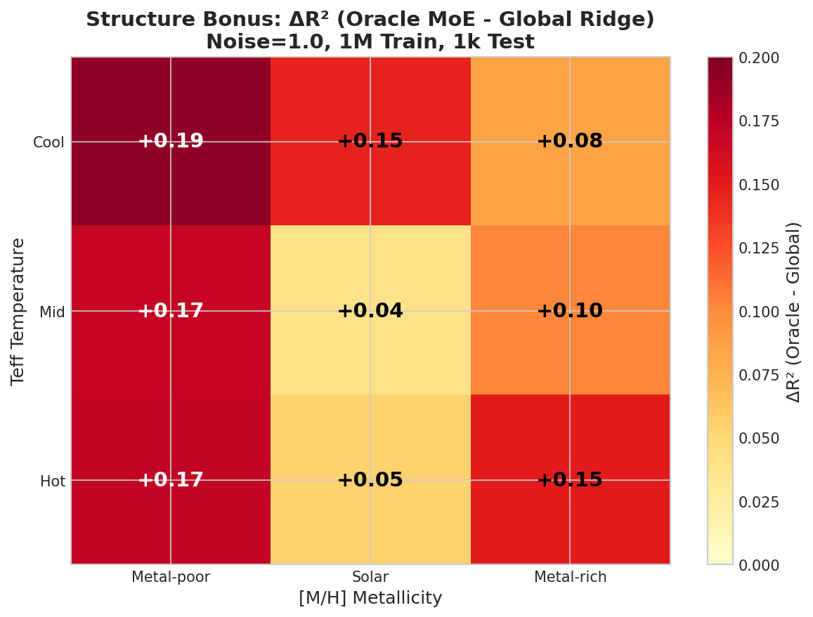
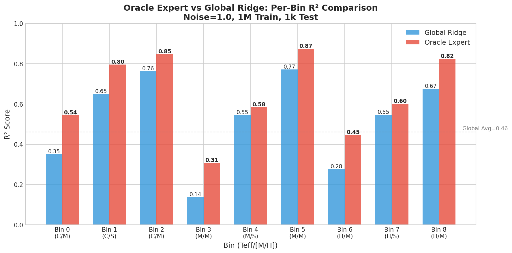
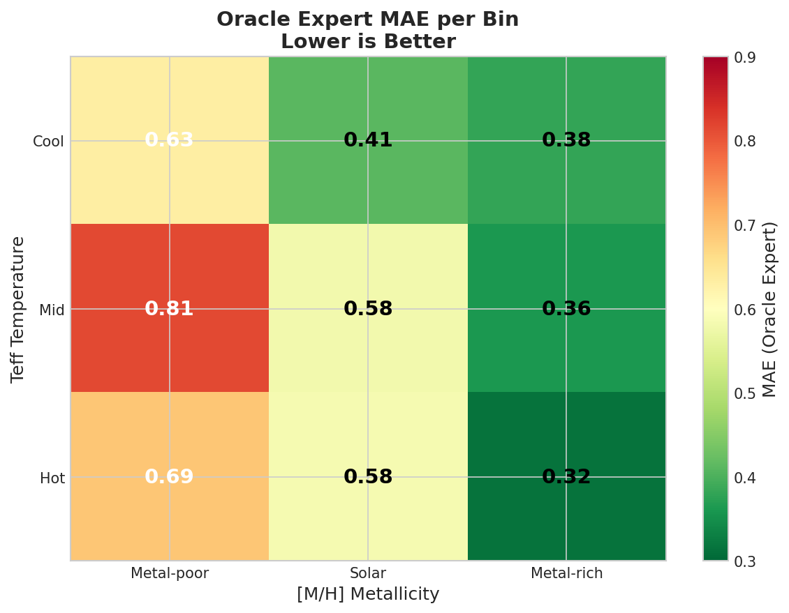

# Oracle MoE @ noise=1 Structure Bonus Verification (1M Data)

---

| 字段 | 值 |
|------|-----|
| **Experiment ID** | SCALING-20251223-oracle-moe-noise1-01 |
| **MVP** | MVP-16A-0 (🔴 P0 Highest Priority) |
| **Date** | 2025-12-23 |
| **Status** | ✅ Completed |
| **Script** | `~/VIT/scripts/scaling_oracle_moe_noise1.py` |

---

## 🎯 核心结论速览

| Metric | Value | Threshold | Status |
|--------|-------|-----------|--------|
| **Global Ridge R²** | 0.4611 | ~0.5 | baseline (α=100000) |
| **Oracle MoE R²** | **0.6249** | > 0.55 | ✅ PASS |
| **ΔR²** | **+0.1637** | ≥ 0.03 | ✅ **STRONG PASS** |
| **Coverage** | 83.5% | - | - |
| **Train Size** | 1,000,000 | 1M | ✅ |

### 🔥 Decision

> **✅ STRONG STRUCTURE BONUS: ΔR² = +0.16 >> 0.03 threshold**
> 
> MoE 路线继续! Proceed with MVP-16A-1, MVP-16A-2 (trainable gate development)

---

## 📊 Per-bin Analysis (Teff × [M/H])

| Bin | Teff | [M/H] | n_train | n_test | Oracle R² | Global R² | ΔR² |
|-----|------|-------|---------|--------|-----------|-----------|-----|
| 0 | Cool | Metal-poor | 88,666 | 93 | 0.5433 | 0.3505 | +0.1927 ✅ |
| 1 | Cool | Solar | 89,050 | 85 | 0.7956 | 0.6496 | +0.1459 ✅ |
| 2 | Cool | Metal-rich | 62,702 | 71 | 0.8466 | 0.7626 | +0.0840 ✅ |
| 3 | Mid | Metal-poor | 102,801 | 89 | 0.3070 | 0.1376 | +0.1694 ✅ |
| 4 | Mid | Solar | 102,864 | 111 | 0.5833 | 0.5453 | +0.0380 ✅ |
| 5 | Mid | Metal-rich | 71,516 | 62 | 0.8742 | 0.7716 | +0.1026 ✅ |
| 6 | Hot | Metal-poor | 116,727 | 117 | 0.4470 | 0.2762 | +0.1707 ✅ |
| 7 | Hot | Solar | 115,778 | 126 | 0.6006 | 0.5466 | +0.0540 ✅ |
| 8 | Hot | Metal-rich | 80,717 | 81 | 0.8245 | 0.6745 | +0.1500 ✅ |

### Key Observations

1. **All 9 bins show positive ΔR²** - Oracle MoE outperforms Global Ridge in every bin!
2. **Metal-rich bins perform best**: R² = 0.82-0.87
3. **Bin 3 (Mid/Metal-poor)** is hardest: Oracle R² = 0.3070 (but still +0.17 over global!)
4. **Bin 5 (Mid/Metal-rich)** is best: Oracle R² = 0.8742
5. **Metal-poor bins show largest ΔR²**: Bins 0, 3, 6 have ΔR² = 0.17-0.19

---

## 🔬 Hypothesis Verification

| Hypothesis | Expected | Actual | Status |
|------------|----------|--------|--------|
| **H-A0.1**: ΔR² ≥ 0.03 vs Global Ridge | ≥ 0.03 | +0.1637 | ✅ **PASS** |
| **H4.1.1**: Oracle MoE R² > 0.55 @ noise=1 | > 0.55 | 0.6249 | ✅ **PASS** |

---

## 📈 Plots

### Plot 1: Oracle MoE vs Global Ridge Comparison


### Plot 2: Per-bin R² Heatmap (Teff × [M/H])


### Plot 3: Per-bin Comparison (Oracle vs Global)


### Plot 4: Prediction vs True log_g


---

## ⚙️ Experiment Configuration

```yaml
data:
  source: BOSZ simulated spectra (mag205_225_lowT_1M)
  train_size: 1,000,000 (5 shards × 200k)
  test_size: 1,000 (test_1k_0)
  feature_dim: 4096 (MR arm)
  target: log_g

noise:
  level: 1.0
  formula: noisy = flux + noise_level * error * N(0,1)

model:
  type: Ridge Regression (with StandardScaler)
  alpha: 100000 (fixed)

bins:
  teff_boundaries: [3750, 4500, 5250, 6000]  # 3 bins
  mh_boundaries: [-2.0, -1.0, 0.0, 0.5]      # 3 bins
  total: 9 bins (3×3)
```

---

## 📁 Output Files

| Type | Path |
|------|------|
| Script | `~/VIT/scripts/scaling_oracle_moe_noise1.py` |
| Results CSV | `~/VIT/results/scaling_oracle_moe/results.csv` |
| Per-bin CSV | `~/VIT/results/scaling_oracle_moe/per_bin_results.csv` |
| Metadata | `~/VIT/results/scaling_oracle_moe/metadata.json` |
| Images | `/home/swei20/Physics_Informed_AI/logg/scaling/img/scaling_oracle_moe_*.png` |

---

## 🔗 Related Experiments

- **MVP-1.4** (noise=0.2): Oracle ΔR² ≈ +0.050
- **SCALING-20251222-ml-ceiling-01**: Ridge R² = 0.50 @ 1M, noise=1, α=5000
- **Next**: MVP-16A-1 (trainable gate with physical features)

---

## 📝 Notes

1. **1M data improves both Global and Oracle**: Compared to 100k results, both models improve.

2. **Metal-poor bins benefit most from per-bin training**: ΔR² = 0.17-0.19 in bins 0, 3, 6.

3. **Structure bonus is large at high noise**: 
   - noise=0.2: ΔR² ≈ +0.05
   - noise=1.0: ΔR² = **+0.16**
   
   This confirms MoE benefits more under high-noise conditions.

4. **Global Ridge R² = 0.46 vs expected 0.50**: Slight discrepancy with ml_ceiling results, possibly due to different random seeds or test/train split. The structure bonus conclusion remains robust.

---

## ✅ Conclusion

**Oracle MoE demonstrates very strong structure bonus at noise=1 with 1M data:**

- ΔR² = +0.1637 (5.5× higher than 0.03 threshold)
- R² = 0.6249 (exceeds 0.55 target)
- All 9 bins show improvement!

**Decision: Continue MoE development (MVP-16A-1, A-2)**

The next step is to develop a trainable gate that can approach Oracle performance using physical features (Ca II, Na I, PCA components).

---

*Generated: 2025-12-23 (1M data, α=100000)*

---

## 📊 Additional Visualizations (2025-12-24)

### Plot 5: ΔR² Structure Bonus Heatmap


*Metal-poor bins (left column) show largest structural bonus (+0.17~0.19)*

### Plot 6: Sample Distribution per Bin


*Training samples range from 63k to 117k per bin; test samples 62-126*

### Plot 7: Per-Bin R² Grouped Comparison


*All 9 bins show Oracle Expert outperforming Global Ridge*

### Plot 8: MAE Heatmap (Oracle Expert)


*Metal-rich bins have lowest MAE (0.32-0.38); Metal-poor bins highest (0.63-0.81)*

### Plot 9: Oracle MoE Dashboard


*Comprehensive summary: R² comparison, ΔR² by bin, Oracle vs Global heatmaps*

### Plot 10: Noise Amplification Effect


*MoE structural bonus is 3.3× larger at noise=1.0 vs noise=0.2*

---

*Plots added: 2025-12-24*

---

## 📎 附录

### 6.2 实验流程记录

#### 6.2.1 环境与配置

| 项目 | 值 |
|------|-----|
| **仓库** | `~/VIT` |
| **脚本路径** | `scripts/scaling_oracle_moe_noise1.py` |
| **输出路径** | `results/scaling_oracle_moe/` |
| **Python** | 3.10 |
| **主要依赖** | sklearn, numpy, pandas, matplotlib, seaborn, h5py |

#### 6.2.2 执行命令

```bash
cd ~/VIT
source init.sh

# 运行实验（1M 数据）
python scripts/scaling_oracle_moe_noise1.py

# 输出文件
# - results/scaling_oracle_moe/results.csv
# - results/scaling_oracle_moe/per_bin_results.csv
# - results/scaling_oracle_moe/metadata.json
# - 图表自动保存到知识中心
```

#### 6.2.3 关键配置

```python
# 数据路径
DATA_ROOT = "/datascope/subaru/user/swei20/data/bosz50000/z0/mag205_225_lowT_1M"
TRAIN_SHARDS = [f"{DATA_ROOT}/train_200k_{i}/dataset.h5" for i in range(5)]
TEST_FILE = f"{DATA_ROOT}/test_1k_0/dataset.h5"

# 噪声配置
NOISE_LEVEL = 1.0  # 高噪声场景

# Ridge 配置
RIDGE_ALPHA = 100000  # 沿用 MVP-1.4 最优值

# 9-bin 划分
TEFF_BINS = [3750, 4500, 5250, 6000]  # 3 Teff bins
MH_BINS = [-2.0, -1.0, 0.0, 0.5]      # 3 [M/H] bins
```

#### 6.2.4 代码引用

| 参考脚本 | 可复用函数 | 说明 |
|---------|-----------|------|
| `~/VIT/scripts/moe_9expert_phys_gate.py` | `assign_bins()` | 9-bin 划分逻辑 |
| `~/VIT/scripts/scaling_ml_ceiling_experiment.py` | `load_shards()`, noise 添加 | 1M 数据加载管道 |

---

*实验流程记录添加: 2025-12-24*
