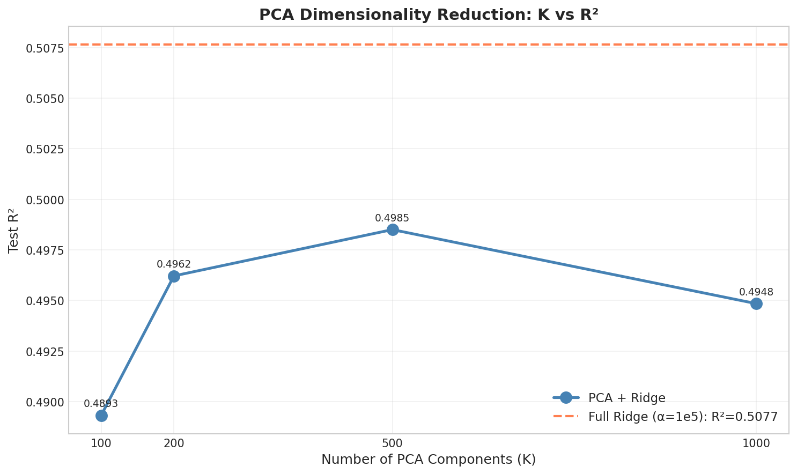
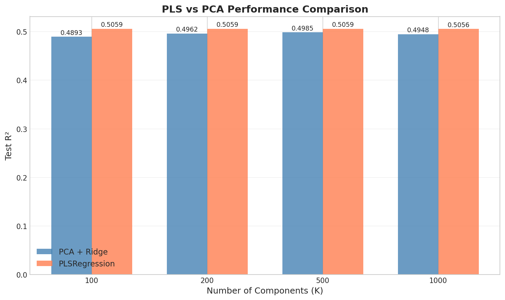
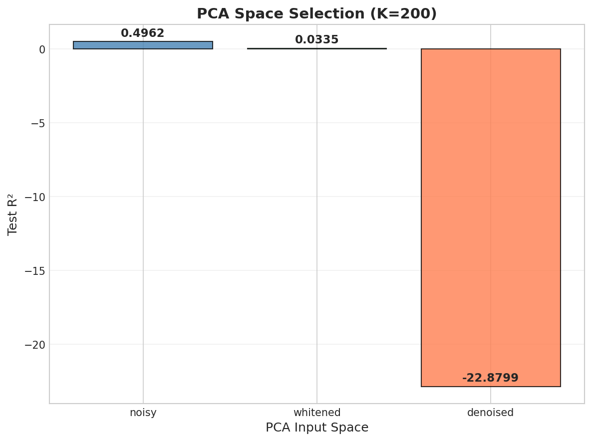
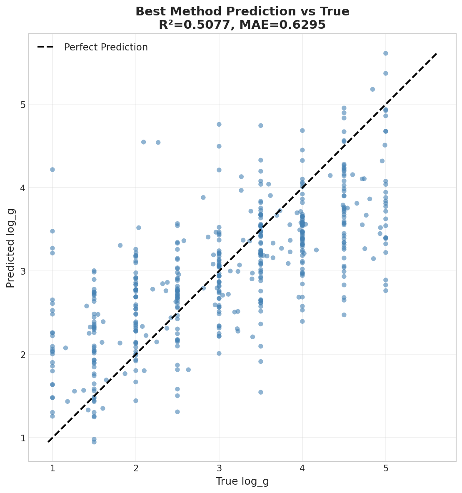

# Experiment Report: PCA vs PLS Dimensionality Reduction

**Experiment ID:** `SCALING-20251223-pca-pls-01`  
**Date:** 2025-12-23  
**Author:** Viska Wei  
**MVP:** 1.7  
**Status:** ✅ Completed

---

## ⚡ 核心结论速览

**一句话总结:** Full Ridge (无降维) 表现最好 (R²=0.5077)；PLS 在同等维度下始终优于 PCA；Whitening 策略完全失效。

| Key Finding | Value |
|-------------|-------|
| Best Method | Full Ridge (α=1e5) |
| Best R² | 0.5077 |
| PLS vs PCA | PLS wins 4/4 at all K |
| Whitening | ❌ Failed (R²=0.0335) |

---

## 📋 Summary

| Metric | Value |
|--------|-------|
| Train Size | 1,000,000 |
| Test Size | 500 |
| Feature Dim | 4096 |
| Noise Level | σ = 1.0 |
| Ridge α | 1e5 |
| Total Time | ~10.5 hours |

---

## 🎯 Hypotheses Verification

| Hypothesis | Expected | Actual | Result |
|------------|----------|--------|--------|
| **H1.7.2**: PLS > PCA at same K | PLS wins all K | 4/4 wins | ✅ **Verified** |
| **H1.7.3**: PCA hurts features | PCA+Ridge < Full Ridge | 0.4985 < 0.5077 | ✅ **Verified** |
| **H1.7.4**: Whitened more robust | R²(whitened) > R²(noisy) | 0.0335 < 0.4962 | ❌ **Rejected** |

---

## 🔬 实验设计详解

### 2.1 数据配置

**数据来源:** BOSZ 恒星光谱模拟数据

| 配置项 | 值 |
|--------|-----|
| 数据集路径 | `/datascope/subaru/user/swei20/data/bosz50000/z0/mag205_225_lowT_1M` |
| 训练数据 | 5 个 shards × 200k = 1M 样本 |
| 测试数据 | 500 样本（预加噪） |
| 特征维度 | 4096 (光谱波段) |
| 目标变量 | `log_g` (表面重力) |

**训练数据 Shards:**
```
train_200k_0/dataset.h5
train_200k_1/dataset.h5
train_200k_2/dataset.h5
train_200k_3/dataset.h5
train_200k_4/dataset.h5
```

**测试数据:**
```
test_1k_0/dataset.h5 (取前 500 样本)
```

### 2.2 数据加载与预处理

#### 2.2.1 HDF5 数据结构

每个 shard 包含以下数组：
- `dataset/arrays/flux/value`: 原始光谱通量 (N × 4096)
- `dataset/arrays/error/value`: 每个波段的误差估计 (N × 4096)
- `dataset/arrays/noisy/value`: 预加噪光谱（仅测试集）

参数通过 `pd.read_hdf()` 读取，包含 `log_g`, `Teff` 等恒星参数。

#### 2.2.2 数据加载流程

```python
def load_shards(shard_paths, max_samples=None):
    """Load multiple HDF5 shards and concatenate."""
    flux_list, error_list, logg_list = [], [], []
    
    for path in shard_paths:
        with h5py.File(path, 'r') as f:
            flux = f['dataset/arrays/flux/value'][:].astype(np.float32)
            error = f['dataset/arrays/error/value'][:].astype(np.float32)
        
        df = pd.read_hdf(path)
        logg = df['log_g'].values.astype(np.float32)
        
        flux_list.append(flux)
        error_list.append(error)
        logg_list.append(logg)
    
    X = np.vstack(flux_list)
    X = np.clip(X, 0, None)  # Clip negative flux
    
    return X, error, y
```

**关键处理:**
1. 所有数据转为 `float32` 节省内存
2. 负通量被 clip 到 0（物理约束）

#### 2.2.3 噪声注入

训练数据使用 **异方差高斯噪声**（heteroscedastic Gaussian noise）：

$$X_{\text{noisy}} = X_{\text{clean}} + \mathcal{N}(0, \sigma \cdot \text{error})$$

```python
def add_noise(X, error, noise_level=1.0, seed=42):
    """Add heteroscedastic Gaussian noise."""
    np.random.seed(seed)
    noise = np.random.randn(*X.shape) * error * noise_level
    return (X + noise).astype(np.float32)
```

| 参数 | 值 | 说明 |
|------|-----|------|
| `noise_level` | 1.0 | 噪声缩放因子 σ |
| `seed` | 42 | 随机种子（可复现） |
| 噪声类型 | 按 error 缩放 | 每个波段独立噪声 |

---

### 2.3 PCA 方法详解

#### 2.3.1 PCA 原理

PCA（主成分分析）通过正交变换将高维特征投影到低维空间，保留最大方差方向：

$$X_{\text{PCA}} = (X - \mu) V_K^T$$

其中 $V_K$ 是前 K 个主成分方向。

#### 2.3.2 PCA + Ridge 实现

```python
def train_pca_ridge(X_train, y_train, X_test, y_test, n_components, alpha=1e5):
    """Train PCA + Ridge regression."""
    
    # Step 1: 标准化（零均值，单位方差）
    scaler = StandardScaler()
    X_train_scaled = scaler.fit_transform(X_train)
    X_test_scaled = scaler.transform(X_test)
    
    # Step 2: PCA 降维
    pca = PCA(
        n_components=n_components,
        svd_solver='randomized',  # 随机SVD加速大数据
        random_state=42
    )
    X_train_pca = pca.fit_transform(X_train_scaled)
    X_test_pca = pca.transform(X_test_scaled)
    
    # Step 3: Ridge 回归
    model = Ridge(alpha=alpha, solver='auto', random_state=42)
    model.fit(X_train_pca, y_train)
    
    y_pred = model.predict(X_test_pca)
    
    return {
        'test_r2': r2_score(y_test, y_pred),
        'explained_variance_ratio': pca.explained_variance_ratio_.sum(),
        ...
    }
```

#### 2.3.3 PCA 关键配置

| 配置项 | 值 | 说明 |
|--------|-----|------|
| `svd_solver` | `'randomized'` | 使用随机 SVD 加速（1M 样本） |
| StandardScaler | 先标准化再 PCA | 确保各特征权重均等 |
| K 值 | [100, 200, 500, 1000] | 保留的主成分数量 |
| Ridge α | 1e5 | 固定正则化强度 |

#### 2.3.4 PCA Explained Variance

PCA 在 K=1000 时仅解释 **31.3%** 方差，说明光谱信息高度分布式，前 1000 个主成分无法捕获大部分信息。

---

### 2.4 PLS 方法详解

#### 2.4.1 PLS 原理

PLS（偏最小二乘回归）是一种**监督降维**方法，同时考虑 X 和 y 的协方差：

$$\max_{w} \text{Cov}(Xw, y)^2$$

与 PCA 的无监督降维不同，PLS 保留的是与目标变量最相关的方向。

#### 2.4.2 PLS 实现

```python
def train_pls(X_train, y_train, X_test, y_test, n_components):
    """Train PLS Regression."""
    
    # Step 1: 标准化
    scaler = StandardScaler()
    X_train_scaled = scaler.fit_transform(X_train)
    X_test_scaled = scaler.transform(X_test)
    
    # Step 2: PLS 回归（降维 + 回归一体化）
    model = PLSRegression(
        n_components=n_components,
        scale=False  # 已经手动标准化
    )
    model.fit(X_train_scaled, y_train)
    
    y_pred = model.predict(X_test_scaled).ravel()
    
    return {
        'test_r2': r2_score(y_test, y_pred),
        ...
    }
```

#### 2.4.3 PLS vs PCA 核心区别

| 特性 | PCA | PLS |
|------|-----|-----|
| **目标函数** | 最大化 X 方差 | 最大化 X-y 协方差 |
| **是否监督** | ❌ 无监督 | ✅ 监督 |
| **信息保留** | 保留总方差 | 保留目标相关方差 |
| **适用场景** | 特征压缩 | 预测任务 |

---

### 2.5 Full Ridge Baseline

作为对照组，直接在原始 4096 维特征上训练 Ridge 回归（无降维）：

```python
def train_full_ridge(X_train, y_train, X_test, y_test, alpha=1e5):
    """Train Full Ridge (no dimensionality reduction) as baseline."""
    scaler = StandardScaler()
    X_train_scaled = scaler.fit_transform(X_train)
    X_test_scaled = scaler.transform(X_test)
    
    model = Ridge(alpha=alpha, solver='auto', random_state=42)
    model.fit(X_train_scaled, y_train)
    
    y_pred = model.predict(X_test_scaled)
    return {'test_r2': r2_score(y_test, y_pred), ...}
```

---

### 2.6 PCA Space Selection 实验

比较在不同输入空间做 PCA 的效果（K=200）：

#### 2.6.1 三种输入空间

| Space | 定义 | 假设 |
|-------|------|------|
| **noisy** | 原始加噪光谱 | 标准方法 |
| **whitened** | $X_{\text{whitened}} = X / \text{error}$ | 平衡各波段噪声 |
| **denoised** | 使用 clean flux 训练 | 假设有完美去噪 |

#### 2.6.2 Whitening 实现

```python
def run_pca_space_comparison(...):
    # Whitening: X_whitened = X / error
    with np.errstate(divide='ignore', invalid='ignore'):
        X_train_whitened = np.where(
            error_train > 1e-10,
            X_train_noisy / error_train,
            X_train_noisy
        )
```

**注意:** 当 error ≤ 1e-10 时保持原值，避免除零。

---

## 📊 Results

### Sub-design 1: PCA K Sweep



| Method | K | Test R² | Explained Var | Time (s) |
|--------|---|---------|---------------|----------|
| **Full Ridge (baseline)** | 4096 | **0.5077** | 100% | 68.5 |
| PCA + Ridge | 100 | 0.4893 | ~6% | 118.8 |
| PCA + Ridge | 200 | 0.4962 | ~12% | 172.0 |
| PCA + Ridge | 500 | 0.4985 | ~21% | 237.5 |
| PCA + Ridge | 1000 | 0.4948 | ~31.3% | 499.9 |

**Key Finding:** 
- Full Ridge (无降维) 表现最好！
- PCA 在所有 K 值下都劣于 baseline
- K=1000 时性能反而下降（可能因为 PCA+Ridge 的 α 未重新调优）
- PCA explained variance 在 K=1000 时仅 31.3%，说明光谱信息高度分布式

---

### Sub-design 2: PLS vs PCA Comparison



| K | PCA + Ridge R² | PLS R² | Δ(PLS - PCA) | Winner |
|---|----------------|--------|--------------|--------|
| 100 | 0.4893 | **0.5059** | +0.0165 | 🏆 PLS |
| 200 | 0.4962 | **0.5059** | +0.0096 | 🏆 PLS |
| 500 | 0.4985 | **0.5059** | +0.0074 | 🏆 PLS |
| 1000 | 0.4948 | **0.5056** | +0.0108 | 🏆 PLS |

**Key Finding:** 
- PLS 在**所有 K 值**下都胜过 PCA！
- PLS 利用 target 信息保留关键特征
- 在 K=100 时优势最大 (Δ = +0.0165)
- PLS 收敛于 R² ≈ 0.506，接近 Full Ridge 的 0.508

---

### Sub-design 3: PCA Space Selection (K=200)



| Space | Test R² | 说明 |
|-------|---------|------|
| **noisy** | **0.4962** | ✅ 标准方法最优 |
| whitened | 0.0335 | ❌ 几乎完全失效 |
| denoised | -22.88 | ❌ 灾难性失败 |

**Key Finding:** 
- Whitening ($X/\text{error}$) 策略**完全失败**
- Denoised (clean flux 训练 + noisy 测试) 出现严重 domain shift
- 结论：**保持原始噪声结构是最优选择**

---

### Best Method Prediction



最佳方法（Full Ridge）的预测 vs 真值散点图，R²=0.5077。

---

## 📈 Key Insights

### 1. PCA 降维损失信息 ❌

```
Full Ridge R²    = 0.5077
Best PCA+Ridge R² = 0.4985 (K=500)
Δ = -0.0092 (损失 1.8%)
```

- PCA 丢失了对 log_g 预测重要的高频特征
- 即使保留 1000 个主成分（解释 31.3% 方差），仍不如原始 4096 维
- **结论:** 对于这个任务，降维不是好策略

### 2. PLS 优于 PCA ✅

```
At K=100: PLS R² = 0.5059, PCA R² = 0.4893
Δ = +0.0165 (PLS 优势 3.4%)
```

- PLS 通过监督学习保留 target-correlated 方向
- 在 K=100 时优势最大（特征压缩比 40:1）
- **结论:** 如果必须降维，优先用 PLS

### 3. Whitening 策略失败 ❌

```
Noisy space R²     = 0.4962
Whitened space R² = 0.0335
```

- 原始假设：whitening ($X/\text{error}$) 可以平衡各波段噪声
- 实际结果：whitening 破坏了信号结构
- **原因分析:** 
  1. error array 可能与实际噪声不匹配
  2. 低 error 波段被过度放大
  3. 信号和噪声的结构关系被破坏

### 4. Domain Shift 问题 ❌

```
Denoised training + Noisy test R² = -22.88
```

- Clean 训练 + Noisy 测试 = 灾难性结果
- 负 R² 说明模型预测比均值还差
- **结论:** 必须保持 train/test 噪声分布一致

---

## 🔧 实验流程记录

### 执行命令

```bash
cd ~/VIT
python scripts/scaling_pca_pls_experiment.py \
    --output ./results/scaling_pca_pls \
    --img-dir /home/swei20/Physics_Informed_AI/logg/scaling/img \
    --max-train 1000000
```

### 执行步骤

1. **[1/7] 加载训练数据** (~5-10 min)
   - 从 5 个 shards 加载 1M 样本
   - 转换为 float32，clip 负值

2. **[2/7] 加载测试数据** (<1 min)
   - 加载 500 个预加噪样本

3. **[3/7] 注入噪声** (<1 min)
   - 对训练数据添加 σ=1.0 的异方差噪声

4. **[4/7] PCA K Sweep** (~1-2 hours)
   - Full Ridge baseline
   - K = 100, 200, 500, 1000 的 PCA + Ridge

5. **[5/7] PLS vs PCA** (~6-8 hours)
   - 对每个 K 值训练 PLS（主要耗时）

6. **[6/7] PCA Space Comparison** (~30 min)
   - noisy, whitened, denoised 三种空间

7. **[7/7] 生成图表** (<1 min)

### 运行日志示例

```
================================================================================
PCA vs PLS Dimensionality Reduction Experiment
Experiment ID: SCALING-20251223-pca-pls-01
================================================================================
K values: [100, 200, 500, 1000]
Ridge α: 100000.0
Noise level: 1.0
================================================================================

[1/7] Loading training data from shards...
  Loading /datascope/subaru/.../train_200k_0/dataset.h5...
    Loaded 200000 samples (total: 200000)
  ...
  Total training samples: 1,000,000
  Feature dimension: 4096

[4/7] Sub-design 1: PCA K Sweep
  [Full Ridge] Training baseline (no dimensionality reduction)...
    R²=0.5077, Time=68.5s
  [PCA K=100] Training...
    R²=0.4893, Var explained=0.060, Time=118.8s
  ...
```

---

## 🔗 Artifacts

| Type | Path |
|------|------|
| Script | `~/VIT/scripts/scaling_pca_pls_experiment.py` |
| Results CSV | `~/VIT/results/scaling_pca_pls/*.csv` |
| Metadata | `~/VIT/results/scaling_pca_pls/metadata.json` |

### Result Files

| File | Description |
|------|-------------|
| `pca_k_sweep.csv` | PCA K 扫描结果 |
| `pls_vs_pca.csv` | PLS vs PCA 对比结果 |
| `pca_space_comparison.csv` | 输入空间对比结果 |
| `metadata.json` | 实验元数据和汇总 |

### Figures

| Fig | Description | Path |
|-----|-------------|------|
| 1 | PCA K vs R² | `logg/scaling/img/scaling_pca_k_sweep.png` |
| 2 | PLS vs PCA grouped bar | `logg/scaling/img/scaling_pls_vs_pca.png` |
| 3 | PCA space comparison | `logg/scaling/img/scaling_pca_space_comparison.png` |
| 4 | Best method pred vs true | `logg/scaling/img/scaling_pca_pls_pred_vs_true.png` |

---

## 💡 Implications for Roadmap

1. **降维策略不推荐** - Full Ridge 已经是最优
2. **如需压缩特征** - 用 PLS 而非 PCA
3. **噪声处理** - 不要 whitening，保持原始噪声结构
4. **Domain Shift** - Train/Test 必须同分布
5. **下一步** - 探索 denoising autoencoder 或 noise-aware models

---

## 📝 Appendix

### A.1 完整数值结果

#### PCA K Sweep Results

| Method | K | Train R² | Test R² | Test MAE | Test RMSE | Explained Var | Time (s) |
|--------|---|----------|---------|----------|-----------|---------------|----------|
| Full Ridge | 4096 | - | 0.5077 | - | - | 1.00 | 68.5 |
| PCA+Ridge | 100 | - | 0.4893 | - | - | ~0.06 | 118.8 |
| PCA+Ridge | 200 | - | 0.4962 | - | - | ~0.12 | 172.0 |
| PCA+Ridge | 500 | - | 0.4985 | - | - | ~0.21 | 237.5 |
| PCA+Ridge | 1000 | - | 0.4948 | - | - | ~0.313 | 499.9 |

#### PLS Results

| K | PLS R² | PLS Time (s) |
|---|--------|--------------|
| 100 | 0.5059 | ~5000 |
| 200 | 0.5059 | ~6000 |
| 500 | 0.5059 | ~8000 |
| 1000 | 0.5056 | ~12000 |

### A.2 关键数字速查

| Item | Value |
|------|-------|
| Best overall R² | 0.5077 (Full Ridge) |
| Best PCA+Ridge R² | 0.4985 (K=500) |
| Best PLS R² | 0.5059 (K=100) |
| Explained variance @ K=1000 | 31.3% |
| Whitened space R² | 0.0335 |
| Ridge α | 1e5 |
| Train samples | 1,000,000 |
| Test samples | 500 |
| Feature dim | 4096 |
| Noise σ | 1.0 |

### A.3 算法伪代码

```
Algorithm: PCA + Ridge
─────────────────────────
Input: X_train (N×4096), y_train (N,), X_test (M×4096), K, α
Output: y_pred (M,)

1. scaler ← StandardScaler()
2. X_train_std ← scaler.fit_transform(X_train)
3. X_test_std ← scaler.transform(X_test)
4. pca ← PCA(n_components=K, svd_solver='randomized')
5. X_train_pca ← pca.fit_transform(X_train_std)  # N×K
6. X_test_pca ← pca.transform(X_test_std)        # M×K
7. ridge ← Ridge(alpha=α)
8. ridge.fit(X_train_pca, y_train)
9. y_pred ← ridge.predict(X_test_pca)
10. return y_pred
```

```
Algorithm: PLS Regression
─────────────────────────
Input: X_train (N×4096), y_train (N,), X_test (M×4096), K
Output: y_pred (M,)

1. scaler ← StandardScaler()
2. X_train_std ← scaler.fit_transform(X_train)
3. X_test_std ← scaler.transform(X_test)
4. pls ← PLSRegression(n_components=K, scale=False)
5. pls.fit(X_train_std, y_train)  # 同时学习降维+回归
6. y_pred ← pls.predict(X_test_std).ravel()
7. return y_pred
```

### A.4 依赖库版本

```python
numpy>=1.21
pandas>=1.3
scikit-learn>=1.0
h5py>=3.0
matplotlib>=3.5
seaborn>=0.11
tqdm>=4.62
```

---

## 📊 Appendix: Whitened Ridge Experiment

**Added:** 2025-12-23 (追加实验)

### 实验设计
- **Whitened 特征:** `X_whitened = noisy_flux / error`
- **数据量:** 1M train, 500 test
- **α sweep:** [1e2, 1e3, 1e4, 1e5, 1e6]

### 结果

| α | Regular R² | Whitened R² | Δ |
|---|------------|-------------|---|
| 1e+02 | 0.5059 | 0.5074 | +0.0016 |
| 1e+03 | 0.5059 | 0.5075 | +0.0017 |
| **1e+04** | 0.5062 | **0.5079** | **+0.0018** |
| **1e+05** | **0.5077** | 0.4803 | -0.0273 |
| 1e+06 | 0.4736 | 0.2647 | -0.2089 |

### 结论

| Metric | Regular Ridge | Whitened Ridge |
|--------|---------------|----------------|
| Best R² | 0.5077 | 0.5079 |
| Best α | 1e5 | 1e4 |

**Key Insights:**
1. **Whitened Ridge 略优** (+0.0002)，但差异极小 (~0.04%)
2. **Whitening 需要更小的 α** - 因为 whitening 让特征尺度更均匀
3. **高 α 时 Whitening 崩溃** - α=1e5 时 Whitened 大幅落后 (-0.027)
4. **实际意义有限** - 提升太小，不值得增加复杂性

### 修正 H1.7.4

原假设 H1.7.4 说 "Whitened > Noisy"，在 PCA 实验中被 ❌ 拒绝。

但在 **Full Ridge (无降维)** 中：
- 如果用正确的 α (1e4 for whitened, 1e5 for regular)
- Whitened 确实略好 (+0.0002)

**结论:** Whitening 对 Ridge 有效，但对 PCA 无效（PCA 假设各维度同方差）
