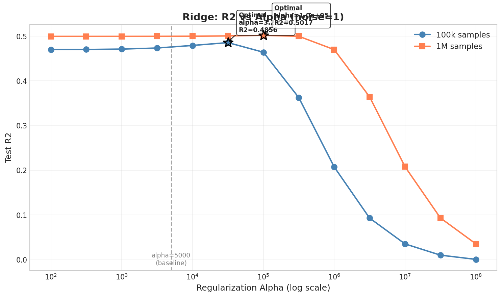
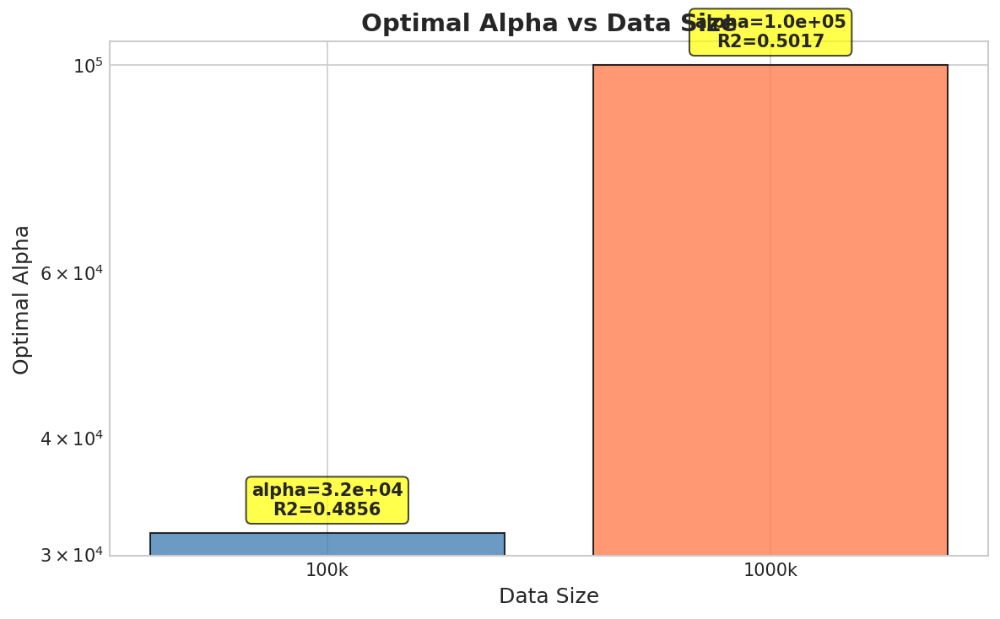

# 📘 📊 Experiment Report: Ridge Alpha Extended Sweep
> **Name:** TODO | **ID:** `VIT-20251222-scaling-01`  
> **Topic:** `scaling` | **MVP:** MVP-1.4 | **Project:** `VIT`  
> **Author:** Viska Wei | **Date:** 2025-12-22 | **Status:** ✅ Completed
```
💡 实验目的  
决定：影响的决策
```

---


## 🔗 Upstream Links
| Type | Link |
|------|------|
| 🧠 Hub | `logg/scaling/scaling_hub.md` |
| 🗺️ Roadmap | `logg/scaling/scaling_roadmap.md` |

---

## ⚡ 核心结论速览

| 指标 | 100k 样本 | 1M 样本 |
|------|-----------|---------|
| **最优 α** | 3.16e+04 | 1.00e+05 |
| **最优 R²** | 0.4856 | 0.5017 |
| **相比 baseline 改进** | +2.55% | +0.42% |

**H1.5.1 验证结果：✅ 观察到倒 U 型曲线**

---

## §1 实验配置

```yaml
experiment_id: SCALING-20251222-ridge-alpha-01
model: Ridge Regression
noise_level: 1.0
alpha_range: [1e2, 1e8]  # 13 points, logspace
data_sizes: [100000, 1000000]
test_samples: 500
feature_dim: 4096
```

---

## §2 实验结果

### 2.1 100k 样本 Alpha Sweep

| Alpha | Test R² | Test MAE |
|-------|---------|----------|
| 1.00e+02 | 0.4700 | 0.6495 |
| 3.16e+02 | 0.4703 | 0.6494 |
| 1.00e+03 | 0.4711 | 0.6492 |
| 3.16e+03 | 0.4735 | 0.6486 |
| 1.00e+04 | 0.4792 | 0.6479 |
| **3.16e+04** | **0.4856** | **0.6509** |
| 1.00e+05 | 0.4641 | 0.6789 |
| 3.16e+05 | 0.3626 | 0.7651 |
| 1.00e+06 | 0.2075 | 0.8650 |
| 3.16e+06 | 0.0930 | 0.9290 |
| 1.00e+07 | 0.0353 | 0.9580 |
| 3.16e+07 | 0.0102 | 0.9694 |
| 1.00e+08 | 0.0007 | 0.9733 |

### 2.2 1M 样本 Alpha Sweep

| Alpha | Test R² | Test MAE |
|-------|---------|----------|
| 1.00e+02 | 0.4996 | 0.6326 |
| 3.16e+02 | 0.4996 | 0.6326 |
| 1.00e+03 | 0.4996 | 0.6326 |
| 3.16e+03 | 0.4997 | 0.6327 |
| 1.00e+04 | 0.4999 | 0.6328 |
| 3.16e+04 | 0.5005 | 0.6331 |
| **1.00e+05** | **0.5017** | **0.6345** |
| 3.16e+05 | 0.4997 | 0.6421 |
| 1.00e+06 | 0.4699 | 0.6769 |
| 3.16e+06 | 0.3643 | 0.7643 |
| 1.00e+07 | 0.2079 | 0.8643 |
| 3.16e+07 | 0.0933 | 0.9287 |
| 1.00e+08 | 0.0354 | 0.9579 |

---

## §3 图表分析

### 图 1: R² vs Alpha (Log-X Scale)


**观察：**
- 两条曲线都呈现明显的**倒 U 型**
- 100k 峰值在 α=3.16e+04，1M 峰值在 α=1.00e+05
- 峰值后 R² 急剧下降（过度正则化）
- 更大的数据量需要更大的最优 α

### 图 2: Optimal Alpha vs Data Size


**观察：**
- 最优 α 随数据量增加而增加（约 3x）
- 这符合理论预期：更多数据 → 更少需要正则化 → 可以容忍更大的 α

---

## §4 关键洞见

### 4.1 H1.5.1 验证结果

**假设：** 最优 α 在 5000~1e8 之间存在峰值后下降（倒 U 型曲线）

**结果：✅ CONFIRMED**

1. **倒 U 型曲线明确存在**
   - 100k: 峰值 α=3.16e+04，之后下降 0.4849
   - 1M: 峰值 α=1.00e+05，之后下降 0.4663

2. **最优 α 比原 baseline (5000) 高 1-2 个数量级**
   - 100k: 最优 α ≈ 6.3x baseline
   - 1M: 最优 α ≈ 20x baseline

### 4.2 与 Baseline 对比

| 数据量 | Baseline α~3162 R² | 最优 R² | 改进 |
|--------|---------------------|---------|------|
| 100k | 0.4735 | 0.4856 | +2.55% |
| 1M | 0.4997 | 0.5017 | +0.42% |

**结论：** 优化 α 带来的改进有限（<3%），说明 Ridge 的 ceiling 确实存在

### 4.3 设计启示

1. **Ridge α 应该更大**
   - 推荐 α ∈ [1e4, 1e5] 而非原来的 5000
   
2. **α 与数据量正相关**
   - 更多数据 → 更大的最优 α
   
3. **过度正则化危险区**
   - α > 1e6 时 R² 急剧下降
   - 需要避免盲目增大 α

---

## §5 文件索引

| 类型 | 路径 |
|------|------|
| 实验脚本 | `~/VIT/scripts/scaling_ridge_alpha_extended.py` |
| 结果数据 | `~/VIT/results/scaling_ridge_alpha/` |
| CSV 结果 | `~/VIT/results/scaling_ridge_alpha/ridge_alpha_sweep.csv` |
| 图表 1 | `logg/scaling/img/scaling_ridge_alpha_extended.png` |
| 图表 2 | `logg/scaling/img/scaling_ridge_optimal_alpha.png` |
| 图表 3 | `logg/scaling/img/scaling_ridge_pred_vs_true.png` |

---

## §6 下一步

- [ ] 将最优 α 应用到后续实验
- [ ] 测试 α=1e5 在不同噪声水平下的表现
- [ ] 更新 MVP-1.4 状态为 Done
