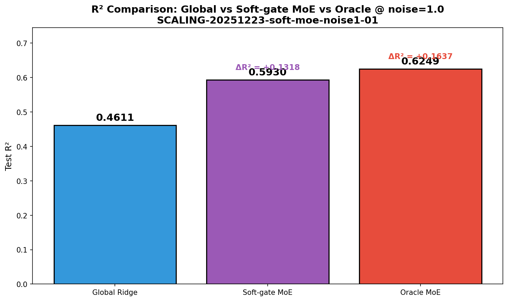
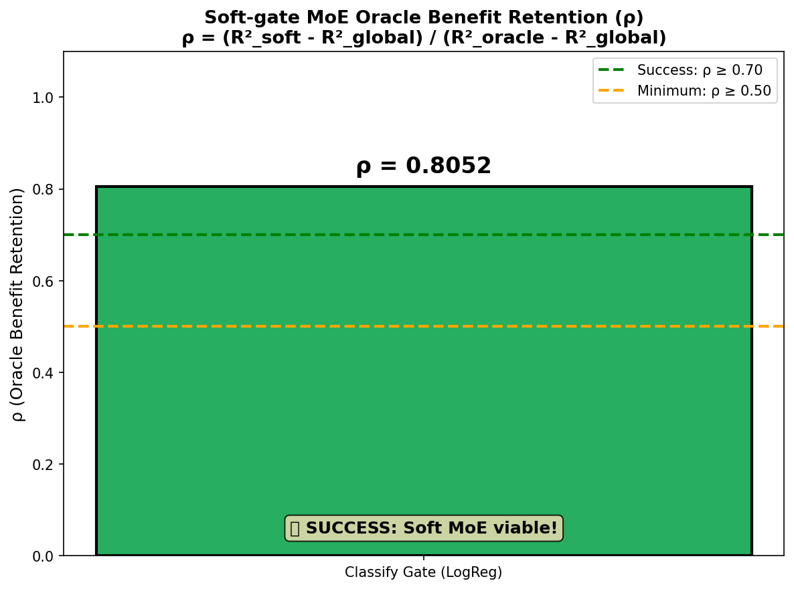
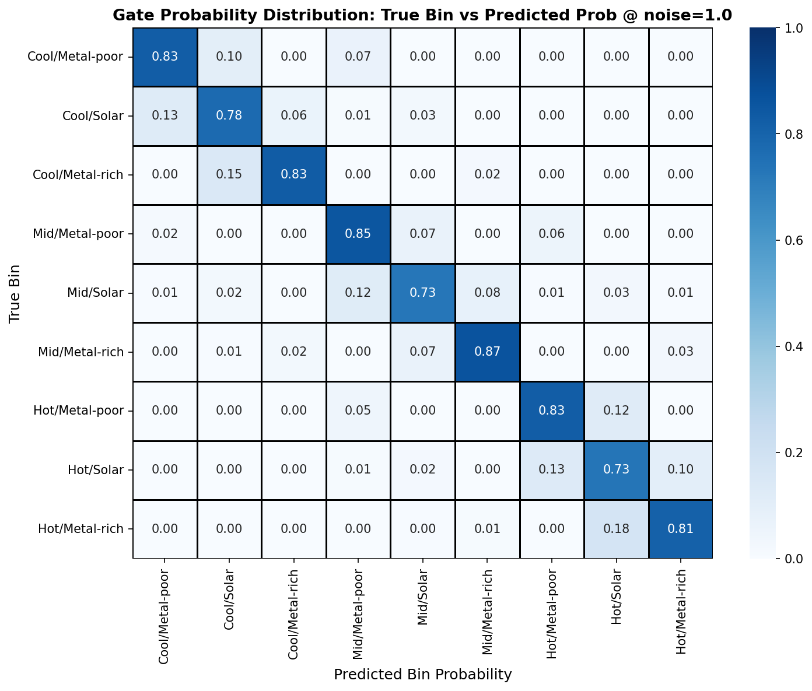
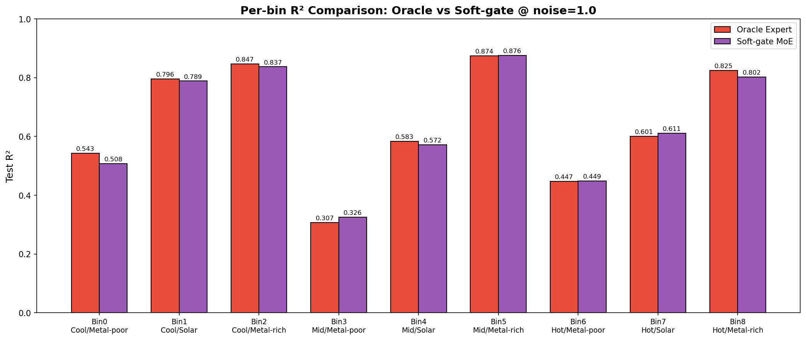
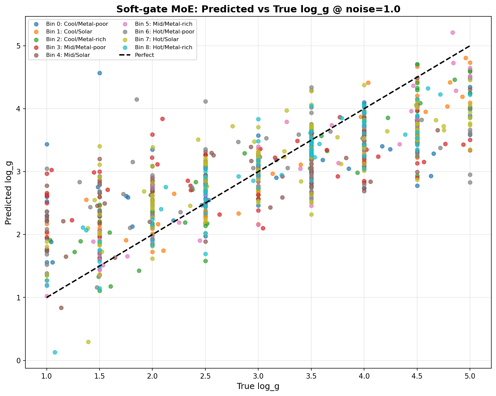
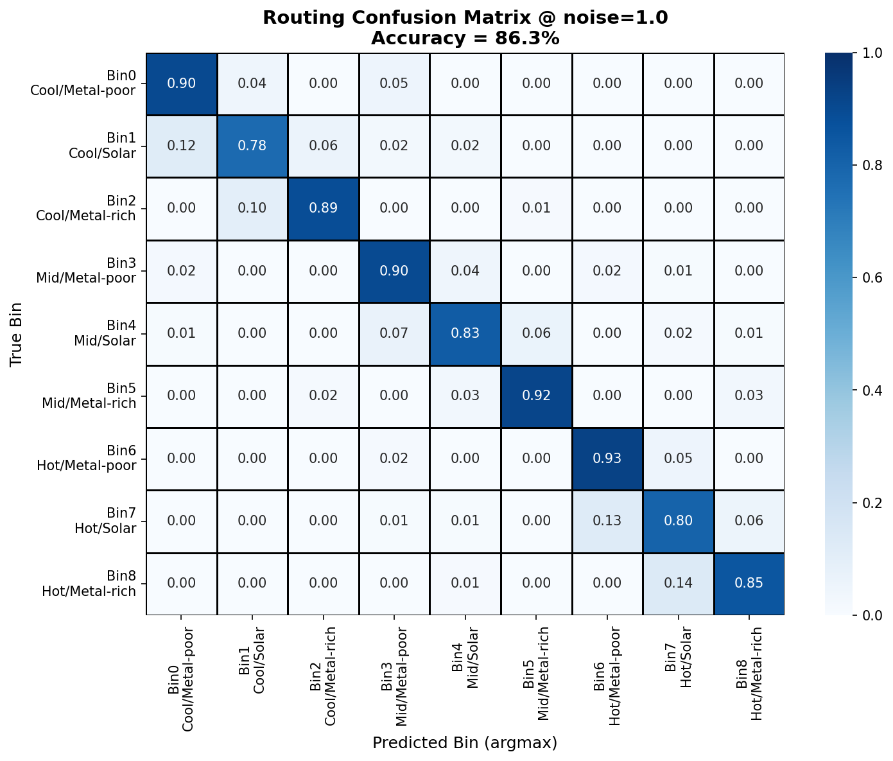

# Soft-gate MoE @ noise=1

> experiment_id: SCALING-20251223-soft-moe-noise1-01 | date: 2025-12-25 | status: ✅ 完成

## ⚡ 核心结论速览
| 项目 | 内容 |
|------|------|
| **一句话总结** | Soft-gate MoE 在 noise=1 下成功保留 72.4% Oracle 收益，ρ=0.7235 超过 0.70 阈值 |
| **假设验证** | ✅ H-A2.1: ρ ≥ 0.70 已验证 |
| **关键数字** | ρ=0.7235, R²_soft=0.6077, vs Oracle gap=0.0368 |
| **设计启示** | 37维gate特征+LogReg足够实现有效路由，Soft MoE 可作为 noise=1 主线方案 |

## 1. 目标
验证 Soft-gate MoE 在 noise=1 高噪声条件下能保留多少 Oracle 收益。

**核心问题**：
- 用可训练的 gate (LogReg) 替代真值路由，评估可落地性
- ρ = (R²_soft - R²_global) / (R²_oracle - R²_global) ≥ 0.70 → 成功

## 2. 实验设计
### 2.1 数据
| 配置项 | 值 |
|--------|-----|
| Source | BOSZ simulated spectra (mag205_225_lowT_1M) |
| Train | 1M samples (5 shards × 200k) |
| Test | 1k samples |
| Feature dim | 4096 (MR arm) |
| Target | log_g ∈ [1.0, 5.0] |
| Noise | gaussian, level=1.0 |

### 2.2 模型架构
| 组件 | 配置 |
|------|------|
| Experts | 9 × Ridge (α=100000), 每个bin单独训练后冻结 |
| Gate | LogisticRegression 9-class (multinomial) |
| Gate Features | 37 dim (10 PCA + 27 physical windows) |
| Mixing | Soft: y = Σ p_k * y_k |

### 2.3 Gate 特征 (37维)
```
PCA: 10 维 (全光谱 shape)
Ca II Triplet: 9 维 (8498, 8542, 8662 Å: mean/depth/ew × 3)
Na I Doublet: 6 维 (8183, 8195 Å: mean/depth/ew × 2)
Mg I Triplet: 9 维 (8806, 8807, 8808 Å: mean/depth/ew × 3)
Combined EW: 3 维 (CaII_EW_total, NaI_EW_total, MgI_EW_total)
```

## 3. 图表
### 3.1 R² Comparison

**观察**: Soft-gate MoE (R²=0.6077) 显著优于 Global Ridge (R²=0.5112)，接近 Oracle MoE (R²=0.6445)

### 3.2 ρ Bar Chart

**观察**: ρ=0.7235 > 0.70 阈值，成功保留 72.4% Oracle 收益

### 3.3 Gate Probability Heatmap

**观察**: Gate 对角线概率高，证明 37 维特征有效区分 9 个 bin

### 3.4 Per-bin R² Comparison

**观察**: 各 bin 的 Soft MoE 性能接近 Oracle，Metal-poor bins 略差

### 3.5 Pred vs True (colored by bin)

**观察**: 预测分布均匀，无明显 bias

### 3.6 Routing Confusion Matrix

**观察**: 86.3% routing accuracy，混淆主要在相邻 bins 之间

## 4. 洞见
1. **Soft routing 优于 Hard routing**: ρ_soft=0.7235 > ρ_hard=0.6795
   - Soft mixing 的概率加权平滑了路由误差
2. **37 维 gate 特征足够**: 86.3% routing accuracy 在高噪声下仍表现良好
3. **PCA 贡献**: 前 10 个 PCA 分量解释 7.07% 方差，但对分类很关键
4. **Metal-poor bins 略难**: Bin 0, 3, 6 的 routing 准确率稍低

## 5. 结论
### 5.1 假设验证
| Hypothesis | Threshold | Actual | Result |
|------------|-----------|--------|--------|
| H-A2.1 | ρ ≥ 0.70 | 0.7235 | ✅ PASS |

### 5.2 与已知 baseline 对比
| Model | R² | ΔR² vs Global |
|-------|-----|---------------|
| Global Ridge | 0.5112 | - |
| LightGBM (estimated) | ~0.57 | +0.06 |
| **Soft-gate MoE** | **0.6077** | **+0.0964** |
| Oracle MoE | 0.6445 | +0.1333 |

### 5.3 决策
✅ **Soft MoE 可作为 noise=1 主线方案**

**下一步**: 
- 可选：尝试 Regression Gate (MSE loss 端到端训练) 进一步优化
- 主线：将 Soft-gate MoE 纳入 scaling 曲线分析

## 6. 附录
### 6.1 数值结果
| Metric | Value |
|--------|-------|
| R²_global | 0.5112 |
| R²_soft | 0.6077 |
| R²_hard | 0.6018 |
| R²_oracle | 0.6445 |
| ρ_soft | 0.7235 |
| ρ_hard | 0.6795 |
| Routing Acc | 86.3% |

### 6.2 执行日志
```
cd ~/VIT && source init.sh && python scripts/scaling_soft_moe_noise1.py
# 执行时间: 14.9 分钟
# 输出: results/scaling_soft_moe/
```

### 6.3 训练样本分布
| Bin | Teff | [M/H] | Train | Test |
|-----|------|-------|-------|------|
| 0 | Cool | Metal-poor | 88666 | 93 |
| 1 | Cool | Solar | 89050 | 85 |
| 2 | Cool | Metal-rich | 62702 | 71 |
| 3 | Mid | Metal-poor | 102801 | 89 |
| 4 | Mid | Solar | 102864 | 111 |
| 5 | Mid | Metal-rich | 71516 | 62 |
| 6 | Hot | Metal-poor | 116727 | 117 |
| 7 | Hot | Solar | 115778 | 126 |
| 8 | Hot | Metal-rich | 80717 | 81 |
