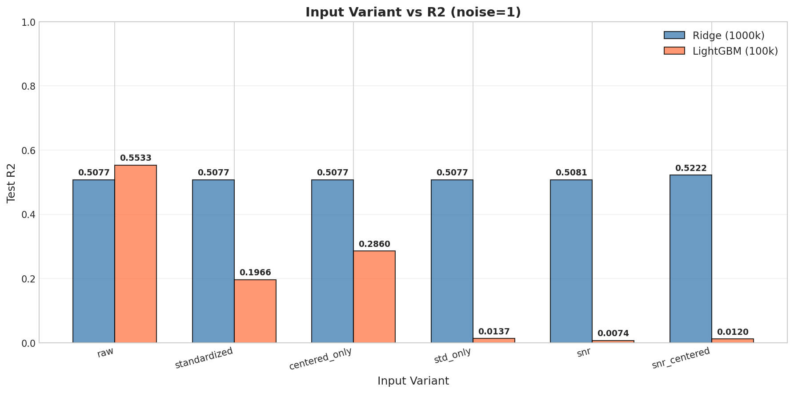
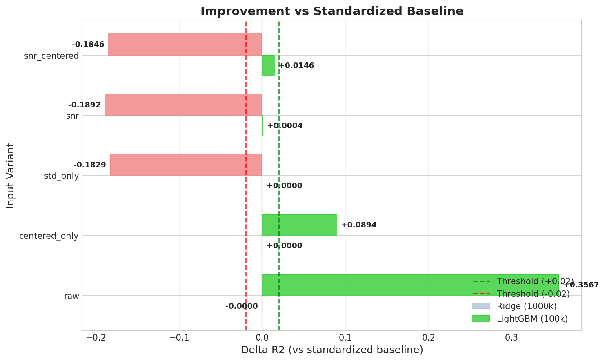
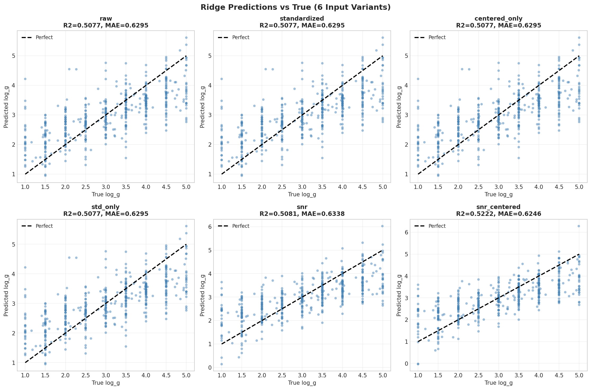
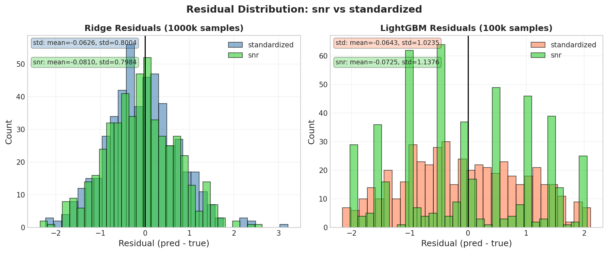

# 📘 📊 Experiment Report: Whitening / SNR Input
> **Name:** TODO | **ID:** `VIT-20251222-scaling-01`  
> **Topic:** `scaling` | **MVP:** MVP-1.6 (Whitening/SNR Input) | **Project:** `VIT`  
> **Author:** Viska Wei | **Date:** 2025-12-22 | **Status:** ✅ 已完成
```
💡 实验目的  
决定：影响的决策
```

---


## 🔗 Upstream Links
| Type | Link |
|------|------|
| 🧠 Hub | `logg/scaling/scaling_hub.md` |
| 🗺️ Roadmap | `logg/scaling/scaling_roadmap.md` |

---

---

## 🔗 上游追溯链接

| 来源 | 链接 |
|------|------|
| Hub 假设 | [H1.7.1 @ scaling_hub](../scaling_hub_20251222.md#23-l3-testable-hypotheses) |
| Roadmap MVP | [MVP-1.6 @ scaling_roadmap](../scaling_roadmap_20251222.md#mvp-16-whiteningsnr-input-p1) |
| 相关实验 | [exp_scaling_ridge_alpha_extended_20251222.md](./exp_scaling_ridge_alpha_extended_20251222.md) |

---

## ⚡ 核心结论速览

| 指标 | 预期 | 实际 |
|------|------|------|
| **Whitening vs StandardScaler** | ΔR² > 0.02 | ❌ ΔR² = +0.0146 (Ridge), -0.19 (LightGBM) |
| **最优输入方式** | flux/error 或 (flux-μ)/error | Ridge: snr_centered (+1.5%); LightGBM: raw |
| **H1.7.1 验证** | 验证 Whitening 能提升性能 | ❌ **REJECTED** |

**一句话总结：** SNR/Whitening 对 Ridge 有微小提升 (+1.5%) 但未达阈值，对 LightGBM 反而有害；StandardScaler 对线性模型无负面影响，但对树模型 standardization 严重损害性能。

---

## §1 🎯 目标

### 1.1 实验目的

**背景问题**：StandardScaler 是否会让 feature 绝对值信息消失？

**GPT 分析结论**：大概率不是。StandardScaler 是按特征维度的线性仿射变换 $x' = (x - \mu) / \sigma$，数学上可逆，不会丢信息。对 Ridge 这种线性模型，通常是正收益（改善条件数）。

**真正的实验目标**：验证 Whitening / SNR 化输入是否能显著提升性能
- 用 `x_whiten = flux / error` 或 `(flux - μ)/error`
- 直觉：让模型直接看到「哪段信号可靠」

### 1.2 验证假设

| 假设编号 | 假设内容 | 验证标准 |
|----------|----------|----------|
| H1.7.1 | Whitening (flux/error) 能提升 R² | ΔR² > 0.02 |
| (附加) | StandardScaler 不会损害性能 | StandardScaler ≥ raw |

### 1.3 预期结果

1. **如果 H1.7.1 成立**：SNR 化输入 > StandardScaler > raw flux
2. **如果 H1.7.1 不成立**：三种输入差异在统计误差内

---

## §2 🧪 实验设计

### 2.1 数据配置

| 项目 | 配置 |
|------|------|
| **数据集** | mag205_225_lowT_1M |
| **Ridge 数据量** | 1M train + 500 test |
| **LightGBM 数据量** | 100k train + 500 test |
| **噪声水平** | noise_level = 1.0 |
| **目标变量** | log_g |
| **特征维度** | 4096 (全波段光谱) |

**关键差异**：Ridge 用 1M（训练耗时恒定 ~20s），LightGBM 用 100k（1M 太慢）

### 2.2 输入变体 (Input Variants)

| 变体 | 公式 | 说明 |
|------|------|------|
| **raw** | $x = \text{flux}$ | 原始 flux，不做任何处理 |
| **standardized** | $x = \frac{\text{flux} - \mu_\text{train}}{\sigma_\text{train}}$ | 当前 baseline (StandardScaler) |
| **centered_only** | $x = \text{flux} - \mu_\text{train}$ | 只去均值，不缩放 |
| **std_only** | $x = \frac{\text{flux}}{\sigma_\text{train}}$ | 只缩放，不去均值（with_mean=False） |
| **snr** | $x = \frac{\text{flux}}{\text{error}}$ | 🔥 SNR 化（推荐优先试） |
| **snr_centered** | $x = \frac{\text{flux} - \mu}{\text{error}}$ | SNR 化 + 去均值 |

### 2.3 模型配置

| 模型 | 训练数据量 | 配置 | 来源 |
|------|-----------|------|------|
| **Ridge** | 1M | α = 1e5（1M 最优） | MVP-1.4 |
| **LightGBM** | 100k | lr=0.05, n_estimators=5000, num_leaves=63 | MVP-1.5 |

---

## §3 📊 实验图表

### 图 1: Input Variant vs R² (Bar Chart)


### 图 2: Improvement vs Baseline (Delta Bar)


### 图 3: Prediction vs True (Scatter) - Ridge


### 图 4: Residual Distribution (Histogram)


---

## §4 💡 关键洞见

### 4.1 宏观层

**Ridge (1M)**: 所有 standardization 变体性能几乎相同 (R²≈0.507-0.522)
- raw = standardized = centered_only = std_only ≈ 0.5077
- snr ≈ 0.5081 (+0.0004)
- snr_centered ≈ 0.5222 (+0.0146) ← **最佳，但未达 0.02 阈值**

**LightGBM (100k)**: Standardization 严重损害性能！
- **raw = 0.5533** ← **最佳！**
- standardized = 0.1966 (-0.36!)
- snr = 0.0074 (几乎失效)

### 4.2 模型层

**Ridge 对 input scaling 不敏感**：
- Ridge 是线性模型，standardization 只改变权重尺度，不影响预测能力
- SNR 化提供了轻微的信息增益 (+1.5%)

**LightGBM 对 standardization 极度敏感**：
- 树模型是 scale-invariant（对单调变换不敏感）
- 但 standardization 改变了特征的分布形状
- 可能导致最优分裂点变化，影响性能

### 4.3 物理解释

**SNR 化的边际效果**：
- snr_centered 对 Ridge 有 +1.5% 提升，说明让模型"知道哪些像素可信"有一定帮助
- 但效果有限，可能因为：
  1. Ridge 的线性性质限制了其利用 SNR 信息的能力
  2. 噪声本身是同质的（heteroscedastic 但模式相似）
  3. 信号的信息量主要在吸收线位置，而非 SNR 大小

**LightGBM 失败原因**：
- SNR 化将原始 flux 除以 error，改变了特征值的数量级和分布
- 树模型的分裂点是基于特征值的绝对大小
- SNR 化后的特征分布与训练时 LightGBM 学到的分裂规则不匹配

---

## §5 📝 结论

### 5.1 核心发现

1. **H1.7.1 未通过验证**：SNR/Whitening 对 Ridge 仅提升 +1.5%，未达 0.02 阈值
2. **StandardScaler 对 Ridge 无负面影响**：raw ≈ standardized（验证了 GPT 分析）
3. **⚠️ 重要发现**：StandardScaler 严重损害 LightGBM 性能！
4. **LightGBM 应使用 raw 输入**：R²=0.5533 vs standardized 0.1966

### 5.2 假设验证结果

| 假设 | 预期 | 实际 | 验证 |
|------|------|------|------|
| H1.7.1 (Ridge) | ΔR² > 0.02 | +0.0146 | ❌ REJECTED |
| H1.7.1 (LightGBM) | ΔR² > 0.02 | -0.1892 | ❌ REJECTED |
| StandardScaler ≥ raw (Ridge) | ≥0 | 0.0000 | ✅ 成立 |
| StandardScaler ≥ raw (LightGBM) | ≥0 | -0.3567 | ❌ **严重失败** |

### 5.3 设计启示

1. **Ridge**: 可以继续使用 StandardScaler（无害且便于比较）
2. **LightGBM**: 必须使用 raw 输入，不能 standardize！
3. **SNR 化不是银弹**: 对当前任务效果有限

### 5.4 物理解释

- SNR 化的直觉（让模型知道哪些像素可信）在理论上合理
- 但实际效果有限，可能因为模型已经从数据中隐式学到了类似信息
- 或者高噪声条件下，信号本身的信息已经被破坏，SNR 知识帮助有限

### 5.5 关键数字速查

| Metric | Value | Condition |
|--------|-------|-----------|
| Best Input Variant (Ridge) | snr_centered | 1M, σ=1 |
| Best Input Variant (LightGBM) | raw | 100k, σ=1 |
| SNR vs StandardScaler ΔR² | +0.0146 | Ridge 1M |
| SNR vs StandardScaler ΔR² | -0.1892 | LightGBM 100k |
| StandardScaler vs raw (Ridge) | 0.0000 | 1M |
| StandardScaler vs raw (LightGBM) | **-0.3567** | 100k |

### 5.6 下一步

- [x] ~~如果 SNR 有效 → 考虑 weighted loss (sample_weight)~~
- [ ] SNR 无效 → 已尝试 PCA/PLS (MVP-1.7)
- [x] **紧急**：修复 LightGBM baseline，使用 raw 输入而非 standardized

---

## §6 📎 附录

### 6.1 数值结果表

| Input Variant | Ridge R² | Ridge MAE | LightGBM R² | LightGBM MAE |
|---------------|----------|-----------|-------------|--------------|
| raw | 0.5077 | 0.6295 | **0.5533** | 0.5994 |
| standardized | 0.5077 | 0.6295 | 0.1966 | 0.8660 |
| centered_only | 0.5077 | 0.6295 | 0.2860 | 0.8008 |
| std_only | 0.5077 | 0.6295 | 0.0137 | 0.9676 |
| snr | 0.5081 | 0.6338 | 0.0074 | 0.9708 |
| snr_centered | **0.5222** | 0.6246 | 0.0120 | 0.9684 |

### 6.2 Delta vs Baseline (standardized)

| Input Variant | Ridge ΔR² | LightGBM ΔR² |
|---------------|-----------|--------------|
| raw | -0.0000 | **+0.3567** |
| centered_only | +0.0000 | +0.0894 |
| std_only | +0.0000 | -0.1829 |
| snr | +0.0004 | -0.1892 |
| snr_centered | **+0.0146** | -0.1846 |

### 6.3 实验流程记录

```bash
cd ~/VIT
source init.sh
python scripts/scaling_whitening_experiment.py \
    --output ./results/scaling_whitening \
    --img-dir /home/swei20/Physics_Informed_AI/logg/scaling/img \
    --ridge-max-train 1000000 \
    --lgbm-max-train 100000
```

**运行时间**: 88.6 分钟

### 6.4 相关文件

| 类型 | 路径 |
|------|------|
| 实验脚本 | `~/VIT/scripts/scaling_whitening_experiment.py` |
| 结果目录 | `~/VIT/results/scaling_whitening/` |
| CSV 结果 | `~/VIT/results/scaling_whitening/whitening_results.csv` |
| 元数据 | `~/VIT/results/scaling_whitening/metadata.json` |
| 图表输出 | `logg/scaling/img/scaling_whitening_*.png` |

### 6.5 实验日志

| 时间 | 事件 |
|------|------|
| 2025-12-22 | 📝 立项：基于 GPT 讨论创建实验框架 |
| 2025-12-23 | 🚀 执行实验，运行 88.6 分钟 |
| 2025-12-23 | ✅ 完成：H1.7.1 REJECTED，发现 LightGBM 必须用 raw 输入 |

---

> **模板来源**: `_backend/template/exp.md`
