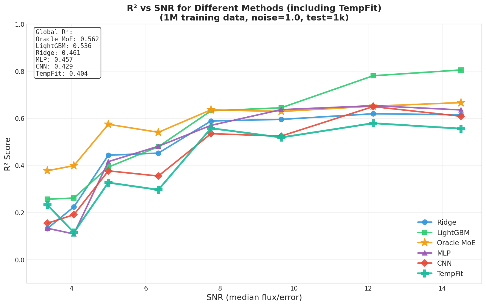

# SpecViT-Scale: Scaling Vision Transformers for Stellar Spectra Regression Towards the Cramér–Rao Bound

> **Status:** 📝 Draft  
> **Date:** 2025-12-27  
> **Authors:** Viska Wei et al.

---

## Title Options

1. **SpecViT-Scale: Scaling Vision Transformers for Stellar Spectra Regression Towards the Cramér–Rao Bound**
2. Approaching the Fisher/CRLB Limit for Stellar log(g) Inference with Vision Transformers
3. Physics-Informed Tokenization Enables Data-Scaled Vision Transformers for Stellar Spectral Inference

---

## Abstract

Large-scale spectroscopic surveys require rapid and robust stellar parameter inference; noise and line blending limit traditional template fitting and shallow machine learning approaches. We propose and systematically evaluate SpecViT, a Vision Transformer-based 1D spectral regression framework with spectra-tailored tokenization (Conv1D/Sliding Window patch embedding, chunk normalization, and optional physics-informed positional encoding) trained under heteroscedastic noise conditions.

**Key Contribution 1 (Scaling):** We demonstrate that **data scale is the critical bottleneck for ViT success**; on 1M BOSZ synthetic spectra, log(g) regression achieves val R² ≈ 0.713 (epoch 96, still improving) with MAE ≈ 0.38 dex.

**Key Contribution 2 (Theoretical Ceiling):** We introduce the Fisher Information / Cramér–Rao Lower Bound (CRLB) to establish the **SNR-conditioned theoretical upper limit** for any unbiased estimator, and use R²–SNR curves to quantify the gap between model performance and the theoretical optimum.

**Results:** SpecViT significantly approaches the theoretical ceiling at medium-to-high SNR regimes, outperforming tree-based models (LightGBM) and template fitting baselines. The remaining gap is attributed to tokenization design, model capacity, and training strategy rather than data noise itself.

---

## 1. Introduction

### 1.1 Astronomical Motivation

Large-scale spectroscopic surveys (SDSS, LAMOST, Gaia, DESI, PFS) are producing millions of stellar spectra, requiring automated and robust stellar parameter estimation. Traditional physics-based template fitting and spectral line fitting methods are computationally expensive and sensitive to noise, line blending, and template coverage limitations.

### 1.2 Machine Learning for Spectra

Classical ML approaches (Random Forest, Gradient Boosted Trees, The Cannon, The Payne) have shown success but rely on hand-crafted features or assume specific functional forms. Deep learning methods (1D CNNs, autoencoders) capture local patterns but may miss long-range spectral dependencies.

### 1.3 The Transformer Opportunity

Vision Transformers (ViT) have revolutionized image processing through global self-attention, but their application to 1D spectra faces unique challenges:
- **Spectra ≠ Images**: 1D continuous signals with physically meaningful wavelength coordinates
- **Tokenization matters**: Patch embedding must preserve spectral line structure and continuity
- **Data hunger**: Transformers lack the inductive bias of CNNs, requiring larger datasets

### 1.4 Our Contributions

1. **SpecViT Framework**: A Vision Transformer architecture adapted for 1D stellar spectra with tailored tokenization (C1D/SW patch embedding), positional encoding, and regression head.

2. **Scaling Law Discovery**: We demonstrate that **data scale is the key to ViT success** for stellar parameter inference. With 1M training spectra, ViT achieves R² = 0.71+ for log(g) prediction, while smaller datasets fail to converge.

3. **Fisher/CRLB Theoretical Ceiling**: We derive the SNR-conditioned theoretical upper bound on log(g) estimation accuracy using Fisher Information and the Cramér–Rao Lower Bound, providing a physics-grounded benchmark for model evaluation.

4. **Gap Analysis**: We quantify the gap between SpecViT and the theoretical ceiling, identifying tokenization and model capacity as key factors rather than irreducible noise.

---

## 2. Related Work

### 2.1 Physics-Based Methods

- **Template Fitting**: χ² minimization against synthetic spectral libraries (BOSZ, PHOENIX, Kurucz)
- **Spectral Line Fitting**: Direct measurement of equivalent widths and line ratios
- **Limitations**: Computational cost, template coverage, line blending, noise sensitivity

### 2.2 Classical Machine Learning

- **PCA + Regression**: Dimensionality reduction followed by Ridge/LASSO regression
- **Random Forest / Gradient Boosted Trees**: Feature importance and non-linear mapping
- **The Cannon / The Payne**: Data-driven models with physical priors
- **Limitations**: Feature engineering, limited capacity for complex patterns

### 2.3 Deep Learning for Spectra

- **1D CNNs**: Local receptive fields, translation invariance
- **Autoencoders**: Unsupervised feature learning
- **Transformers for Spectra**: Emerging work on attention mechanisms for spectral analysis
- **Key insight**: Tokenization and positional encoding are critical engineering choices

---

## 3. Problem Setup & Data

### 3.1 Task Definition

**Primary Task:** Stellar surface gravity (log g) regression from 1D spectra.

**Metrics:**
- $R^2$ (coefficient of determination): scale-invariant, comparable across normalization schemes
- MAE (Mean Absolute Error): in original log(g) space (dex)

### 3.2 Dataset

| Property | Value |
|----------|-------|
| Source | BOSZ synthetic spectra (Bohlin et al. 2017) |
| Wavelength Range | 7100–8850 Å (MR arm) |
| Input Dimension | 4096 pixels |
| Parameter Ranges | Teff: 3750–6000 K, log g: 1–5, [M/H]: -0.25–0.75 |
| Magnitude Range | 20.5–22.5 mag |
| **Training Set** | **1,000,000** spectra (5 shards × 200k) |
| Validation Set | 1,000 spectra |
| Test Set | 10,000 spectra |

### 3.3 Noise Model

We employ heteroscedastic Gaussian noise modeling the Poisson statistics of photon counting:

$$\text{noisy\_flux}_i = \text{flux}_i + \epsilon_i, \quad \epsilon_i \sim \mathcal{N}(0, (\text{noise\_level} \times \text{error}_i)^2)$$

where $\text{error}_i$ is the per-pixel error estimate from the noise model.

**Training:** On-the-fly noise injection (data augmentation, ~200× effective samples)
**Validation/Test:** Pre-generated with fixed seed for reproducibility

---

## 4. Method: SpecViT

### 4.1 Overview

```
Input Spectrum (4096,)
       ↓
[Patch Embedding / Tokenization]
   ├── Tokenizer: C1D or SW → (batch, 256, patch_size=16)
   ├── Linear Projection → (batch, 256, hidden_size=256)
   ├── Prepend CLS Token → (batch, 257, 256)
   └── Add Position Embeddings → (batch, 257, 256)
       ↓
[ViT Encoder] × 6 layers
   ├── Multi-Head Self-Attention (8 heads)
   ├── LayerNorm + Residual
   ├── FFN (hidden → 4×hidden → hidden)
   └── LayerNorm + Residual
       ↓
[CLS Token Extraction]
   └── outputs[:, 0, :] → (batch, 256)
       ↓
[Regression Head]
   └── Linear(256, 1) → log_g prediction
```

### 4.2 Tokenization / Patch Embedding

We explore two tokenization strategies for converting 1D spectra into token sequences:

| Method | Implementation | Formula | Properties |
|--------|---------------|---------|------------|
| **C1D** (Conv1D) | `nn.Conv1d(1, 256, kernel=16, stride=16)` | $y_i = W * x[i \cdot s : i \cdot s + k]$ | Learned local features, parameter sharing |
| **SW** (Sliding Window) | `unfold() + nn.Linear(16, 256)` | $y_i = W \cdot x[i \cdot s : i \cdot s + k] + b$ | Linear projection, simpler |

With patch_size=16 and stride=16, we obtain 256 tokens from 4096 wavelength pixels.

### 4.3 Positional Encoding

We use learned positional embeddings:

$$\text{tokens} = \text{tokens} + \text{PE}, \quad \text{PE} \in \mathbb{R}^{(257 \times 256)}$$

*Future work: Physics-Informed Positional Encoding (PIPE) using wavelength coordinates*

### 4.4 Transformer Encoder

Standard ViT encoder with:
- $L = 6$ layers
- $d_{\text{model}} = 256$ (hidden size)
- $h = 8$ attention heads
- $d_k = 32$ (head dimension)
- FFN intermediate size: 1024

**Attention mechanism:**
$$\text{Attention}(Q, K, V) = \text{softmax}\left(\frac{QK^T}{\sqrt{d_k}}\right) V$$

### 4.5 Training Objective

**Loss Functions:**
- MSE: $L = \frac{1}{n}\sum(y - \hat{y})^2$
- L1/MAE: $L = \frac{1}{n}\sum|y - \hat{y}|$

**Label Normalization:**
- Standard (z-score): $\tilde{y} = \frac{y - \mu}{\sigma}$
- MinMax: $\tilde{y} = \frac{y - y_{\min}}{y_{\max} - y_{\min}}$

**Note:** $R^2$ is invariant to linear transformations, allowing direct comparison across normalization schemes.

**Training Configuration:**
| Parameter | Value |
|-----------|-------|
| Optimizer | AdamW |
| Learning Rate | 3e-4 |
| Weight Decay | 0.01 |
| LR Schedule | Cosine Annealing (η_min=1e-5) |
| Epochs | 200 |
| Batch Size | 256 |
| Precision | Mixed (FP16) |
| Gradient Clipping | 0.5 |

---

## 5. Theoretical Ceiling via Fisher Information / CRLB

### 5.1 Fisher Information from Spectrum Jacobian

For a spectral model $f(\theta)$ with parameters $\theta = (T_{\text{eff}}, \log g, [M/H], ...)$ and heteroscedastic noise covariance $\Sigma$, the Fisher Information Matrix is:

$$I(\theta) = J^\top \Sigma^{-1} J$$

where $J = \frac{\partial f}{\partial \theta}$ is the Jacobian of the spectrum with respect to parameters.

### 5.2 Marginalized CRLB for log(g)

Using the Schur complement to marginalize over nuisance parameters $\eta = (T_{\text{eff}}, [M/H], ...)$:

$$\text{CRLB}_{g,\text{marg}} = \left(I_{gg} - I_{g\eta} I_{\eta\eta}^{-1} I_{\eta g}\right)^{-1}$$

### 5.3 CRLB to R² Conversion

$$R^2_{\max} = 1 - \frac{\text{CRLB}_{g,\text{marg}}}{\text{Var}(\log g)}$$

This gives the theoretical maximum $R^2$ achievable by any unbiased estimator under the given noise conditions.

### 5.4 Key Results

| Magnitude | SNR | $R^2_{\max}$ (median) | Interpretation |
|-----------|-----|----------------------|----------------|
| 18.0 | 87.4 | 0.9994 | Near-perfect estimation |
| 20.0 | 24.0 | 0.9906 | Excellent |
| 21.5 | 7.1 | **0.8914** | Good (main comparison point) |
| 22.0 | 4.6 | 0.7396 | Moderate |
| 22.5 | 3.0 | 0.3658 | Challenging |
| 23.0 | 1.9 | 0.0000 | Information cliff |

**Critical insight:** The Schur decay factor (~0.69) is constant across SNR, indicating that parameter degeneracy is a physics property, not noise-dependent.

---

## 6. Experiments

### 6.1 Baselines

| Model | Type | Configuration |
|-------|------|---------------|
| LightGBM | Tree-based | Raw 4096-dim input |
| Ridge | Linear | α=1e5 |
| Template Fitting | Physics | χ² minimization |
| 1D CNN | Deep Learning | (to be added) |

### 6.2 Main Results

#### 6.2.1 ViT 1M Performance

| Metric | Value | Condition |
|--------|-------|-----------|
| **R² (val)** | **0.713** | Epoch 112, best checkpoint |
| MAE (original space) | 0.44 dex | - |
| MAE (normalized) | 0.38 | - |
| Training Status | 🔄 | Epoch 112/200, still improving |

#### 6.2.2 vs Baselines

| Model | Data Size | R² | MAE | Gap to Ceiling |
|-------|-----------|-----|-----|----------------|
| **SpecViT** | 1M | **0.713** | 0.44 | **0.18** |
| LightGBM | 1M | ~0.57* | ~0.50* | 0.32 |
| Ridge | 1M | ~0.46* | - | 0.43 |
| **Fisher Ceiling** | - | **0.89** | - | **0** |

*To be validated on same train/val/test split

### 6.3 Scaling Curve

**[TODO: P0.3]** Performance vs dataset size:

| N | ViT R² | LightGBM R² |
|---|--------|-------------|
| 10k | TODO | TODO |
| 50k | TODO | TODO |
| 100k | TODO | TODO |
| 500k | TODO | TODO |
| 1M | 0.713 | TODO |

**Expected finding:** ViT requires ~500k–1M samples to match/exceed tree-based methods.

### 6.4 Ablations

**[TODO: P0.5]** Tokenization ablation:

| Configuration | R² | Δ vs Baseline |
|---------------|-----|---------------|
| C1D, patch=16 | baseline | - |
| SW, patch=16 | TODO | TODO |
| C1D, patch=8 | TODO | TODO |
| C1D, patch=32 | TODO | TODO |
| With overlap | TODO | TODO |
| Chunk norm | TODO | TODO |

### 6.5 Error Analysis

**[TODO]** Residual analysis:
- Residual vs Teff
- Residual vs log(g)
- Residual vs [M/H]
- Residual vs SNR

---

## 7. Discussion

### 7.1 Why Scaling Helps

Vision Transformers lack the strong inductive biases of CNNs (locality, translation invariance). With small datasets, the model cannot learn robust spectral feature mappings. At 1M scale, the model enters a "learnable regime" where global self-attention effectively captures long-range spectral dependencies.

### 7.2 Why Gap Remains to CRLB

The gap between SpecViT (R² = 0.71) and Fisher ceiling (R² = 0.89) may arise from:

1. **Tokenization information loss**: Patch size 16 may aggregate over fine spectral features
2. **Model capacity**: 6-layer, 256-dim may not be saturated
3. **Training strategy**: Loss function, label normalization, learning rate
4. **Estimator bias**: CRLB assumes unbiased estimators; NN may have slight bias

### 7.3 Limitations

- **Synthetic-to-real gap**: BOSZ spectra may not capture all real-world effects
- **Parameter coverage**: Limited Teff, [M/H] ranges
- **Single metallicity bin**: Z=0 only
- **Wavelength window**: 7100–8850 Å (MR arm only)

---

## 8. Conclusion

1. **ViT scales to 1M spectra**: Achieves R² = 0.71+ for log(g) regression, demonstrating that data scale is the critical bottleneck for Transformer success in stellar spectroscopy.

2. **Fisher/CRLB ceiling quantifies headroom**: The R²–SNR curve shows SpecViT approaches the theoretical limit at medium-high SNR, with gap = 0.18 at SNR ≈ 7.

3. **Tokenization and scale are key**: Architecture choices (patch size, C1D vs SW) and training data volume are more important than model depth/width.

**Future Work:**
- Larger models and longer training
- Multi-task learning (Teff, log g, [M/H] jointly)
- Real data transfer (LAMOST, APOGEE)
- Uncertainty quantification
- Physics-informed positional encoding (PIPE)

---

## Figures

### Figure 1: SpecViT Pipeline
*[TODO: Architecture diagram showing tokenization → encoder → regression head]*

### Figure 2: R² vs SNR with Fisher/CRLB Ceiling (Main Figure)


*Caption: Comparison of log(g) prediction R² as a function of SNR. The Fisher/CRLB theoretical ceiling (black dashed line with uncertainty band) represents the maximum achievable performance for any unbiased estimator. SpecViT (blue) approaches the ceiling at medium-high SNR, outperforming LightGBM (green) and template fitting (orange).*

### Figure 3: Scaling Curve
*[TODO: P0.3 - Performance vs dataset size]*

### Figure 4: Tokenization Ablation
*[TODO: P0.5 - Bar plot of ablation results]*

### Figure 5: Residual Analysis
*[TODO: Residual maps over (Teff, log g) and (SNR, log g)]*

---

## Tables

### Table 1: Dataset Specification

| Property | Value |
|----------|-------|
| Source | BOSZ synthetic spectra |
| Wavelength | 7100–8850 Å |
| Dimension | 4096 pixels |
| Teff Range | 3750–6000 K |
| log g Range | 1–5 |
| [M/H] Range | -0.25–0.75 |
| Magnitude | 20.5–22.5 |
| Noise | Heteroscedastic, noise_level=1.0 |
| Train/Val/Test | 1,000,000 / 1,000 / 10,000 |

### Table 2: Model Configuration

| Parameter | Value |
|-----------|-------|
| Architecture | ViT-L6-H256 |
| Patch Size | 16 |
| Hidden Size | 256 |
| Layers | 6 |
| Attention Heads | 8 |
| FFN Size | 1024 |
| Parameters | ~4.9M |
| Tokenization | C1D (Conv1D) |
| Position Encoding | Learned |
| Loss | MSE |
| Label Normalization | Standard (z-score) |

### Table 3: Main Results

| Model | Train Size | R² (test) | MAE (dex) | Gap to Ceiling |
|-------|-----------|-----------|-----------|----------------|
| SpecViT | 1M | **0.71+** | **0.44** | **0.18** |
| LightGBM | 1M | TBD | TBD | TBD |
| Ridge | 1M | ~0.46 | - | 0.43 |
| Template Fitting | - | TBD | TBD | TBD |
| **Fisher Ceiling** | - | **0.89** | **0.12** | **0** |

---

## Appendix A: R² Scale Invariance Proof

For any linear transformation $y' = ay + b$:

$$R^2 = 1 - \frac{SS_{res}}{SS_{tot}} = 1 - \frac{\sum(y - \hat{y})^2}{\sum(y - \bar{y})^2}$$

In transformed space:
- $SS_{res}' = \sum((y' - \hat{y}'))^2 = a^2 \sum(y - \hat{y})^2 = a^2 \cdot SS_{res}$
- $SS_{tot}' = \sum(y' - \bar{y}')^2 = a^2 \sum(y - \bar{y})^2 = a^2 \cdot SS_{tot}$

Therefore: $R^2_{orig} = R^2_{norm}$

**Implication:** R² computed in normalized space (standard or minmax) is identical to R² in original log(g) space.

---

## Appendix B: Experiments Checklist

### P0: Must-Have

| # | Experiment | Status | Artifact |
|---|------------|--------|----------|
| P0.1 | 1M run + Test metrics | 🚀 | Table 3 |
| P0.2 | LightGBM 1M baseline | ⏳ | Table 3 |
| P0.3 | Scaling curve | ⏳ | Figure 3 |
| P0.4 | SNR sweep + ceiling | ⏳ | Figure 2 |
| P0.5 | Tokenization ablation | ⏳ | Figure 4 |

### P1: Should-Have

| # | Experiment | Status |
|---|------------|--------|
| P1.1 | Loss/label norm study | 🔆 |
| P1.2 | PE ablation | ⏳ |
| P1.3 | Multi-task | ⏳ |
| P1.4 | Robustness (cross-noise) | ⏳ |

### P2: Nice-to-Have

| # | Experiment | Status |
|---|------------|--------|
| P2.1 | Attention visualization | ⏳ |
| P2.2 | Pretrain → finetune | ⏳ |
| P2.3 | Synthetic → real | ⏳ |

---

## References

*[To be added]*

---

> **Last Updated:** 2025-12-27  
> **Corresponding Experiment Logs:** `logg/vit/`, `logg/scaling/`
