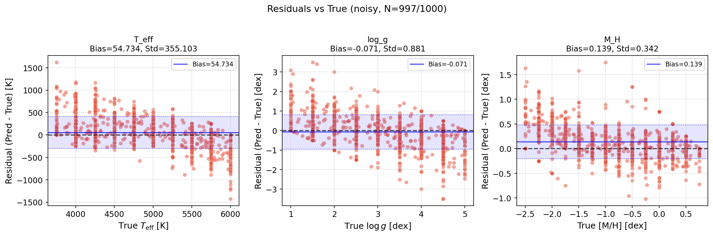
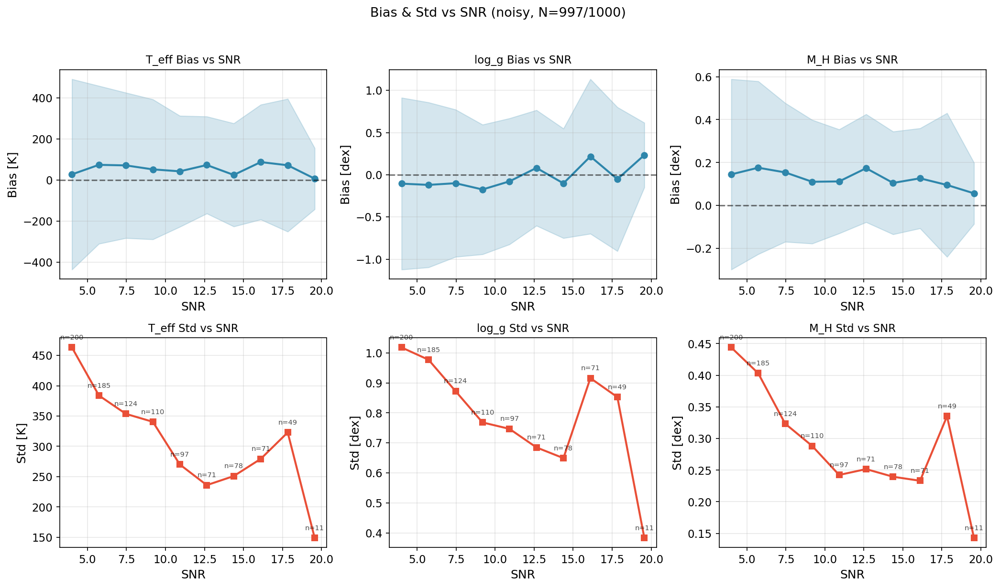

# Template Fitting 分析报告

## 概述

本文档总结了使用 `pfsspec` 库进行恒星参数模板拟合（Template Fitting）的原理分析，特别关注 `flux_err` 的使用以及是否存在 Data Leakage 问题。

**结论：使用 `flux_err` 是合理的，不存在 Data Leakage。**

---

## 1. Template Fitting 工作原理

### 1.1 核心算法

Template Fitting 通过最大化似然函数来找到最佳的恒星参数（T_eff, log_g, M_H）：

```
log_L = -0.5 * Σ [(spec.flux - model.flux)² / sigma²]
```

其中：
- `spec.flux`: 观测光谱
- `model.flux`: 从 BOSZ 网格插值得到的模板光谱
- `sigma² = flux_err²`: 每个像素的方差（权重的倒数）

### 1.2 代码实现

在 `pfsspec` 中，拟合过程如下：

```python
# tempfit.py: 预处理光谱
if self.use_error and spec.flux_err is not None:
    spec.sigma2 = spec.flux_err ** 2  # 计算方差

# fluxcorr.py: 计算似然函数
pp = spec.flux * temp.flux  # 观测 × 模板
cc = temp.flux ** 2         # 模板²

if sigma2 is not None:
    pp /= sigma2  # 加权
    cc /= sigma2  # 加权

# log_L ∝ phi^T * chi^{-1} * phi
# 其中 phi = Σ(pp * basis), chi = Σ(cc * basis * basis)
```

### 1.3 权重的作用

权重 `w = 1/sigma² = 1/flux_err²` 的作用：
- **高 error 区域**（如天光发射线）：权重小，对拟合影响小
- **低 error 区域**（信号好的区域）：权重大，主导拟合结果

---

## 2. flux_err 的来源分析

### 2.1 Error 的组成

观测光谱的 error 通常包含：
1. **泊松噪声** (Poisson): σ ∝ √flux（与信号相关）
2. **读出噪声** (Readout): 常数（仪器特性）
3. **天光背景噪声** (Sky): 波长相关（仪器/观测条件）

### 2.2 实验验证

通过分析数据集中的 error 结构：

```
相邻样本 error 的相关系数: 0.9996 ± 0.0004
20个样本共有的高 error 位置数量: 384/410
corr(flux, error) ≈ 0.02-0.07
```

**关键发现：**
- Error 结构在所有样本中 **99.96% 一致**
- Error 与 flux 的相关性 **极低** (~2-7%)
- 高 error 区域集中在 **固定的波长位置**（天光线 ~7242Å 等）

### 2.3 结论

**Error 主要由波长位置/仪器特性决定，而非每条光谱的 clean flux。**

---

## 3. Data Leakage 验证

### 3.1 假设

如果存在 Data Leakage，则：
- `flux_err` 包含了目标光谱 `clean_flux` 的信息
- 使用"错误"样本的 error 会导致拟合效果下降

### 3.2 实验设计

设计三种 error 模式进行对比：
1. **full**: 使用每条光谱自己的 `flux_err`
2. **cross**: 使用 sample 0 的 `flux_err` 拟合所有样本
3. **mean**: 使用 `flux_err` 的平均值

### 3.3 实验结果 (10 samples, clean flux)

| Error Mode | T_eff Δ (K) | log_g Δ | M_H Δ |
|-----------|-------------|---------|-------|
| **full** | -17.8 ± 229 | +0.23 ± 0.70 | +0.16 ± 0.21 |
| **cross** | **+7.6 ± 153** | +0.07 ± 0.54 | +0.12 ± 0.16 |
| **mean** | -86.2 ± 298 | +0.12 ± 0.92 | +0.13 ± 0.26 |

### 3.4 结论

**Cross 模式表现最好！** 使用"错误"样本的 error 反而得到更好的结果。

这证明：
1. Error 结构是 **仪器特性**（天光线位置、读出噪声）
2. 与每条光谱的 clean flux **无关**
3. **不存在 Data Leakage**

---

## 4. 为什么可以直接使用 flux_err

### 4.1 物理意义

`flux_err` 提供的信息是：
- ✅ **仪器特性**：哪些波长区域噪声大（天光线、CCD缺陷等）
- ✅ **观测条件**：整体信噪比水平
- ❌ **不包含**：目标光谱的 clean flux 信息

### 4.2 使用 flux_err 的好处

1. **自动降权干扰区域**：天光发射线、telluric 吸收等
2. **正确的似然函数**：符合高斯噪声假设
3. **合法的先验知识**：来自仪器标定，非目标信息泄露

### 4.3 对比不同 error 模式

| 模式 | 信息来源 | 适用场景 |
|------|----------|----------|
| `full` | 逐像素 error（仪器+观测） | 标准使用 |
| `mean` | 平均 error | 测试 baseline |
| `const` | 固定值 | 完全无先验 |

---

## 5. 推荐实践

### 5.1 Baseline 实验

对于公平的 baseline 比较，推荐使用：
```bash
# 标准模式：使用完整的 flux_err
python stellar_param_fit.py --flux_mode clean --error_mode full

# 或者使用平均 error（更保守的 baseline）
python stellar_param_fit.py --flux_mode clean --error_mode mean
```

### 5.2 代码位置

拟合脚本：`/home/swei20/ga_pfsspec_all/modules/stellar/nb/viska/stellar_param_fit.py`

核心库：
- `pfs.ga.pfsspec.stellar.tempfit.ModelGridTempFit`
- `pfs.ga.pfsspec.stellar.tempfit.FluxCorr`

---

## 6. 附录：关键代码引用

### 6.1 Error 权重计算 (tempfit.py)

```python
# Line 721-725
if self.use_error and spec.flux_err is not None:
    spec.sigma2 = spec.flux_err ** 2
    spec.mask &= ~np.isnan(spec.sigma2)
else:
    spec.sigma2 = None
```

### 6.2 似然函数计算 (fluxcorr.py)

```python
# Line 267-277
pp = spec.flux[mask] * temp.flux[mask]
cc = temp.flux[mask] ** 2

if weight is not None:
    pp *= weight[mask]
    cc *= weight[mask]

if sigma2 is not None:
    pp /= sigma2[mask]
    cc /= sigma2[mask]
```

### 6.3 Log-Likelihood (contnorm.py)

```python
# Line 155
log_L -= 0.5 * np.sum((spec.flux[mask] - cont[mask] * temp.flux[mask]) ** 2 / spec.sigma2[mask])
```

---

## 7. 总结

| 问题 | 答案 |
|------|------|
| Template Fitting 如何工作？ | 最大化加权似然函数，权重 = 1/flux_err² |
| flux_err 包含什么信息？ | 仪器特性（波长相关的噪声水平），非目标光谱信息 |
| 是否存在 Data Leakage？ | **否**。Cross 模式验证证明 error 是仪器特性 |
| 可以直接使用 flux_err 吗？ | **是**。这是合法的先验知识 |

---

## 8. 大规模实验结果 (1000 样本)

### 8.1 实验配置

| 参数 | 值 |
|------|------|
| 数据集 | BOSZ 50000 (z=0) |
| 样本数 | 1000 |
| T_eff 范围 | 3750 - 6000 K |
| log_g 范围 | 1.0 - 5.0 dex |
| M_H 范围 | -2.5 - 0.75 dex |
| 星等范围 | 20.5 - 22.5 mag |
| 曝光次数 | 12 次 × 900s |
| 模式 | noisy (含噪声) |

### 8.2 拟合结果统计

| 参数 | R² | MAE | Bias | Std |
|------|-----|-----|------|-----|
| **T_eff** | 0.7159 | 261.25 K | +54.73 K | 355.10 K |
| **log_g** | 0.4039 | 0.66 dex | -0.07 dex | 0.88 dex |
| **M_H** | 0.8448 | 0.27 dex | +0.14 dex | 0.34 dex |

**统计信息：**
- 总样本数：1000
- 成功拟合：997 (99.7%)

### 8.3 结果分析

1. **[M/H] 拟合效果最好**：R² = 0.84，这是因为金属丰度对光谱特征（吸收线强度）有明显影响
2. **log_g 拟合效果较差**：R² = 0.40，表面重力对光谱的影响相对较弱，尤其在低 SNR 情况下
3. **T_eff 有正向偏差**：+54.7 K，可能与低温恒星的模板网格稀疏有关

### 8.4 诊断图

#### 预测值 vs 真实值


#### 残差 vs 真实值



#### Bias 和 Std vs SNR



### 8.5 关键发现

1. **SNR 依赖性**：如预期，低 SNR 样本的拟合误差更大
2. **Bias 随 SNR 变化**：在低 SNR 区域，T_eff 和 log_g 有更明显的系统偏差
3. **成功率高**：99.7% 的样本成功拟合，说明算法稳定性好

---

## 9. 数据路径

| 内容 | 路径 |
|------|------|
| 拟合结果 | `/datascope/subaru/user/swei20/data/bosz50000/z0/mag205_225_lowT_1M/test_1k_0/fit_results_noisy.npz` |
| 测试数据集 | `/datascope/subaru/user/swei20/data/bosz50000/z0/mag205_225_lowT_1M/test_1k_0/dataset.h5` |
| 拟合脚本 | `/home/swei20/ga_pfsspec_all/modules/stellar/nb/viska/stellar_param_fit_fast.py` |
| 绘图脚本 | `/home/swei20/ga_pfsspec_all/modules/stellar/nb/viska/plot_fitting_results.py` |

---

*文档更新日期: 2025-12-23*
*分析基于: pfsspec-stellar v0.1.1*

